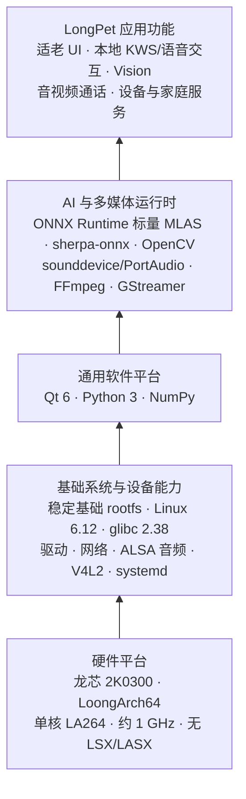
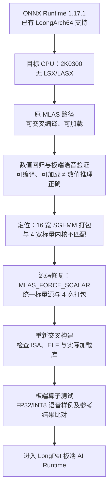
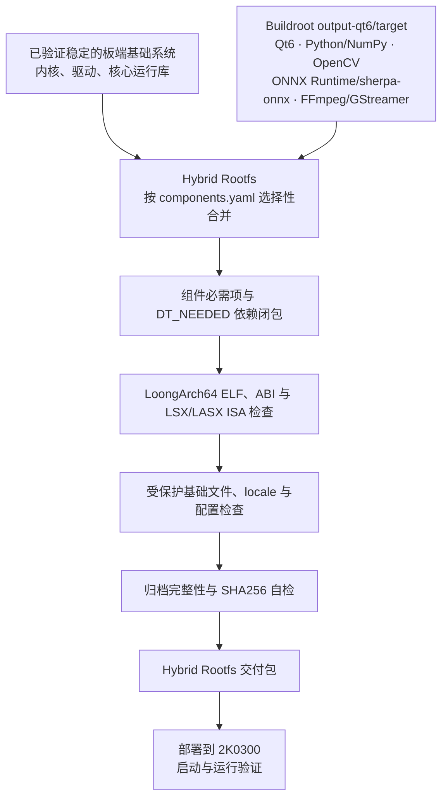

# LongPet 产品设计文档

| 文档信息 | 内容 |
| --- | --- |
| 文档版本 | V0.2（编写中） |
| 产品名称 | LongPet |
| 文档类型 | 产品设计文档 |

## 文档修订记录

| 版本 | 日期 | 修订说明 |
| --- | --- | --- |
| V0.1 | 2026-09-13 | 建立正式报告框架与分层目录 |
| V0.2 | 2026-09-13 | 完成报告第六章正文 |

## 摘要

<!-- 待正文完成后撰写。 -->

## 关键词

<!-- 待正文完成后填写。 -->

## 缩略语与术语表

<!-- 随章节编写补充。 -->

## 图目录

<!-- 随图表插入补充。 -->

## 表目录

<!-- 随图表插入补充。 -->

## 目录

- 文档修订记录
- 摘要
- 关键词
- 缩略语与术语表
- 图目录
- 表目录
- 1 文档概述
  - 1.1 编写目的
  - 1.2 文档范围与读者对象
  - 1.3 产品版本、交付基线与文档关系
  - 1.4 参考资料与证据来源
  - 1.5 完成状态与证据等级说明
- 2 产品概述
  - 2.1 项目背景与问题定义
  - 2.2 产品定位与目标
  - 2.3 目标用户与使用环境
  - 2.4 用户痛点与核心价值
  - 2.5 典型使用场景
  - 2.6 产品形态、组成与交互方式
  - 2.7 产品能力边界与非目标
- 3 产品需求分析
  - 3.1 需求来源、优先级与版本范围
  - 3.2 功能需求总览
  - 3.3 老人端适老交互与本地业务需求
  - 3.4 提醒、今日关怀与状态查看需求
  - 3.5 AI 语音交互与离线陪伴需求
  - 3.6 视觉感知、自动跟头与人物跟随需求
  - 3.7 视频和语音通话需求
  - 3.8 家属端管理与远程控制需求
  - 3.9 运动控制与安全需求
  - 3.10 多模态数据采集、处理与融合需求
  - 3.11 非功能需求
    - 3.11.1 性能与响应时间
    - 3.11.2 稳定性与故障恢复
    - 3.11.3 易用性与适老性
    - 3.11.4 安全性与隐私保护
    - 3.11.5 可维护性与可扩展性
    - 3.11.6 可复现性与可验证性
  - 3.12 平台、硬件、网络与资源约束
  - 3.13 需求验收口径与追踪方式
- 4 系统总体设计
  - 4.1 总体设计原则
  - 4.2 龙芯主控、家属端与运动 MCU 协同架构
  - 4.3 系统功能架构
  - 4.4 物理架构与硬件连接概览
  - 4.5 部署架构与网络边界
  - 4.6 软件分层架构
  - 4.7 四个工程仓库的职责划分
  - 4.8 功能模块与物理模块映射
  - 4.9 主要数据流与控制流
  - 4.10 核心技术路线与选型原则
- 5 硬件系统设计
  - 5.1 硬件总体组成
  - 5.2 龙芯 2K0300 主控平台
  - 5.3 显示与触摸模块
  - 5.4 摄像头模块
  - 5.5 麦克风与音频输出模块
  - 5.6 网络通信模块
  - 5.7 ESP32-S3 运动控制模块
  - 5.8 电机、驱动、编码器与 IMU
  - 5.9 头部舵机机构
  - 5.10 电源、存储与外部接口
  - 5.11 硬件连接关系与信号边界
  - 5.12 关键物料选型依据
  - 5.13 当前硬件限制与工程化缺口
- 6 LoongArch 系统软件平台设计
  - 6.1 目标板约束与平台设计目标
  - 6.2 LoongArch AI 生态的兼容性边界
  - 6.3 Buildroot 软件栈与交叉构建基线
  - 6.4 Python、NumPy 与音频依赖的源码构建
  - 6.5 ONNX Runtime 的无向量指令适配
    - 6.5.1 可加载但数值错误的问题
    - 6.5.2 MLAS 标量路径的源码级修复
    - 6.5.3 算子、模型与部署链路验证
  - 6.6 sherpa-onnx、Qt6、OpenCV 与多媒体能力
  - 6.7 基础系统路线与 Hybrid Rootfs 决策
  - 6.8 Hybrid Rootfs 的合并与校验设计
    - 6.8.1 清单驱动的组件合入和依赖闭包
    - 6.8.2 ABI、架构与 ISA 检查
    - 6.8.3 基础文件保护、locale 与产物校验
  - 6.9 systemd、自启动与自恢复
  - 6.10 验证结论与证据边界
- 7 LongPet 应用软件架构
  - 7.1 应用软件总体分层
  - 7.2 Qt6 表示层与适老界面
  - 7.3 应用控制层与页面流程
  - 7.4 业务服务、Repository 与本地持久化
  - 7.5 设备适配层与能力降级
  - 7.6 AI 语音模块与 Provider 分层
  - 7.7 视觉模块与 TargetObservation 数据通路
  - 7.8 FamilyLink 服务与家属端协同
  - 7.9 MotionService 与运动 MCU 协同
  - 7.10 线程、进程、资源与生命周期管理
- 8 核心功能设计
  - 8.1 老人端交互与表情状态机
  - 8.2 提醒、今日关怀与本地状态展示
  - 8.3 天气查询与网络能力降级
  - 8.4 AI 语音交互
    - 8.4.1 VAD、本地 KWS 与唤醒流程
    - 8.4.2 在线 ASR/LLM/TTS Provider 与对话管理
    - 8.4.3 Tool Calling 与工具权限边界
    - 8.4.4 离线基础陪伴、取消与异常处理
    - 8.4.5 自建推理服务器接口预留及当前边界
  - 8.5 视觉 AI 与人物感知
    - 8.5.1 候选方案、轻量模型与选型依据
    - 8.5.2 人物数据准备、训练与域适配
    - 8.5.3 当前 V1.2 模型与 V1.3 实验版本管理
    - 8.5.4 低频 Detector、高频 Tracker 与目标观测
    - 8.5.5 自动头部跟踪与头身协调
    - 8.5.6 基于目标框的距离代理与跟随策略
    - 8.5.7 视觉失效场景与功能边界
  - 8.6 视频、语音通话与媒体链路
  - 8.7 家属端状态查看、提醒管理与 AI 视野
  - 8.8 家属端远程控制与模式管理
  - 8.9 多模态信息融合与触发策略
- 9 接口与数据设计
  - 9.1 系统接口总体设计与边界
  - 9.2 LongPet—运动 MCU 串口接口
  - 9.3 LongPet—Family Desktop 接口
  - 9.4 AI Provider 与第三方服务接口
  - 9.5 摄像头、音频、显示与平台硬件接口
  - 9.6 本地业务数据与持久化
  - 9.7 AI 对话、记忆与敏感数据
  - 9.8 视觉观测、训练数据与模型元数据
  - 9.9 配置管理、令牌与隐私保护
  - 9.10 数据一致性、失效与降级处理
- 10 运动控制与系统安全设计
  - 10.1 控制目标、职责分离与安全原则
  - 10.2 ESP32-S3 控制状态与模式隔离
  - 10.3 头部舵机、底盘与 IMU 控制
  - 10.4 UART 命令校验与控制权管理
  - 10.5 心跳、命令租约与目标新鲜度
  - 10.6 异常检测、故障锁存与统一停车
  - 10.7 家属端远控的按住刷新与失效停车
  - 10.8 人物跟随的运动约束与禁止动作
  - 10.9 软件安全边界与待补充的硬件防护
  - 10.10 安全验证矩阵与证据索引
- 11 典型业务流程
  - 11.1 开机、自检、登录/连接与服务就绪
  - 11.2 老人端提醒创建、触发与完成
  - 11.3 在线语音对话与工具调用
  - 11.4 断网后的离线基础陪伴
  - 11.5 视觉人物发现、自动跟头与目标丢失
  - 11.6 家属端连接、状态查看与提醒管理
  - 11.7 视频/语音通话
  - 11.8 远程手动控制与停止
  - 11.9 人物跟随启停与安全停车
  - 11.10 故障发生、降级与恢复
- 12 非功能需求落实与工程化设计
  - 12.1 性能预算、响应链路与资源监测
  - 12.2 视觉与语音并发资源调度
  - 12.3 适老可用性与交互一致性
  - 12.4 稳定性、进程隔离与服务恢复
  - 12.5 网络、接口、令牌与隐私安全
  - 12.6 日志、诊断与可观测性
  - 12.7 自动化测试、实机验证与可复现性
  - 12.8 第三方组件、模型来源与许可管理
- 13 构建、部署、发布与运营计划
  - 13.1 四仓库构建链与交付物关系
  - 13.2 龙芯系统、应用、家属端与 MCU 部署概览
  - 13.3 配置、首次启动与验收检查点
  - 13.4 版本基线、发布包与完整性校验
  - 13.5 升级、备份、回退与故障恢复
  - 13.6 原型试用、使用支持与维护计划
  - 13.7 后续运营、反馈收集与迭代计划
- 14 关键技术难点与方案权衡
  - 14.1 2K0300 无 LSX/LASX 的软件兼容问题
  - 14.2 ONNX Runtime 从可加载到数值正确的修复
  - 14.3 基础系统稳定性与 Hybrid Rootfs 取舍
  - 14.4 低算力视觉模型、域适配与 Detector/Tracker 协同
  - 14.5 语音在线/离线链路与资源竞争
  - 14.6 头身协调、距离代理与无地图跟随边界
  - 14.7 远程运动控制的时效性与失效安全
- 15 技术创新与应用价值
  - 15.1 LoongArch 低算力平台的 AI 适配实践
  - 15.2 可校验的 Hybrid Rootfs 交付方法
  - 15.3 面向实拍场景的视觉训练与分层推理
  - 15.4 语音、视觉与家属端协同的适老体验
  - 15.5 多层运动安全机制与可解释边界
  - 15.6 应用价值、推广条件与市场潜力
- 16 当前成果、限制与后续规划
  - 16.1 交付基线与已验证成果
  - 16.2 已实现但验证有限的能力
  - 16.3 实验性能力、接口预留与未完成功能
  - 16.4 已知性能、环境与硬件限制
  - 16.5 后续测试、工程化与产品化路线
- 17 总结
  - 17.1 产品设计总结
  - 17.2 需求、技术方案与证据的对应关系
- 附录
  - 附录 A 需求—模块—测试追踪矩阵
  - 附录 B 系统接口索引
  - 附录 C 关键配置参数表
  - 附录 D 硬件连接与引脚摘要
  - 附录 E 第三方软件、库与模型清单
  - 附录 F 参考资料

---

## 1 文档概述

### 1.1 编写目的

### 1.2 文档范围与读者对象

### 1.3 产品版本、交付基线与文档关系

### 1.4 参考资料与证据来源

### 1.5 完成状态与证据等级说明

## 2 产品概述

### 2.1 项目背景与问题定义

### 2.2 产品定位与目标

### 2.3 目标用户与使用环境

### 2.4 用户痛点与核心价值

### 2.5 典型使用场景

### 2.6 产品形态、组成与交互方式

### 2.7 产品能力边界与非目标

## 3 产品需求分析

### 3.1 需求来源、优先级与版本范围

### 3.2 功能需求总览

### 3.3 老人端适老交互与本地业务需求

### 3.4 提醒、今日关怀与状态查看需求

### 3.5 AI 语音交互与离线陪伴需求

### 3.6 视觉感知、自动跟头与人物跟随需求

### 3.7 视频和语音通话需求

### 3.8 家属端管理与远程控制需求

### 3.9 运动控制与安全需求

### 3.10 多模态数据采集、处理与融合需求

### 3.11 非功能需求

#### 3.11.1 性能与响应时间

#### 3.11.2 稳定性与故障恢复

#### 3.11.3 易用性与适老性

#### 3.11.4 安全性与隐私保护

#### 3.11.5 可维护性与可扩展性

#### 3.11.6 可复现性与可验证性

### 3.12 平台、硬件、网络与资源约束

### 3.13 需求验收口径与追踪方式

## 4 系统总体设计

### 4.1 总体设计原则

### 4.2 龙芯主控、家属端与运动 MCU 协同架构

### 4.3 系统功能架构

### 4.4 物理架构与硬件连接概览

### 4.5 部署架构与网络边界

### 4.6 软件分层架构

### 4.7 四个工程仓库的职责划分

### 4.8 功能模块与物理模块映射

### 4.9 主要数据流与控制流

### 4.10 核心技术路线与选型原则

## 5 硬件系统设计

### 5.1 硬件总体组成

### 5.2 龙芯 2K0300 主控平台

### 5.3 显示与触摸模块

### 5.4 摄像头模块

### 5.5 麦克风与音频输出模块

### 5.6 网络通信模块

### 5.7 ESP32-S3 运动控制模块

### 5.8 电机、驱动、编码器与 IMU

### 5.9 头部舵机机构

### 5.10 电源、存储与外部接口

### 5.11 硬件连接关系与信号边界

### 5.12 关键物料选型依据

### 5.13 当前硬件限制与工程化缺口

## 6 LoongArch 系统软件平台设计

LongPet 在龙芯 2K0300 上运行图形、语音、视觉和多媒体组件。软件平台采用受控交叉构建、标量推理适配和 Hybrid Rootfs，并分别验证产物兼容性、推理数值和板端功能。

### 6.1 目标板约束与平台设计目标

目标主控龙芯 2K0300 采用单核 LA264、约 1 GHz 的 LoongArch64 处理器，不支持 LSX/LASX 向量指令。编入这些指令的二进制包无法在目标板运行；语音、视觉和界面并发时还需控制 CPU 与内存占用。一次板端测试显示系统可见内存约 369 MiB，未配置 swap。

交付基线采用 LoongArch64 LP64D ABI、Linux 6.12.0.lsgd 内核、glibc 2.38 和 Python 3.12。外部 GCC 13.3 工具链以通用 `loongarch64` 和严格对齐为编译目标。ONNX Runtime 产物还需满足目标板内核的 16 KiB ELF 可加载段对齐要求。

软件栈分为基础系统、通用平台、AI 与媒体运行时、应用功能四层（图 6-1）。

**图 6-1 LongPet 面向 2K0300 的 LoongArch 软件栈总体架构**

### 6.2 LoongArch AI 生态的兼容性边界

预编译的 LoongArch 软件包可能使用 2K0300 不支持的向量指令，运行时的架构判断也可能选错计算内核。关键组件统一交叉构建，并检查指令集、ABI、动态库依赖和推理数值。

源码构建固定版本与编译选项；构建后继续检查 ELF 产物和模型输出。

### 6.3 Buildroot 软件栈与交叉构建基线

Buildroot 2024.08 的 `output-qt6` 构建树使用面向 2K0300 的媒体版 defconfig，包含 Qt、Python/AI、视觉处理及多媒体软件包。主要组件见表 6-1。

**表 6-1 LongPet LoongArch 软件平台关键组件与版本基线**

| 组件 | 当前工程版本 | 构建方式 | 在 LongPet 中的主要用途 | 设计说明 / 关键考虑 |
| --- | --- | --- | --- | --- |
| Qt 6 | 6.8.1 | Buildroot 源码交叉构建 | Widgets 触控界面、网络、SQL、SVG | 采用 `linuxfb` 和触摸输入插件，适配板端显示环境 |
| Python 3 | 3.12.5 | Buildroot 源码交叉构建 | 本地 KWS 及 Python AI 组件运行 | 与基础系统 Python 3.12 运行环境保持兼容 |
| NumPy | 1.25.0 | Buildroot/Meson 源码交叉构建 | 音频数据处理和 AI Python 扩展基础 | 固定工具链与目标 ISA，避免依赖不可控的预编译二进制 |
| OpenCV | 4.10.0 | Buildroot 源码交叉构建 | 摄像头输入、图像预处理与视觉跟踪 | 保留 V4L2、视频处理及目标端所需接口 |
| ONNX Runtime | 1.17.1 | Buildroot 源码交叉构建并应用 MLAS 补丁 | 本地 ONNX 模型推理 | 对无 LSX/LASX 目标启用一致的标量路径，并验证数值正确性 |
| sherpa-onnx | 1.12.15 | Buildroot 源码交叉构建 | 语音推理组件 | 复用系统 ONNX Runtime，避免私有运行库副本不一致 |
| sounddevice | 0.5.1 | Buildroot 源码打包，配套 CFFI/PortAudio | Python 音频采集 | 将动态加载依赖列为合并清单的必需文件 |
| FFmpeg | 6.1.2 | Buildroot 源码交叉构建 | 多媒体工具与编解码库 | 按当前构建基线交付，控制板端实时编码负载 |
| GStreamer | 1.22.9 | Buildroot 源码交叉构建 | 插件化音视频处理能力 | 显式纳入运行时插件，不能只依赖 ELF 依赖闭包 |

Buildroot 生成相互匹配的 target、staging 和交叉 SDK。`output-qt6/target` 为 Hybrid Rootfs 提供软件组件，最终镜像按清单选择合入。

### 6.4 Python、NumPy 与音频依赖的源码构建

部分预编译 NumPy 包使用 2K0300 不支持的扩展指令，因此从 NumPy 1.25.0 源码构建。构建过程使用 Buildroot 的 Meson 交叉编译流程，并将目标端头文件安装到 staging，供下游扩展使用。Python 3.12、NumPy、CFFI、sounddevice 和 PortAudio 构成板端 Python 音频链路。

Buildroot 以 Python 字节码交付，合并时保留 NumPy、sounddevice 的 `.pyc` 文件及二进制扩展。sounddevice 经 CFFI 间接加载 PortAudio，相关文件不会全部出现在 ELF 的 `DT_NEEDED` 中；合并清单因此显式要求 sounddevice、`_sounddevice`、`_cffi_backend` 和 PortAudio 同时存在。板端分别验证数值计算、模块导入和音频设备访问。

### 6.5 ONNX Runtime 的无向量指令适配

#### 6.5.1 可加载但数值错误的问题

ONNX Runtime 1.17.1 的原有 MLAS 路径在无 LSX/LASX 的 2K0300 上出现数值错误。早期板端测试中，FP32 模型输出固定乱码，INT8 模型输出空串，静音输入也得到异常结果；模型可以加载，但推理结果错误。

源码与产物检查发现，原 LoongArch 路径在无向量内核时混用了 16 宽 B 矩阵打包和 4 宽标量计算内核。数据布局不一致导致 MatMul、Gemm、Conv 等计算失真，进而影响 Zipformer ASR 解码。修复前后的算子测试验证了这一定位。

#### 6.5.2 MLAS 标量路径的源码级修复

ONNX Runtime 包新增默认关闭的 `onnxruntime_MLAS_FORCE_SCALAR` 选项，仅在 2K0300 构建规则中启用。补丁调整 MLAS 源文件选择、LoongArch 宏和 LSX 头文件条件，改用通用标量源，并将 B 矩阵打包统一为与标量内核匹配的 4 宽格式。产物仍为 LoongArch64 LP64D 库。

构建使用通用 `loongarch64` 和严格对齐选项。sherpa-onnx 复用 `/usr/lib` 中的 ONNX Runtime，安装时移除 Python 包内的私有运行库副本。部署测试曾因绝对 RPATH 误加载旧库；改用相对 `$ORIGIN` 路径后，隔离库验证通过。验证时需核对实际加载的库版本。

#### 6.5.3 算子、模型与部署链路验证

目标板隔离部署的十项 ONNX Runtime 算子测试均通过。Conv、LayerNorm、Softmax 相对独立参考的最大绝对误差分别约为 `1.9×10⁻⁶`、`1.3×10⁻⁶`、`3.0×10⁻⁸`；其余受测算子为零误差。判定阈值为绝对误差 `1×10⁻⁵`、相对误差 `1×10⁻⁴`。FP32、INT8 流式识别测试中，静音输出为空串，语音结果连续三次一致，四类样例与 x86 参考逐字匹配。x86 参考使用的 sherpa-onnx 版本与板端不同，这些结果仅覆盖受测样例。

构建与镜像检查确认了标量源文件、无 LSX/LASX 指令、16 KiB ELF 可加载段对齐及修复库已纳入交付包。板端隔离部署的算子与语音测试通过；完整 Hybrid Rootfs 的启动与功能验证见项目综合测试报告。

图 6-2 展示从数值错误定位到标量路径修复、板端验证的流程。

**图 6-2 ONNX Runtime 在无 LSX/LASX 的 2K0300 上的适配与验证路径**

### 6.6 sherpa-onnx、Qt6、OpenCV 与多媒体能力

sherpa-onnx 1.12.15 依赖 ONNX Runtime、Python、NumPy 和 ALSA。构建启用 Python 接口，关闭未使用的 TTS、说话人分离和 GPU 选项，并禁用 Eigen 向量化。LongPet 的本地 KWS 另由独立维护的 Python/ONNX 组件实现。

界面使用 Qt6 Widgets/Network/SQL/SVG，显示采用 `linuxfb`，触摸由输入插件接入。OpenCV 4.10.0 提供 C++/Python 图像处理、V4L2 摄像头和 FFmpeg 视频后端。媒体组件包含 FFmpeg、GStreamer 插件、Opus、VP8、RTP、DTLS、SRTP 与 WebRTC 相关基础库。合并清单显式列出通过运行时注册或 `dlopen()` 加载的插件。板端尚未完成全部 WebRTC 或实时软件编码场景的性能验收；当前也没有已确认可用的通用硬件视频编码器。

### 6.7 基础系统路线与 Hybrid Rootfs 决策

早期实机验证显示，直接套用龙芯buildroot仓库（[open-loongarch/buildroot-2024.08](https://gitee.com/open-loongarch/buildroot-2024.08)）构建的系统，完整替换基础系统后的稳定性未达到项目要求（出现cpu占用率异常波动等问题）。交付方案因此保留已验证的出厂自带基础系统，仅按清单合入所需的用户空间组件。

Hybrid Rootfs 以可启动的板卡基础 rootfs、内核和 ramdisk 为基线，从 `output-qt6/target` 选取 Qt6、Python/AI、OpenCV 和媒体组件。原有内核、模块、固件、动态加载器及核心 C/C++ 运行库保持不变；新增组件通过依赖、ABI 和 ISA 检查后合入。

### 6.8 Hybrid Rootfs 的合并与校验设计

基础系统与 Buildroot target 按清单合并，经依赖、ABI、ISA、基础文件和完整性校验后形成交付包，再进行板端验证（图 6-3）。

**图 6-3 LongPet Hybrid Rootfs 的构建、组件合并与完整性校验流程**

#### 6.8.1 清单驱动的组件合入和依赖闭包

`components.yaml` 以包含/排除规则、必需文件和受保护路径限定合并范围，覆盖 locale、Qt6、OpenCV、NumPy、sounddevice、ONNX Runtime、sherpa-onnx、FFmpeg、V4L2 工具及 GStreamer。必需文件缺失时构建失败；GStreamer 插件和 Python 动态加载依赖需显式列入清单。

解析器递归读取新增 ELF 的 `DT_NEEDED`，优先复用基础 rootfs 中的库，缺失时从 Buildroot target 补齐共享库及链接名，同时保留原有目录布局和受保护文件。合并后检查动态依赖、断链软链接及 Qt5 残留依赖。2026 年 8 月 29 日的记录显示：必需组件缺失 0、未解析依赖 0；检查 1739 个 ELF，断链软链接 0。

#### 6.8.2 ABI、架构与 ISA 检查

合并前核对基础 rootfs 与 target 的 glibc 版本、Python 主版本，以及内核镜像与模块目录；新增 ELF 的 GLIBC、GLIBCXX、CXXABI 符号版本要求不得超出基础运行库能力。8 月 29 日检查时，两套系统均使用 glibc 2.38，新增 ELF 的符号版本要求未超限。

架构检查遍历合并 rootfs 的全部 ELF，要求 `Machine=LoongArch`。ISA 检查默认反汇编本次新增的 ELF，拒绝 LSX/LASX 指令；也可启用全 rootfs 严格扫描。该次检查发现非 LoongArch ELF 0 个，新增 ELF 的向量指令命中 0 次。默认模式的 ISA 检查范围限于新增 ELF。

#### 6.8.3 基础文件保护、locale 与产物校验

清单保护 `/boot`、内核模块、固件、动态加载器、核心 glibc/libstdc++ 与既有系统配置。构建前后对关键基础文件计算 SHA256 并比较；不一致时停止交付。Qt6 所需 UTF-8 环境通过 `locale-archive` 和 `LANG=C.UTF-8` 配置补齐，构建过程校验 archive 非空且包含 C.UTF-8。合并还保留归档的数字属主、权限、扩展属性和 ACL，检查目录层级、关键文件、压缩包完整性，并对 rootfs、内核和 ramdisk 生成及自检 `SHA256SUMS`。

8 月 29 日合并记录显示受保护文件未变、locale 验证通过，rootfs、内核和 ramdisk 的校验通过。现有构建流程可按固定输入和配置重建软件集合；尚无不同主机间逐字节一致的验证记录。

### 6.9 systemd、自启动与自恢复

LongPet 服务以独立的 `longpet` 用户运行，配置显示、触摸、音频、串口权限和私有运行目录，并指定 `linuxfb` framebuffer、`tty1` VT 与触摸输入插件。板端联调解决了 `tty1` 与控制台抢占、设备节点权限问题；整板重启后应用和界面能够恢复。服务通过 `Restart=always` 在进程异常退出后自动重启。

针对特定 Wi-Fi 驱动探测失败，系统配置了条件式恢复服务。时间同步已启用，但 RTC 读取和重启后的同步稳定性仍需验证，提醒服务应检查时钟是否可信。合并系统在 `/etc/locale.conf` 中设置 C.UTF-8；冷启动验收已检查 Qt 字符编码、媒体设备权限、网络恢复及并发资源占用。

### 6.10 验证结论与证据边界

表 6-2 汇总已完成的构建检查与板端测试。具体测试条件见功能与性能报告。

**表 6-2 LongPet LoongArch 平台关键问题、设计决策与验证结果矩阵**

| 工程问题 | 设计决策 | 验证方式 | 当前结果 / 状态 |
| --- | --- | --- | --- |
| 2K0300 无 LSX/LASX | 采用通用目标编译选项，排除不兼容向量路径 | 交叉编译、ELF 架构与新增 ELF 指令扫描 | 构建与 ISA 校验通过 |
| LoongArch AI/Python 组件不能只按架构名称直接复用 | 固定源码、工具链和 ABI 基线 | 目标包构建、符号版本及板端导入检查 | 构建与运行验证通过 |
| NumPy 等 Python 扩展需受控构建 | Buildroot 源码交叉构建，保留字节码与扩展模块 | 构建产物、清单必需项和板端导入检查 | 构建与板端验证通过 |
| ONNX Runtime 可加载但曾出现数值错误 | 强制一致的标量 MLAS 和 4 宽打包路径 | 十项板端算子、FP32/INT8 语音样例及参考结果比对 | 板端数值验证通过 |
| 图形、视觉、语音和媒体组件需在同一目标环境协作 | 扩展 Buildroot Qt6、OpenCV、Python/AI、FFmpeg/GStreamer 配置 | target 构建、运行库与插件合并检查、板端功能验证 | 构建与运行验证通过 |
| 完整替换基础系统的稳定性未达项目要求 | 保留稳定基础系统，选择性合入 Buildroot 用户空间 | Hybrid Rootfs 合并校验和目标板运行验收 | Hybrid 方案板端验证通过 |
| 混合系统可能出现依赖、ABI/ISA 或基础文件冲突 | 对全 rootfs 依赖、符号版本、ISA、受保护文件和 SHA256 分层检查 | 合并报告与最终归档自检 | 依赖、兼容性与完整性校验通过 |
| 嵌入式应用需要自动启动和进程故障恢复 | systemd 管理 LongPet，配置运行权限与自动重启 | 整板重启、服务重启和异常退出恢复测试 | 板端验证通过 |

## 7 LongPet 应用软件架构

### 7.1 应用软件总体分层

### 7.2 Qt6 表示层与适老界面

### 7.3 应用控制层与页面流程

### 7.4 业务服务、Repository 与本地持久化

### 7.5 设备适配层与能力降级

### 7.6 AI 语音模块与 Provider 分层

### 7.7 视觉模块与 TargetObservation 数据通路

### 7.8 FamilyLink 服务与家属端协同

### 7.9 MotionService 与运动 MCU 协同

### 7.10 线程、进程、资源与生命周期管理

## 8 核心功能设计

### 8.1 老人端交互与表情状态机

### 8.2 提醒、今日关怀与本地状态展示

### 8.3 天气查询与网络能力降级

### 8.4 AI 语音交互

#### 8.4.1 VAD、本地 KWS 与唤醒流程

#### 8.4.2 在线 ASR/LLM/TTS Provider 与对话管理

#### 8.4.3 Tool Calling 与工具权限边界

#### 8.4.4 离线基础陪伴、取消与异常处理

#### 8.4.5 自建推理服务器接口预留及当前边界

### 8.5 视觉 AI 与人物感知

#### 8.5.1 候选方案、轻量模型与选型依据

#### 8.5.2 人物数据准备、训练与域适配

#### 8.5.3 当前 V1.2 模型与 V1.3 实验版本管理

#### 8.5.4 低频 Detector、高频 Tracker 与目标观测

#### 8.5.5 自动头部跟踪与头身协调

#### 8.5.6 基于目标框的距离代理与跟随策略

#### 8.5.7 视觉失效场景与功能边界

### 8.6 视频、语音通话与媒体链路

### 8.7 家属端状态查看、提醒管理与 AI 视野

### 8.8 家属端远程控制与模式管理

### 8.9 多模态信息融合与触发策略

## 9 接口与数据设计

### 9.1 系统接口总体设计与边界

### 9.2 LongPet—运动 MCU 串口接口

### 9.3 LongPet—Family Desktop 接口

### 9.4 AI Provider 与第三方服务接口

### 9.5 摄像头、音频、显示与平台硬件接口

### 9.6 本地业务数据与持久化

### 9.7 AI 对话、记忆与敏感数据

### 9.8 视觉观测、训练数据与模型元数据

### 9.9 配置管理、令牌与隐私保护

### 9.10 数据一致性、失效与降级处理

## 10 运动控制与系统安全设计

### 10.1 控制目标、职责分离与安全原则

### 10.2 ESP32-S3 控制状态与模式隔离

### 10.3 头部舵机、底盘与 IMU 控制

### 10.4 UART 命令校验与控制权管理

### 10.5 心跳、命令租约与目标新鲜度

### 10.6 异常检测、故障锁存与统一停车

### 10.7 家属端远控的按住刷新与失效停车

### 10.8 人物跟随的运动约束与禁止动作

### 10.9 软件安全边界与待补充的硬件防护

### 10.10 安全验证矩阵与证据索引

## 11 典型业务流程

### 11.1 开机、自检、登录/连接与服务就绪

### 11.2 老人端提醒创建、触发与完成

### 11.3 在线语音对话与工具调用

### 11.4 断网后的离线基础陪伴

### 11.5 视觉人物发现、自动跟头与目标丢失

### 11.6 家属端连接、状态查看与提醒管理

### 11.7 视频/语音通话

### 11.8 远程手动控制与停止

### 11.9 人物跟随启停与安全停车

### 11.10 故障发生、降级与恢复

## 12 非功能需求落实与工程化设计

### 12.1 性能预算、响应链路与资源监测

### 12.2 视觉与语音并发资源调度

### 12.3 适老可用性与交互一致性

### 12.4 稳定性、进程隔离与服务恢复

### 12.5 网络、接口、令牌与隐私安全

### 12.6 日志、诊断与可观测性

### 12.7 自动化测试、实机验证与可复现性

### 12.8 第三方组件、模型来源与许可管理

## 13 构建、部署、发布与运营计划

### 13.1 四仓库构建链与交付物关系

### 13.2 龙芯系统、应用、家属端与 MCU 部署概览

### 13.3 配置、首次启动与验收检查点

### 13.4 版本基线、发布包与完整性校验

### 13.5 升级、备份、回退与故障恢复

### 13.6 原型试用、使用支持与维护计划

### 13.7 后续运营、反馈收集与迭代计划

## 14 关键技术难点与方案权衡

### 14.1 2K0300 无 LSX/LASX 的软件兼容问题

### 14.2 ONNX Runtime 从可加载到数值正确的修复

### 14.3 基础系统稳定性与 Hybrid Rootfs 取舍

### 14.4 低算力视觉模型、域适配与 Detector/Tracker 协同

### 14.5 语音在线/离线链路与资源竞争

### 14.6 头身协调、距离代理与无地图跟随边界

### 14.7 远程运动控制的时效性与失效安全

## 15 技术创新与应用价值

### 15.1 LoongArch 低算力平台的 AI 适配实践

### 15.2 可校验的 Hybrid Rootfs 交付方法

### 15.3 面向实拍场景的视觉训练与分层推理

### 15.4 语音、视觉与家属端协同的适老体验

### 15.5 多层运动安全机制与可解释边界

### 15.6 应用价值、推广条件与市场潜力

## 16 当前成果、限制与后续规划

### 16.1 交付基线与已验证成果

### 16.2 已实现但验证有限的能力

### 16.3 实验性能力、接口预留与未完成功能

### 16.4 已知性能、环境与硬件限制

### 16.5 后续测试、工程化与产品化路线

## 17 总结

### 17.1 产品设计总结

### 17.2 需求、技术方案与证据的对应关系

## 附录

### 附录 A 需求—模块—测试追踪矩阵

### 附录 B 系统接口索引

### 附录 C 关键配置参数表

### 附录 D 硬件连接与引脚摘要

### 附录 E 第三方软件、库与模型清单

### 附录 F 参考资料
