# LongPet 产品设计文档

| 文档信息 | 内容 |
| --- | --- |
| 文档版本 | V0.4（编写中） |
| 产品名称 | LongPet |
| 文档类型 | 产品设计文档 |

## 文档修订记录

| 版本 | 日期 | 修订说明 |
| --- | --- | --- |
| V0.1 | 2026-09-13 | 建立正式报告框架与分层目录 |
| V0.2 | 2026-09-13 | 完成报告第六章正文 |
| V0.3 | 2026-09-13 | 完成报告第十章正文 |
| V0.4 | 2026-09-14 | 将第八章拆分为八、九两章，后面章节依次顺延，完成报告第八、九章正文 |
## 摘要

<!-- 待正文完成后撰写。 -->

## 关键词

<!-- 待正文完成后填写。 -->

## 缩略语与术语表

<!-- 随章节编写补充。 -->

## 图目录

<!-- 随图表插入补充。 -->

## 表目录

<!-- 随图表插入补充。 -->

## 目录

- 文档修订记录
- 摘要
- 关键词
- 缩略语与术语表
- 图目录
- 表目录
- 1 文档概述
  - 1.1 编写目的
  - 1.2 文档范围与读者对象
  - 1.3 产品版本、交付基线与文档关系
  - 1.4 参考资料与证据来源
  - 1.5 完成状态与证据等级说明
- 2 产品概述
  - 2.1 项目背景与问题定义
  - 2.2 产品定位与目标
  - 2.3 目标用户与使用环境
  - 2.4 用户痛点与核心价值
  - 2.5 典型使用场景
  - 2.6 产品形态、组成与交互方式
  - 2.7 产品能力边界与非目标
- 3 产品需求分析
  - 3.1 需求来源、优先级与版本范围
  - 3.2 功能需求总览
  - 3.3 老人端适老交互与本地业务需求
  - 3.4 提醒、今日关怀与状态查看需求
  - 3.5 AI 语音交互与离线陪伴需求
  - 3.6 视觉感知、自动跟头与人物跟随需求
  - 3.7 视频和语音通话需求
  - 3.8 家属端管理与远程控制需求
  - 3.9 运动控制与安全需求
  - 3.10 多模态数据采集、处理与融合需求
  - 3.11 非功能需求
    - 3.11.1 性能与响应时间
    - 3.11.2 稳定性与故障恢复
    - 3.11.3 易用性与适老性
    - 3.11.4 安全性与隐私保护
    - 3.11.5 可维护性与可扩展性
    - 3.11.6 可复现性与可验证性
  - 3.12 平台、硬件、网络与资源约束
  - 3.13 需求验收口径与追踪方式
- 4 系统总体设计
  - 4.1 总体设计原则
  - 4.2 龙芯主控、家属端与运动 MCU 协同架构
  - 4.3 系统功能架构
  - 4.4 物理架构与硬件连接概览
  - 4.5 部署架构与网络边界
  - 4.6 软件分层架构
  - 4.7 四个工程仓库的职责划分
  - 4.8 功能模块与物理模块映射
  - 4.9 主要数据流与控制流
  - 4.10 核心技术路线与选型原则
- 5 硬件系统设计
  - 5.1 硬件总体组成
  - 5.2 龙芯 2K0300 主控平台
  - 5.3 显示与触摸模块
  - 5.4 摄像头模块
  - 5.5 麦克风与音频输出模块
  - 5.6 网络通信模块
  - 5.7 ESP32-S3 运动控制模块
  - 5.8 电机、驱动、编码器与 IMU
  - 5.9 头部舵机机构
  - 5.10 电源、存储与外部接口
  - 5.11 硬件连接关系与信号边界
  - 5.12 关键物料选型依据
  - 5.13 当前硬件限制与工程化缺口
- 6 LoongArch 系统软件平台设计
  - 6.1 目标板约束与平台设计目标
  - 6.2 LoongArch AI 生态的兼容性边界
  - 6.3 Buildroot 软件栈与交叉构建基线
  - 6.4 Python、NumPy 与音频依赖的源码构建
  - 6.5 ONNX Runtime 的无向量指令适配
    - 6.5.1 可加载但数值错误的问题
    - 6.5.2 MLAS 标量路径的源码级修复
    - 6.5.3 算子、模型与部署链路验证
  - 6.6 sherpa-onnx、Qt6、OpenCV 与多媒体能力
  - 6.7 基础系统路线与 Hybrid Rootfs 决策
  - 6.8 Hybrid Rootfs 的合并与校验设计
    - 6.8.1 清单驱动的组件合入和依赖闭包
    - 6.8.2 ABI、架构与 ISA 检查
    - 6.8.3 基础文件保护、locale 与产物校验
  - 6.9 systemd、自启动与自恢复
  - 6.10 验证结论与证据边界
- 7 LongPet 应用软件架构
  - 7.1 应用软件总体分层
  - 7.2 Qt6 表示层与适老界面
  - 7.3 应用控制层与页面流程
  - 7.4 业务服务、Repository 与本地持久化
  - 7.5 设备适配层与能力降级
  - 7.6 AI 语音模块与 Provider 分层
  - 7.7 视觉模块与 TargetObservation 数据通路
  - 7.8 FamilyLink 服务与家属端协同
  - 7.9 MotionService 与运动 MCU 协同
  - 7.10 线程、进程、资源与生命周期管理
- 8 核心业务功能设计
  - 8.1 业务能力与协同关系
  - 8.2 老人端界面与状态反馈
  - 8.3 提醒、今日关怀与天气
  - 8.4 语音交互、工具操作与离线陪伴
  - 8.5 人物感知、AI 视野与自动跟随
  - 8.6 音视频通话与媒体资源
  - 8.7 家属端管理与人工远控
  - 8.8 当前业务边界
- 9 本地 AI 模型与感知系统设计
  - 9.1 端侧 AI 处理链与工程边界
  - 9.2 本地 KWS、声学模型与关键词策略
  - 9.3 自主人物检测模型训练与板端部署
    - 9.3.1 板端模型选型
    - 9.3.2 从随机初始化训练通用人物模型
    - 9.3.3 LongPet 实拍数据与领域微调
    - 9.3.4 V1.2 冻结测试结果
    - 9.3.5 V1.3 泛化实验与版本取舍
    - 9.3.6 ONNX 导出与板端部署
  - 9.4 Detector + Tracker 的持续目标感知
  - 9.5 AI 观测输出与产品接口
  - 9.6 并发资源、验证口径与后续测量
- 10 接口与数据设计
  - 10.1 系统接口总体设计与边界
  - 10.2 LongPet—运动 MCU 串口接口
  - 10.3 LongPet—Family Desktop 接口
  - 10.4 AI Provider 与第三方服务接口
  - 10.5 摄像头、音频、显示与平台硬件接口
  - 10.6 本地业务数据与持久化
  - 10.7 AI 对话、记忆与敏感数据
  - 10.8 视觉观测、训练数据与模型元数据
  - 10.9 配置管理、令牌与隐私保护
  - 10.10 数据一致性、失效与降级处理
- 11 运动控制与系统安全设计
  - 11.1 设计目标与安全原则
  - 11.2 双处理器运动控制架构
  - 11.3 运动执行链路
  - 11.4 控制模式与权限
  - 11.5 UART 协议与输入校验
  - 11.6 多级时效与运动租约
  - 11.7 统一停车、故障锁存与恢复
  - 11.8 家庭远控与控制权仲裁
  - 11.9 视觉跟随安全控制
  - 11.10 安全设计验证与证据追踪
  - 11.11 版本边界与后续优化
- 12 典型业务流程
  - 12.1 开机、自检、登录/连接与服务就绪
  - 12.2 老人端提醒创建、触发与完成
  - 12.3 在线语音对话与工具调用
  - 12.4 断网后的离线基础陪伴
  - 12.5 视觉人物发现、自动跟头与目标丢失
  - 12.6 家属端连接、状态查看与提醒管理
  - 12.7 视频/语音通话
  - 12.8 远程手动控制与停止
  - 12.9 人物跟随启停与安全停车
  - 12.10 故障发生、降级与恢复
- 13 非功能需求落实与工程化设计
  - 13.1 性能预算、响应链路与资源监测
  - 13.2 视觉与语音并发资源调度
  - 13.3 适老可用性与交互一致性
  - 13.4 稳定性、进程隔离与服务恢复
  - 13.5 网络、接口、令牌与隐私安全
  - 13.6 日志、诊断与可观测性
  - 13.7 自动化测试、实机验证与可复现性
  - 13.8 第三方组件、模型来源与许可管理
- 14 构建、部署、发布与运营计划
  - 14.1 四仓库构建链与交付物关系
  - 14.2 龙芯系统、应用、家属端与 MCU 部署概览
  - 14.3 配置、首次启动与验收检查点
  - 14.4 版本基线、发布包与完整性校验
  - 14.5 升级、备份、回退与故障恢复
  - 14.6 原型试用、使用支持与维护计划
  - 14.7 后续运营、反馈收集与迭代计划
- 15 关键技术难点与方案权衡
  - 15.1 2K0300 无 LSX/LASX 的软件兼容问题
  - 15.2 ONNX Runtime 从可加载到数值正确的修复
  - 15.3 基础系统稳定性与 Hybrid Rootfs 取舍
  - 15.4 低算力视觉模型、域适配与 Detector/Tracker 协同
  - 15.5 语音在线/离线链路与资源竞争
  - 15.6 头身协调、距离代理与无地图跟随边界
  - 15.7 远程运动控制的时效性与失效安全
- 16 技术创新与应用价值
  - 16.1 LoongArch 低算力平台的 AI 适配实践
  - 16.2 可校验的 Hybrid Rootfs 交付方法
  - 16.3 面向实拍场景的视觉训练与分层推理
  - 16.4 语音、视觉与家属端协同的适老体验
  - 16.5 多层运动安全机制与可解释边界
  - 16.6 应用价值、推广条件与市场潜力
- 17 当前成果、限制与后续规划
  - 17.1 交付基线与已验证成果
  - 17.2 已实现但验证有限的能力
  - 17.3 实验性能力、接口预留与未完成功能
  - 17.4 已知性能、环境与硬件限制
  - 17.5 后续测试、工程化与产品化路线
- 18 总结
  - 18.1 产品设计总结
  - 18.2 需求、技术方案与证据的对应关系
- 附录
  - 附录 A 需求—模块—测试追踪矩阵
  - 附录 B 系统接口索引
  - 附录 C 关键配置参数表
  - 附录 D 硬件连接与引脚摘要
  - 附录 E 第三方软件、库与模型清单
  - 附录 F 参考资料

---

## 1 文档概述

### 1.1 编写目的

### 1.2 文档范围与读者对象

### 1.3 产品版本、交付基线与文档关系

### 1.4 参考资料与证据来源

### 1.5 完成状态与证据等级说明

## 2 产品概述

### 2.1 项目背景与问题定义

### 2.2 产品定位与目标

### 2.3 目标用户与使用环境

### 2.4 用户痛点与核心价值

### 2.5 典型使用场景

### 2.6 产品形态、组成与交互方式

### 2.7 产品能力边界与非目标

## 3 产品需求分析

### 3.1 需求来源、优先级与版本范围

### 3.2 功能需求总览

### 3.3 老人端适老交互与本地业务需求

### 3.4 提醒、今日关怀与状态查看需求

### 3.5 AI 语音交互与离线陪伴需求

### 3.6 视觉感知、自动跟头与人物跟随需求

### 3.7 视频和语音通话需求

### 3.8 家属端管理与远程控制需求

### 3.9 运动控制与安全需求

### 3.10 多模态数据采集、处理与融合需求

### 3.11 非功能需求

#### 3.11.1 性能与响应时间

#### 3.11.2 稳定性与故障恢复

#### 3.11.3 易用性与适老性

#### 3.11.4 安全性与隐私保护

#### 3.11.5 可维护性与可扩展性

#### 3.11.6 可复现性与可验证性

### 3.12 平台、硬件、网络与资源约束

### 3.13 需求验收口径与追踪方式

## 4 系统总体设计

### 4.1 总体设计原则

### 4.2 龙芯主控、家属端与运动 MCU 协同架构

### 4.3 系统功能架构

### 4.4 物理架构与硬件连接概览

### 4.5 部署架构与网络边界

### 4.6 软件分层架构

### 4.7 四个工程仓库的职责划分

### 4.8 功能模块与物理模块映射

### 4.9 主要数据流与控制流

### 4.10 核心技术路线与选型原则

## 5 硬件系统设计

### 5.1 硬件总体组成

### 5.2 龙芯 2K0300 主控平台

### 5.3 显示与触摸模块

### 5.4 摄像头模块

### 5.5 麦克风与音频输出模块

### 5.6 网络通信模块

### 5.7 ESP32-S3 运动控制模块

### 5.8 电机、驱动、编码器与 IMU

### 5.9 头部舵机机构

### 5.10 电源、存储与外部接口

### 5.11 硬件连接关系与信号边界

### 5.12 关键物料选型依据

### 5.13 当前硬件限制与工程化缺口

## 6 LoongArch 系统软件平台设计

LongPet 在龙芯 2K0300 上运行图形、语音、视觉和多媒体组件。软件平台采用受控交叉构建、标量推理适配和 Hybrid Rootfs，并分别验证产物兼容性、推理数值和板端功能。

### 6.1 目标板约束与平台设计目标

目标主控龙芯 2K0300 采用单核 LA264、约 1 GHz 的 LoongArch64 处理器，不支持 LSX/LASX 向量指令。编入这些指令的二进制包无法在目标板运行；语音、视觉和界面并发时还需控制 CPU 与内存占用。一次板端测试显示系统可见内存约 369 MiB，未配置 swap。

交付基线采用 LoongArch64 LP64D ABI、Linux 6.12.0.lsgd 内核、glibc 2.38 和 Python 3.12。外部 GCC 13.3 工具链以通用 `loongarch64` 和严格对齐为编译目标。ONNX Runtime 产物还需满足目标板内核的 16 KiB ELF 可加载段对齐要求。

软件栈分为基础系统、通用平台、AI 与媒体运行时、应用功能四层（图 6-1）。

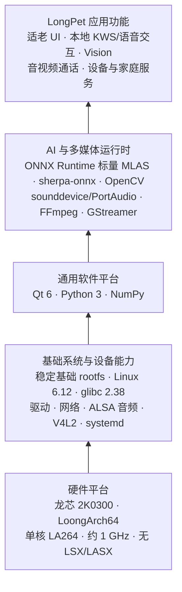

**图 6-1 LongPet 面向 2K0300 的 LoongArch 软件栈总体架构**

### 6.2 LoongArch AI 生态的兼容性边界

预编译的 LoongArch 软件包可能使用 2K0300 不支持的向量指令，运行时的架构判断也可能选错计算内核。关键组件统一交叉构建，并检查指令集、ABI、动态库依赖和推理数值。

源码构建固定版本与编译选项；构建后继续检查 ELF 产物和模型输出。

### 6.3 Buildroot 软件栈与交叉构建基线

Buildroot 2024.08 的 `output-qt6` 构建树使用面向 2K0300 的媒体版 defconfig，包含 Qt、Python/AI、视觉处理及多媒体软件包。主要组件见表 6-1。

**表 6-1 LongPet LoongArch 软件平台关键组件与版本基线**

| 组件 | 当前工程版本 | 构建方式 | 在 LongPet 中的主要用途 | 设计说明 / 关键考虑 |
| --- | --- | --- | --- | --- |
| Qt 6 | 6.8.1 | Buildroot 源码交叉构建 | Widgets 触控界面、网络、SQL、SVG | 采用 `linuxfb` 和触摸输入插件，适配板端显示环境 |
| Python 3 | 3.12.5 | Buildroot 源码交叉构建 | 本地 KWS 及 Python AI 组件运行 | 与基础系统 Python 3.12 运行环境保持兼容 |
| NumPy | 1.25.0 | Buildroot/Meson 源码交叉构建 | 音频数据处理和 AI Python 扩展基础 | 固定工具链与目标 ISA，避免依赖不可控的预编译二进制 |
| OpenCV | 4.10.0 | Buildroot 源码交叉构建 | 摄像头输入、图像预处理与视觉跟踪 | 保留 V4L2、视频处理及目标端所需接口 |
| ONNX Runtime | 1.17.1 | Buildroot 源码交叉构建并应用 MLAS 补丁 | 本地 ONNX 模型推理 | 对无 LSX/LASX 目标启用一致的标量路径，并验证数值正确性 |
| sherpa-onnx | 1.12.15 | Buildroot 源码交叉构建 | 语音推理组件 | 复用系统 ONNX Runtime，避免私有运行库副本不一致 |
| sounddevice | 0.5.1 | Buildroot 源码打包，配套 CFFI/PortAudio | Python 音频采集 | 将动态加载依赖列为合并清单的必需文件 |
| FFmpeg | 6.1.2 | Buildroot 源码交叉构建 | 多媒体工具与编解码库 | 按当前构建基线交付，控制板端实时编码负载 |
| GStreamer | 1.22.9 | Buildroot 源码交叉构建 | 插件化音视频处理能力 | 显式纳入运行时插件，不能只依赖 ELF 依赖闭包 |

Buildroot 生成相互匹配的 target、staging 和交叉 SDK。`output-qt6/target` 为 Hybrid Rootfs 提供软件组件，最终镜像按清单选择合入。

### 6.4 Python、NumPy 与音频依赖的源码构建

部分预编译 NumPy 包使用 2K0300 不支持的扩展指令，因此从 NumPy 1.25.0 源码构建。构建过程使用 Buildroot 的 Meson 交叉编译流程，并将目标端头文件安装到 staging，供下游扩展使用。Python 3.12、NumPy、CFFI、sounddevice 和 PortAudio 构成板端 Python 音频链路。

Buildroot 以 Python 字节码交付，合并时保留 NumPy、sounddevice 的 `.pyc` 文件及二进制扩展。sounddevice 经 CFFI 间接加载 PortAudio，相关文件不会全部出现在 ELF 的 `DT_NEEDED` 中；合并清单因此显式要求 sounddevice、`_sounddevice`、`_cffi_backend` 和 PortAudio 同时存在。板端分别验证数值计算、模块导入和音频设备访问。

### 6.5 ONNX Runtime 的无向量指令适配

#### 6.5.1 可加载但数值错误的问题

ONNX Runtime 1.17.1 的原有 MLAS 路径在无 LSX/LASX 的 2K0300 上出现数值错误。早期板端测试中，FP32 模型输出固定乱码，INT8 模型输出空串，静音输入也得到异常结果；模型可以加载，但推理结果错误。

源码与产物检查发现，原 LoongArch 路径在无向量内核时混用了 16 宽 B 矩阵打包和 4 宽标量计算内核。数据布局不一致导致 MatMul、Gemm、Conv 等计算失真，进而影响 Zipformer ASR 解码。修复前后的算子测试验证了这一定位。

#### 6.5.2 MLAS 标量路径的源码级修复

ONNX Runtime 包新增默认关闭的 `onnxruntime_MLAS_FORCE_SCALAR` 选项，仅在 2K0300 构建规则中启用。补丁调整 MLAS 源文件选择、LoongArch 宏和 LSX 头文件条件，改用通用标量源，并将 B 矩阵打包统一为与标量内核匹配的 4 宽格式。产物仍为 LoongArch64 LP64D 库。

构建使用通用 `loongarch64` 和严格对齐选项。sherpa-onnx 复用 `/usr/lib` 中的 ONNX Runtime，安装时移除 Python 包内的私有运行库副本。部署测试曾因绝对 RPATH 误加载旧库；改用相对 `$ORIGIN` 路径后，隔离库验证通过。验证时需核对实际加载的库版本。

#### 6.5.3 算子、模型与部署链路验证

目标板隔离部署的十项 ONNX Runtime 算子测试均通过。Conv、LayerNorm、Softmax 相对独立参考的最大绝对误差分别约为 `1.9×10⁻⁶`、`1.3×10⁻⁶`、`3.0×10⁻⁸`；其余受测算子为零误差。判定阈值为绝对误差 `1×10⁻⁵`、相对误差 `1×10⁻⁴`。FP32、INT8 流式识别测试中，静音输出为空串，语音结果连续三次一致，四类样例与 x86 参考逐字匹配。x86 参考使用的 sherpa-onnx 版本与板端不同，这些结果仅覆盖受测样例。

构建与镜像检查确认了标量源文件、无 LSX/LASX 指令、16 KiB ELF 可加载段对齐及修复库已纳入交付包。板端隔离部署的算子与语音测试通过；完整 Hybrid Rootfs 的启动与功能验证见项目综合测试报告。

图 6-2 展示从数值错误定位到标量路径修复、板端验证的流程。

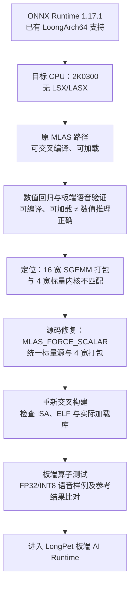

**图 6-2 ONNX Runtime 在无 LSX/LASX 的 2K0300 上的适配与验证路径**

### 6.6 sherpa-onnx、Qt6、OpenCV 与多媒体能力

sherpa-onnx 1.12.15 依赖 ONNX Runtime、Python、NumPy 和 ALSA。构建启用 Python 接口，关闭未使用的 TTS、说话人分离和 GPU 选项，并禁用 Eigen 向量化。LongPet 的本地 KWS 另由独立维护的 Python/ONNX 组件实现。

界面使用 Qt6 Widgets/Network/SQL/SVG，显示采用 `linuxfb`，触摸由输入插件接入。OpenCV 4.10.0 提供 C++/Python 图像处理、V4L2 摄像头和 FFmpeg 视频后端。媒体组件包含 FFmpeg、GStreamer 插件、Opus、VP8、RTP、DTLS、SRTP 与 WebRTC 相关基础库。合并清单显式列出通过运行时注册或 `dlopen()` 加载的插件。板端尚未完成全部 WebRTC 或实时软件编码场景的性能验收；当前也没有已确认可用的通用硬件视频编码器。

### 6.7 基础系统路线与 Hybrid Rootfs 决策

早期实机验证显示，直接套用龙芯buildroot仓库（[open-loongarch/buildroot-2024.08](https://gitee.com/open-loongarch/buildroot-2024.08)）构建的系统，完整替换基础系统后的稳定性未达到项目要求（出现cpu占用率异常波动等问题）。交付方案因此保留已验证的出厂自带基础系统，仅按清单合入所需的用户空间组件。

Hybrid Rootfs 以可启动的板卡基础 rootfs、内核和 ramdisk 为基线，从 `output-qt6/target` 选取 Qt6、Python/AI、OpenCV 和媒体组件。原有内核、模块、固件、动态加载器及核心 C/C++ 运行库保持不变；新增组件通过依赖、ABI 和 ISA 检查后合入。

### 6.8 Hybrid Rootfs 的合并与校验设计

基础系统与 Buildroot target 按清单合并，经依赖、ABI、ISA、基础文件和完整性校验后形成交付包，再进行板端验证（图 6-3）。

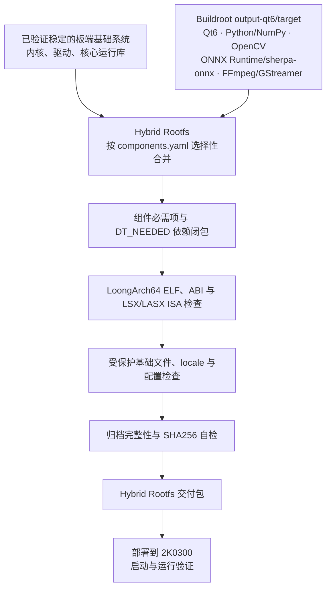

**图 6-3 LongPet Hybrid Rootfs 的构建、组件合并与完整性校验流程**

#### 6.8.1 清单驱动的组件合入和依赖闭包

`components.yaml` 以包含/排除规则、必需文件和受保护路径限定合并范围，覆盖 locale、Qt6、OpenCV、NumPy、sounddevice、ONNX Runtime、sherpa-onnx、FFmpeg、V4L2 工具及 GStreamer。必需文件缺失时构建失败；GStreamer 插件和 Python 动态加载依赖需显式列入清单。

解析器递归读取新增 ELF 的 `DT_NEEDED`，优先复用基础 rootfs 中的库，缺失时从 Buildroot target 补齐共享库及链接名，同时保留原有目录布局和受保护文件。合并后检查动态依赖、断链软链接及 Qt5 残留依赖。2026 年 8 月 29 日的记录显示：必需组件缺失 0、未解析依赖 0；检查 1739 个 ELF，断链软链接 0。

#### 6.8.2 ABI、架构与 ISA 检查

合并前核对基础 rootfs 与 target 的 glibc 版本、Python 主版本，以及内核镜像与模块目录；新增 ELF 的 GLIBC、GLIBCXX、CXXABI 符号版本要求不得超出基础运行库能力。8 月 29 日检查时，两套系统均使用 glibc 2.38，新增 ELF 的符号版本要求未超限。

架构检查遍历合并 rootfs 的全部 ELF，要求 `Machine=LoongArch`。ISA 检查默认反汇编本次新增的 ELF，拒绝 LSX/LASX 指令；也可启用全 rootfs 严格扫描。该次检查发现非 LoongArch ELF 0 个，新增 ELF 的向量指令命中 0 次。默认模式的 ISA 检查范围限于新增 ELF。

#### 6.8.3 基础文件保护、locale 与产物校验

清单保护 `/boot`、内核模块、固件、动态加载器、核心 glibc/libstdc++ 与既有系统配置。构建前后对关键基础文件计算 SHA256 并比较；不一致时停止交付。Qt6 所需 UTF-8 环境通过 `locale-archive` 和 `LANG=C.UTF-8` 配置补齐，构建过程校验 archive 非空且包含 C.UTF-8。合并还保留归档的数字属主、权限、扩展属性和 ACL，检查目录层级、关键文件、压缩包完整性，并对 rootfs、内核和 ramdisk 生成及自检 `SHA256SUMS`。

8 月 29 日合并记录显示受保护文件未变、locale 验证通过，rootfs、内核和 ramdisk 的校验通过。现有构建流程可按固定输入和配置重建软件集合；尚无不同主机间逐字节一致的验证记录。

### 6.9 systemd、自启动与自恢复

LongPet 服务以独立的 `longpet` 用户运行，配置显示、触摸、音频、串口权限和私有运行目录，并指定 `linuxfb` framebuffer、`tty1` VT 与触摸输入插件。板端联调解决了 `tty1` 与控制台抢占、设备节点权限问题；整板重启后应用和界面能够恢复。服务通过 `Restart=always` 在进程异常退出后自动重启。

针对特定 Wi-Fi 驱动探测失败，系统配置了条件式恢复服务。时间同步已启用，但 RTC 读取和重启后的同步稳定性仍需验证，提醒服务应检查时钟是否可信。合并系统在 `/etc/locale.conf` 中设置 C.UTF-8；冷启动验收已检查 Qt 字符编码、媒体设备权限、网络恢复及并发资源占用。

### 6.10 验证结论与证据边界

表 6-2 汇总已完成的构建检查与板端测试。具体测试条件见功能与性能报告。

**表 6-2 LongPet LoongArch 平台关键问题、设计决策与验证结果矩阵**

| 工程问题 | 设计决策 | 验证方式 | 当前结果 / 状态 |
| --- | --- | --- | --- |
| 2K0300 无 LSX/LASX | 采用通用目标编译选项，排除不兼容向量路径 | 交叉编译、ELF 架构与新增 ELF 指令扫描 | 构建与 ISA 校验通过 |
| LoongArch AI/Python 组件不能只按架构名称直接复用 | 固定源码、工具链和 ABI 基线 | 目标包构建、符号版本及板端导入检查 | 构建与运行验证通过 |
| NumPy 等 Python 扩展需受控构建 | Buildroot 源码交叉构建，保留字节码与扩展模块 | 构建产物、清单必需项和板端导入检查 | 构建与板端验证通过 |
| ONNX Runtime 可加载但曾出现数值错误 | 强制一致的标量 MLAS 和 4 宽打包路径 | 十项板端算子、FP32/INT8 语音样例及参考结果比对 | 板端数值验证通过 |
| 图形、视觉、语音和媒体组件需在同一目标环境协作 | 扩展 Buildroot Qt6、OpenCV、Python/AI、FFmpeg/GStreamer 配置 | target 构建、运行库与插件合并检查、板端功能验证 | 构建与运行验证通过 |
| 完整替换基础系统的稳定性未达项目要求 | 保留稳定基础系统，选择性合入 Buildroot 用户空间 | Hybrid Rootfs 合并校验和目标板运行验收 | Hybrid 方案板端验证通过 |
| 混合系统可能出现依赖、ABI/ISA 或基础文件冲突 | 对全 rootfs 依赖、符号版本、ISA、受保护文件和 SHA256 分层检查 | 合并报告与最终归档自检 | 依赖、兼容性与完整性校验通过 |
| 嵌入式应用需要自动启动和进程故障恢复 | systemd 管理 LongPet，配置运行权限与自动重启 | 整板重启、服务重启和异常退出恢复测试 | 板端验证通过 |

## 7 LongPet 应用软件架构

### 7.1 应用软件总体分层

### 7.2 Qt6 表示层与适老界面

### 7.3 应用控制层与页面流程

### 7.4 业务服务、Repository 与本地持久化

### 7.5 设备适配层与能力降级

### 7.6 AI 语音模块与 Provider 分层

### 7.7 视觉模块与 TargetObservation 数据通路

### 7.8 FamilyLink 服务与家属端协同

### 7.9 MotionService 与运动 MCU 协同

### 7.10 线程、进程、资源与生命周期管理

## 8 核心业务功能设计

LongPet 将日常陪伴、照护提醒和家庭联系整合在同一设备中。老人通过 1024×600 触屏或语音快速进入常用功能；家属通过桌面端设置提醒、查看设备、发起通话并提供远程协助，形成老人易用、家属可参与的双端体验。

### 8.1 业务能力与协同关系

老人端集中呈现提醒、今日关怀、天气和语音入口，减少日常操作步骤；家属端提供设备查看、通话及远程协助。视觉功能让设备主动关注人物，并向家属展示当前感知画面；人物跟随与人工远控均在独立运动安全校验下运行。

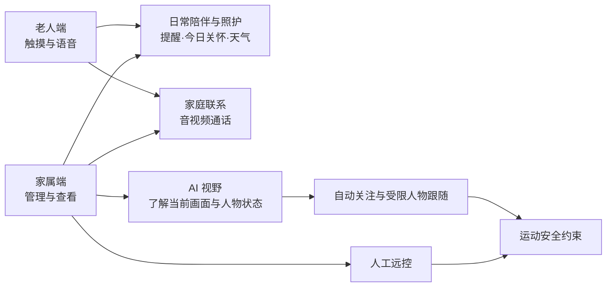

图 8-1 LongPet 核心业务能力关系。

| 核心功能 | 主要使用者 | 当前产品价值 |
| --- | --- | --- |
| 陪伴界面与语音 | 老人 | 用触摸或自然语言进入常用功能，并看懂设备正在倾听、回答还是等待 |
| 提醒与今日关怀 | 老人、家属 | 将提醒触发、老人确认和饮水记录汇成当日可查看的信息 |
| 天气 | 老人 | 在状态栏低成本查看当前天气，并在在线对话中询问天气 |
| 自动关注与 AI 视野 | 老人、家属 | 机器人朝向人物，家属了解它当前看到的画面和感知状态 |
| 人物跟随与人工远控 | 老人、家属 | 在受控场景下靠近人物，或由家属手动协助移动 |
| 音视频通话 | 老人、家属 | 在同一设备上进行家庭联系；语音与视频按所需媒体分别启用 |

表 8-1 核心功能、目标用户与主要价值。

### 8.2 老人端界面与状态反馈

老人端的设计重点是让高频任务一步可见、低频设置少打扰。1024×600 触屏首页显示陪伴表情和简短提示，并直接提供“陪我说话”“今日关怀”“视频通话”三个大按钮。状态栏显示时间、网络，以及有数据时的天气和供电信息，并提供设置入口。老人可从“今日关怀”进入提醒列表，查看事项状态或新增、编辑、确认提醒；较复杂的配置由家属端完成。

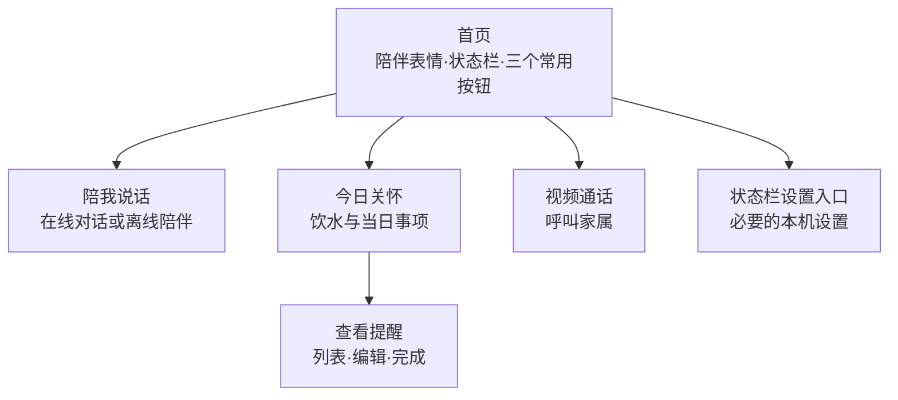

图 8-2 老人端主要导航。语音不可用时，常用功能仍可通过触屏进入。

陪伴表情用于提示设备状态：待机、倾听、思考、说话和异常分别配有表情或文字反馈。提醒触发时显示提示，并区分已完成与未确认事项；通话页面显示对方、连接状态和挂断入口。网络、AI 或设备能力不可用时，页面提示重试或功能状态，其他本地功能保持可用。表情暂时不承担情绪识别功能。

### 8.3 提醒、今日关怀与天气

提醒用于把饮水、用药等需要记住的事项转成到时可见、完成可查的行动。老人可在本机提醒页触摸创建或修改，家属可远程补充，在线语音也可在限定范围内创建、查询或删除提醒。三种入口指向同一份本地提醒状态，老人不必学会家属端的复杂设置。家属端的写入只有在设备确认成功后才算完成；连接失败或内容冲突会提示刷新、重试，不会显示虚假的保存成功。

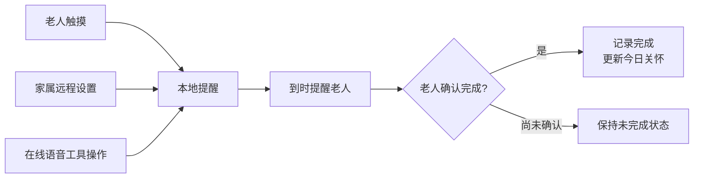

图 8-3 提醒的三入口与完成状态。触发后未确认的提醒保持未完成；断网期间已有本地提醒仍依本机时间触发。

“今日关怀”把饮水记录和用药提醒完成等离散事件整理为当日信息。老人可在本机记录喝水并查看进度，家属端可读取同一设备上的关怀摘要；活动分钟、互动次数虽有展示或记录位置，当前并未自动由摄像头或运动传感器生成健康指标，后续会补充相关功能和算法；没有可靠数据时应显示未知或待接入。这些信息有效帮助家庭了解已记录的日常事项。

天气作为无需另开复杂页面的日常信息显示在状态栏，也可作为在线语音回答的已有事实。网络正常且配置可用时更新当前天气；更新失败时，本次运行中已取得的快照会保留，首次无数据则显示“--”。若快照过期，在线语音使用旧快照时会提示信息可能过期。

### 8.4 语音交互、工具操作与离线陪伴

语音让老人少走菜单。在线能力可用时，老人说“小龙小龙”后进入倾听状态，说完需求后看到思考状态，随后听到回答并看到说话状态，结束后回到陪伴状态。老人也可以触摸“陪我说话”进入对话。在线模式支持日常聊天、询问时间和当前天气，以及提醒创建、查询、按明确对象删除和打开限定页面等业务操作。Tool Calling 的价值在于把自然语言请求转为受限的真实产品动作，提高产品的便捷性和智能性。

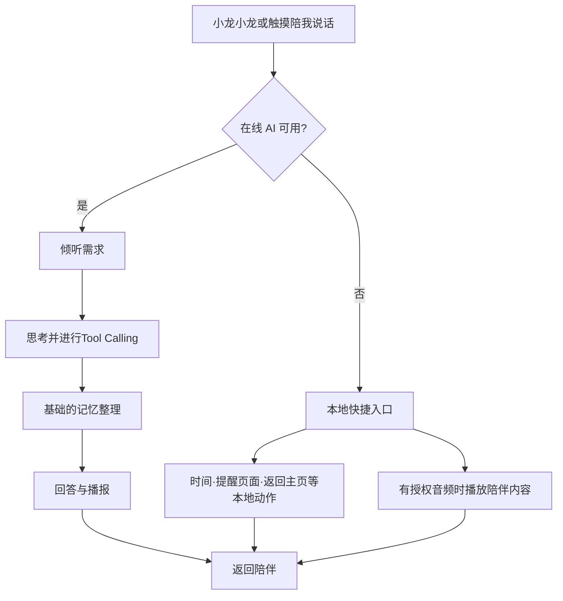

图 8-4 在线与离线语音流程。在线 AI 不可用时，本地唤醒和已配置的快捷功能仍可使用。

离线时，“小龙小龙”打开本地快捷提示；本地词可打开提醒、报时、返回主页、进入联系家人的通话入口或紧急页面。“陪我说话”可播放已配置的本地陪伴音频，音频文件缺失时页面提示不可播放。通话仍需网络，紧急页面目前不自动报警；语音“停止”用于取消对话或陪伴音频，或触发底盘停车。

通话、录音、播报或陪伴音频占用麦克风时，本地唤醒监听暂停；触屏取消或挂断入口保持可用。在线请求失败时显示失败状态，老人可结束或重试；离线快捷功能仍可通过本地唤醒入口使用。

### 8.5 人物感知、AI 视野与自动跟随

人物感知将同一份实时观测用于自动关注、家属端 AI 视野和人物跟随：老人获得更自然的陪伴反馈，家属可以了解设备关注的画面，并在需要时开启受控跟随。三项功能按各自权限运行。

**自动关注。** 家属开启“仅头部”后，设备根据有效人物位置调整头部朝向，底盘保持静止。目标丢失、画面中断或观测过期时停止使用旧位置。

**AI 视野。** 家属可在桌面端查看当前画面、人物框、感知状态及“关闭／仅头部／人物跟随”模式，并进入人工远控。无有效目标时不显示旧人物框；关闭远程视野页面不影响设备本地视觉功能。

**人物跟随。** 家属开启后，设备先确认目标，再调整头部和机身朝向；目标较远且安全条件满足时低速靠近，到达设定的画面距离后停车。目标丢失、摄像头不可用、人工接管、通话或故障时停止移动。通话或人工远控结束后，家属需重新开启跟随。

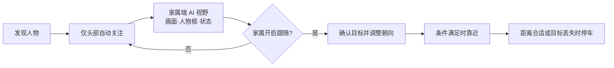

图 8-5 人物感知与受控跟随流程。

### 8.6 音视频通话与媒体资源

老人可从首页“视频通话”主动呼叫家属，家属端可接听或拒绝；老人等待时可取消，呼叫被拒绝时会收到提示。家属端可选择语音或视频呼叫设备；设备播放对应提示并准备媒体后接通，老人端提供挂断入口。通话页显示对象、连接状态和时长，触屏可显示醒目的挂断按钮。

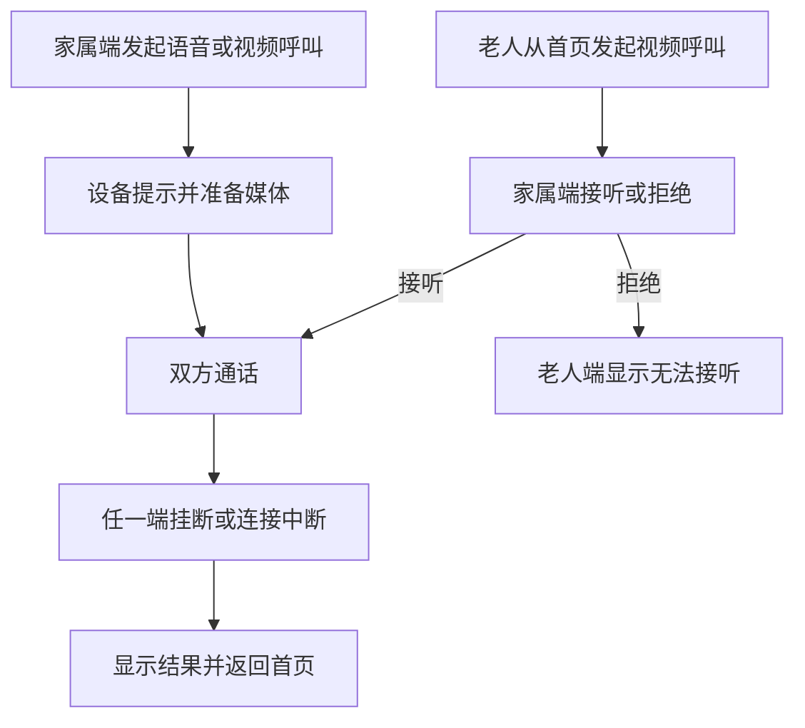

图 8-6 双向通话流程。语音通话只使用音频，视频通话使用双方画面和声音。设备发起视频时暂停占用摄像头的视觉任务，通话结束后重新检测人物。摄像头、麦克风或扬声器被占用、权限不足或连接失败时，页面显示失败或忙碌状态并释放已占用资源；断线后退出通话。家庭通话需保持网络连接。

### 8.7 家属端管理与人工远控

老人端提供陪伴、关怀、通话和必要的本机操作。家属端集中管理设备与网络状态、今日关怀、提醒、AI 视野、音视频通话、自动跟头、人物跟随及人工远控。家属端以设备实际反馈为准，失联、能力不可用或写入冲突时提示异常。

图 8-7 老人端与家属端的功能分工。两端共用设备上的提醒状态；家属端通过刷新获取关怀信息。

家属从“AI 视野”进入人工远控，按住方向按钮或按键时发送控制意图，松开、页面失焦或连接丢失时停车。人工控制优先于自动跟随；退出后，家属需重新开启跟随。运动能力不可用、控制模式不符或设备故障时，界面禁用控制按钮。

### 8.8 当前业务边界

现阶段的业务链覆盖老人端日常使用、家属端远程协助、本地感知与受控运动。表 8-2 集中列出已交付能力及使用条件，便于后续试用和迭代。

| 能力 | 当前交付 | 使用条件与后续方向 |
| --- | --- | --- |
| 老人端适老交互 | 大按钮、浅层导航与状态表情 | 目前表情是交互反馈，可加入情绪识别丰富表情反馈 |
| 提醒与今日关怀 | 触屏、家属端和在线语音共用提醒，完成后形成当日记录 | 已有本地提醒可在断网时触发；完成状态以老人确认为准，活动指标待接入可靠数据源 |
| 天气 | 状态栏显示天气，在线对话可引用已获取的信息 | 联网更新；失败时保留本次运行快照，过期标记待补充 |
| 在线 AI 语音与工具操作 | 自然语言聊天、提醒管理和限定页面操作 | 需要在线服务；具体动作由本机规则授权 |
| 本地唤醒与离线陪伴 | 离线保留关键词唤醒、快捷动作和已配置的陪伴音频 | 通话占用麦克风时暂停监听；长期记忆功能 |
| AI 视野、自动关注与人物跟随 | 家属查看当前画面，设备在受控条件下关注并靠近人物 | 目标无效或模式冲突时停车；身份识别、摔倒检测算法、复杂导航与避障属于后续能力 |
| 音视频通话 | 老人和家属双向联系，按需启用语音或视频 | 依赖网络与媒体设备；家属主动呼叫时设备提示后接通，老人可挂断 |
| 家属管理与人工远控 | 远程设置提醒、查看状态和按住协助移动 | 写入以设备确认为准；松开或失焦停车，左右平移暂缓开放 |

表 8-2 LongPet 已交付的业务能力、使用条件与后续方向。

## 9 本地 AI 模型与感知系统设计

LongPet 在龙芯 2K0300 上完成关键词唤醒（KWS）和人物视觉推理，形成无需云端参与的基础感知链。人物检测模型由项目在 PC 端训练、导出为 ONNX 后部署到板端；在线 ASR、LLM 和 TTS 则补充开放式语音对话能力。

### 9.1 端侧 AI 处理链与工程边界

麦克风输入先经自适应能量 VAD 筛选，再由常驻 FSMN-CTC 模型产生关键词事件；摄像头输入经轻量 Detector 和 Sparse LK Tracker 形成带时效信息的 `TargetObservation`。两条链分别支撑语音入口和人物位置观测，电机动作仍由独立运动控制链路裁决。板端运行依赖标量适配后的 ONNX Runtime、Python/NumPy 音频组件和 OpenCV。

### 9.2 本地 KWS、声学模型与关键词策略

本地 KWS 基于预训练 WeKWS FSMN-CTC ONNX 模型及中文 token 表，项目完成了从音频采集、FBank、CTC 词条匹配、自适应 VAD 到进程桥接和业务动作映射的端侧集成，并针对产品词条配置别名和阈值。声学文件为 `components/longpet-kws/assets/fsmn/fsmn_ctc.onnx`（3,065,258 B；SHA-256 `6febd9f7f15c47caed88d434d810651e34215334c66961b9ba66251fa04d98c4`）。产品 KWS 使用 Python、NumPy 和 ONNX Runtime `CPUExecutionProvider` 运行；声学权重的来源与再分发许可将在发布前核验。

板端默认以 48 kHz 单声道 PCM 每约 100 ms 取一块，转换为模型 16 kHz 输入；自适应能量 VAD 在静音时跳过 ONNX，保留约 300 ms 语音前缀，连续约 500 ms 静音后重置流式缓存。`KwsProcessAdapter` 通过独立 bridge 接收逐行 JSON 事件；模型常驻，暂停时释放采集，异常退出可重启。音频会话只有在带 ID 的暂停确认后才获麦克风；超时按失败处理。

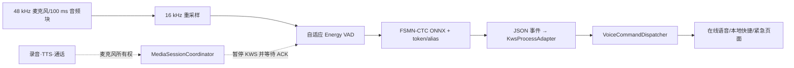

图 9-1 本地关键词与音频资源协调。通话和播报期间暂停 KWS 监听。

产品 bridge 为同一声学模型配置 11 个词条：“小龙小龙、你好、陪我说话、救命、停止、打开提醒、现在几点、联系家人、返回主页、音量大点、音量小点”。默认唤醒阈值为 0.15，“你好”为 0.10，其余命令词为 0.05；“救命”配置同音字别名，“返回主页”通过词表中的“反回主页”匹配后归一化。阈值属于 CTC 匹配策略。

| 关键词 | 当前 `VoiceCommandDispatcher.cpp` 的实际行为 |
|---|---|
| “小龙小龙” | 在线可用时开始语音会话，否则打开离线指令窗口 |
| “你好” | 识别后不触发业务操作 |
| “救命” | 取消当前语音/陪伴并打开本地紧急页面，当前不自动拨号或上报 |
| “停止” | 取消当前语音/陪伴并提示用户，不发送底盘 `STOP` |
| “陪我说话”“打开提醒”“现在几点”等 | 在线不可用时执行本地音频、提醒页、报时、联系家人入口、主页或音量调整 |

表 9-1 关键词到业务动作的映射。

通话、录音、播报和离线播放占用麦克风时，KWS 监听暂停。无视觉工况下，KWS 进程在安静环境cpu占用约13%， 嘈杂环境中 CPU 占用约 23%～31%；实测端到端延迟控制在几百毫秒以内。

### 9.3 人物检测模型自主训练与板端部署

LongPet 基于 [ETH-PBL/TinyissimoYOLO](https://github.com/ETH-PBL/TinyissimoYOLO) 的 TinyissimoYOLO-v1-small 网络结构，自主训练人物检测权重。通用模型从随机初始化开始，在 COCO person-only 数据上训练，再使用 LongPet 固定摄像头的实拍数据进行领域微调。

#### 9.3.1 板端模型选型

在单核约 1 GHz 的龙芯 2K0300 上，早期 YOLO11n-Pose 和手部 Landmark 每帧耗时数秒，皆作为废弃方案。后来测试的FastestDet 能检测人物，但推理延迟较高。表 9-2 对比同图、同 benchmark 条件下的纯 CNN 推理耗时，作为轻量模型选型依据。

| 模型 | 输入 | 板端纯推理平均耗时 | 相对速度 |
|---|---:|---:|---:|
| FastestDet | 352×352 | 2,399.16 ms | 1× |
| Tinyissimo V1.1 | 128×128 | 635.41 ms | 约 3.78× |

表 9-2 板端模型选型基线。Tinyissimo V1.1 的单次推理约 0.64 s，比 FastestDet 快约 3.78 倍；正式 V1.2 的并发性能另见表 9-6。

#### 9.3.2 Tinyissimo 架构来源与 COCO 通用训练

V1.1 从随机权重开始训练，使用 COCO person-only 小样本集：训练集 2,000 张含人图和 500 张无人图，验证集 500 张含人图和 125 张无人图。该版本用于验证架构、ONNX 导出及板端部署。COCO-full 随后独立随机初始化（`pretrained=false`、`resume=false`），用于训练正式通用人物模型；配置与有效数据量见表 9-3。

| 项目 | COCO-full 正式配置或扫描结果 |
|---|---|
| 网络与任务 | TinyissimoYOLO-v1-small，person-only |
| 初始化 | 重新随机初始化；`pretrained=false`、`resume=false` |
| 输入 | 128×128 |
| manifest 选出训练图片 | 69,115（64,115 张含人图、5,000 张无人图） |
| 扫描后有效训练图片 | **69,078**，其中 **4,996** 张空标注背景图 |
| 损坏并忽略 | **37** 张 |
| Optimizer / batch | SGD / 256 |
| 最大 epoch / patience | 150 / 30 |
| 初始学习率 `lr0` / seed | 0.01 / 20260901 |
| AMP | 开启 |

表 9-3 COCO-full 通用人物模型训练配置。manifest 选出 69,115 张图，训练缓存确认 69,078 张有效图，其中 4,996 张为空标注背景图；37 张损坏图被忽略。正式部署前继续使用 LongPet 固定视角数据微调。

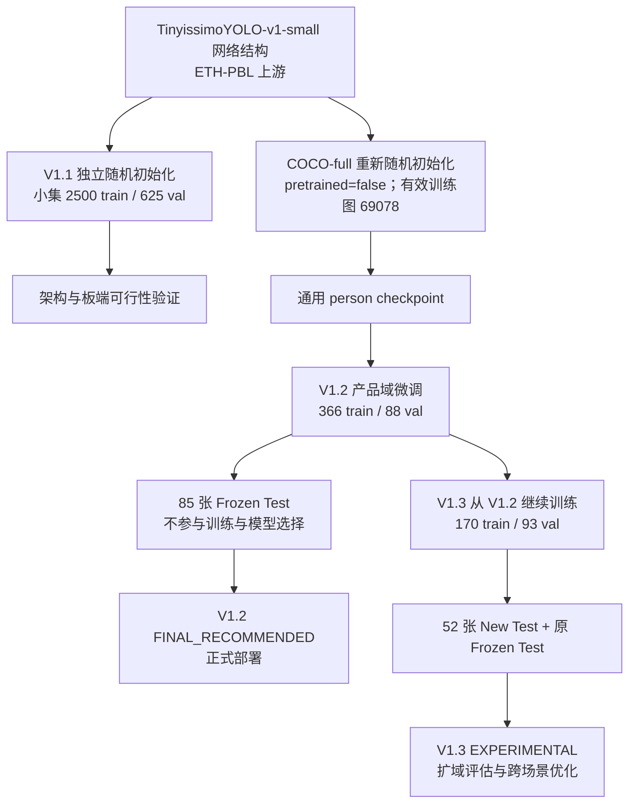

图 9-3 人物检测权重训练谱系。V1.1 与 COCO-full 独立初始化；V1.2 使用 539 张领域数据进行训练、验证和冻结测试划分，V1.3 在 V1.2 基础上开展扩域实验。

#### 9.3.3 LongPet 实拍数据集构建

V1.2 数据来自 36 段自行拍摄的产品视角视频，总长约 332.7 s，分辨率 1920×1080、约 30 FPS，按约 2 FPS 抽帧。使用 dHash 汉明距离和 32×18 灰度差剔除近重复帧；YOLOv8x teacher 在 PC 端初标，低置信、局部人体及疑似漏检由人工复核。同一视频的帧只进入一个 split，避免相邻帧随机划分造成测试泄漏。

V1.2 领域数据集共 539 张：366 张用于训练，88 张用于验证和早停，85 张 Frozen Test 用于独立评估。Frozen Test 在 V1.3 实验中继续保持原有标注和划分，其中没有经确认的纯无人负样本。

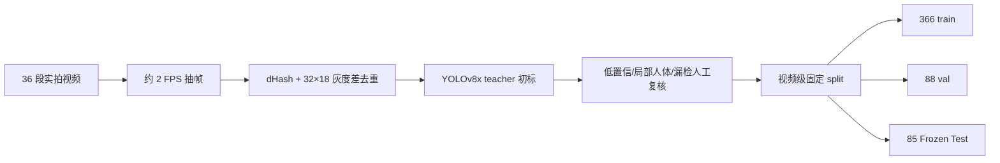

图 9-4 V1.2 实拍数据集构建流程。YOLOv8x teacher 只在 PC 端用于初标，冻结测试集保持独立。

#### 9.3.4 V1.2 领域微调与 Frozen Test

V1.2 从项目 COCO-full `best.pt` 开始领域微调，输入 128×128，使用 SGD、batch 32、`lr0=0.001`、最多 30 epoch、`patience=8`；最佳验证结果出现在第 21 个 epoch。表 9-4 在同一组 85 张 Frozen Test 上比较 COCO-only 与 V1.2 的静态 ONNX 模型。

| 指标 | COCO-only | V1.2 | 变化 |
|---|---:|---:|---:|
| Precision | 1.0000 | 1.0000 | 不变 (均为1是由于第一轮实拍数据采集未收集无人负样本） |
| Recall | 0.8813 | 0.9647 | +0.0834 |
| mAP50 | 0.9777 | 0.9856 | +0.0079 |
| mAP50-95 | 0.7963 | 0.8488 | +0.0525 |
| 正样本逐帧检测成功率 | 84.7% | 96.5% | +11.8 个百分点 |

表 9-4 V1.2 产品域适配结果。在同一组冻结测试帧上，Recall 从 0.8813 提升至 0.9647，正样本逐帧检出率提升 11.8 个百分点。逐帧检出按 `score≥0.25` 且最佳框 `IoU≥0.50` 统计。困难场景 `2场景1人绿左.mp4` 的 3 张测试帧尚未检出；空场误报由 V1.3 新域负样本另行评估。

#### 9.3.5 V1.3 扩域实验与最终版本取舍

V1.3 从 V1.2 checkpoint 继续微调，新增 19 段、总长约 174.4 s 的视频，形成 315 张图：170 张训练、93 张验证、52 张 New Test；其中 226 张含人图、89 张人工确认的无人图。扩域实验同时使用 New Test 和保持不变的 V1.2 Frozen Test，分别评估新旧场景表现。

| 测试域与指标 | V1.2 | V1.3 |
|---|---:|---:|
| **New V1.3 Test（52 张；38 positive / 14 negative）** | | |
| Recall | 0.4689 | 0.7895 |
| mAP50 / mAP50-95 | 0.7062 / 0.2989 | 0.8959 / 0.6136 |
| 正样本逐帧检出率 | 47.37% | 71.05% |
| 确认无人帧误报率 | 28.57% | 0% |
| **Frozen V1.2 Test（85 张；无 confirmed negative）** | | |
| Recall | 0.9647 | 0.9502 |
| mAP50 / mAP50-95 | 0.9856 / 0.8488 | 0.9784 / 0.8086 |
| 正样本逐帧检出率 | 96.47% | 88.24% |

表 9-5 V1.3 在两个测试域上的表现。V1.3 提高了新域召回率和 mAP，14 张确认无人测试帧中未出现误报；原冻结域的逐帧检出率则从 96.47% 降至 88.24%。为保持已验证产品场景的检出表现，正式部署继续使用 V1.2（`FINAL_RECOMMENDED`）；V1.3 作为扩域实验版本（`EXPERIMENTAL`）继续优化。

图 9-5 V1.2 与 V1.3 在新旧测试域的表现对照。

#### 9.3.6 ONNX 导出与 LoongArch 部署

正式 V1.2 为 person-only FP32 ONNX，opset 17，输入 `[1,3,128,128]`、输出 `[1,5,16]`，约 402,057 个参数，文件 1,620,685 B；SHA-256 为 `cb3defedb3ac01006d4caa5312c21d4a674e5a808e885067f2bc67e8f822f89c`。在 85 张 Frozen Test 上，PyTorch 与 ONNX 原始输出的最大绝对差为 0.00036621、平均绝对差为 0.00000982，均满足 `atol=5e-4`；逐图 `score≥0.25` 的候选框数量一致。

板端通过 ONNX Runtime `CPUExecutionProvider` 运行 V1.2 模型；`deploy/longpet.service` 指向 `tinyissimo-person-128-longpet-v1.onnx`。训练与部署流程包括 COCO 通用训练、产品域微调、Frozen Test、ONNX 一致性检查、LoongArch 部署、板端测量及 Detector+Tracker 调度优化。

### 9.4 Detector + Tracker 持续人物感知

正式 V1.2 的 detector-only 板端测量显示，KWS 并发时 CNN 平均推理约 1,269 ms，检测吞吐约 0.738 FPS。Vision V2.0 使用 Tinyissimo 低频搜索、目标重获和周期纠偏，并由 Sparse Lucas–Kanade Tracker 在检测间隙更新人物框。工作线程只处理摄像头最新帧，避免旧帧排队。

| V1.2 detector-only 板端工况 | 预热 / 测量帧 | 平均推理 | P95 推理 | 平均总链路 | 有效检测吞吐 |
|---|---:|---:|---:|---:|---:|
| Vision 基本独占（主程序停止） | 10 / 65 | 735.26 ms | 759.04 ms | 768.11 ms | 1.285 FPS |
| KWS 并发 | 10 / 33 | 1,268.86 ms | 1,374.13 ms | 1,322.83 ms | 0.738 FPS |

表 9-6 正式 V1.2 detector-only 实机测量。总链路包含 JPEG 解码、预处理、CNN 推理和后处理；两组 RSS 分别为 41,296/41,920 kB，`LongPetVisionBench` 进程 CPU 分别为 90.29%/55.91%。KWS 并发使单核资源竞争加剧。

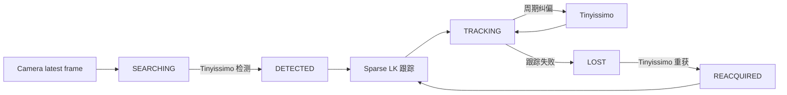

图 9-6 Detector 与 Tracker 的状态流。跟踪特征不足、越界或一致性检查失败时转入目标重搜。

| V2.0 Detector+Tracker 实机工况 | CNN 平均推理 | Detector 总链路 | Detector 实际触发 | 目标位置更新 |
|---|---:|---:|---:|---:|
| KWS 正常运行，单人物 | 992.33 ms | 1,030.19 ms | 0.121 Hz | **8.75 Hz** |
| 真人持续走动，单人物 | 993.922 ms | 1,028.81 ms | 0.247 Hz | **7.23 Hz** |

表 9-7 V2.0 板端感知调度。通过低频 Detector 与高频 Tracker 协同，单人物测试中的目标观测频率达到约 7～9 Hz；真人走动时，6 次跟踪失败均由 Detector 重获。这使受限算力平台也能够持续向上层提供人物位置。

CNN 周期纠偏与 Tracker 目前在同一工作线程同步执行，CNN 推理期间目标更新暂停，结束后继续处理最新帧。`TargetObservation` 的时间戳和 freshness 约束上层消费，避免无限使用旧目标。

### 9.5 TargetObservation 与产品视觉接口

`TargetObservation` 是 Detector 与 Tracker 的统一服务级感知接口，至少包含人物 bbox、归一化中心、`SEARCHING/DETECTED/TRACKING/CORRECTED/LOST/REACQUIRED` 状态、帧序号、采集时间戳、发布时间戳及 age/freshness。家属端 AI 视野、自动跟头和人物跟随消费同一观测；上层无需知道该 bbox 来自 Tinyissimo 检测还是 Sparse LK 跟踪。目标过期、丢失或摄像头故障时，控制策略停止继续使用旧框；是否运动仍由第 11 章的模式、租约与安全约束裁决。
家属端 AI 视野在授权会话中接收共享摄像头已有的 JPEG 与归一化 bbox/视觉元数据，由 Family Desktop 本地绘框。板端无需为叠框再次执行 JPEG 解码、绘制和编码，避免增加 2K0300 的图像处理负担。家属端退出 AI 视野只释放远程查看资源，本地 Vision 继续运行；视频通话则按媒体资源仲裁暂停或重置 Vision。

### 9.6 并发资源、性能验证与当前边界

端侧视觉以 Detector+Tracker 调度在有限算力下保持目标位置更新，并通过最新帧处理与观测时效避免旧画面积压。表 9-6 测量连续 CNN 检测吞吐，表 9-7 测量协同后的目标更新频率。Vision 与 KWS 在单核上竞争 CPU；经过kws的vad检测参数调整后，全部业务开启时，实机测试加载期 CPU 短时约 100%、随后维持在约 40%～80%，内存约 0.18 GB。cpu负载和内存资源占用健康，长期运行安全稳定。

后续验证重点包括无人画面误报、困难场景漏检、多人关联、完全遮挡、快速尺度变化，以及 CNN 同步推理造成的短时更新空档。V1.2 冻结集没有确认的纯无人样本，困难场景未检出时 Tracker 也无法建立目标。V1.3 已改善新域表现，后续训练需兼顾原有场景。

## 10 接口与数据设计

### 10.1 系统接口总体设计与边界

### 10.2 LongPet—运动 MCU 串口接口

### 10.3 LongPet—Family Desktop 接口

### 10.4 AI Provider 与第三方服务接口

### 10.5 摄像头、音频、显示与平台硬件接口

### 10.6 本地业务数据与持久化

### 10.7 AI 对话、记忆与敏感数据

### 10.8 视觉观测、训练数据与模型元数据

### 10.9 配置管理、令牌与隐私保护

### 10.10 数据一致性、失效与降级处理

## 11 运动控制与系统安全设计

### 11.1 设计目标与安全原则

LongPet 是具备摄像头、网络连接和可运动底盘的适老产品。运动控制的目标不是让底盘“能动”，而是使它**受控、安全、可恢复地动**。系统遵循失效优先停车原则：视觉误检、远控端失焦、串口断线或主控任务阻塞时，底盘不得持续执行上一条运动命令。系统在命令超时、故障、模式冲突或控制源丢失时停车；恢复运动须重新满足模式、命令和时效条件。通信在线与运动授权分别校验。

### 11.2 双处理器运动控制架构

运动安全采用**上层策略约束 + MCU 独立执行保护**。龙芯 2K0300 主控负责远控接入、视觉感知、运动策略和控制权仲裁。ESP32-S3 运动 MCU 负责模式与命令校验、时效检查、传感器故障处理和输出撤销。MCU 与电机直接相连，即使 Linux 应用层失去响应，也能独立停止底盘。

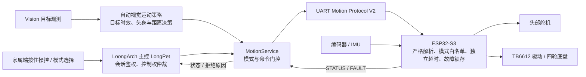

图 11-1 双处理器分层控制与安全边界。网络和视觉侧通过 MCU 控制电机；主控失效时，MCU 的租约与链路超时仍能使持续底盘动作停止。

### 11.3 运动执行链路

`MotionService` 集中管理串口、家属端会话、视觉模式和 MCU 状态。`AutomaticHeadTrackingService` 将 `TargetObservation` 的画面偏差转为 `TARGET`；人物跟随时，再结合物理头偏和归一化人物框高度形成 `FOLLOW_MOVE`。Family Desktop 通过 FamilyLink 申请远控会话并发送底盘、头部控制意图。命令经 `MotionService` 和 UART Motion Protocol V2 到达 ESP32-S3，由 MCU 控制舵机、TB6612 四轮麦克纳姆底盘、编码器 PID 与 IMU 航向反馈，并通过双向 UART 返回 `STATUS` 和故障信息。

MCU 启动时执行 `BeginSafe`：先将两组 TB6612 的 STBY 置低，再初始化方向和 PWM 输出，初始模式为 `SAFE`。头部位置受软件脉宽限制；`HEAD` 与 `TARGET` 使用同一左右方向映射。自动跟头设置死区和单次转动幅度上限。

### 11.4 控制模式与权限

MCU 设置 `SAFE`、`HEAD_ONLY`、`MANUAL`、`FOLLOW` 四种模式。切换模式时先停车，清除底盘动作、手动与跟随租约、目标有效性和转向瞬态，再进入新模式。重复发送当前 `MODE` 不清除现有租约；模式切换也不解除故障锁存。

| 模式 | 主要控制来源 | 允许动作 | 禁止动作 | 典型退出或停车条件 |
|---|---|---|---|---|
| `SAFE` | 主控安全管理 | `MODE`、`STOP`、`PING`、`STATUS` | 所有主动底盘及头部命令 | 上电保持停止；显式切换模式前仍不运动 |
| `HEAD_ONLY` | 自动头部跟踪 | `TARGET` 修正头部及通用命令 | `MOVE`、`FOLLOW_MOVE`；目标帧驱动轮组 | 目标丢失/过期、模式切换、故障 |
| `MANUAL` | 已获控制权的家属端 | `HEAD`；持续刷新的 `MOVE` 驱动底盘；通用命令 | `TARGET`、`FOLLOW_MOVE` | 松开/退出主动 `STOP`，链路或 `MOVE` 租约到期、模式切换、故障 |
| `FOLLOW` | LongPet 视觉跟随策略 | `TARGET` 跟头；独立续租的 `FOLLOW_MOVE` 前进、原地旋转或停止；通用命令 | 手动 `MOVE`；`FOLLOW_MOVE` 后退、平移及弧线动作 | 目标丢失/过期、跟随租约或链路到期、模式切换、故障 |

表 11-1 MCU 模式与权限矩阵。各模式均接受诊断、停车和模式命令；`STOP` 立即撤销底盘驱动。协议保留 `SHIFT_LEFT`/`SHIFT_RIGHT` 解析，但当前版本和家属端均未开放左右平移。旧三整数目标格式仅兼容 `TARGET` 输入，不触发按目标面积自动驱动底盘。

### 11.5 UART 协议与输入校验

主控与 MCU 使用逐行 ASCII 串口协议。MCU 使用固定 64 字节行缓冲，限制每次主循环的读取量，并在收到完整行后解析。非可打印 ASCII、控制字符和超长行整行丢弃；未知命令、错误模式、额外字段、整数溢出及越界参数均被拒绝。解析仅接受约定的空格分隔，速度、舵机步长和目标几何量不得越界。

只有格式正确且当前模式允许的完整命令才刷新通用链路时戳；非法输入既不执行，也不刷新运动或目标时效。主控同样校验命令并检查 `STATUS`。V1.3 测试中，半包、超长行、乱码、特殊关键词组合和越界参数复测均通过，未再复现此前的乱码卡死。

### 11.6 多级时效与运动租约

固件分别记录通用链路、手动动作、自动跟随动作和视觉目标的时戳。四项超时当前均为 500 ms，但由各自的有效输入独立刷新。

| 安全时钟 | 仅由什么刷新 | 到期后的含义 |
|---|---|---|
| General Link | 任意被接受的合法命令，包括 `PING`、`STATUS` | 活动底盘无有效链路，停车 |
| MANUAL Motion Lease | `MANUAL` 中合法 `MOVE` | 手动动作不再被持续授权，停车 |
| FOLLOW Motion Lease | `FOLLOW` 中合法、非停止的 `FOLLOW_MOVE` | 自动底盘动作不再被新策略结果授权，停车 |
| TARGET Freshness | `HEAD_ONLY`/`FOLLOW` 中合法目标帧 | 当前有效人物目标过期，清目标并停车 |

表 11-2 四类独立时效约束。`PING`/`STATUS` 仅续通用链路，`TARGET` 不续跟随动作租约；`FOLLOW_MOVE STOP` 立即停车且不建立新租约。目标过期检查仅针对已取得的有效目标。活动底盘完全失联时通常记录 `LINK_TIMEOUT`；链路仍由 `PING` 保持、动作却未刷新时，记录 `MANUAL_COMMAND_TIMEOUT` 或 `FOLLOW_COMMAND_TIMEOUT`。两种情况均停车。

家属端按住底盘按钮时周期发送控制意图，LongPet 仅在远控租约有效时重发 `MOVE`。视觉侧须对新目标观测重新检查时效、模式、头偏和距离，才发送下一条 `FOLLOW_MOVE`。UART 断线时主控尝试停车；命令无法送达时由 MCU 超时停车。

### 11.7 统一停车、故障锁存与恢复

停止请求、模式切换、目标丢失、链路或动作租约到期属于可恢复停车。IMU 初始化或运行时读取失败、活动运动控制周期超限、固件定角转向超时则触发故障锁存。控制周期目标为 100 ms；活动运动间隔超过 250 ms 时，固件报 `CONTROL_OVERRUN` 并停车。定角转向有固件超时保护，但对外 `MOVE` 尚未开放定角转向指令。

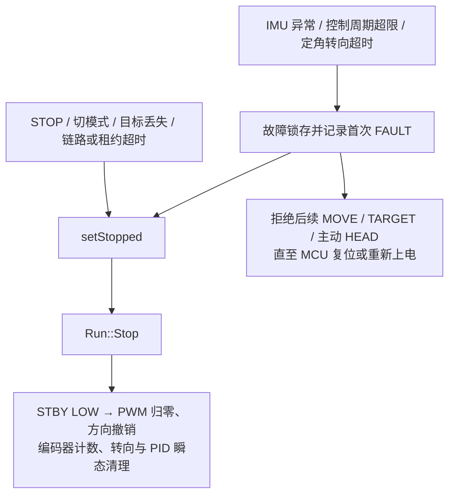

图 11-2 统一停车与故障锁存路径。`setStopped` 清除底盘模式、速度及手动、跟随租约，并调用 `Run::Stop`；目标有效位由目标丢失、故障或模式切换路径清除。`Run::Stop` 先撤销 TB6612 STBY，再将 PWM 置零、方向脚置低，清除编码器计数、转向与 PID 瞬态；头部舵机保持当前位置。故障锁存后，`PING`、`STATUS`、`STOP` 和 `MODE` 仍可用于诊断或停车，恢复主动控制须复位或重新上电并排查故障。

`STATUS` 只有一个 `stopReason` 字段。锁存后发送 `STOP` 或切换模式可能覆盖最近的停车原因，但 `fault=1` 保留；排障时应查看首次 `[FAULT]` 记录。

### 11.8 家庭远控与控制权仲裁

Family Desktop 发起远控会话，LongPet 校验会话身份、串口状态、MCU 在线状态及故障状态，同一时间只允许一名远控控制者。进入 `MANUAL` 前，`MotionService` 预留手动控制权、释放自动控制，再执行 `STOP → MODE MANUAL → STATUS`；退出时执行 `STOP → MODE SAFE`。MCU 失联、模式意外变化、故障或串口断线时，主控撤销控制权。长期 Bearer Token 保留在 Electron 主进程，渲染进程使用短时运动会话令牌。当前明文 HTTP/WS 控制端口仅用于局域网，不应直接暴露公网。

底盘控制按住时持续刷新，按钮或键盘释放、页面失焦、隐藏、退出或断线时，家属端发送停止命令并停止刷新；LongPet 远控租约和 MCU 手动租约提供超时停车。头部控制按住时发送有限步进，松开后保持当前位置。界面仅在 MCU 处于 `MANUAL` 且无故障时开放操控。

人工遥控优先于自动视觉运动，视频通话也会暂停相关自动运动。远控或通话结束后，人物跟随须由用户重新开启；头部自动跟踪可在开关有效、视觉恢复且安全条件满足时重新进入 `HEAD_ONLY`，并等待新目标。

### 11.9 视觉跟随安全控制

`HEAD_ONLY` 模式下，`TARGET` 只驱动头部舵机，不驱动轮组。`FOLLOW` 模式下，`TARGET` 更新头部及目标时效；目标稳定、Motion 状态有效时，LongPet 读取 MCU 报告的物理 `head_offset`，判断是否需要原地转动机身，再根据人物框归一化高度的 FAR/GOOD/NEAR 分类决定是否前进。画面中心偏差 `dx` 不直接用于底盘驱动。

头身对齐且分类为 FAR 时，底盘低速前进；GOOD 或 NEAR 时停车，不自动后退。头偏方向变化时先停车并重新确认；目标丢失或过期时停车、清目标，重获后重新确认稳定性。MCU 仅在 `FOLLOW` 模式接受 `FOLLOW_MOVE`，且拒绝后退、平移和弧线动作。视觉观测中断时，上层停止续租，由 MCU 在租约到期后停车。V1.3 测试覆盖人物跟随硬件闭环、距离阈值、独立租约与失联停车，包括台架、悬空轮组和低速落地验证。人物框高度仅是距离代理；系统尚无 SLAM、自主导航及障碍、悬崖检测能力。

### 11.10 安全设计验证与证据追踪

《LongPet 产品运动功能测试报告_2026-09-13_V1.3_全项通过版》附录 A 共列 58 项：56 项通过，左右平移两项（15、16 号）主动暂缓，待验证项为 0。表 11-3 列出运动安全设计与测试编号的对应关系。

| 安全设计机制 | V1.3 测试编号 | 当前结论 |
|---|---|---|
| 上电默认 `SAFE`、底盘不自启 | 1–2 | 通过 |
| 半包、超长行、乱码与异常参数拒绝；压力复测未再卡死 | 23–27（含 25 号压力复测） | 通过 |
| `SAFE` 拒绝 `MOVE`；`HEAD_ONLY` 允许跟头但轮组阻断 | 28–30 | 通过 |
| 模式切换前停车并清旧运动/租约 | 32、55 | 通过 |
| 运动中 `STOP` 与随后重新合法控制 | 33–34 | 通过 |
| 单条 `MOVE` 后静默，通用链路到期停车 | 36 | 通过 |
| `PING`/`STATUS` 不续 MANUAL `MOVE` 租约 | 37 | 通过 |
| UART 断开停车及重连后的受控恢复 | 38–39、56–57 | 通过 |
| IMU 故障、控制周期超限锁存，拒绝动作，复位后恢复 | 40–43 | 通过 |
| 目标过期或丢失清目标；`TARGET` 不直接驱动 FOLLOW 底盘 | 46–48 | 通过 |
| 非 FOLLOW 模式拒绝 `FOLLOW_MOVE`；FOLLOW 禁止后退/平移 | 49、54 | 通过 |
| `TARGET`、`PING`/`STATUS` 不续 FOLLOW 独立租约 | 50–51 | 通过 |
| `FOLLOW_MOVE STOP` 立即撤销运动并清租约 | 53 | 通过 |
| V2.3 人物跟随硬件闭环及距离阈值 | 报告正文 5.5、5.6；附录 A 48–58 | 通过 |

表 11-3 安全设计与 V1.3 测试证据追踪。测试编号见报告附录 A；人物跟随硬件闭环还对应报告正文 5.5 的实机结果。

### 11.11 版本边界与后续优化

`SHIFT_LEFT`/`SHIFT_RIGHT` 横向平移暂缓交付。`speed` 是内部控制量，尚未标定为 cm/s；精确速度、转角误差、停车距离及 `stopReason` 的诊断可读性仍需改进。

`Run::Stop` 将 TB6612 的 STBY 置低，使电机进入高阻自由滑行状态；实际停车距离受速度、惯性、地面和负载影响。现阶段运动功能须在有人看护的低速环境中使用，人物框高度不能充当碰撞检测。后续应增加物理急停、驱动默认禁能、限流与供电保护、电源切断路径、外部 STBY 下拉及障碍、悬崖感知，并量化速度、转角和停距。

## 12 典型业务流程

### 12.1 开机、自检、登录/连接与服务就绪

### 12.2 老人端提醒创建、触发与完成

### 12.3 在线语音对话与工具调用

### 12.4 断网后的离线基础陪伴

### 12.5 视觉人物发现、自动跟头与目标丢失

### 12.6 家属端连接、状态查看与提醒管理

### 12.7 视频/语音通话

### 12.8 远程手动控制与停止

### 12.9 人物跟随启停与安全停车

### 12.10 故障发生、降级与恢复

## 13 非功能需求落实与工程化设计

### 13.1 性能预算、响应链路与资源监测

### 13.2 视觉与语音并发资源调度

### 13.3 适老可用性与交互一致性

### 13.4 稳定性、进程隔离与服务恢复

### 13.5 网络、接口、令牌与隐私安全

### 13.6 日志、诊断与可观测性

### 13.7 自动化测试、实机验证与可复现性

### 13.8 第三方组件、模型来源与许可管理

## 14 构建、部署、发布与运营计划

### 14.1 四仓库构建链与交付物关系

### 14.2 龙芯系统、应用、家属端与 MCU 部署概览

### 14.3 配置、首次启动与验收检查点

### 14.4 版本基线、发布包与完整性校验

### 14.5 升级、备份、回退与故障恢复

### 14.6 原型试用、使用支持与维护计划

### 14.7 后续运营、反馈收集与迭代计划

## 15 关键技术难点与方案权衡

### 15.1 2K0300 无 LSX/LASX 的软件兼容问题

### 15.2 ONNX Runtime 从可加载到数值正确的修复

### 15.3 基础系统稳定性与 Hybrid Rootfs 取舍

### 15.4 低算力视觉模型、域适配与 Detector/Tracker 协同

### 15.5 语音在线/离线链路与资源竞争

### 15.6 头身协调、距离代理与无地图跟随边界

### 15.7 远程运动控制的时效性与失效安全

## 16 技术创新与应用价值

### 16.1 LoongArch 低算力平台的 AI 适配实践

### 16.2 可校验的 Hybrid Rootfs 交付方法

### 16.3 面向实拍场景的视觉训练与分层推理

### 16.4 语音、视觉与家属端协同的适老体验

### 16.5 多层运动安全机制与可解释边界

### 16.6 应用价值、推广条件与市场潜力

## 17 当前成果、限制与后续规划

### 17.1 交付基线与已验证成果

### 17.2 已实现但验证有限的能力

### 17.3 实验性能力、接口预留与未完成功能

### 17.4 已知性能、环境与硬件限制

### 17.5 后续测试、工程化与产品化路线

## 18 总结

### 18.1 产品设计总结

### 18.2 需求、技术方案与证据的对应关系

## 附录

### 附录 A 需求—模块—测试追踪矩阵

### 附录 B 系统接口索引

### 附录 C 关键配置参数表

### 附录 D 硬件连接与引脚摘要

### 附录 E 第三方软件、库与模型清单

### 附录 F 参考资料
