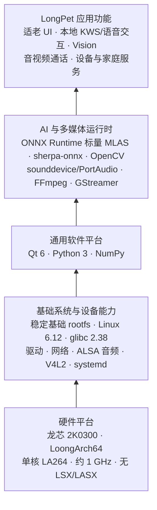
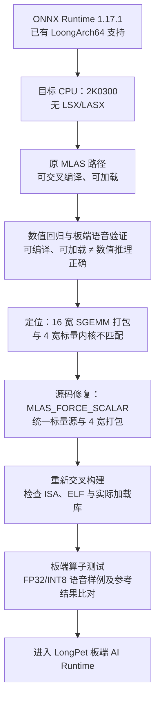
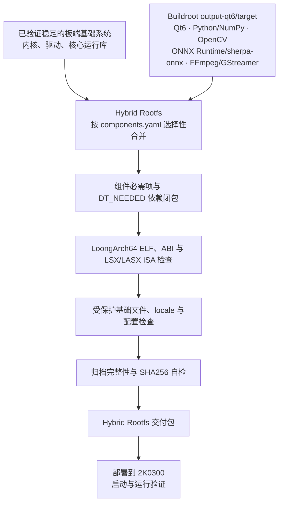
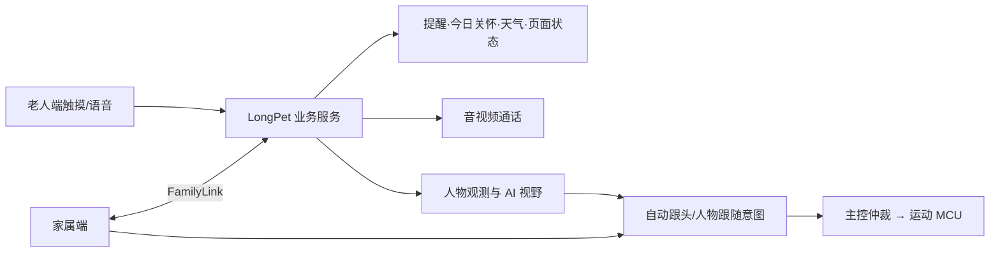
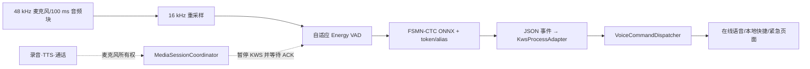
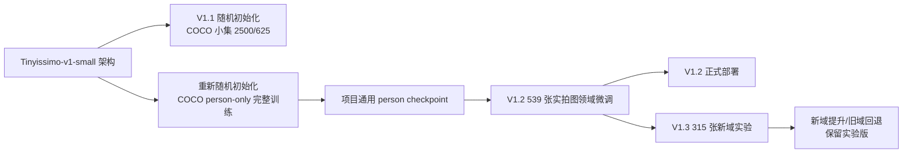
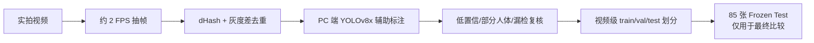
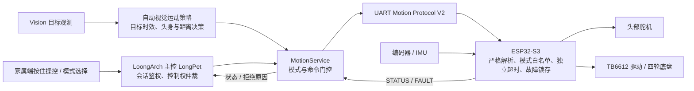
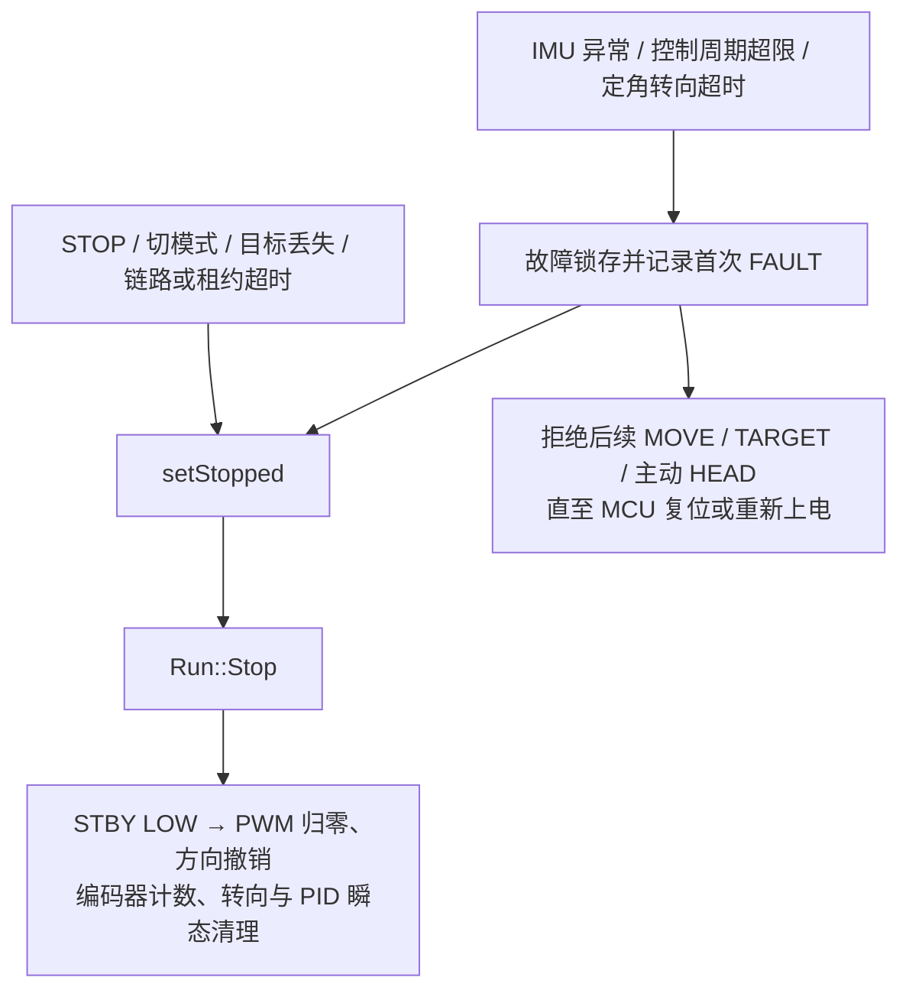

# LongPet 产品设计文档

| 文档信息 | 内容 |
| --- | --- |
| 文档版本 | V0.2（编写中） |
| 产品名称 | LongPet |
| 文档类型 | 产品设计文档 |

## 文档修订记录

| 版本 | 日期 | 修订说明 |
| --- | --- | --- |
| V0.1 | 2026-09-13 | 建立正式报告框架与分层目录 |
| V0.2 | 2026-09-13 | 完成报告第六章正文 |
| V0.3 | 2026-09-13 | 完成报告第十章正文 |

## 摘要

<!-- 待正文完成后撰写。 -->

## 关键词

<!-- 待正文完成后填写。 -->

## 缩略语与术语表

<!-- 随章节编写补充。 -->

## 图目录

<!-- 随图表插入补充。 -->

## 表目录

<!-- 随图表插入补充。 -->

## 目录

- 文档修订记录
- 摘要
- 关键词
- 缩略语与术语表
- 图目录
- 表目录
- 1 文档概述
  - 1.1 编写目的
  - 1.2 文档范围与读者对象
  - 1.3 产品版本、交付基线与文档关系
  - 1.4 参考资料与证据来源
  - 1.5 完成状态与证据等级说明
- 2 产品概述
  - 2.1 项目背景与问题定义
  - 2.2 产品定位与目标
  - 2.3 目标用户与使用环境
  - 2.4 用户痛点与核心价值
  - 2.5 典型使用场景
  - 2.6 产品形态、组成与交互方式
  - 2.7 产品能力边界与非目标
- 3 产品需求分析
  - 3.1 需求来源、优先级与版本范围
  - 3.2 功能需求总览
  - 3.3 老人端适老交互与本地业务需求
  - 3.4 提醒、今日关怀与状态查看需求
  - 3.5 AI 语音交互与离线陪伴需求
  - 3.6 视觉感知、自动跟头与人物跟随需求
  - 3.7 视频和语音通话需求
  - 3.8 家属端管理与远程控制需求
  - 3.9 运动控制与安全需求
  - 3.10 多模态数据采集、处理与融合需求
  - 3.11 非功能需求
    - 3.11.1 性能与响应时间
    - 3.11.2 稳定性与故障恢复
    - 3.11.3 易用性与适老性
    - 3.11.4 安全性与隐私保护
    - 3.11.5 可维护性与可扩展性
    - 3.11.6 可复现性与可验证性
  - 3.12 平台、硬件、网络与资源约束
  - 3.13 需求验收口径与追踪方式
- 4 系统总体设计
  - 4.1 总体设计原则
  - 4.2 龙芯主控、家属端与运动 MCU 协同架构
  - 4.3 系统功能架构
  - 4.4 物理架构与硬件连接概览
  - 4.5 部署架构与网络边界
  - 4.6 软件分层架构
  - 4.7 四个工程仓库的职责划分
  - 4.8 功能模块与物理模块映射
  - 4.9 主要数据流与控制流
  - 4.10 核心技术路线与选型原则
- 5 硬件系统设计
  - 5.1 硬件总体组成
  - 5.2 龙芯 2K0300 主控平台
  - 5.3 显示与触摸模块
  - 5.4 摄像头模块
  - 5.5 麦克风与音频输出模块
  - 5.6 网络通信模块
  - 5.7 ESP32-S3 运动控制模块
  - 5.8 电机、驱动、编码器与 IMU
  - 5.9 头部舵机机构
  - 5.10 电源、存储与外部接口
  - 5.11 硬件连接关系与信号边界
  - 5.12 关键物料选型依据
  - 5.13 当前硬件限制与工程化缺口
- 6 LoongArch 系统软件平台设计
  - 6.1 目标板约束与平台设计目标
  - 6.2 LoongArch AI 生态的兼容性边界
  - 6.3 Buildroot 软件栈与交叉构建基线
  - 6.4 Python、NumPy 与音频依赖的源码构建
  - 6.5 ONNX Runtime 的无向量指令适配
    - 6.5.1 可加载但数值错误的问题
    - 6.5.2 MLAS 标量路径的源码级修复
    - 6.5.3 算子、模型与部署链路验证
  - 6.6 sherpa-onnx、Qt6、OpenCV 与多媒体能力
  - 6.7 基础系统路线与 Hybrid Rootfs 决策
  - 6.8 Hybrid Rootfs 的合并与校验设计
    - 6.8.1 清单驱动的组件合入和依赖闭包
    - 6.8.2 ABI、架构与 ISA 检查
    - 6.8.3 基础文件保护、locale 与产物校验
  - 6.9 systemd、自启动与自恢复
  - 6.10 验证结论与证据边界
- 7 LongPet 应用软件架构
  - 7.1 应用软件总体分层
  - 7.2 Qt6 表示层与适老界面
  - 7.3 应用控制层与页面流程
  - 7.4 业务服务、Repository 与本地持久化
  - 7.5 设备适配层与能力降级
  - 7.6 AI 语音模块与 Provider 分层
  - 7.7 视觉模块与 TargetObservation 数据通路
  - 7.8 FamilyLink 服务与家属端协同
  - 7.9 MotionService 与运动 MCU 协同
  - 7.10 线程、进程、资源与生命周期管理
- 8 核心业务功能设计
  - 8.1 业务能力与协同关系
  - 8.2 老人端界面与状态反馈
  - 8.3 提醒、今日关怀与天气
  - 8.4 语音交互、工具操作与离线陪伴
  - 8.5 人物感知、AI 视野与自动跟随
  - 8.6 音视频通话与媒体资源
  - 8.7 家属端管理与人工远控
  - 8.8 当前业务边界
- 9 本地 AI 模型与感知系统设计
  - 9.1 端侧 AI 处理链与工程边界
  - 9.2 本地 KWS、声学模型与关键词策略
  - 9.3 自主人物检测模型训练与板端部署
    - 9.3.1 板端模型选型
    - 9.3.2 从随机初始化训练通用人物模型
    - 9.3.3 LongPet 实拍数据与领域微调
    - 9.3.4 V1.2 冻结测试结果
    - 9.3.5 V1.3 泛化实验与版本取舍
    - 9.3.6 ONNX 导出与板端部署
  - 9.4 Detector + Tracker 的持续目标感知
  - 9.5 AI 观测输出与产品接口
  - 9.6 并发资源、验证口径与后续测量
- 10 接口与数据设计
  - 10.1 系统接口总体设计与边界
  - 10.2 LongPet—运动 MCU 串口接口
  - 10.3 LongPet—Family Desktop 接口
  - 10.4 AI Provider 与第三方服务接口
  - 10.5 摄像头、音频、显示与平台硬件接口
  - 10.6 本地业务数据与持久化
  - 10.7 AI 对话、记忆与敏感数据
  - 10.8 视觉观测、训练数据与模型元数据
  - 10.9 配置管理、令牌与隐私保护
  - 10.10 数据一致性、失效与降级处理
- 11 运动控制与系统安全设计
  - 11.1 设计目标与安全原则
  - 11.2 双处理器运动控制架构
  - 11.3 运动执行链路
  - 11.4 控制模式与权限
  - 11.5 UART 协议与输入校验
  - 11.6 多级时效与运动租约
  - 11.7 统一停车、故障锁存与恢复
  - 11.8 家庭远控与控制权仲裁
  - 11.9 视觉跟随安全控制
  - 11.10 安全设计验证与证据追踪
  - 11.11 版本边界与后续优化
- 12 典型业务流程
  - 12.1 开机、自检、登录/连接与服务就绪
  - 12.2 老人端提醒创建、触发与完成
  - 12.3 在线语音对话与工具调用
  - 12.4 断网后的离线基础陪伴
  - 12.5 视觉人物发现、自动跟头与目标丢失
  - 12.6 家属端连接、状态查看与提醒管理
  - 12.7 视频/语音通话
  - 12.8 远程手动控制与停止
  - 12.9 人物跟随启停与安全停车
  - 12.10 故障发生、降级与恢复
- 13 非功能需求落实与工程化设计
  - 13.1 性能预算、响应链路与资源监测
  - 13.2 视觉与语音并发资源调度
  - 13.3 适老可用性与交互一致性
  - 13.4 稳定性、进程隔离与服务恢复
  - 13.5 网络、接口、令牌与隐私安全
  - 13.6 日志、诊断与可观测性
  - 13.7 自动化测试、实机验证与可复现性
  - 13.8 第三方组件、模型来源与许可管理
- 14 构建、部署、发布与运营计划
  - 14.1 四仓库构建链与交付物关系
  - 14.2 龙芯系统、应用、家属端与 MCU 部署概览
  - 14.3 配置、首次启动与验收检查点
  - 14.4 版本基线、发布包与完整性校验
  - 14.5 升级、备份、回退与故障恢复
  - 14.6 原型试用、使用支持与维护计划
  - 14.7 后续运营、反馈收集与迭代计划
- 15 关键技术难点与方案权衡
  - 15.1 2K0300 无 LSX/LASX 的软件兼容问题
  - 15.2 ONNX Runtime 从可加载到数值正确的修复
  - 15.3 基础系统稳定性与 Hybrid Rootfs 取舍
  - 15.4 低算力视觉模型、域适配与 Detector/Tracker 协同
  - 15.5 语音在线/离线链路与资源竞争
  - 15.6 头身协调、距离代理与无地图跟随边界
  - 15.7 远程运动控制的时效性与失效安全
- 16 技术创新与应用价值
  - 16.1 LoongArch 低算力平台的 AI 适配实践
  - 16.2 可校验的 Hybrid Rootfs 交付方法
  - 16.3 面向实拍场景的视觉训练与分层推理
  - 16.4 语音、视觉与家属端协同的适老体验
  - 16.5 多层运动安全机制与可解释边界
  - 16.6 应用价值、推广条件与市场潜力
- 17 当前成果、限制与后续规划
  - 17.1 交付基线与已验证成果
  - 17.2 已实现但验证有限的能力
  - 17.3 实验性能力、接口预留与未完成功能
  - 17.4 已知性能、环境与硬件限制
  - 17.5 后续测试、工程化与产品化路线
- 18 总结
  - 18.1 产品设计总结
  - 18.2 需求、技术方案与证据的对应关系
- 附录
  - 附录 A 需求—模块—测试追踪矩阵
  - 附录 B 系统接口索引
  - 附录 C 关键配置参数表
  - 附录 D 硬件连接与引脚摘要
  - 附录 E 第三方软件、库与模型清单
  - 附录 F 参考资料

---

## 1 文档概述

### 1.1 编写目的

### 1.2 文档范围与读者对象

### 1.3 产品版本、交付基线与文档关系

### 1.4 参考资料与证据来源

### 1.5 完成状态与证据等级说明

## 2 产品概述

### 2.1 项目背景与问题定义

### 2.2 产品定位与目标

### 2.3 目标用户与使用环境

### 2.4 用户痛点与核心价值

### 2.5 典型使用场景

### 2.6 产品形态、组成与交互方式

### 2.7 产品能力边界与非目标

## 3 产品需求分析

### 3.1 需求来源、优先级与版本范围

### 3.2 功能需求总览

### 3.3 老人端适老交互与本地业务需求

### 3.4 提醒、今日关怀与状态查看需求

### 3.5 AI 语音交互与离线陪伴需求

### 3.6 视觉感知、自动跟头与人物跟随需求

### 3.7 视频和语音通话需求

### 3.8 家属端管理与远程控制需求

### 3.9 运动控制与安全需求

### 3.10 多模态数据采集、处理与融合需求

### 3.11 非功能需求

#### 3.11.1 性能与响应时间

#### 3.11.2 稳定性与故障恢复

#### 3.11.3 易用性与适老性

#### 3.11.4 安全性与隐私保护

#### 3.11.5 可维护性与可扩展性

#### 3.11.6 可复现性与可验证性

### 3.12 平台、硬件、网络与资源约束

### 3.13 需求验收口径与追踪方式

## 4 系统总体设计

### 4.1 总体设计原则

### 4.2 龙芯主控、家属端与运动 MCU 协同架构

### 4.3 系统功能架构

### 4.4 物理架构与硬件连接概览

### 4.5 部署架构与网络边界

### 4.6 软件分层架构

### 4.7 四个工程仓库的职责划分

### 4.8 功能模块与物理模块映射

### 4.9 主要数据流与控制流

### 4.10 核心技术路线与选型原则

## 5 硬件系统设计

### 5.1 硬件总体组成

### 5.2 龙芯 2K0300 主控平台

### 5.3 显示与触摸模块

### 5.4 摄像头模块

### 5.5 麦克风与音频输出模块

### 5.6 网络通信模块

### 5.7 ESP32-S3 运动控制模块

### 5.8 电机、驱动、编码器与 IMU

### 5.9 头部舵机机构

### 5.10 电源、存储与外部接口

### 5.11 硬件连接关系与信号边界

### 5.12 关键物料选型依据

### 5.13 当前硬件限制与工程化缺口

## 6 LoongArch 系统软件平台设计

LongPet 在龙芯 2K0300 上运行图形、语音、视觉和多媒体组件。软件平台采用受控交叉构建、标量推理适配和 Hybrid Rootfs，并分别验证产物兼容性、推理数值和板端功能。

### 6.1 目标板约束与平台设计目标

目标主控龙芯 2K0300 采用单核 LA264、约 1 GHz 的 LoongArch64 处理器，不支持 LSX/LASX 向量指令。编入这些指令的二进制包无法在目标板运行；语音、视觉和界面并发时还需控制 CPU 与内存占用。一次板端测试显示系统可见内存约 369 MiB，未配置 swap。

交付基线采用 LoongArch64 LP64D ABI、Linux 6.12.0.lsgd 内核、glibc 2.38 和 Python 3.12。外部 GCC 13.3 工具链以通用 `loongarch64` 和严格对齐为编译目标。ONNX Runtime 产物还需满足目标板内核的 16 KiB ELF 可加载段对齐要求。

软件栈分为基础系统、通用平台、AI 与媒体运行时、应用功能四层（图 6-1）。

**图 6-1 LongPet 面向 2K0300 的 LoongArch 软件栈总体架构**

### 6.2 LoongArch AI 生态的兼容性边界

预编译的 LoongArch 软件包可能使用 2K0300 不支持的向量指令，运行时的架构判断也可能选错计算内核。关键组件统一交叉构建，并检查指令集、ABI、动态库依赖和推理数值。

源码构建固定版本与编译选项；构建后继续检查 ELF 产物和模型输出。

### 6.3 Buildroot 软件栈与交叉构建基线

Buildroot 2024.08 的 `output-qt6` 构建树使用面向 2K0300 的媒体版 defconfig，包含 Qt、Python/AI、视觉处理及多媒体软件包。主要组件见表 6-1。

**表 6-1 LongPet LoongArch 软件平台关键组件与版本基线**

| 组件 | 当前工程版本 | 构建方式 | 在 LongPet 中的主要用途 | 设计说明 / 关键考虑 |
| --- | --- | --- | --- | --- |
| Qt 6 | 6.8.1 | Buildroot 源码交叉构建 | Widgets 触控界面、网络、SQL、SVG | 采用 `linuxfb` 和触摸输入插件，适配板端显示环境 |
| Python 3 | 3.12.5 | Buildroot 源码交叉构建 | 本地 KWS 及 Python AI 组件运行 | 与基础系统 Python 3.12 运行环境保持兼容 |
| NumPy | 1.25.0 | Buildroot/Meson 源码交叉构建 | 音频数据处理和 AI Python 扩展基础 | 固定工具链与目标 ISA，避免依赖不可控的预编译二进制 |
| OpenCV | 4.10.0 | Buildroot 源码交叉构建 | 摄像头输入、图像预处理与视觉跟踪 | 保留 V4L2、视频处理及目标端所需接口 |
| ONNX Runtime | 1.17.1 | Buildroot 源码交叉构建并应用 MLAS 补丁 | 本地 ONNX 模型推理 | 对无 LSX/LASX 目标启用一致的标量路径，并验证数值正确性 |
| sherpa-onnx | 1.12.15 | Buildroot 源码交叉构建 | 语音推理组件 | 复用系统 ONNX Runtime，避免私有运行库副本不一致 |
| sounddevice | 0.5.1 | Buildroot 源码打包，配套 CFFI/PortAudio | Python 音频采集 | 将动态加载依赖列为合并清单的必需文件 |
| FFmpeg | 6.1.2 | Buildroot 源码交叉构建 | 多媒体工具与编解码库 | 按当前构建基线交付，控制板端实时编码负载 |
| GStreamer | 1.22.9 | Buildroot 源码交叉构建 | 插件化音视频处理能力 | 显式纳入运行时插件，不能只依赖 ELF 依赖闭包 |

Buildroot 生成相互匹配的 target、staging 和交叉 SDK。`output-qt6/target` 为 Hybrid Rootfs 提供软件组件，最终镜像按清单选择合入。

### 6.4 Python、NumPy 与音频依赖的源码构建

部分预编译 NumPy 包使用 2K0300 不支持的扩展指令，因此从 NumPy 1.25.0 源码构建。构建过程使用 Buildroot 的 Meson 交叉编译流程，并将目标端头文件安装到 staging，供下游扩展使用。Python 3.12、NumPy、CFFI、sounddevice 和 PortAudio 构成板端 Python 音频链路。

Buildroot 以 Python 字节码交付，合并时保留 NumPy、sounddevice 的 `.pyc` 文件及二进制扩展。sounddevice 经 CFFI 间接加载 PortAudio，相关文件不会全部出现在 ELF 的 `DT_NEEDED` 中；合并清单因此显式要求 sounddevice、`_sounddevice`、`_cffi_backend` 和 PortAudio 同时存在。板端分别验证数值计算、模块导入和音频设备访问。

### 6.5 ONNX Runtime 的无向量指令适配

#### 6.5.1 可加载但数值错误的问题

ONNX Runtime 1.17.1 的原有 MLAS 路径在无 LSX/LASX 的 2K0300 上出现数值错误。早期板端测试中，FP32 模型输出固定乱码，INT8 模型输出空串，静音输入也得到异常结果；模型可以加载，但推理结果错误。

源码与产物检查发现，原 LoongArch 路径在无向量内核时混用了 16 宽 B 矩阵打包和 4 宽标量计算内核。数据布局不一致导致 MatMul、Gemm、Conv 等计算失真，进而影响 Zipformer ASR 解码。修复前后的算子测试验证了这一定位。

#### 6.5.2 MLAS 标量路径的源码级修复

ONNX Runtime 包新增默认关闭的 `onnxruntime_MLAS_FORCE_SCALAR` 选项，仅在 2K0300 构建规则中启用。补丁调整 MLAS 源文件选择、LoongArch 宏和 LSX 头文件条件，改用通用标量源，并将 B 矩阵打包统一为与标量内核匹配的 4 宽格式。产物仍为 LoongArch64 LP64D 库。

构建使用通用 `loongarch64` 和严格对齐选项。sherpa-onnx 复用 `/usr/lib` 中的 ONNX Runtime，安装时移除 Python 包内的私有运行库副本。部署测试曾因绝对 RPATH 误加载旧库；改用相对 `$ORIGIN` 路径后，隔离库验证通过。验证时需核对实际加载的库版本。

#### 6.5.3 算子、模型与部署链路验证

目标板隔离部署的十项 ONNX Runtime 算子测试均通过。Conv、LayerNorm、Softmax 相对独立参考的最大绝对误差分别约为 `1.9×10⁻⁶`、`1.3×10⁻⁶`、`3.0×10⁻⁸`；其余受测算子为零误差。判定阈值为绝对误差 `1×10⁻⁵`、相对误差 `1×10⁻⁴`。FP32、INT8 流式识别测试中，静音输出为空串，语音结果连续三次一致，四类样例与 x86 参考逐字匹配。x86 参考使用的 sherpa-onnx 版本与板端不同，这些结果仅覆盖受测样例。

构建与镜像检查确认了标量源文件、无 LSX/LASX 指令、16 KiB ELF 可加载段对齐及修复库已纳入交付包。板端隔离部署的算子与语音测试通过；完整 Hybrid Rootfs 的启动与功能验证见项目综合测试报告。

图 6-2 展示从数值错误定位到标量路径修复、板端验证的流程。

**图 6-2 ONNX Runtime 在无 LSX/LASX 的 2K0300 上的适配与验证路径**

### 6.6 sherpa-onnx、Qt6、OpenCV 与多媒体能力

sherpa-onnx 1.12.15 依赖 ONNX Runtime、Python、NumPy 和 ALSA。构建启用 Python 接口，关闭未使用的 TTS、说话人分离和 GPU 选项，并禁用 Eigen 向量化。LongPet 的本地 KWS 另由独立维护的 Python/ONNX 组件实现。

界面使用 Qt6 Widgets/Network/SQL/SVG，显示采用 `linuxfb`，触摸由输入插件接入。OpenCV 4.10.0 提供 C++/Python 图像处理、V4L2 摄像头和 FFmpeg 视频后端。媒体组件包含 FFmpeg、GStreamer 插件、Opus、VP8、RTP、DTLS、SRTP 与 WebRTC 相关基础库。合并清单显式列出通过运行时注册或 `dlopen()` 加载的插件。板端尚未完成全部 WebRTC 或实时软件编码场景的性能验收；当前也没有已确认可用的通用硬件视频编码器。

### 6.7 基础系统路线与 Hybrid Rootfs 决策

早期实机验证显示，直接套用龙芯buildroot仓库（[open-loongarch/buildroot-2024.08](https://gitee.com/open-loongarch/buildroot-2024.08)）构建的系统，完整替换基础系统后的稳定性未达到项目要求（出现cpu占用率异常波动等问题）。交付方案因此保留已验证的出厂自带基础系统，仅按清单合入所需的用户空间组件。

Hybrid Rootfs 以可启动的板卡基础 rootfs、内核和 ramdisk 为基线，从 `output-qt6/target` 选取 Qt6、Python/AI、OpenCV 和媒体组件。原有内核、模块、固件、动态加载器及核心 C/C++ 运行库保持不变；新增组件通过依赖、ABI 和 ISA 检查后合入。

### 6.8 Hybrid Rootfs 的合并与校验设计

基础系统与 Buildroot target 按清单合并，经依赖、ABI、ISA、基础文件和完整性校验后形成交付包，再进行板端验证（图 6-3）。

**图 6-3 LongPet Hybrid Rootfs 的构建、组件合并与完整性校验流程**

#### 6.8.1 清单驱动的组件合入和依赖闭包

`components.yaml` 以包含/排除规则、必需文件和受保护路径限定合并范围，覆盖 locale、Qt6、OpenCV、NumPy、sounddevice、ONNX Runtime、sherpa-onnx、FFmpeg、V4L2 工具及 GStreamer。必需文件缺失时构建失败；GStreamer 插件和 Python 动态加载依赖需显式列入清单。

解析器递归读取新增 ELF 的 `DT_NEEDED`，优先复用基础 rootfs 中的库，缺失时从 Buildroot target 补齐共享库及链接名，同时保留原有目录布局和受保护文件。合并后检查动态依赖、断链软链接及 Qt5 残留依赖。2026 年 8 月 29 日的记录显示：必需组件缺失 0、未解析依赖 0；检查 1739 个 ELF，断链软链接 0。

#### 6.8.2 ABI、架构与 ISA 检查

合并前核对基础 rootfs 与 target 的 glibc 版本、Python 主版本，以及内核镜像与模块目录；新增 ELF 的 GLIBC、GLIBCXX、CXXABI 符号版本要求不得超出基础运行库能力。8 月 29 日检查时，两套系统均使用 glibc 2.38，新增 ELF 的符号版本要求未超限。

架构检查遍历合并 rootfs 的全部 ELF，要求 `Machine=LoongArch`。ISA 检查默认反汇编本次新增的 ELF，拒绝 LSX/LASX 指令；也可启用全 rootfs 严格扫描。该次检查发现非 LoongArch ELF 0 个，新增 ELF 的向量指令命中 0 次。默认模式的 ISA 检查范围限于新增 ELF。

#### 6.8.3 基础文件保护、locale 与产物校验

清单保护 `/boot`、内核模块、固件、动态加载器、核心 glibc/libstdc++ 与既有系统配置。构建前后对关键基础文件计算 SHA256 并比较；不一致时停止交付。Qt6 所需 UTF-8 环境通过 `locale-archive` 和 `LANG=C.UTF-8` 配置补齐，构建过程校验 archive 非空且包含 C.UTF-8。合并还保留归档的数字属主、权限、扩展属性和 ACL，检查目录层级、关键文件、压缩包完整性，并对 rootfs、内核和 ramdisk 生成及自检 `SHA256SUMS`。

8 月 29 日合并记录显示受保护文件未变、locale 验证通过，rootfs、内核和 ramdisk 的校验通过。现有构建流程可按固定输入和配置重建软件集合；尚无不同主机间逐字节一致的验证记录。

### 6.9 systemd、自启动与自恢复

LongPet 服务以独立的 `longpet` 用户运行，配置显示、触摸、音频、串口权限和私有运行目录，并指定 `linuxfb` framebuffer、`tty1` VT 与触摸输入插件。板端联调解决了 `tty1` 与控制台抢占、设备节点权限问题；整板重启后应用和界面能够恢复。服务通过 `Restart=always` 在进程异常退出后自动重启。

针对特定 Wi-Fi 驱动探测失败，系统配置了条件式恢复服务。时间同步已启用，但 RTC 读取和重启后的同步稳定性仍需验证，提醒服务应检查时钟是否可信。合并系统在 `/etc/locale.conf` 中设置 C.UTF-8；冷启动验收已检查 Qt 字符编码、媒体设备权限、网络恢复及并发资源占用。

### 6.10 验证结论与证据边界

表 6-2 汇总已完成的构建检查与板端测试。具体测试条件见功能与性能报告。

**表 6-2 LongPet LoongArch 平台关键问题、设计决策与验证结果矩阵**

| 工程问题 | 设计决策 | 验证方式 | 当前结果 / 状态 |
| --- | --- | --- | --- |
| 2K0300 无 LSX/LASX | 采用通用目标编译选项，排除不兼容向量路径 | 交叉编译、ELF 架构与新增 ELF 指令扫描 | 构建与 ISA 校验通过 |
| LoongArch AI/Python 组件不能只按架构名称直接复用 | 固定源码、工具链和 ABI 基线 | 目标包构建、符号版本及板端导入检查 | 构建与运行验证通过 |
| NumPy 等 Python 扩展需受控构建 | Buildroot 源码交叉构建，保留字节码与扩展模块 | 构建产物、清单必需项和板端导入检查 | 构建与板端验证通过 |
| ONNX Runtime 可加载但曾出现数值错误 | 强制一致的标量 MLAS 和 4 宽打包路径 | 十项板端算子、FP32/INT8 语音样例及参考结果比对 | 板端数值验证通过 |
| 图形、视觉、语音和媒体组件需在同一目标环境协作 | 扩展 Buildroot Qt6、OpenCV、Python/AI、FFmpeg/GStreamer 配置 | target 构建、运行库与插件合并检查、板端功能验证 | 构建与运行验证通过 |
| 完整替换基础系统的稳定性未达项目要求 | 保留稳定基础系统，选择性合入 Buildroot 用户空间 | Hybrid Rootfs 合并校验和目标板运行验收 | Hybrid 方案板端验证通过 |
| 混合系统可能出现依赖、ABI/ISA 或基础文件冲突 | 对全 rootfs 依赖、符号版本、ISA、受保护文件和 SHA256 分层检查 | 合并报告与最终归档自检 | 依赖、兼容性与完整性校验通过 |
| 嵌入式应用需要自动启动和进程故障恢复 | systemd 管理 LongPet，配置运行权限与自动重启 | 整板重启、服务重启和异常退出恢复测试 | 板端验证通过 |

## 7 LongPet 应用软件架构

### 7.1 应用软件总体分层

### 7.2 Qt6 表示层与适老界面

### 7.3 应用控制层与页面流程

### 7.4 业务服务、Repository 与本地持久化

### 7.5 设备适配层与能力降级

### 7.6 AI 语音模块与 Provider 分层

### 7.7 视觉模块与 TargetObservation 数据通路

### 7.8 FamilyLink 服务与家属端协同

### 7.9 MotionService 与运动 MCU 协同

### 7.10 线程、进程、资源与生命周期管理

## 8 核心业务功能设计

本章从老人端与家属端的实际操作出发，说明各项功能的入口、处理结果和失效行为。模型训练、端侧推理和性能取舍见第 9 章；接口字段与运动安全裁决分别见第 10、11 章。

### 8.1 业务能力与协同关系

图 8-1 LongPet 业务能力关系。语音和视觉是业务入口或感知输入；提醒写入、媒体占用与底盘运动仍分别经过业务校验、资源仲裁和 MCU 安全裁决。

| 使用场景 | 老人端/家属端可见结果 | 主要约束 |
|---|---|---|
| 日常照护 | 提醒、饮水记录、今日关怀、天气与状态 | 本地记录和网络数据分开标明时效 |
| 语音陪伴 | 唤醒后在线对话、有限工具操作；断网后本地快捷动作与音频陪伴 | 离线不提供生成式回答；通话期间不并行监听 |
| 人物感知 | 头部朝向人物、家属端 AI 视野、受限人物跟随 | 目标过期、丢失或模式冲突时不继续自动运动 |
| 家庭连接 | 设置与提醒管理、语音/视频通话、手动远控 | 权限、媒体设备和运动控制权分别仲裁 |

表 8-1 核心业务的结果与约束。

### 8.2 老人端界面与状态反馈

`AppController` 将触摸、语音事件、来电及提醒完成操作交给相应 Service，页面不直接访问数据库、网络 Provider 或电机。首页提供今日关怀、提醒、通话、设置及网络配置入口；语音会话或来电期间保持当前任务页面，结束后恢复合适导航。`PetFaceWidget` 与会话页按待机、倾听、思考、说话、离线等业务状态切换表情，并显示可理解的设备或网络错误。表情用于交互反馈，不表示情绪识别或健康判断。

### 8.3 提醒、今日关怀与天气

老人、家属及受限语音工具均通过 `ReminderService` 创建或编辑提醒。服务校验标题、日期时间、重复规则和启用状态，由 Repository 持久化并调度下一次触发；“已触发”和“已完成”分别记账，避免重复提醒或把未确认事项误报为完成。断网时本地提醒仍可工作，不承诺断电期间向外推送。

`CareService` 汇总饮水和用药提醒完成等本地事件，老人端喝水操作写入记录。活动分钟、互动次数虽有数据字段/记录接口，但现版主程序未自动将摄像头或 IMU 数据换算为这些健康指标。状态页面只展示已获取的信息，未知数据保持未知。

`WeatherService` 周期获取当前天气，网络恢复后补刷；失败时显示带时效的缓存，首次无数据则显示空状态。已有天气快照可作为在线对话的只读上下文，不等于已提供未来天气预报。

### 8.4 语音交互、工具操作与离线陪伴

本地唤醒词“小龙小龙”在在线能力可用时开启语音会话；录音经句尾检测后依次进入 ASR、LLM 和 TTS。ASR/LLM/TTS 各有独立 Provider；网络或 Provider 失败会反馈当前错误，不宣称在同一句中无缝切换到离线生成式回答。对话只保留有限轮进程内历史。天气快照可参与回答；Tool Calling 只允许创建/查询/按 ID 删除提醒、查询日期时间或打开限定页面，所有参数由本地服务复核，模型不能直接改数据库或驱动底盘。

在线不可用时，唤醒词打开本地快捷指令窗口；“陪我说话”播放本地音频，“打开提醒”“现在几点”“联系家人”“返回主页”和音量词进入相应本地动作。当前代码中，“你好”虽可被识别却被业务层忽略；“救命”取消当前语音并进入本地紧急页面，不等于自动报警；“停止”取消当前语音或本地陪伴，**不等于底盘急停**。这些词只在 KWS 持有麦克风时有效。通话、AI 录音/TTS 和陪伴音频期间，音频协调器先暂停 KWS 并等待释放确认；暂停失败时本次媒体申请失败，页面取消按钮仍可使用。KWS 模型与技术证据见第 9 章。

### 8.5 人物感知、AI 视野与自动跟随

共享摄像头持续产生新帧，板端人物感知输出带时间戳和新鲜度的人物框；老人端可在 `HEAD_ONLY` 模式自动跟头，家属端 AI 视野可查看 JPEG、人物框及感知状态。目标丢失、过期或摄像头不可用时，家属端不继续展示“有效”的旧框，自动控制也不延用旧目标。家属端退出 AI 视野仅释放自身摄像头引用，不关闭本地 Vision。

V2.3 人物跟随在目标稳定后先依据 MCU 报告的实际头偏对齐机身，再用人物框高度分为 FAR/GOOD/NEAR；仅对齐且 FAR 时允许低速前进，GOOD/NEAR 停车，不自动后退。人物框高度是距离代理，不是米制测距；当前不支持人脸身份确认、跌倒诊断、SLAM、完整导航或避障。视觉模型训练、目标更新频率及已知漏检场景见第 9 章；运动模式与独立停车机制见第 11 章。

### 8.6 音视频通话与媒体资源

`VideoCallService` 处理呼叫、接听/拒绝、挂断和断线；语音通话不要求摄像头，视频通话复用板端已有摄像头 JPEG。通话准备前暂停 Vision，结束后从新帧重新搜索，不沿用通话前的人物框。麦克风由 `MediaSessionCoordinator` 在 KWS、语音交互、陪伴音频及通话间互斥；未取得音频所有权不启动双向采集。失败、拒绝或断线后释放媒体并更新页面，不把残留会话显示成已连接。

### 8.7 家属端管理与人工远控

Family Desktop 经 FamilyLink 查看设备、网络、供电、提醒及今日关怀状态；提醒与设置写入仍由板端 Service 校验，失联时不伪装成提交成功。AI 视野的 bbox 由桌面端根据归一化坐标绘制，板端不额外重编码。长期令牌位于 Electron 主进程，渲染层经受限接口调用。

底盘远控是按住刷新、松开停止：页面失焦、隐藏、退出或连接中断时主动发送 STOP 并停止续发。进入手动模式时抢占视觉自动控制；通话或人工远控结束后，人物跟随不自动恢复前进。即使上层 STOP 丢失，MCU 的独立租约仍会到期停车。当前家属端不开放左右平移，这是版本主动暂缓，不是遗漏。

### 8.8 当前业务边界

| 已提供的业务能力 | 当前边界 |
|---|---|
| 提醒、今日关怀、天气与状态 | 天气需联网更新；活动等字段不能冒充自动健康监测 |
| 在线语音、工具调用、本地 KWS 与离线快捷 | 离线不是完整 ASR/LLM/TTS；KWS 非全双工；自建 AI 服务器仅有接口预留 |
| V1.2 人物检测、AI 视野、自动跟头与受限跟随 | 存在困难场景漏检；无身份识别和完整自主避障 |
| 家属端管理、音视频通话及手动远控 | 控制源和媒体资源互斥；左右 SHIFT 平移暂缓 |

表 8-2 当前业务能力边界。更细的模型指标与资源数据见第 9 章，测试通过项与故障复测见综合测试报告。

## 9 本地 AI 模型与感知系统设计

本章的“本地 AI”指在龙芯 2K0300 上执行的 KWS 声学推理与人物视觉推理，以及与之配套的模型准备、端侧部署、目标时效和资源调度。视觉模型在 PC 端训练、在板端运行 ONNX；KWS 声学权重的训练来源另见 9.2 的证据边界。在线 ASR/LLM/TTS 的业务使用见第 8 章，不将云端 Provider 误写为板端模型。LoongArch 推理环境见第 6 章，应用分层见第 7 章。

### 9.1 端侧 AI 处理链与工程边界

麦克风输入先由自适应能量 VAD 门控，再由常驻的 FSMN-CTC 产生关键词事件；摄像头输入经轻量 Detector 与 Sparse LK Tracker 产生带新鲜度的 `TargetObservation`。两条端侧链分别服务语音入口和人物位置观测：它们不做完整离线语义理解、人物身份认证或医疗判断，也不直接发出无条件电机指令。端侧依赖 ONNX Runtime 的无 LSX/LASX 标量适配、Python/NumPy 音频组件和 OpenCV；相关运行环境在第 6 章统一描述。本章只讨论模型与感知设计，不重复产品页面或 MCU 安全状态机。

### 9.2 本地 KWS、声学模型与关键词策略

当前声学资产为 `components/longpet-kws/assets/fsmn/fsmn_ctc.onnx`（3,065,258 B；SHA-256 `6febd9f7f15c47caed88d434d810651e34215334c66961b9ba66251fa04d98c4`）及中文 token 表。组件源码注明它是**预训练 WeKWS FSMN-CTC ONNX**。项目维护本地采集、FBank、CTC 词条匹配、别名/阈值、自适应 VAD、进程桥接和业务策略；当前仓库及视觉交接包未提供该声学权重的训练数据、配置、日志或前后对照，故不能把“声学模型自行从零训练/微调”写成已证实事实。模型来源与再分发许可仍需补证。产品 KWS 运行时是 Python + NumPy + ONNX Runtime `CPUExecutionProvider`，不是 sherpa-onnx 推理链。

板端默认以 48 kHz 单声道 PCM 每约 100 ms 取一块，转换为模型 16 kHz 输入；自适应能量 VAD 在静音时跳过 ONNX，保留约 300 ms 语音前缀，连续约 500 ms 静音后重置流式缓存。`KwsProcessAdapter` 通过独立 bridge 接收逐行 JSON 事件；模型常驻，暂停时释放采集，异常退出可重启。音频会话只有在带 ID 的暂停确认后才获麦克风；超时按失败处理。

图 9-1 本地关键词与音频所有权链路。通话/播报期间 KWS 暂停，虚线不表示同时监听。

产品 bridge 给**同一声学模型**配置 11 个词条：“小龙小龙、你好、陪我说话、救命、停止、打开提醒、现在几点、联系家人、返回主页、音量大点、音量小点”；`run.py` 的四词入口只是独立调试，不是产品策略。默认唤醒阈值 0.15，“你好”0.10，其余命令词 0.05；“救命”有同音字别名，“返回主页”以词表可用的“反回主页”匹配后归一化为正式事件。阈值是 CTC 匹配门限，不是模型重新训练。

| 关键词 | 当前 `VoiceCommandDispatcher.cpp` 的实际行为 |
|---|---|
| “小龙小龙” | 在线可用时开始语音会话，否则打开离线指令窗口 |
| “你好” | 可被识别，但业务层明确忽略；**不是**当前在线入口 |
| “救命” | 取消当前语音/陪伴，进入本地紧急页面；不等于已自动拨号或上报 |
| “停止” | 取消当前语音/陪伴并提示用户；**不发送底盘 STOP** |
| “陪我说话”“打开提醒”“现在几点”等 | 在线不可用时执行本地音频、提醒页、报时、联系家人入口、主页或音量调整 |

表 9-1 关键词到业务动作的映射。通话、AI 录音/TTS、离线播放占用麦克风时 KWS 不提供全双工声控急停。旧版无视觉工况曾测 KWS 进程约 23%～31% CPU，但该结果不能代替当前并发值。未找到板端单次 decode、音频到触发端到端延迟或最新 KWS RSS 的可复核记录；用户反馈唤醒体感很快，本章不虚构具体毫秒数，也不混淆 100 ms 采样块、模型计算与整句感知延迟。

### 9.3 自主人物检测模型训练与板端部署

#### 9.3.1 板端模型选型

早期 YOLO11n-Pose 与手部 Landmark 在单核 2K0300 上均为数秒一帧。历史同图基线：FastestDet 352×352 纯推理 2399.16 ms，TinyissimoYOLO V1.1 128×128 为 635.41 ms，后者约快 3.78 倍。因此后续采用 TinyissimoYOLO-v1-small、单类 person，并以自训通用模型、产品视角领域适配和 Tracker 解决精度/连续感知问题。历史 V1.1 速度不是最终 V1.2 在所有业务并发下的恒定延迟。

图 9-2 模型选型的历史板端证据。原图第三组“Tinyissimo + KWS”仅有**总链路**值，不能当纯 CNN 推理值；图的外部绝对路径在正式打包前须改为材料内相对路径。

#### 9.3.2 从随机初始化训练通用人物模型

项目仅采用 TinyissimoYOLO-v1-small 的网络结构，未加载上游现成人物权重。V1.1 先由随机初始化在 COCO person-only 小集（train 2500、val 625）训练，验证板端可行性，精度尚不足。随后**重新随机初始化**完整 COCO person-only 训练：`06_training_runs/COCO_full/args.yaml` 明记 `pretrained: false`，不是从 V1.1 权重续训。由此形成项目自己的通用 person checkpoint。V1.2 加载此 checkpoint 做 LongPet 领域微调；V1.3 则继续从 V1.2 权重训练。

图 9-3 训练谱系。539 张实拍图不是“从零训练整个检测器”的唯一数据。

#### 9.3.3 LongPet 实拍数据与领域微调

V1.2 有 36 段有效产品视角视频，约 332.7 s，1920×1080、约 30 FPS，按约 2 FPS 抽样。manifest 的视频保留帧为 559 张、先前近重复剔除记录为 122 张；另有 1 张经确认的局部人物静态图，形成 560 张待审候选，21 张复核候选未入集，最终 539 张：train 366、val 88、frozen test 85。同源视频按 dHash 汉明距离与 32×18 灰度差去重；PC 端 YOLOv8x 只做 teacher 初标，低置信、漏检和局部人体再人工复核，**teacher 未检出不自动判为无人**。按视频固定划分，防止相邻帧跨训练/测试。V1.2 冻结测试集无确认无人图，不能据此计算误报率。

图 9-4 V1.2 数据构建与防泄漏流程。Teacher 不部署到 2K0300。

#### 9.3.4 V1.2 冻结测试结果

V1.2 从项目 COCO-full checkpoint 初始化，128×128、SGD，最多 30 epoch（patience 8）。两版 ONNX 在**同一组 85 张** LongPet frozen test 上比较：

| 指标 | COCO-only | V1.2 | 变化 |
|---|---:|---:|---:|
| Precision | 1.0000 | 1.0000 | 基本不变 |
| Recall | 0.8813 | 0.9647 | +0.0834 |
| mAP50 | 0.9777 | 0.9856 | +0.0079 |
| mAP50-95 | 0.7963 | 0.8488 | +0.0525 |
| 逐帧检测成功率 | 84.7% | 96.5% | +11.8 个百分点 |

表 9-2 V1.2 领域适配的直接证据。逐帧成功须 score≥0.25 且最佳框 IoU≥0.50，与 mAP 口径不同。真实产品视角的召回和逐帧稳定性提高；困难视频 `2场景1人绿左.mp4` 的 3 张 frozen test 帧仍 0/3 检出，边界保留。

#### 9.3.5 V1.3 泛化实验与版本取舍

V1.3 从 V1.2 权重继续训练，新增 19 段、约 174.4 s 的视频，构建 315 张图（226 张人物、89 张**人工确认**的无人图；train/val/test 为 170/93/52）。新光照、方向、距离和坐姿改善覆盖，但需同时复测原冻结域。

| 评价集与指标 | V1.2 | V1.3 | 结论 |
|---|---:|---:|---|
| 新域 Recall | 0.4689 | 0.7895 | 提升 |
| 新域 mAP50 / mAP50-95 | 0.7062 / 0.2989 | 0.8959 / 0.6136 | 提升 |
| 新域正样本逐帧检出 | 47.37% | 71.05% | 提升 |
| 新域无人帧误报 | 28.57% | 0% | 降低 |
| 原 Frozen Test Recall | 0.9647 | 0.9502 | 回退 |
| 原 Frozen Test mAP50 / mAP50-95 | 0.9856 / 0.8488 | 0.9784 / 0.8086 | 回退 |
| 原 Frozen Test 正样本逐帧检出 | 96.47% | 88.24% | 回退 |

表 9-3 新旧两套测试域的版本取舍，不能把两域混成一个“准确率”。V1.3 是有效的扩域实验，并非失败；因旧域回退，当前仍部署综合稳定性更好的 V1.2。旧域遗忘是合理机制推断，不是直接测得的内部原因。

图 9-5 双测试域上的 mAP50/Recall 取舍。图引用交接包绝对路径；最终归档需纳入匿名化图片资源并改相对路径。

#### 9.3.6 ONNX 导出与板端部署

正式 V1.2 为 person-only FP32 ONNX，opset 17，输入 `[1,3,128,128]`、输出 `[1,5,16]`（中心框、宽高和人分数），约 402,057 参数、融合推理网络约 3.2 GFLOPs、文件 1,620,685 B。SHA-256：`cb3defedb3ac01006d4caa5312c21d4a674e5a808e885067f2bc67e8f822f89c`；`deploy/longpet.service` 目前指定此 V1.2 文件，板端用 ONNX Runtime `CPUExecutionProvider`。85 张 frozen test 的 PyTorch→ONNX 原始输出对照：最大绝对差 0.00036621，平均绝对差 0.00000982，均在 `atol=5e-4` 内；score≥0.25 的候选数逐图一致。这证明导出数值一致，不代替真实场景、资源与长期运行验证。

### 9.4 Detector + Tracker 的持续目标感知

`VisionService` 在工作线程只保留共享相机**最新帧**，新帧覆盖未处理旧帧。V1.2 Detector 负责搜人、重获和周期纠偏；Sparse Lucas–Kanade Tracker 在两次检测之间更新 bbox。特征不足、越界或一致性失败进入 LOST/SEARCHING 并重新检测；周期检测偶发漏检时仍可使用可信 Tracker，但不能无限维持旧框。统一 `TargetObservation` 携带 bbox、归一化中心、状态、帧号、时间戳与新鲜度，供家属显示和跟随策略共同消费。

| 对象与工况 | CNN 单次推理/总链路 | 频率/资源 | 口径 |
|---|---:|---:|---|
| 历史 V1.2 detector-only 独占 | 约 735 ms / — | 有效检测约 1.285 FPS；RSS 约 40 MiB | 单模型吞吐 |
| 历史 V1.2 detector-only + KWS | 约 1269 ms / — | 有效检测约 0.738 FPS | 单核争用 |
| V2.0 Detector+Tracker + KWS | 992.33 / 1030.19 ms | detector 触发 0.121 Hz；目标更新 8.75 Hz | 低频纠偏 |
| V2.0 真人走动 | 993.922 / 1028.81 ms | detector 触发 0.247 Hz；目标更新 7.23 Hz | 含目标重获 |

表 9-4 不同板端工况与**检测吞吐/实际触发率/位置更新率**。前两行是 detector-only 历史基线，后两行是启用 Tracker 的调度结果，不能将约 7～9 Hz 称为 Tinyissimo 推理 FPS。同步 CNN 推理期间 Tracker 仍会暂停约一次推理时间。

### 9.5 AI 观测输出与产品接口

`TargetObservation` 由 VisionService 向家属端 AI 视野、自动跟头和人物跟随策略提供统一的人物框及状态。家属端只接收已授权会话中的 JPEG 与元数据，在桌面端绘制归一化 bbox；它不是另起一条板端推理链。自动头部跟踪消费新鲜观测生成 `TARGET`，人物跟随还需检查目标稳定性、MCU 物理 `head_offset` 与归一化 bbox 高度，才可能生成 `FOLLOW_MOVE`。目标 stale/lost、摄像头故障或媒体占用时不续用旧框；AI 输出是控制策略的输入，最终能否运动由第 11 章所述模式与租约裁决。

### 9.6 并发资源、验证口径与后续测量

用户提供的当前“所有业务服务开启”实机观察：KWS/视觉模型加载期间 CPU 短时约 100%，之后约 40%～80%，内存稳定约 0.18 GB。服务开启仍按资源仲裁运行，例如通话时 Vision 暂停；这些是观察区间，不是经采样统计的平均值、P95 或持续峰值。第 13 章和综合测试报告应补采样窗口、进程 CPU/RSS、整机内存口径、冷启动/稳态、KWS 单次计算与说话到触发端到端延迟，避免与历史单模型 benchmark 混用。

端侧 AI 的已验证边界也应保持：V1.2 是当前部署人物模型，V1.3 仅作扩域实验；约 7～9 Hz 是 Tracker 辅助的目标位置更新，不是 CNN FPS；KWS 当前可复核的是运行模型、词条配置与业务事件，**声学权重训练来源及精确唤醒延迟仍缺完整证据**。后续性能曲线、逐场景漏检和模型来源审查应在综合测试报告及第三方清单中单列。

## 10 接口与数据设计

### 10.1 系统接口总体设计与边界

### 10.2 LongPet—运动 MCU 串口接口

### 10.3 LongPet—Family Desktop 接口

### 10.4 AI Provider 与第三方服务接口

### 10.5 摄像头、音频、显示与平台硬件接口

### 10.6 本地业务数据与持久化

### 10.7 AI 对话、记忆与敏感数据

### 10.8 视觉观测、训练数据与模型元数据

### 10.9 配置管理、令牌与隐私保护

### 10.10 数据一致性、失效与降级处理

## 11 运动控制与系统安全设计

### 11.1 设计目标与安全原则

LongPet 是具备摄像头、网络连接和可运动底盘的适老产品。运动控制的目标不是让底盘“能动”，而是使它**受控、安全、可恢复地动**。系统遵循失效优先停车原则：视觉误检、远控端失焦、串口断线或主控任务阻塞时，底盘不得持续执行上一条运动命令。系统在命令超时、故障、模式冲突或控制源丢失时停车；恢复运动须重新满足模式、命令和时效条件。通信在线与运动授权分别校验。

### 11.2 双处理器运动控制架构

运动安全采用**上层策略约束 + MCU 独立执行保护**。龙芯 2K0300 主控负责远控接入、视觉感知、运动策略和控制权仲裁。ESP32-S3 运动 MCU 负责模式与命令校验、时效检查、传感器故障处理和输出撤销。MCU 与电机直接相连，即使 Linux 应用层失去响应，也能独立停止底盘。

图 11-1 双处理器分层控制与安全边界。网络和视觉侧通过 MCU 控制电机；主控失效时，MCU 的租约与链路超时仍能使持续底盘动作停止。

### 11.3 运动执行链路

`MotionService` 集中管理串口、家属端会话、视觉模式和 MCU 状态。`AutomaticHeadTrackingService` 将 `TargetObservation` 的画面偏差转为 `TARGET`；人物跟随时，再结合物理头偏和归一化人物框高度形成 `FOLLOW_MOVE`。Family Desktop 通过 FamilyLink 申请远控会话并发送底盘、头部控制意图。命令经 `MotionService` 和 UART Motion Protocol V2 到达 ESP32-S3，由 MCU 控制舵机、TB6612 四轮麦克纳姆底盘、编码器 PID 与 IMU 航向反馈，并通过双向 UART 返回 `STATUS` 和故障信息。

MCU 启动时执行 `BeginSafe`：先将两组 TB6612 的 STBY 置低，再初始化方向和 PWM 输出，初始模式为 `SAFE`。头部位置受软件脉宽限制；`HEAD` 与 `TARGET` 使用同一左右方向映射。自动跟头设置死区和单次转动幅度上限。

### 11.4 控制模式与权限

MCU 设置 `SAFE`、`HEAD_ONLY`、`MANUAL`、`FOLLOW` 四种模式。切换模式时先停车，清除底盘动作、手动与跟随租约、目标有效性和转向瞬态，再进入新模式。重复发送当前 `MODE` 不清除现有租约；模式切换也不解除故障锁存。

| 模式 | 主要控制来源 | 允许动作 | 禁止动作 | 典型退出或停车条件 |
|---|---|---|---|---|
| `SAFE` | 主控安全管理 | `MODE`、`STOP`、`PING`、`STATUS` | 所有主动底盘及头部命令 | 上电保持停止；显式切换模式前仍不运动 |
| `HEAD_ONLY` | 自动头部跟踪 | `TARGET` 修正头部及通用命令 | `MOVE`、`FOLLOW_MOVE`；目标帧驱动轮组 | 目标丢失/过期、模式切换、故障 |
| `MANUAL` | 已获控制权的家属端 | `HEAD`；持续刷新的 `MOVE` 驱动底盘；通用命令 | `TARGET`、`FOLLOW_MOVE` | 松开/退出主动 `STOP`，链路或 `MOVE` 租约到期、模式切换、故障 |
| `FOLLOW` | LongPet 视觉跟随策略 | `TARGET` 跟头；独立续租的 `FOLLOW_MOVE` 前进、原地旋转或停止；通用命令 | 手动 `MOVE`；`FOLLOW_MOVE` 后退、平移及弧线动作 | 目标丢失/过期、跟随租约或链路到期、模式切换、故障 |

表 11-1 MCU 模式与权限矩阵。各模式均接受诊断、停车和模式命令；`STOP` 立即撤销底盘驱动。协议保留 `SHIFT_LEFT`/`SHIFT_RIGHT` 解析，但当前版本和家属端均未开放左右平移。旧三整数目标格式仅兼容 `TARGET` 输入，不触发按目标面积自动驱动底盘。

### 11.5 UART 协议与输入校验

主控与 MCU 使用逐行 ASCII 串口协议。MCU 使用固定 64 字节行缓冲，限制每次主循环的读取量，并在收到完整行后解析。非可打印 ASCII、控制字符和超长行整行丢弃；未知命令、错误模式、额外字段、整数溢出及越界参数均被拒绝。解析仅接受约定的空格分隔，速度、舵机步长和目标几何量不得越界。

只有格式正确且当前模式允许的完整命令才刷新通用链路时戳；非法输入既不执行，也不刷新运动或目标时效。主控同样校验命令并检查 `STATUS`。V1.3 测试中，半包、超长行、乱码、特殊关键词组合和越界参数复测均通过，未再复现此前的乱码卡死。

### 11.6 多级时效与运动租约

固件分别记录通用链路、手动动作、自动跟随动作和视觉目标的时戳。四项超时当前均为 500 ms，但由各自的有效输入独立刷新。

| 安全时钟 | 仅由什么刷新 | 到期后的含义 |
|---|---|---|
| General Link | 任意被接受的合法命令，包括 `PING`、`STATUS` | 活动底盘无有效链路，停车 |
| MANUAL Motion Lease | `MANUAL` 中合法 `MOVE` | 手动动作不再被持续授权，停车 |
| FOLLOW Motion Lease | `FOLLOW` 中合法、非停止的 `FOLLOW_MOVE` | 自动底盘动作不再被新策略结果授权，停车 |
| TARGET Freshness | `HEAD_ONLY`/`FOLLOW` 中合法目标帧 | 当前有效人物目标过期，清目标并停车 |

表 11-2 四类独立时效约束。`PING`/`STATUS` 仅续通用链路，`TARGET` 不续跟随动作租约；`FOLLOW_MOVE STOP` 立即停车且不建立新租约。目标过期检查仅针对已取得的有效目标。活动底盘完全失联时通常记录 `LINK_TIMEOUT`；链路仍由 `PING` 保持、动作却未刷新时，记录 `MANUAL_COMMAND_TIMEOUT` 或 `FOLLOW_COMMAND_TIMEOUT`。两种情况均停车。

家属端按住底盘按钮时周期发送控制意图，LongPet 仅在远控租约有效时重发 `MOVE`。视觉侧须对新目标观测重新检查时效、模式、头偏和距离，才发送下一条 `FOLLOW_MOVE`。UART 断线时主控尝试停车；命令无法送达时由 MCU 超时停车。

### 11.7 统一停车、故障锁存与恢复

停止请求、模式切换、目标丢失、链路或动作租约到期属于可恢复停车。IMU 初始化或运行时读取失败、活动运动控制周期超限、固件定角转向超时则触发故障锁存。控制周期目标为 100 ms；活动运动间隔超过 250 ms 时，固件报 `CONTROL_OVERRUN` 并停车。定角转向有固件超时保护，但对外 `MOVE` 尚未开放定角转向指令。

图 11-2 统一停车与故障锁存路径。`setStopped` 清除底盘模式、速度及手动、跟随租约，并调用 `Run::Stop`；目标有效位由目标丢失、故障或模式切换路径清除。`Run::Stop` 先撤销 TB6612 STBY，再将 PWM 置零、方向脚置低，清除编码器计数、转向与 PID 瞬态；头部舵机保持当前位置。故障锁存后，`PING`、`STATUS`、`STOP` 和 `MODE` 仍可用于诊断或停车，恢复主动控制须复位或重新上电并排查故障。

`STATUS` 只有一个 `stopReason` 字段。锁存后发送 `STOP` 或切换模式可能覆盖最近的停车原因，但 `fault=1` 保留；排障时应查看首次 `[FAULT]` 记录。

### 11.8 家庭远控与控制权仲裁

Family Desktop 发起远控会话，LongPet 校验会话身份、串口状态、MCU 在线状态及故障状态，同一时间只允许一名远控控制者。进入 `MANUAL` 前，`MotionService` 预留手动控制权、释放自动控制，再执行 `STOP → MODE MANUAL → STATUS`；退出时执行 `STOP → MODE SAFE`。MCU 失联、模式意外变化、故障或串口断线时，主控撤销控制权。长期 Bearer Token 保留在 Electron 主进程，渲染进程使用短时运动会话令牌。当前明文 HTTP/WS 控制端口仅用于局域网，不应直接暴露公网。

底盘控制按住时持续刷新，按钮或键盘释放、页面失焦、隐藏、退出或断线时，家属端发送停止命令并停止刷新；LongPet 远控租约和 MCU 手动租约提供超时停车。头部控制按住时发送有限步进，松开后保持当前位置。界面仅在 MCU 处于 `MANUAL` 且无故障时开放操控。

人工遥控优先于自动视觉运动，视频通话也会暂停相关自动运动。远控或通话结束后，人物跟随须由用户重新开启；头部自动跟踪可在开关有效、视觉恢复且安全条件满足时重新进入 `HEAD_ONLY`，并等待新目标。

### 11.9 视觉跟随安全控制

`HEAD_ONLY` 模式下，`TARGET` 只驱动头部舵机，不驱动轮组。`FOLLOW` 模式下，`TARGET` 更新头部及目标时效；目标稳定、Motion 状态有效时，LongPet 读取 MCU 报告的物理 `head_offset`，判断是否需要原地转动机身，再根据人物框归一化高度的 FAR/GOOD/NEAR 分类决定是否前进。画面中心偏差 `dx` 不直接用于底盘驱动。

头身对齐且分类为 FAR 时，底盘低速前进；GOOD 或 NEAR 时停车，不自动后退。头偏方向变化时先停车并重新确认；目标丢失或过期时停车、清目标，重获后重新确认稳定性。MCU 仅在 `FOLLOW` 模式接受 `FOLLOW_MOVE`，且拒绝后退、平移和弧线动作。视觉观测中断时，上层停止续租，由 MCU 在租约到期后停车。V1.3 测试覆盖人物跟随硬件闭环、距离阈值、独立租约与失联停车，包括台架、悬空轮组和低速落地验证。人物框高度仅是距离代理；系统尚无 SLAM、自主导航及障碍、悬崖检测能力。

### 11.10 安全设计验证与证据追踪

《LongPet 产品运动功能测试报告_2026-09-13_V1.3_全项通过版》附录 A 共列 58 项：56 项通过，左右平移两项（15、16 号）主动暂缓，待验证项为 0。表 11-3 列出运动安全设计与测试编号的对应关系。

| 安全设计机制 | V1.3 测试编号 | 当前结论 |
|---|---|---|
| 上电默认 `SAFE`、底盘不自启 | 1–2 | 通过 |
| 半包、超长行、乱码与异常参数拒绝；压力复测未再卡死 | 23–27（含 25 号压力复测） | 通过 |
| `SAFE` 拒绝 `MOVE`；`HEAD_ONLY` 允许跟头但轮组阻断 | 28–30 | 通过 |
| 模式切换前停车并清旧运动/租约 | 32、55 | 通过 |
| 运动中 `STOP` 与随后重新合法控制 | 33–34 | 通过 |
| 单条 `MOVE` 后静默，通用链路到期停车 | 36 | 通过 |
| `PING`/`STATUS` 不续 MANUAL `MOVE` 租约 | 37 | 通过 |
| UART 断开停车及重连后的受控恢复 | 38–39、56–57 | 通过 |
| IMU 故障、控制周期超限锁存，拒绝动作，复位后恢复 | 40–43 | 通过 |
| 目标过期或丢失清目标；`TARGET` 不直接驱动 FOLLOW 底盘 | 46–48 | 通过 |
| 非 FOLLOW 模式拒绝 `FOLLOW_MOVE`；FOLLOW 禁止后退/平移 | 49、54 | 通过 |
| `TARGET`、`PING`/`STATUS` 不续 FOLLOW 独立租约 | 50–51 | 通过 |
| `FOLLOW_MOVE STOP` 立即撤销运动并清租约 | 53 | 通过 |
| V2.3 人物跟随硬件闭环及距离阈值 | 报告正文 5.5、5.6；附录 A 48–58 | 通过 |

表 11-3 安全设计与 V1.3 测试证据追踪。测试编号见报告附录 A；人物跟随硬件闭环还对应报告正文 5.5 的实机结果。

### 11.11 版本边界与后续优化

`SHIFT_LEFT`/`SHIFT_RIGHT` 横向平移暂缓交付。`speed` 是内部控制量，尚未标定为 cm/s；精确速度、转角误差、停车距离及 `stopReason` 的诊断可读性仍需改进。

`Run::Stop` 将 TB6612 的 STBY 置低，使电机进入高阻自由滑行状态；实际停车距离受速度、惯性、地面和负载影响。现阶段运动功能须在有人看护的低速环境中使用，人物框高度不能充当碰撞检测。后续应增加物理急停、驱动默认禁能、限流与供电保护、电源切断路径、外部 STBY 下拉及障碍、悬崖感知，并量化速度、转角和停距。

## 12 典型业务流程

### 12.1 开机、自检、登录/连接与服务就绪

### 12.2 老人端提醒创建、触发与完成

### 12.3 在线语音对话与工具调用

### 12.4 断网后的离线基础陪伴

### 12.5 视觉人物发现、自动跟头与目标丢失

### 12.6 家属端连接、状态查看与提醒管理

### 12.7 视频/语音通话

### 12.8 远程手动控制与停止

### 12.9 人物跟随启停与安全停车

### 12.10 故障发生、降级与恢复

## 13 非功能需求落实与工程化设计

### 13.1 性能预算、响应链路与资源监测

### 13.2 视觉与语音并发资源调度

### 13.3 适老可用性与交互一致性

### 13.4 稳定性、进程隔离与服务恢复

### 13.5 网络、接口、令牌与隐私安全

### 13.6 日志、诊断与可观测性

### 13.7 自动化测试、实机验证与可复现性

### 13.8 第三方组件、模型来源与许可管理

## 14 构建、部署、发布与运营计划

### 14.1 四仓库构建链与交付物关系

### 14.2 龙芯系统、应用、家属端与 MCU 部署概览

### 14.3 配置、首次启动与验收检查点

### 14.4 版本基线、发布包与完整性校验

### 14.5 升级、备份、回退与故障恢复

### 14.6 原型试用、使用支持与维护计划

### 14.7 后续运营、反馈收集与迭代计划

## 15 关键技术难点与方案权衡

### 15.1 2K0300 无 LSX/LASX 的软件兼容问题

### 15.2 ONNX Runtime 从可加载到数值正确的修复

### 15.3 基础系统稳定性与 Hybrid Rootfs 取舍

### 15.4 低算力视觉模型、域适配与 Detector/Tracker 协同

### 15.5 语音在线/离线链路与资源竞争

### 15.6 头身协调、距离代理与无地图跟随边界

### 15.7 远程运动控制的时效性与失效安全

## 16 技术创新与应用价值

### 16.1 LoongArch 低算力平台的 AI 适配实践

### 16.2 可校验的 Hybrid Rootfs 交付方法

### 16.3 面向实拍场景的视觉训练与分层推理

### 16.4 语音、视觉与家属端协同的适老体验

### 16.5 多层运动安全机制与可解释边界

### 16.6 应用价值、推广条件与市场潜力

## 17 当前成果、限制与后续规划

### 17.1 交付基线与已验证成果

### 17.2 已实现但验证有限的能力

### 17.3 实验性能力、接口预留与未完成功能

### 17.4 已知性能、环境与硬件限制

### 17.5 后续测试、工程化与产品化路线

## 18 总结

### 18.1 产品设计总结

### 18.2 需求、技术方案与证据的对应关系

## 附录

### 附录 A 需求—模块—测试追踪矩阵

### 附录 B 系统接口索引

### 附录 C 关键配置参数表

### 附录 D 硬件连接与引脚摘要

### 附录 E 第三方软件、库与模型清单

### 附录 F 参考资料
