# LongPet 产品设计文档

| 文档信息 | 内容 |
| --- | --- |
| 文档版本 | V1.0 |
| 文档状态 | 正式提交版 |
| 需求基线 | `REQ-BASE-2026-09-15` |
| 产品交付基线 | 当前原型的工程、固件、模型与系统组合，见 1.3、14.4 |
| 产品名称 | LongPet |
| 文档类型 | 产品设计文档 |

## 文档修订记录

| 版本 | 日期 | 修订说明 |
| --- | --- | --- |
| V0.1 | 2026-09-13 | 建立正式报告框架与分层目录 |
| V0.2 | 2026-09-13 | 完成报告第六章正文 |
| V0.3 | 2026-09-13 | 完成报告第十章正文 |
| V0.4 | 2026-09-14 | 将第八章拆分为八、九两章，后面章节依次顺延，完成报告第八、九章正文 |
| V0.5 | 2026-09-14 | 完成第七章正文，同步第八章离线语音流程图 |
| V0.6 | 2026-09-14 | 完成第十章正文和附录 B |
| V0.7 | 2026-09-14 | 完成第四章正文 |
| V0.8 | 2026-09-14 | 完成第 5 章硬件系统设计与附录 D 硬件连接摘要 |
| V0.9 | 2026-09-14 | 添加原型实拍精修第 5 章和附录 D |
| V0.10 | 2026-09-14 | 完成第 3 章和附录 A |
| V0.11 | 2026-09-14 | 完成第 12 章 |
| V0.12 | 2026-09-15 | 完成第 13～18 章，统一工程化、交付、技术权衡、成果边界与后续路线 |
| V0.13 | 2026-09-15 | 完成摘要、关键词、术语表及第 1、2 章，统一前部产品定位与版本边界 |
| V0.14 | 2026-09-15 | 完成附录 C、E、F |
| V1.0 | 2026-09-15 | 完成格式与提交质量终审，统一标题层级、图表编号及目录、交叉引用和脱敏示例，整理为正式提交版 |

## 摘要

LongPet 是面向老年人日常陪伴、事项提醒和家庭联系的 LoongArch 智能陪伴机器人原型。产品以大按钮触控和语音提供简洁的本机入口，通过 Family Desktop 家属端承担提醒维护、状态查看、视频联系和远程协助。两端共享设备业务状态，支持提醒创建、触发与确认的完整流程，并将饮水和提醒完成情况汇总为今日关怀，便于老人使用和家属协同。

原型以龙芯 2K0300 为主控，在单核、无 LSX/LASX 向量指令的条件下集成 Qt6 界面、本地关键词识别和人物视觉。项目修复 ONNX Runtime 标量计算路径的数值问题，采用 Hybrid Rootfs 整合基础系统与 AI、多媒体组件，完成目标板运行适配。视觉采用基于 TinyissimoYOLO 结构训练的 V1.2 人物模型，通过低频检测与帧间跟踪协同，在单人物板端测试中达到约 7～9 Hz 的目标位置更新频率；统一观测供 AI 视野、自动跟头和人物跟随复用。在线 ASR、LLM、TTS 扩展自然语言对话，工具调用经过本地业务校验；断网时仍保留已设提醒、本地快捷操作和已配置的陪伴音频。

运动系统采用龙芯主控与 ESP32-S3 MCU 分工架构：主控负责感知、策略和控制权仲裁，MCU 独立校验模式、命令时效与故障，控制失效时撤销底盘驱动。人物跟随由家属显式开启，面向有人看护的低速室内场景。原型已完成软件、板端、双端和受控实机功能验证。项目实现了国产架构平台上的多模态陪伴与运动协同，为后续适老使用测试、整机保护和产品工程化奠定基础。

## 关键词

适老陪伴机器人；LoongArch；端侧 AI；家庭协同；人物检测与跟踪；运动安全

## 缩略语与术语表

| 术语 | 定义与项目用法 |
| --- | --- |
| LoongArch | 龙芯处理器指令集架构，LongPet 的目标主控为龙芯 2K0300。 |
| LSX / LASX | LoongArch 的向量指令扩展；2K0300 使用不依赖这些扩展的运行库。 |
| ISA（Instruction Set Architecture） | 指令集架构，规定处理器支持的指令及其执行语义。 |
| ABI（Application Binary Interface） | 应用二进制接口，规定调用约定、数据布局等二进制兼容规则。 |
| KWS（Keyword Spotting） | 关键词识别，用于本地唤醒和预设快捷操作；项目集成第三方预训练 FSMN-CTC 声学模型。 |
| VAD（Voice Activity Detection） | 语音活动检测，用于筛选有效语音片段，减少静音期间的推理开销。 |
| ASR（Automatic Speech Recognition） | 自动语音识别，将用户语音转为文本。 |
| LLM（Large Language Model） | 大语言模型，用于自然语言对话和结构化工具调用。 |
| TTS（Text to Speech） | 语音合成，将回答文本转为可播放音频。 |
| ONNX（Open Neural Network Exchange） | 模型交换格式，用于导出和部署项目的语音、视觉模型。 |
| ONNX Runtime | ONNX 模型推理运行时；项目为 2K0300 适配并验证了标量计算路径。 |
| MCU（Microcontroller Unit） | 微控制器；LongPet 使用 ESP32-S3 Motion MCU 执行底盘、头部控制和失效保护。 |
| UART（Universal Asynchronous Receiver/Transmitter） | 异步串行通信接口，用于龙芯主控与运动 MCU 交换命令和状态。 |
| V4L2（Video4Linux2） | Linux 视频设备接口，用于接入 USB 摄像头。 |
| ALSA（Advanced Linux Sound Architecture） | Linux 音频子系统，用于 USB 声卡录音、播放及音量控制。 |
| Provider | 提供 ASR、LLM、TTS 或天气等能力的服务实现，可按部署配置选择。 |
| Port | 业务层定义的能力接口，描述设备或外部服务应提供的操作与结果。 |
| Adapter | Port 的具体实现，负责接入硬件、操作系统或外部服务。 |
| FamilyLink | LongPet 向家属端提供的家庭连接服务，通过受控局域网承载业务请求和授权实时会话。 |
| Family Desktop | 家属 PC 桌面应用，提供状态查看、提醒管理、通话、模式选择和人工远控。 |
| TargetObservation | 包含人物位置、状态、时间戳和新鲜度的统一视觉观测，供 AI 视野、自动跟头和人物跟随共享。 |
| Hybrid Rootfs | 保留稳定基础系统，按清单合入 Buildroot 用户态组件，并校验依赖、二进制兼容性和完整性的根文件系统方案。 |
| TinyissimoYOLO | 项目采用的轻量检测网络结构，用于训练人物检测模型。 |
| Detector | 人物检测器，负责目标搜索、重获和周期纠偏。 |
| Tracker | 帧间目标跟踪器，使用 Sparse Lucas–Kanade 方法在检测间隙更新人物位置。 |
| Frozen Test | 固定保留的测试集，用于人物模型的最终评测和版本对比。 |
| Tool Calling | 模型提出的结构化工具调用，经本地业务校验后执行限定操作。 |
| Vision Handoff | 人物视觉模块的交接包，包含训练、评测、模型清单和部署复现材料。 |

## 图目录

- 图 4-1 LongPet 系统总体架构
- 图 4-2 系统功能架构
- 图 4-3 系统物理组成与连接边界
- 图 4-4 系统部署与网络边界
- 图 4-5 LongPet 主程序的高层软件分层
- 图 4-6 主要数据流与控制流
- 图 5-1 LongPet 硬件总体组成与双处理器分工
- 图 5-2 当前原型供电路径与共地边界
- 图 5-3 LongPet 原型整机正面实拍
- 图 5-4 LongPet 原型内部结构实拍
- 图 5-5 LongPet 四轮底盘实拍
- 图 5-6 Motion MCU 执行器与反馈连接图
- 图 6-1 LongPet 面向 2K0300 的 LoongArch 软件栈总体架构
- 图 6-2 ONNX Runtime 在无 LSX/LASX 的 2K0300 上的适配与验证路径
- 图 6-3 LongPet Hybrid Rootfs 的构建、组件合并与完整性校验流程
- 图 7-1 LongPet 主程序逻辑分层与依赖方向
- 图 7-2 本地与远程入口对同一业务服务的复用
- 图 7-3 语音会话、Provider 与业务工具的分层
- 图 7-4 摄像头共享与统一视觉观测的多消费者数据通路
- 图 7-5 人工与自动控制汇入同一运动服务
- 图 7-6 共享硬件与异步任务的运行期协调
- 图 8-1 LongPet 核心业务能力关系
- 图 8-2 老人端主要导航
- 图 8-3 提醒的三入口与完成状态
- 图 8-4 在线与离线语音流程
- 图 8-5 人物感知与受控跟随流程
- 图 8-6 双向通话流程
- 图 8-7 老人端与家属端的功能分工
- 图 9-1 本地关键词与音频资源协调
- 图 9-2 同口径板端纯推理延迟对比
- 图 9-3 人物检测权重训练谱系
- 图 9-4 V1.2 实拍数据集构建流程
- 图 9-5 V1.2 与 V1.3 在新旧测试域的表现对照
- 图 9-6 Detector 与 Tracker 的状态流
- 图 10-1 系统接口全景
- 图 10-2 FamilyLink 控制面与三个实时通道
- 图 10-3 持久业务数据、启动配置与运行期状态的不同生命周期
- 图 10-4 视觉数据契约的消费者
- 图 10-5 接口结果进入产品状态前的有效性门控
- 图 11-1 双处理器分层控制与安全边界
- 图 11-2 统一停车与故障锁存路径
- 图 12-1 LongPet 统一业务闭环
- 图 12-2 三入口统一提醒及关怀闭环
- 图 12-3 在线语音和 Tool Calling 时序
- 图 12-4 在线与离线语音分流
- 图 12-5 单份视觉观测服务三个消费路径
- 图 12-6 AI 视野数据链与远控控制链
- 图 12-7 通话会话与资源生命周期
- 图 17-1 LoongArch AI 推理能力演进路线

## 表目录

- 表 1-1 需求完成状态及判定方式
- 表 2-1 当前适用范围与迭代方向
- 表 3-1 当前需求基线组成
- 表 3-2 需求优先级
- 表 3-3 功能需求分类与产品结果
- 表 3-4 FR-UI 需求及验收口径
- 表 3-5 FR-REM 需求及验收口径
- 表 3-6 FR-CARE 需求及验收口径
- 表 3-7 FR-WEATHER 需求及验收口径
- 表 3-8 FR-VOICE 需求及验收口径
- 表 3-9 FR-VISION 需求及验收口径
- 表 3-10 FR-CALL 需求及验收口径
- 表 3-11 FR-FAMILY 需求及验收口径
- 表 3-12 FR-MOTION 需求及验收口径
- 表 3-13 FR-MM 需求及验收口径
- 表 3-14 NFR-PERF 需求及验收口径
- 表 3-15 NFR-STAB 需求及验收口径
- 表 3-16 NFR-USAB 需求及验收口径
- 表 3-17 安全性与隐私保护需求及验收口径
- 表 3-18 NFR-MAINT 需求及验收口径
- 表 3-19 NFR-REPRO 需求及验收口径
- 表 3-20 平台与资源约束表
- 表 3-21 需求验证类型
- 表 4-1 LongPet 总体设计原则及对应实现
- 表 4-2 四个工程的职责与交付边界
- 表 4-3 产品功能与物理主体映射
- 表 4-4 主要数据流、控制流与失效边界
- 表 4-5 核心技术路线与总体选型依据
- 表 5-1 当前硬件功能模块与产品职责
- 表 5-2 当前主控配置与产品设计意义
- 表 5-3 关键物料与结构选型
- 表 5-4 原型能力与后续工程化工作
- 表 6-1 LongPet LoongArch 软件平台关键组件与版本基线
- 表 6-2 LongPet LoongArch 平台关键问题、设计决策与验证结果矩阵
- 表 7-1 软件层级的职责边界
- 表 7-2 主要共享资源与异步边界
- 表 8-1 核心功能、目标用户与主要价值
- 表 8-2 LongPet 已交付的业务能力、使用条件与后续方向
- 表 9-1 关键词到业务动作的映射
- 表 9-2 板端模型选型基线
- 表 9-3 COCO-full 通用人物模型训练配置
- 表 9-4 V1.2 产品域适配结果
- 表 9-5 V1.3 在两个测试域上的表现
- 表 9-6 正式 V1.2 detector-only 实机测量
- 表 9-7 V2.0 板端感知调度
- 表 10-1 数据所有权与生命周期
- 表 11-1 MCU 模式与权限矩阵
- 表 11-2 四类独立时效约束
- 表 11-3 安全设计与 V1.3 测试证据追踪
- 表 12-1 主要共享资源与控制权仲裁
- 表 12-2 典型异常与局部降级矩阵
- 表 12-3 典型业务流程的需求、模块与验证类型追踪
- 表 13-1 非功能需求落实矩阵
- 表 14-1 四工程交付物及集成关系
- 表 15-1 七项技术难点与方案权衡
- 表 17-1 当前能力与验证状态
- 表 A-1 现有验证记录索引
- 表 A-2 FR-UI 需求追踪矩阵
- 表 A-3 FR-REM 需求追踪矩阵
- 表 A-4 FR-CARE 需求追踪矩阵
- 表 A-5 FR-WEATHER 需求追踪矩阵
- 表 A-6 FR-VOICE 需求追踪矩阵
- 表 A-7 FR-VISION 需求追踪矩阵
- 表 A-8 FR-CALL 需求追踪矩阵
- 表 A-9 FR-FAMILY 需求追踪矩阵
- 表 A-10 FR-MOTION 需求追踪矩阵
- 表 A-11 FR-MM 需求追踪矩阵
- 表 A-12 NFR-PERF 需求追踪矩阵
- 表 A-13 NFR-STAB 需求追踪矩阵
- 表 A-14 NFR-USAB 需求追踪矩阵
- 表 A-15 NFR-SAFE 需求追踪矩阵
- 表 A-16 NFR-SEC 需求追踪矩阵
- 表 A-17 NFR-MAINT 需求追踪矩阵
- 表 A-18 NFR-REPRO 需求追踪矩阵
- 表 A-19 CON-PLAT 需求追踪矩阵
- 表 A-20 CON-HW 需求追踪矩阵
- 表 A-21 CON-NET 需求追踪矩阵
- 表 A-22 CON-RES 需求追踪矩阵
- 表 B-1 系统接口矩阵
- 表 B-2 Motion UART V2 主要命令
- 表 B-3 MCU STATUS 的产品级解释
- 表 B-4 当前 REST 接口
- 表 B-5 三种 WebSocket 通道
- 表 B-6 Provider 接口类别
- 表 B-7 目标观测及网络投影的关键字段
- 表 B-8 本地数据、运行路径与配置
- 表 B-9 各接口的失效语义
- 表 C-1 AI Provider 配置与运行参数
- 表 C-2 Voice / KWS 配置与运行参数
- 表 C-3 Vision 配置与运行参数
- 表 C-4 FamilyLink 配置与运行参数
- 表 C-5 Weather 配置与运行参数
- 表 C-6 数据库与本地数据配置
- 表 C-7 Motion / UART 配置与运行参数
- 表 C-8 Follow 代码默认值与 V2.3 实机标定部署值
- 表 C-9 Runtime / systemd / 环境变量配置
- 表 D-1 硬件模块连接总览
- 表 D-2 龙芯—运动 MCU UART 交叉接线
- 表 D-3 当前固件 GPIO 分配
- 表 D-4 两块 TB6612 与四个电机的固件通道映射
- 表 D-5 IMU、头部舵机与诊断环境传感器接线
- 表 D-6 头部舵机参数与符号约定
- 表 D-7 龙芯 2K0300 先锋派 40PIN LCD FPC 接口摘要
- 表 D-8 原型 USB 外设与 Linux 设备节点
- 表 D-9 当前供电与共地关系
- 表 D-10 软硬件停车与电气保护边界
- 表 E-1 系统与基础运行环境组件清单
- 表 E-2 UI / 网络 / 多媒体组件清单
- 表 E-3 AI / 数值计算组件清单
- 表 E-4 Vision 组件与模型清单
- 表 E-5 KWS 组件与模型清单
- 表 E-6 Family Desktop / Motion MCU 组件清单
- 表 F-1 芯片与硬件参考资料
- 表 F-2 系统与开发框架参考资料
- 表 F-3 AI / 模型参考资料
- 表 F-4 项目内部参考资料

## 目录

- 文档修订记录
- 摘要
- 关键词
- 缩略语与术语表
- 图目录
- 表目录
- 1 文档概述
  - 1.1 编写目的
  - 1.2 文档范围与读者对象
  - 1.3 产品版本与交付基线
  - 1.4 设计与交付原则
  - 1.5 功能完成状态
- 2 产品概述
  - 2.1 项目背景与问题定义
  - 2.2 产品定位与目标
  - 2.3 目标用户与使用环境
    - 2.3.1 老人用户
    - 2.3.2 家属或照护者
    - 2.3.3 典型使用环境
  - 2.4 用户痛点与核心价值
    - 2.4.1 降低老人使用数字设备的认知负担
    - 2.4.2 由家属端承担复杂管理
    - 2.4.3 兼顾本地响应与在线智能
    - 2.4.4 提供面向用户的空间交互
    - 2.4.5 由独立控制层保障运动安全
  - 2.5 典型使用场景
    - 2.5.1 日常信息与提醒
    - 2.5.2 本地语音快捷交互
    - 2.5.3 开放式 AI 对话
    - 2.5.4 视频联系与家庭协同
    - 2.5.5 人物感知与头部跟随
    - 2.5.6 人物跟随
    - 2.5.7 家属远程辅助控制
  - 2.6 产品形态、组成与交互方式
    - 2.6.1 老人端 LongPet 主终端
    - 2.6.2 Family Desktop 家属端
    - 2.6.3 AI 与本地感知系统
    - 2.6.4 Motion MCU 运动控制系统
  - 2.7 当前适用范围与迭代方向
- 3 产品需求分析
  - 3.1 需求分级与版本范围
  - 3.2 功能需求总览
  - 3.3 老人端适老交互与本地业务需求
  - 3.4 提醒、今日关怀与状态查看需求
  - 3.5 AI 语音交互与离线陪伴需求
  - 3.6 视觉感知、自动跟头与人物跟随需求
  - 3.7 视频和语音通话需求
  - 3.8 家属端管理与远程控制需求
  - 3.9 运动控制与安全需求
  - 3.10 多模态数据采集、处理与融合需求
  - 3.11 非功能需求
    - 3.11.1 性能与响应时间
    - 3.11.2 稳定性与故障恢复
    - 3.11.3 易用性与适老性
    - 3.11.4 安全性与隐私保护
    - 3.11.5 可维护性与可扩展性
    - 3.11.6 可复现性与可验证性
  - 3.12 平台、硬件、网络与资源约束
  - 3.13 需求验收口径与追踪方式
- 4 系统总体设计
  - 4.1 总体设计原则
  - 4.2 龙芯主控、家属端与运动 MCU 协同架构
  - 4.3 系统功能架构
  - 4.4 物理架构与硬件连接概览
  - 4.5 部署架构与网络边界
  - 4.6 软件分层架构
  - 4.7 四个工程仓库的职责划分
  - 4.8 功能模块与物理模块映射
  - 4.9 主要数据流与控制流
  - 4.10 核心技术路线与选型原则
- 5 硬件系统设计
  - 5.1 硬件总体组成
  - 5.2 龙芯 2K0300 主控平台
  - 5.3 显示与触摸模块
  - 5.4 摄像头模块
  - 5.5 麦克风与音频输出模块
  - 5.6 网络通信模块
  - 5.7 ESP32-S3 运动控制模块
  - 5.8 电机、驱动、编码器与 IMU
  - 5.9 头部舵机机构
  - 5.10 电源、存储与外部接口
  - 5.11 硬件连接关系与信号边界
  - 5.12 关键物料选型
  - 5.13 原型验证成果与工程化方向
- 6 LoongArch 系统软件平台设计
  - 6.1 目标板约束与平台设计目标
  - 6.2 LoongArch AI 生态的兼容性边界
  - 6.3 Buildroot 软件栈与交叉构建基线
  - 6.4 Python、NumPy 与音频依赖的源码构建
  - 6.5 ONNX Runtime 的无向量指令适配
    - 6.5.1 可加载但数值错误的问题
    - 6.5.2 MLAS 标量路径的源码级修复
    - 6.5.3 算子、模型与部署链路验证
  - 6.6 sherpa-onnx、Qt6、OpenCV 与多媒体能力
  - 6.7 基础系统路线与 Hybrid Rootfs 决策
  - 6.8 Hybrid Rootfs 的合并与校验设计
    - 6.8.1 清单驱动的组件合入和依赖闭包
    - 6.8.2 ABI、架构与 ISA 检查
    - 6.8.3 基础文件保护、locale 与产物校验
  - 6.9 systemd、自启动与自恢复
  - 6.10 验证结论与证据边界
- 7 LongPet 应用软件架构
  - 7.1 应用软件总体分层
  - 7.2 Qt6 表示层与适老界面
  - 7.3 应用控制层与页面流程
  - 7.4 业务服务、Repository 与本地持久化
  - 7.5 设备适配层与能力降级
  - 7.6 AI 语音模块与 Provider 分层
  - 7.7 视觉模块与 TargetObservation 数据通路
  - 7.8 FamilyLink 服务与家属端协同
  - 7.9 MotionService 与运动 MCU 协同
  - 7.10 线程、进程、资源与生命周期管理
- 8 核心业务功能设计
  - 8.1 业务能力与协同关系
  - 8.2 老人端界面与状态反馈
  - 8.3 提醒、今日关怀与天气
  - 8.4 语音交互、工具操作与离线陪伴
  - 8.5 人物感知、AI 视野与自动跟随
  - 8.6 音视频通话与媒体资源
  - 8.7 家属端管理与人工远控
  - 8.8 当前业务边界
- 9 本地 AI 模型与感知系统设计
  - 9.1 端侧 AI 处理链与工程边界
  - 9.2 本地 KWS、声学模型与关键词策略
  - 9.3 人物检测模型自主训练与板端部署
    - 9.3.1 板端模型选型
    - 9.3.2 Tinyissimo 架构来源与 COCO 通用训练
    - 9.3.3 LongPet 实拍数据集构建
    - 9.3.4 V1.2 领域微调与 Frozen Test
    - 9.3.5 V1.3 扩域实验与最终版本取舍
    - 9.3.6 ONNX 导出与 LoongArch 部署
  - 9.4 Detector + Tracker 持续人物感知
  - 9.5 TargetObservation 与产品视觉接口
  - 9.6 并发资源、性能验证与当前边界
- 10 接口与数据设计
  - 10.1 系统接口总体设计与边界
  - 10.2 LongPet—运动 MCU 串口接口
  - 10.3 LongPet—Family Desktop 接口
  - 10.4 AI Provider 与第三方服务接口
  - 10.5 摄像头、音频、显示与平台硬件接口
  - 10.6 本地业务数据与持久化
  - 10.7 AI 对话、记忆与敏感数据
  - 10.8 视觉观测、训练数据与模型元数据
  - 10.9 配置管理、令牌与隐私保护
  - 10.10 数据一致性、失效与降级处理
- 11 运动控制与系统安全设计
  - 11.1 设计目标与安全原则
  - 11.2 双处理器运动控制架构
  - 11.3 运动执行链路
  - 11.4 控制模式与权限
  - 11.5 UART 协议与输入校验
  - 11.6 多级时效与运动租约
  - 11.7 统一停车、故障锁存与恢复
  - 11.8 家庭远控与控制权仲裁
  - 11.9 视觉跟随安全控制
  - 11.10 安全设计验证与证据追踪
  - 11.11 版本边界与后续优化
- 12 典型业务流程与系统协同
  - 12.1 业务流程设计原则与统一闭环
  - 12.2 提醒与今日关怀业务流程
  - 12.3 在线 AI 语音交互与工具调用流程
  - 12.4 离线语音交互与能力降级流程
  - 12.5 人物感知、自动跟头与人物跟随流程
  - 12.6 家属端 AI 视野与人工远程控制流程
  - 12.7 音视频通话与媒体资源生命周期
  - 12.8 多功能并发、资源占用与控制权仲裁
  - 12.9 异常、断连与安全降级流程
  - 12.10 典型流程与需求、模块和验证映射
- 13 非功能需求落实与工程化设计
  - 13.1 性能预算、响应链路与资源约束
  - 13.2 视觉、语音与媒体并发资源调度
  - 13.3 适老可用性与交互一致性
  - 13.4 稳定性、故障隔离与服务恢复
  - 13.5 网络、接口、凭据与隐私安全
  - 13.6 可维护性、日志诊断与可观测性
  - 13.7 自动化测试、实机验证与可复现性
  - 13.8 第三方组件、模型来源与许可管理
- 14 构建、部署、发布与运营计划
  - 14.1 四工程构建链与交付物关系
  - 14.2 龙芯系统、应用、家属端与 MCU 部署概览
  - 14.3 配置、首次启动与验收检查点
  - 14.4 版本基线、发布包与完整性校验
  - 14.5 升级、备份、回退与故障恢复
  - 14.6 原型试用、使用支持与维护计划
  - 14.7 后续运营、反馈收集与迭代计划
- 15 关键技术难点与方案权衡
  - 15.1 2K0300 无 LSX/LASX 的软件兼容问题
  - 15.2 ONNX Runtime 从可加载到数值正确的修复
  - 15.3 基础系统稳定性与 Hybrid Rootfs 取舍
  - 15.4 低算力视觉模型、领域适配与 Detector/Tracker 协同
  - 15.5 语音在线/离线链路与资源竞争
  - 15.6 头身协调、距离代理与无地图跟随边界
  - 15.7 远程控制时效性与双处理器失效安全
- 16 技术创新与应用价值
  - 16.1 LoongArch 低算力平台的可验证 AI 适配实践
  - 16.2 可校验的 Hybrid Rootfs 交付方法
  - 16.3 面向持续人物感知的轻量视觉与分层推理
  - 16.4 语音、视觉与家属端协同的适老体验
  - 16.5 AI 感知与多层运动安全机制
  - 16.6 应用价值、成本优势与推广条件
- 17 当前成果、限制与后续规划
  - 17.1 交付基线与已验证成果
  - 17.2 已实现能力与验证边界
  - 17.3 实验性能力、接口预留与未完成功能
  - 17.4 已知性能、环境、硬件与成本限制
  - 17.5 后续测试、工程化与产品化路线
  - 17.6 LoongArch AI 推理基础设施演进路线
- 18 总结
  - 18.1 产品设计总结
  - 18.2 需求与成果对应
- 附录
  - 附录 A 需求—模块—测试追踪矩阵
    - A.1 维护规则与状态口径
    - A.2 现有证据定位索引
    - A.3 当前需求追踪矩阵
    - A.4 后续回填与覆盖检查
  - 附录 B 系统接口索引
    - B.1 接口总览
    - B.2 Motion UART 接口
    - B.3 FamilyLink / Family Desktop 接口
    - B.4 AI Provider 与天气接口
    - B.5 Vision / TargetObservation 数据结构
    - B.6 本地数据与配置索引
    - B.7 接口错误与降级语义索引
  - 附录 C 关键配置与运行参数表
    - C.1 配置管理说明
    - C.2 AI Provider
    - C.3 Voice / KWS
    - C.4 Vision
    - C.5 FamilyLink
    - C.6 Weather
    - C.7 数据库与本地数据
    - C.8 Motion / UART
    - C.9 Runtime / systemd / 环境变量
    - C.10 配置安全与发布要求
  - 附录 D 硬件连接与引脚摘要
    - D.1 龙芯主控外设连接摘要
    - D.2 龙芯—ESP32-S3 UART 接线
    - D.3 ESP32-S3 GPIO 分配表
    - D.4 电机、编码器与 TB6612 接线表
    - D.5 IMU、舵机与 DHT22 接线表
    - D.6 显示与触摸接口摘要
    - D.7 USB 外设与系统设备节点
    - D.8 电源与共地关系
    - D.9 硬件安全边界
  - 附录 E 第三方软件、库与模型清单
    - E.1 清单说明
    - E.2 系统与基础运行环境
    - E.3 UI / 网络 / 多媒体
    - E.4 AI / 数值计算
    - E.5 Vision
    - E.6 KWS
    - E.7 Family Desktop / Motion MCU
    - E.8 来源与许可说明
  - 附录 F 参考资料
    - F.1 芯片与硬件资料
    - F.2 系统与开发框架资料
    - F.3 AI / 模型资料
    - F.4 项目内部资料

---

## 1 文档概述

### 1.1 编写目的

本文系统说明 LongPet 的产品定位、目标用户、功能设计和技术实现，展现老人端、家属端、端侧 AI 与运动系统在同一原型中的协作方式。文档覆盖需求、总体架构、软硬件设计、业务流程、接口数据、运动安全、测试成果及迭代方向，用于产品评审、集成验收和后续开发。

### 1.2 文档范围与读者对象

文档覆盖老人端与家属端的使用场景，以及龙芯主控、Family Desktop、运动 MCU、端侧 AI 和系统运行环境的协同设计。第 2、3 章说明产品定位与需求，第 4～12 章展开架构、硬件、软件、业务、模型、接口、运动安全和典型流程，第 13～18 章说明工程化设计、交付方案、技术特点、阶段成果与后续路线。附录集中提供需求追踪、接口、配置、硬件连接和第三方组件信息。

主要读者包括比赛评审人员、产品与研发人员、软硬件测试和系统集成人员。用户操作步骤由用户手册说明，构建和现场部署步骤由对应工程文档说明。

### 1.3 产品版本与交付基线

本文档版本为 **V1.0（正式提交版）**，需求基线为 **`REQ-BASE-2026-09-15`**。文档版本仅用于标识本设计文档的修订；产品交付基线由当前原型对应的工程、固件、模型和系统版本组合确定，组件版本见第 6、9、11 章及 14.4，不与文档版本混用。“当前版本”或“当前原型”均指该基线下形成的 LongPet 产品原型。

当前交付对象主要包括：

- 基于龙芯 2K0300 平台的老人端主终端；
- Family Desktop 家属端应用；
- 基于 ESP32-S3 的独立运动控制系统；
- 本地 KWS 与人物视觉感知模块；
- 在线 ASR、LLM、TTS Provider 接入能力；
- 视频通话、天气、提醒关怀、家庭协同和运动控制等业务模块；
- 对应的软件工程、运动固件、模型文件、配置文件及构建部署资料。

测试报告、用户手册、构建部署指南和模型交接材料随对应工程交付，分别用于验收、操作、部署和复现。LoongArch AI Server、AI 算力扩展模块及更高级的环境感知和自主运动能力列入后续版本路线。

### 1.4 设计与交付原则

LongPet 围绕老人日常使用和家庭协同进行设计，在资源受限的 LoongArch 平台上组合本地感知、在线智能与独立运动控制。产品设计遵循四项原则：老人端操作简单直接；家属端承担复杂管理；实时感知和安全控制尽量在本地完成；网络与 AI 能力通过明确接口接入。当前版本交付能够组成完整体验的原型功能，后续能力按独立需求和测试流程逐步纳入。

### 1.5 功能完成状态

附录 A 使用以下状态标记需求进展：

*表 1-1 需求完成状态及判定方式*

| 状态 | 含义 | 判定方式 |
| --- | --- | --- |
| `VERIFIED` | 功能已完成，并通过相应的软件、板端、实机或端到端测试 | 结合该项测试对象、环境和结果判定 |
| `IMPLEMENTED` | 功能已实现，专项验收仍需补充 | 完成测试后转为 `VERIFIED` |
| `PLANNED` | 后续版本或工程化任务 | 完成设计、实现和测试后纳入交付 |

当前 74 条需求中，69 条为 `VERIFIED`，5 条为 `IMPLEMENTED`。测试覆盖软件规则与接口、目标板运行、硬件执行和多端业务闭环；运动功能已完成受控实机测试，长期运行完成初步测试。适老用户任务、实际停距、整机保护及长期多业务工况将在下一阶段继续量化。

## 2 产品概述

### 2.1 项目背景与问题定义

LongPet 面向老年人的日常陪伴、信息获取、家庭联系和基础移动交互需求。传统智能手机和平板电脑通常包含多级菜单、账户设置、输入法及密集的界面元素，部分老年用户使用时需要较高的学习和记忆成本。家属则希望远程了解设备状态、维护提醒、发起视频联系，并在必要时提供操作协助。

人物感知、关键词响应和运动停车需要及时、稳定地在设备侧完成；开放式自然语言对话需要更高的计算资源。LongPet 在资源受限的 LoongArch 平台上采用本地与在线协同方案，设计目标包括：

- 保持老人端简单、直接和低学习成本；
- 由家属端承担远程管理和辅助操作；
- 在断网或网络波动时保留必要的本地交互；
- 使用在线 AI 提供开放式自然语言服务，并以本地业务接口限制操作范围；
- 通过本地人物感知和运动能力实现面向用户的空间交互；
- 在有限成本和算力下完成整套系统部署及稳定运行。

LongPet 围绕这些问题形成老人端、家属端、本地感知、在线 AI 和独立运动控制相结合的产品形态。

### 2.2 产品定位与目标

LongPet 定位为面向老年日常陪伴与家庭协同场景的 LoongArch 智能陪伴终端和可运动机器人原型。产品以老人日常使用为中心，通过家属端提供远程管理和协助，并根据用户角色分配操作职责。

产品采用“老人端简洁交互、家属端协同管理、本地感知及时响应、在线 AI 扩展对话、独立 MCU 保障运动执行”的总体思路。

基于这一原则，老人端重点提供大尺寸、低层级、直接可操作的界面以及语音等自然交互方式；提醒维护、部分设备管理、远程控制等复杂操作更多由家属端承担。

在智能能力方面，本地系统承担关键词识别、人物视觉感知和与安全相关的实时业务；开放式语音对话通过在线 ASR、LLM、TTS Provider 完成。在运动系统中，2K0300 主系统负责业务状态和高层运动意图，ESP32-S3 Motion MCU 独立承担电机控制、状态约束、租约检查和失效停车，使高级业务和底层执行之间保持明确边界。

LongPet 使用普通 RGB 摄像头和资源受限的 LoongArch 平台完成整套原型，主要硬件成本约为 **700～800 元人民币**，体现了方案在有限成本下集成多模态交互与运动能力的可行性。量产成本将在结构、电源、保护和制造方案确定后单独核算。

### 2.3 目标用户与使用环境

LongPet 的直接用户主要为存在简化交互需求的老年人，协同用户主要为其家庭成员或照护者。

#### 2.3.1 老人用户

老人是 LongPet 的主要本地使用者。产品通过大按钮、浅层页面、语音关键词、自然语言对话、视频通话和人物感知降低操作门槛，把复杂设置集中到家属端。

老人端重点关注：

- 当前需要完成什么操作；
- 当前设备正在做什么；
- 如何快速获得天气、提醒、关怀或陪伴信息；
- 如何方便地与家属联系；
- 如何通过语音完成简单操作；
- 当设备正在运动或跟随时，如何获得明确反馈并能够及时停止。

#### 2.3.2 家属或照护者

家属端承担较复杂的远程协同职责，包括查看状态、维护提醒或关怀内容、进行模式管理、发起视频联系以及在需要时进行人工远程控制等。

这种职责划分让老人专注于日常使用，也让家属能够持续参与设置维护、状态查看和远程协助。

#### 2.3.3 典型使用环境

LongPet 主要面向家庭、宿舍式居住空间及类似的室内日常环境。当前运动能力用于有人看护、环境明确的低速场景；复杂开放环境和无人监督移动需要增加深度感知、障碍及悬崖检测、定位和导航能力后再开放。

### 2.4 用户痛点与核心价值

LongPet 将适老交互、家庭协同、本地感知、在线智能和受控运动组合为一套连续体验，其核心价值体现在以下五个方面。

#### 2.4.1 降低老人使用数字设备的认知负担

传统智能设备通常要求用户完成较多界面导航和配置操作。LongPet 将老人端设计为浅层级、直接操作的交互入口，并结合语音关键词和自然语言交互，使常用能力能够以更简单的方式获得。

常用功能可通过更少步骤完成，老人无需理解底层设备和服务配置。

#### 2.4.2 由家属端承担复杂管理

Family Desktop 集中提供提醒维护、设备设置、模式管理和远程辅助。老人端负责日常使用，家属端负责管理和协助，双方共享同一设备状态和业务数据。

#### 2.4.3 兼顾本地响应与在线智能

系统按实时性和计算需求分配能力：

- 本地 KWS 负责关键词检测和部分离线快捷业务；
- 本地人物视觉负责人物检测、目标跟踪和跟随所需感知信息；
- 在线 ASR、LLM 和 TTS 提供开放式自然语言交互；
- 本地业务逻辑决定 AI 能够调用哪些受控功能。

网络波动时，本地关键词、人物感知和基础业务仍可独立运行；网络可用时，在线 AI 扩展自然语言交互能力。

#### 2.4.4 提供面向用户的空间交互

通过摄像头、人物检测、目标跟踪、单轴头部转动和移动底盘，设备可以感知人物位置，控制头部朝向目标，并在明确启用条件下进行低速人物跟随。

语音、视觉和运动围绕同一用户协同，使设备能够从回应指令进一步延伸到朝向和跟随。

#### 2.4.5 由独立控制层保障运动安全

LongPet 将电机执行交由独立 Motion MCU 管理，通过模式、租约、命令时效和失效停车约束运动行为。AI、网络和业务层只生成运动意图，所有动作经过控制权判断和 MCU 校验后执行，从而降低上层延迟或异常影响底盘的风险。

### 2.5 典型使用场景

#### 2.5.1 日常信息与提醒

老人可以在主界面查看日期、天气、提醒和关怀信息，并通过大按钮或语音进入对应功能。

天气数据由在线服务更新，系统保留最近一次结果并标记时效；过期数据在语音引用时会明确提示。提醒和关怀用于日常生活辅助。

#### 2.5.2 本地语音快捷交互

本地 KWS 识别预设关键词并触发页面跳转、快捷回应或流程中止。其中“停止”可触发运动停车，同时结束相关语音或陪伴流程。该能力响应快、无需联网，为常用操作提供基础可用性。

#### 2.5.3 开放式 AI 对话

当网络和在线 Provider 可用时，用户可以通过老人端进行自然语言对话。

典型流程为：

语音输入 → 在线 ASR → LLM → 受控 Tool Calling / 业务处理 → TTS → 语音回复。

AI 可处理天气查询、对话和限定的业务操作；工具调用先经过本地接口校验。运动指令进入独立控制链路，由业务状态和 Motion MCU 共同约束。

#### 2.5.4 视频联系与家庭协同

老人端和 Family Desktop 可以围绕家庭联系建立视频和状态协同能力。

老人通过较简单的本地界面完成接听、查看和基础操作；家属则可以在 Family Desktop 中承担更多设置、状态查看和远程协助任务。

这一分工兼顾老人端的低操作复杂度和家属端的管理、协助能力。

#### 2.5.5 人物感知与头部跟随

本地摄像头持续提供人物视觉输入。

系统使用人物检测模型获得目标位置，并结合目标跟踪算法提高连续视觉更新频率。得到的目标信息统一表示为 `TargetObservation`，供头部控制和人物跟随等上层功能使用。

在人物处于摄像头视野内时，单轴头部机构可以根据目标相对位置调整摄像头朝向，使设备具有更自然的面向用户能力。

#### 2.5.6 人物跟随

人物跟随由明确的业务状态或家属操作启用，发现人物时设备仍保持当前运动模式。

当前跟随模式主要根据目标框位置和目标框高度估计人物相对方向及粗略距离，并执行：

- 向前移动；
- 左转；
- 右转；
- 停止。

目标丢失、观测过期、通信超时或控制条件变化时，系统停车。该能力用于有人看护环境下的低速跟随；倒车、横移和复杂路径规划留待具备相应感知能力后扩展。

#### 2.5.7 家属远程辅助控制

在需要人工干预时，家属可以通过 Family Desktop 进行远程手动控制。

远程控制采用持续授权和租约机制，控制按钮释放、窗口失焦、通信中断或租约超时均会导致停止，从而避免网络控制命令在失去操作者之后继续执行。

远程控制用于家属持续参与的短时辅助操作，界面和服务共同维持控制时效。

### 2.6 产品形态、组成与交互方式

LongPet 由四个职责明确、相互协作的部分组成：

#### 2.6.1 老人端 LongPet 主终端

老人端是产品的主要实体和日常交互入口。

当前原型采用龙芯 **2K0300** 平台，配备 7 英寸触摸屏、USB 摄像头、麦克风、扬声器和网络接口，并连接头部机构及移动底盘。

老人端负责：

- 图形界面；
- 本地业务状态；
- 语音交互；
- 本地 KWS；
- 人物视觉感知；
- 视频和音频处理；
- 天气、提醒与关怀展示；
- FamilyLink 通信；
- 高层运动策略。

部分底层软件沿用 `2K300`、`LS2K300`、`2K300-PAI` 标识，均指本项目使用的龙芯 2K0300 平台。

#### 2.6.2 Family Desktop 家属端

Family Desktop 面向家属或照护者。

它承担老人端不宜承载的复杂交互和管理操作，包括状态查看、提醒和关怀管理、部分设置、视频联系、模式管理和人工远程控制等。

老人端强调简单使用，家属端强调管理与协助；两端按用户角色提供不同入口，共享同一业务状态。

#### 2.6.3 AI 与本地感知系统

LongPet 的智能能力由本地与在线两部分共同组成。

本地部分主要包括：

- KWS 关键词检测；
- VAD 等音频前处理能力；
- 人物检测；
- 目标跟踪；
- 本地业务快捷指令。

在线部分主要包括：

- ASR；
- LLM；
- TTS。

不同 AI Provider 通过统一接口接入，业务层可以按部署条件更换服务和模型。

视觉系统则采用 TinyissimoYOLO 人物检测模型和 Detector/Tracker 协同方案，在低算力平台上兼顾人物检测精度和连续目标更新频率。

当前交付的人物检测权重为 **V1.2 FINAL_RECOMMENDED**。V1.3 用于新场景适配实验，标记为 **EXPERIMENTAL**，两者分别承担稳定部署与后续优化。

#### 2.6.4 Motion MCU 运动控制系统

ESP32-S3 Motion MCU 是运动执行层的独立控制器。

2K0300 主系统根据业务状态和人物感知结果形成高层控制意图，经通信接口传递给 MCU；MCU 再根据当前运动模式、命令时效、租约和安全状态决定是否执行。

这种架构形成了清晰的数据与控制链路：

**人物 / 语音 / 家属输入 → LongPet 业务判断 → 受控运动意图 → Motion MCU 安全检查 → 电机与舵机执行**

视觉、在线 AI 和家属端产生的运动意图均由 Motion MCU 校验后执行。

四个部分通过共享状态、资源仲裁和安全控制形成完整的 LongPet 产品体验。

### 2.7 当前适用范围与迭代方向

当前版本为完成核心功能链验证的比赛原型，适用于日常陪伴、家庭协同和有人看护的低速室内交互。表 2-1 说明当前适用范围及下一阶段迭代方向。

| 能力领域 | 当前能力与适用范围 | 后续迭代方向 |
| --- | --- | --- |
| 语音与 AI | 本地 KWS 提供快捷动作，已配置音频可离线播放；在线 ASR/LLM/TTS 提供开放式对话 | 扩展本地模型、长期记忆、LoongArch AI Server 和近端 AI 算力模块 |
| 关怀与天气 | 今日关怀汇总饮水记录和提醒完成情况；天气联网更新并标记数据时效 | 接入经过验证的活动数据和更多照护能力；医疗诊断、自动报警需按专门产品规范设计 |
| 视觉与运动 | 单目相机与单轴头部支持人物关注；低速跟随使用目标框估计远近，在有人看护环境下前进、原地转向并按失效条件停车 | 增加真实测距、障碍与悬崖感知，再扩展横移、定位、导航及复杂场景运动 |
| 连接与安全 | 家属端通过带鉴权的受控局域网 HTTP/WS 连接；MCU 提供命令时效和失联停车 | 增加 HTTPS/WSS、物理急停、独立硬件禁能、一体化电源/BMS 和整机防护 |
| 验证与成本 | 核心链路已完成软件、板端、双端和受控实机测试；主要原型硬件约 700～800 元 | 开展老年用户任务、长期多业务、速度停距、RTC 断电保持和整机可靠性测试，并形成量产成本模型 |

*表 2-1 当前适用范围与迭代方向*

当前能力覆盖比赛原型的主要体验链路，后续项目围绕本地智能、环境感知、传输安全和整机工程化逐步推进。

## 3 产品需求分析

LongPet 面向老人日常操作、事项提醒和家庭联系需求，提供本地陪伴、关怀记录、语音交互、人物感知与受控运动。家属端承担远程查看、管理和协助，设备端统一维护业务状态与运动权限。本章将这些产品目标转化为可观察、可验收的需求；对应设计见第 4—11 章，逐项追踪见附录 A。

### 3.1 需求分级与版本范围

当前交付需求基线为 **REQ-BASE-2026-09-15**，共 74 条，按功能、质量和平台约束组织。每项需求都有稳定 ID、优先级和验收口径，便于设计、实现与测试对应。

| 类别 | 数量 | 当前版本关注点 |
| --- | ---: | --- |
| 功能需求 FR | 45 | 老人端日常使用、家属协作、语音视觉交互与受控运动 |
| 非功能需求 NFR | 21 | 性能、稳定性、适老易用性、安全与可维护性 |
| 约束 CON | 8 | LoongArch 平台、现有硬件、受控局域网与资源调度 |

*表 3-1 当前需求基线组成*

三类需求共同覆盖产品行为、运行质量和部署条件。

| 优先级 | 定义 | 当前交付中的典型作用 |
| --- | --- | --- |
| P0 | 核心交付能力或必要约束；缺失会破坏主要闭环、状态真实性或控制安全 | 基本交互、提醒、在线与离线语音闭环、通话、远程确认、资源仲裁、运动安全与平台基线 |
| P1 | 重要产品能力 | 关怀记录、视觉关注与跟随、人工远控、上下文、易用性与维护能力 |
| P2 | 可明确降级的增强能力 | 天气获取与时效引用 |

*表 3-2 需求优先级*

人物跟随为 P1 产品功能，其目标失效停车和控制权规则按 P0 安全约束执行。

需求 ID 采用 `类型-领域-两位序号`：FR 为功能需求，NFR 为非功能需求，CON 为约束。各领域沿用现有编号，ID 保持稳定，不随章节位置变化。

当前版本聚焦本地照护、家庭协同和有人看护的低速运动闭环。自建 AI Server、完整本地 LLM、长期记忆和身份识别属于智能能力扩展；医疗监测、自动报警及自主导航属于新的产品与安全场景；横向平移入口、一体化电源管理和独立硬件急停纳入后续工程化计划，不计入本版交付验收。

### 3.2 功能需求总览

| 使用场景与需求类别 | 需求编号范围 | 产品应提供的结果 | 对应设计 |
| --- | --- | --- | --- |
| 老人端常用操作 | FR-UI | 浅层触摸入口、陪伴反馈及触摸语音互补 | 第 7、8 章 |
| 日常提醒与关怀查看 | FR-REM、FR-CARE、FR-WEATHER | 提醒闭环、真实今日关怀、可降级天气信息 | 第 7、8、10 章 |
| 在线交谈与离线快捷操作 | FR-VOICE | 在线问答与受限工具；离线快捷和配置音频 | 第 7—10 章 |
| 人物感知与主动关注 | FR-VISION | 人物观测、AI 视野、仅头部关注和受限跟随 | 第 8、9、11 章 |
| 家庭联系与协助 | FR-CALL、FR-FAMILY | 双向家庭通话、真实状态、管理及人工协助 | 第 7、8、10、11 章 |
| 多模态协同与运动控制 | FR-MOTION、FR-MM | 明确控制权、失效停车和跨模态让渡 | 第 4、7、10、11 章 |

*表 3-3 功能需求分类与产品结果*

老人以触摸和语音提出意图，LongPet 保存本地业务并执行受控动作，家属承担管理与协助；同一业务状态在三方间保持一致。

这些需求形成三条相互衔接的产品闭环：提醒与关怀支持老人日常使用，状态与通话支持家属及时协助，人物感知与运动控制提供受限的主动关注。三条链路共用设备端业务状态和控制规则，减少多入口操作造成的信息不一致。

### 3.3 老人端适老交互与本地业务需求

| ID | 需求 | 优先级 | 验收口径 | 对应设计章节 |
| --- | --- | --- | --- | --- |
| FR-UI-01 | 系统应在触摸首页直接提供陪我说话、今日关怀和视频通话入口，并允许从今日关怀进入提醒管理。 | P0 | 首页三个常用功能均可直接进入并返回；关怀页可进入提醒列表，页面切换不丢失已保存事项。 | 7.2—7.3、8.2 |
| FR-UI-02 | 系统应以表情或文字区分待机、倾听、思考、说话及异常，并显示网络和通话的实际状态。 | P0 | 表情或文字与实际业务状态一致；能力不可用时显示相应提示，不误报成功或在线。 | 7.2、8.2、10.10 |
| FR-UI-03 | 系统应允许老人调整音量、亮度和陪伴风格，并在正常重启后保留已保存设置。 | P1 | 可用设置调整后生效，正常重启后保留；相应硬件能力不可用时明确反馈失败或不可用。 | 7.4、8.2、10.6 |
| FR-UI-04 | 系统应在语音不可用或监听暂停时保留触摸导航、取消及挂断入口。 | P0 | 语音不可用或媒体占用期间，本地业务仍可通过触摸进入，当前会话仍可取消或挂断。 | 7.6、8.2、8.4、8.6 |

*表 3-4 FR-UI 需求及验收口径*

### 3.4 提醒、今日关怀与状态查看需求

提醒在设备供电、应用和本地存储正常且系统时间有效时由本机调度，断网仍可按时触发。断电后的时间恢复取决于 RTC 后备电池与校时条件。

| ID | 需求 | 优先级 | 验收口径 | 对应设计章节 |
| --- | --- | --- | --- | --- |
| FR-REM-01 | 系统应支持老人触摸、家属端和在线语音工具创建提醒，并统一管理同一份本地提醒数据。 | P0 | 三个入口创建的合法提醒归入同一份设备记录，本机与家属端刷新后内容一致；不合法标题、时间或重复规则被拒绝。 | 7.2—7.4、8.3—8.4、10.6 |
| FR-REM-02 | 系统应支持本机和家属端管理提醒，并允许在线语音查询及按明确对象删除提醒。 | P1 | 查询、修改和删除仅作用于指定提醒；远程旧版本修改被拒绝并提示刷新，不影响其他提醒或覆盖新数据。 | 8.3—8.4、10.3、10.10 |
| FR-REM-03 | 系统应按本机时间触发已启用提醒，区分触发与完成；仅在老人确认后记录完成。 | P0 | 在有效本机时间下到时触发，未确认事项保持未完成；确认后状态更新，同日不重复投递已处理事件。 | 7.4、8.3、10.6 |
| FR-REM-04 | 系统应持久保存提醒及事件，并在断网但本机正常运行、时间有效时继续调度已有提醒。 | P0 | 正常重启后已保存提醒及事件仍可读取；本机正常运行且时间有效时，断网不影响已有提醒到时触发。 | 4.1、7.4、8.3、10.6 |

*表 3-5 FR-REM 需求及验收口径*

| ID | 需求 | 优先级 | 验收口径 | 对应设计章节 |
| --- | --- | --- | --- | --- |
| FR-CARE-01 | 系统应允许记录饮水，并将已记录饮水和提醒完成等事件汇总为本机及家属可查看的今日关怀。 | P1 | 当日摘要与已记录饮水、提醒完成事件一致；记录可持久保存，家属刷新后与设备数据一致。 | 7.4、8.3、10.6 |
| FR-CARE-02 | 系统应仅将具有可靠来源的照护事件作为有效记录，未自动采集的活动或健康指标不得表述为自动健康监测结果。 | P0 | 关怀信息具有可说明的事件来源；无可靠数据项呈现未知或待接入，不以占位值声称自动测量结果。 | 8.3、8.8、10.6 |

*表 3-6 FR-CARE 需求及验收口径*

| ID | 需求 | 优先级 | 验收口径 | 对应设计章节 |
| --- | --- | --- | --- | --- |
| FR-WEATHER-01 | 系统应在网络和配置可用时更新天气；更新失败保留本次运行已有快照，首次无数据时显示未知，网络恢复后补刷。 | P2 | 联网成功时天气更新；失败时已有快照保留，无数据时为“--”或明确未知；网络恢复后补刷，不生成虚假实时天气。 | 7.4—7.5、8.3、10.4 |
| FR-WEATHER-02 | 系统应保留天气最近成功获取时间，判定快照是否过期；在线语音引用过期快照时应携带旧数据提示。 | P2 | 快照具有最近成功获取时间和相应过期状态；在线语音引用过期快照时包含旧数据提示，不将缓存表述为刚获取的数据。 | 8.3、10.10、B.4、B.7 |

*表 3-7 FR-WEATHER 需求及验收口径*

### 3.5 AI 语音交互与离线陪伴需求

语音能力分为在线问答与本地快捷操作：离线时保留关键词、报时、页面导航和已配置陪伴音频。紧急页面提供本机入口，自动报警属于后续扩展；触屏取消与运动停车仍各有独立路径。

| ID | 需求 | 优先级 | 验收口径 | 对应设计章节 |
| --- | --- | --- | --- | --- |
| FR-VOICE-01 | 系统应在本地监听可用时响应已配置唤醒词，并按在线能力进入语音会话或本地快捷提示及动作。 | P0 | 在线唤醒进入倾听；离线唤醒可进入报时、提醒页面、返回主页或联系家人入口等已配置动作。 | 7.6、8.4、9.2 |
| FR-VOICE-02 | 系统应在在线服务可用时完成语音识别、自然语言处理和语音合成播放，并允许触摸发起会话。 | P0 | 在线可用时，识别结果可进入问答并形成文字回答和语音播报；会话结束后恢复待机，失败时呈现对应状态。 | 7.6、8.4、10.4 |
| FR-VOICE-03 | 系统应仅执行已授权的提醒、时间查询及限定页面等工具动作，校验参数后将真实执行结果用于回答。 | P0 | 合法且受支持的工具操作返回真实业务结果；未知工具、错误参数或失效对象被拒绝，不虚报操作成功。 | 7.6、8.4、10.4 |
| FR-VOICE-04 | 系统应保留有限轮次的进程内对话上下文供连续问答使用，并支持清空；重启后不恢复该历史。 | P1 | 连续问答可引用前文；超过配置轮次后裁剪；清空或重启后不再引用旧历史。 | 8.4、10.7 |
| FR-VOICE-05 | 系统应在在线 AI 不可用时保留本地快捷能力，并在配置了可用陪伴音频时支持播放，缺少文件时明确提示。 | P0 | 在线 AI 不可用时本地快捷动作及已配置音频仍可使用；音频缺失提示不可播放，触屏在线尝试失败后可结束或重试。 | 7.5—7.6、8.4、9.2 |
| FR-VOICE-06 | 系统应支持取消语音会话及陪伴播放，取消后的旧结果不得改变新会话或继续触发业务动作。 | P0 | 取消后当前录音、请求或播报结束，迟到结果不改变新会话或继续触发业务动作；用户可重新发起会话。 | 7.6、7.10、8.4、10.10 |
| FR-VOICE-07 | 系统应将网络、鉴权、超时和音频失败转为可理解提示；合成失败时允许保留已有文字回答并结束或重试。 | P0 | 各阶段失败均有可理解反馈，会话退出相应等待状态；触摸及其他可用本地业务不受影响。 | 7.5—7.6、8.4、B.7 |

*表 3-8 FR-VOICE 需求及验收口径*

### 3.6 视觉感知、自动跟头与人物跟随需求

当前视觉需求聚焦人物发现、位置持续更新、头部关注和受限低速跟随。人物框面积用于粗略距离分级，运动策略结合目标时效和 MCU 安全条件执行。身份识别、医疗跌倒诊断与自主导航属于不同的后续能力范围。

| ID | 需求 | 优先级 | 验收口径 | 对应设计章节 |
| --- | --- | --- | --- | --- |
| FR-VISION-01 | 系统应在摄像头和视觉能力开启、可用时发现受测场景中的人物，并区分发现、搜索和丢失状态。 | P1 | 在第 9 章所界定的已验证场景范围内具备人物检出能力；无有效目标时显示搜索或丢失，不承诺全场景均可检出。 | 8.5、9.3—9.4 |
| FR-VISION-02 | 系统应持续提供当前人物位置、目标状态和观测时效，供视觉交互与自动控制使用。 | P1 | 人物移动时位置持续更新，中断和重获时状态相应变化；观测时效可供消费者判断，更新能力符合第 9 章的已验证工况范围。 | 7.7、9.4—9.5、10.8 |
| FR-VISION-03 | 系统应在仅头部模式下按有效人物位置调整头部朝向，底盘始终不因该观测启动。 | P1 | 头部随有效目标左右位置调整，轮组保持停止；无有效观测时不继续依赖旧位置。 | 8.5、11.4、11.9 |
| FR-VISION-04 | 系统应允许家属查看当前画面及有效人物框和感知状态；关闭视野页面不应关闭本地感知。 | P1 | 家属可见当前画面及有效目标信息；无新鲜目标时隐藏人物框，断流时清除旧画面，关闭视野页面不影响本地感知。 | 7.7、8.5、B.3、B.5 |
| FR-VISION-05 | 系统应在家属显式开启后确认目标并调整朝向，仅在距离代理判为较远且安全条件满足时低速靠近，合适或过近时停车。 | P1 | 受控跟随先确认目标并对齐朝向，仅在目标较远且安全条件满足时前进；距离合适或过近时停车，不自动倒车、横移或弧线追人。 | 8.5、11.9 |
| FR-VISION-06 | 系统应在目标丢失、过期或摄像头中断时停止依赖旧目标的自动动作；重获后重新确认目标。 | P0 | 目标失效时旧人物框和控制目标失效，跟随底盘停车；重获的新观测经重新确认后才可用于自动动作。 | 9.4—9.5、10.10、11.9 |

*表 3-9 FR-VISION 需求及验收口径*

### 3.7 视频和语音通话需求

| ID | 需求 | 优先级 | 验收口径 | 对应设计章节 |
| --- | --- | --- | --- | --- |
| FR-CALL-01 | 系统应支持老人端发起视频呼叫，家属端接听或拒绝；支持家属端发起语音或视频呼叫，设备提示并准备媒体后接通。 | P0 | 老人视频呼叫可由家属接听或拒绝；家属语音或视频呼叫由设备提示并准备媒体后接通；等待可取消，被拒绝有提示。 | 8.6、10.3、B.3 |
| FR-CALL-02 | 系统应区分呼叫中、准备媒体、已接通和结束状态，并支持任一端挂断；媒体未就绪时不得显示已接通。 | P0 | 显示状态与信令及媒体就绪情况一致；任一端挂断均结束当前会话，旧通话操作不影响新通话。 | 8.2、8.6、10.10、B.7 |
| FR-CALL-03 | 系统应按语音或视频模式启用所需媒体，在断线、设备占用或权限失败时反馈失败并释放已占用资源。 | P0 | 语音模式仅使用音频，视频模式提供双向画面和声音；媒体失败或断线后会话结束并释放资源，条件恢复后可重新通话。 | 7.10、8.6、B.3、B.7 |

*表 3-10 FR-CALL 需求及验收口径*

### 3.8 家属端管理与远程控制需求

| ID | 需求 | 优先级 | 验收口径 | 对应设计章节 |
| --- | --- | --- | --- | --- |
| FR-FAMILY-01 | 系统应向家属提供设备、网络、能力状态与今日关怀查看，并集中提供提醒、必要设置、AI 视野、通话及自动模式管理入口。 | P0 | 家属可访问已提供的查看及管理入口；设备状态和已保存配置与设备实际反馈一致，未知硬件数据不冒充实际测量。 | 4.3、7.8、8.7、10.3 |
| FR-FAMILY-02 | 系统应仅在设备确认后显示远程写入成功，连接失败、鉴权错误和修订冲突应分别反馈并允许刷新重试。 | P0 | 远程写入经设备确认后在本机可见；连接失败、鉴权错误或旧版本冲突不显示保存成功，也不覆盖设备新值。 | 8.3、8.7、10.3、10.10 |
| FR-FAMILY-03 | 系统应允许家属选择关闭、仅头部或人物跟随，并显示实际激活状态；条件不满足时拒绝切换并说明原因。 | P1 | 关闭、仅头部和人物跟随的选择结果与设备实际模式及激活状态一致；能力不可用时不显示自动控制已启动，并给出原因。 | 8.5、8.7、B.3、11.8 |
| FR-FAMILY-04 | 系统应在取得人工控制权后支持按住前进、后退、原地左右转及头部左右调整、回中；松开底盘操作时停车。 | P1 | 已开放底盘动作及头部调整受控制权和头部边界约束；松开、失焦、隐藏或退出页面后底盘停止，故障时禁用操控。 | 8.7、11.8、B.3 |

*表 3-11 FR-FAMILY 需求及验收口径*

### 3.9 运动控制与安全需求

运动需求以明确授权、模式隔离和失效停车为核心，具体保护机制与时限见第 11 章。停车验收以驱动输出撤销为判据；车体停距受惯性和地面条件影响，列入后续量化测试。独立物理急停和硬件失效保护列入工程化计划。

| ID | 需求 | 优先级 | 验收口径 | 对应设计章节 |
| --- | --- | --- | --- | --- |
| FR-MOTION-01 | 系统应在运动控制软件初始化阶段保持底盘禁能和安全模式，未经有效模式与命令授权不得自行运动。 | P0 | 软件初始化及安全模式下轮组不自行启动，未经有效授权的主动动作被拒绝；适用范围不含软件启动前的电气状态。 | 5.13、11.3—11.4、D.9 |
| FR-MOTION-02 | 系统应隔离安全、仅头部、人工和跟随模式，切换模式时先停车并撤销旧运动授权。 | P0 | 跨模式命令被拒绝；切换后不沿用旧动作；仅头部不驱动底盘。 | 11.4、11.6 |
| FR-MOTION-03 | 主控或控制链路失效后，持续底盘动作应在不依赖主控额外发送停止命令的情况下自动失效。 | P0 | 主控或控制链路失效后，底盘在第 11.6 节规定的有效时限届满后撤销输出，且不依赖主控另行送达停止命令。 | 11.2、11.6、11.8 |
| FR-MOTION-04 | 系统应在人工底盘指令不再有效刷新后停车；诊断通信仍在线不得延长旧移动指令。 | P0 | 人工移动指令有效期届满后底盘撤销输出，即使诊断通信仍在线也不延续旧动作；时限见 11.6。 | 11.6、11.8 |
| FR-MOTION-05 | 系统应在跟随底盘指令失效后停车，持续目标或诊断消息不得替代新的跟随移动授权。 | P0 | 跟随移动指令有效期届满后底盘撤销输出，持续目标或诊断消息不延长该有效期；时限见 11.6。 | 11.6、11.9 |
| FR-MOTION-06 | 系统应拒绝非法格式、越界参数及当前模式不允许的命令，且不得通过这些输入延长旧运动或目标有效期。 | P0 | 非法格式、越界参数及当前模式不允许的指令不得产生非授权运动，也不得延长已有控制或目标有效期。 | 11.5、B.2 |
| FR-MOTION-07 | 系统应在严重运动故障后停车并禁止主动动作；普通通信恢复、停止或模式切换不得解除故障限制。 | P0 | 严重故障后底盘停车且主动动作被拒绝；故障限制不因普通通信恢复、停止或模式切换解除，须排障并复位或重新上电后重新授权。 | 11.7 |
| FR-MOTION-08 | 系统应允许有效人工控制抢占自动运动，同一时刻仅允许一个人工控制者；退出接管后人物跟随须显式重新开启。 | P0 | 人工接管先停止自动动作再开放人工控制，第二控制者被拒绝；释放人工控制后人物跟随不自行恢复。 | 7.9、8.7、11.8 |
| FR-MOTION-09 | 系统应在接受 STOP 后立即撤销底盘驱动和移动授权，头部保持当前位置；停止不等同于切断整机或舵机电源。 | P0 | 各模式接受 STOP 后立即撤销底盘驱动和移动授权，头部不自动回中，已有故障限制仍保留。 | 11.4、11.7、11.11、D.9 |

*表 3-12 FR-MOTION 需求及验收口径*

### 3.10 多模态数据采集、处理与融合需求

| ID | 需求 | 优先级 | 验收口径 | 对应设计章节 |
| --- | --- | --- | --- | --- |
| FR-MM-01 | 系统应使触摸、家属端和语音产生的同类业务操作遵循相同校验和持久状态，入口变化不产生相互独立的提醒副本。 | P0 | 同一提醒经不同入口创建、查询或修改后结果一致，冲突不绕过业务校验。 | 4.9、7.3—7.4、8.3、10.6 |
| FR-MM-02 | 系统应使 AI 视野、自动跟头和人物跟随共同使用具备时效语义的人物观测；查看远程视野不应额外争夺控制权。 | P1 | AI 视野与自动关注使用一致的有效目标信息；关闭视野不停止本地感知，单纯查看不取得运动权限。 | 7.7、9.5、10.8 |
| FR-MM-03 | 通话、在线语音及离线陪伴不得无序争用同一音频资源；发生冲突时，系统应按明确的使用权规则让渡或拒绝，并在资源释放后恢复可用能力。 | P0 | 音频使用权明确，无冲突占用；无法完成让渡时本次操作被拒绝或结束，资源释放后恢复可用的本地监听。 | 7.10、8.4、8.6 |
| FR-MM-04 | 系统应在通话期间暂停视觉推理及仅头部自动关注、关闭人物跟随；结束后重新获取有效观测，仅头部按条件恢复，人物跟随须重新开启。 | P0 | 通话期间自动运动让渡、跟随底盘停车；通话结束后以新观测恢复可用能力，仅头部按条件恢复，人物跟随不自行恢复。 | 7.10、8.5—8.6、11.8 |

*表 3-13 FR-MM 需求及验收口径*

### 3.11 非功能需求

非功能需求规定多模态业务在性能、稳定性、适老易用性、安全和维护方面的质量要求，对应验证状态见附录 A。

#### 3.11.1 性能与响应时间

性能要求围绕本地操作连续性、人物观测时效和多业务并发提出。人物观测更新率与模型检测 FPS 分别评估，板端数据见第 9 章；在线服务时延和整机长稳将在完整使用场景中继续量化。

| ID | 需求 | 优先级 | 验收口径 | 对应设计章节 |
| --- | --- | --- | --- | --- |
| NFR-PERF-01 | 系统应使关键本地导航、提醒查看及取消操作不等待外部网络请求完成。 | P0 | 在线请求等待或超时期间，关键本地导航、提醒查看及取消操作仍可响应，不依赖网络请求结束。 | 7.6、7.10、8.2 |
| NFR-PERF-02 | 系统应优先处理新画面并持续提供可用于当前交互闭环的目标观测，不因推理积压持续输出旧目标。 | P1 | 在第 9.4—9.6 节已验证工况下，目标更新可支撑当前交互闭环；无持续旧帧积压，过期目标按 FR-VISION-06 失效。 | 4.1、7.7、9.4—9.6 |
| NFR-PERF-03 | 系统应在已配置的本地唤醒、视觉感知与媒体业务并发或切换时控制资源竞争，维持本地业务和停车保护。 | P0 | 第 9.6 节已验证业务组合下，本地业务、状态切换及停车保护保持可用，资源占用处于该工况已确认的运行范围。 | 6.1、7.10、9.6、11.6 |

*表 3-14 NFR-PERF 需求及验收口径*

#### 3.11.2 稳定性与故障恢复

| ID | 需求 | 优先级 | 验收口径 | 对应设计章节 |
| --- | --- | --- | --- | --- |
| NFR-STAB-01 | 系统应在单个 AI、天气、视觉或远程服务失败时报告该能力异常，并保持其他可用本地业务运行。 | P0 | 单个可选能力失败时明确报告其异常，其他可用本地业务及提醒数据仍可访问；核心存储故障按 NFR-STAB-04 处理。 | 4.1、7.4—7.5、B.7 |
| NFR-STAB-02 | 系统应在语音、视觉或通话任务失败后释放相应资源或进入明确不可用状态，故障排除后允许重新发起可用功能。 | P0 | 失败、取消或断连后的旧会话不持续占用所需资源；相关能力处于明确状态，条件恢复后可重新使用。 | 7.5、7.10、8.6、B.7 |
| NFR-STAB-03 | 系统应支持板端应用自启动及异常退出后的服务恢复；恢复不得继承旧会话的运动授权。 | P0 | 板端正常启动后应用可自动运行，异常退出后可恢复服务；恢复后的旧人工或跟随会话不重新取得运动授权。 | 6.9—6.10、7.10、11.6—11.8 |
| NFR-STAB-04 | 系统应在核心业务存储无法访问或版本初始化失败时明确启动失败，不以空白业务数据伪装正常就绪。 | P0 | 核心存储不可用时启动失败被明确报告，不显示提醒已正常加载；恢复正常服务以存储及版本条件恢复为前提。 | 7.4—7.5、B.7 |

*表 3-15 NFR-STAB 需求及验收口径*

#### 3.11.3 易用性与适老性

适老需求首先落实在可见入口、大按钮、清晰状态和可退出流程；老人用户的任务成功率与阅读表现将在后续使用测试中量化。

| ID | 需求 | 优先级 | 验收口径 | 对应设计章节 |
| --- | --- | --- | --- | --- |
| NFR-USAB-01 | 产品应使高频入口直接可见，并用大按钮及简短状态降低操作负担；复杂管理集中于家属端。 | P1 | 说话、关怀和通话入口在首页直接可见，提醒由关怀入口到达；老人完成高频任务无须进入部署配置。 | 4.1、7.2—7.3、8.2、8.7 |
| NFR-USAB-02 | 产品应在等待、失败、不可用及已结束时给出可读状态，并保留当前流程的退出或重试入口。 | P1 | 等待、失败、不可用及结束状态均有可读反馈，相应退出或重试入口可见且可用。 | 7.3、8.2—8.7、B.7 |

*表 3-16 NFR-USAB 需求及验收口径*

#### 3.11.4 安全性与隐私保护

| ID | 需求 | 优先级 | 验收口径 | 对应设计章节 |
| --- | --- | --- | --- | --- |
| NFR-SAFE-01 | 产品应在运动控制失效时优先停车，并明确区分驱动已撤销、故障限制和机构仍带电的状态。 | P0 | FR-MOTION 所列失效条件下底盘撤销驱动，严重故障保持动作限制；停止状态不被表述为整机断电或已满足未经标定的物理停距。 | 5.13、11.1—11.11、D.9 |
| NFR-SEC-01 | 系统应对远程访问鉴权，FamilyLink 对外监听缺少长期令牌时拒绝启用；媒体、视野及远控短时会话不得跨用途授权。 | P0 | 缺少或错误凭据不能取得数据流或运动权；失效及错用途会话不能接入。 | 7.8、10.3、10.9、B.3 |
| NFR-SEC-02 | 系统应将 AI 工具限定于当前允许的业务动作，不接受任意命令执行或绕过运动控制权限的请求。 | P0 | 未知工具、损坏参数与取消后的工具调用被拒绝；模型输出本身不构成执行授权。 | 7.6、8.4、10.4 |
| NFR-SEC-03 | 系统应通过受控配置管理敏感凭据，普通业务接口不得返回完整敏感凭据；家属端常规连接状态仅返回凭据存在性摘要。 | P0 | 凭据访问受配置权限约束，普通业务响应不含完整敏感凭据；家属端常规连接状态仅含凭据存在性摘要，连接输入在信息更新或重新打开弹窗后清空。 | 10.7、10.9、B.6 |
| NFR-SEC-04 | 系统应将有限对话上下文及当前媒体、视觉、运动会话作为运行态管理，与持久提醒和照护记录区分。 | P1 | 清空或重启后不恢复旧对话和控制会话；本地提醒与真实照护记录仍按持久化规则保留。 | 10.6—10.8、B.6 |

*表 3-17 安全性与隐私保护需求及验收口径*

#### 3.11.5 可维护性与可扩展性

| ID | 需求 | 优先级 | 验收口径 | 对应设计章节 |
| --- | --- | --- | --- | --- |
| NFR-MAINT-01 | 系统应使已支持的外部服务或设备接入方式可替换，而不必改写提醒等核心业务规则。 | P1 | 替换已支持外部服务或设备接入方式后，核心业务规则及页面操作语义保持一致，无须按厂商协议改写业务流程。 | 4.6、7.1、7.5—7.6、10.4 |
| NFR-MAINT-02 | 系统应支持模型、服务及设备参数的独立配置，并保持工程和业务模块职责清晰，使同一业务规则可供本地及远程入口复用。 | P1 | 模型、服务及设备配置边界明确，受支持配置变更不要求修改页面业务规则；本地和远程入口遵循同一业务规则。 | 4.7—4.8、7.1—7.9、10.9、B.6 |
| NFR-MAINT-03 | 系统应提供启动、能力故障和关键会话状态的诊断信息，使维护者能够区分网络、媒体、模型及运动故障。 | P1 | 诊断信息可区分网络、媒体、模型和运动故障；运动故障状态及首次故障原因可辨，不依赖最近停车原因作唯一判断。 | 6.9、7.5、7.10、11.7、B.7 |

*表 3-18 NFR-MAINT 需求及验收口径*

#### 3.11.6 可复现性与可验证性

| ID | 需求 | 优先级 | 验收口径 | 对应设计章节 |
| --- | --- | --- | --- | --- |
| NFR-REPRO-01 | 交付软件应具有可定位的源码、构建配置、工具链和版本基线，使部署产物能够追溯到对应输入。 | P0 | 部署产物能够追溯到第 6 章对应的源码、配置、工具链和版本输入，必要构建与部署材料可定位。 | 4.7、6.3—6.4、6.8、10.9 |
| NFR-REPRO-02 | 交付模型应明确正式和实验版本，保留模型清单、训练及导出证据与完整性校验值。 | P0 | V1.2 正式模型与 V1.3 实验模型标识清晰，部署文件与清单校验值一致，训练、导出及评测结果可对应到具体版本。 | 9.3、10.8 |
| NFR-REPRO-03 | Hybrid Rootfs 交付应可核对组件清单、依赖及受保护基础文件，并具有产物完整性证据。 | P0 | 组件清单、依赖、受保护基础文件与实际合并产物一致，兼容性及完整性校验结果可追溯；不承诺跨主机逐字节相同构建。 | 6.7—6.10 |
| NFR-REPRO-04 | 关键能力应保留测试对象版本、环境、方法与结果，区分软件替身、板端数值及实机闭环证据。 | P0 | 关键能力的验证结论可关联到明确版本、环境、方法及结果；数值推理有参考比对依据，软件替身与实机闭环结论不混用。 | 6.5、6.10、9.3—9.6、11.10 |

*表 3-19 NFR-REPRO 需求及验收口径*

### 3.12 平台、硬件、网络与资源约束

平台、硬件、网络与资源约束决定本版能力的适用条件，也参与验收。需求优先级按其对产品闭环与安全的影响确定。

| ID | 需求 | 优先级 | 验收口径 | 对应设计章节 |
| --- | --- | --- | --- | --- |
| CON-PLAT-01 | 交付应适配单核约 1 GHz 的 LoongArch64 目标平台及当前 ABI，不得依赖 LSX/LASX 指令。 | P0 | 产物适配第 6 章目标架构和 ABI，可在目标板运行，且不依赖平台不支持的向量指令。 | 5.2、6.1、6.5、6.8 |
| CON-PLAT-02 | 功能配置应适应当前有限内存、存储及无 swap 的已测环境，不以全时高帧率大型视觉模型或完整本地 LLM 为交付前提。 | P0 | 在 512 MB 物理内存、第 6.1 节实际可见内存及无 swap 条件下，当前部署组合具备第 9.6 节所确认的运行能力。 | 5.2、5.10、6.1、9.6 |
| CON-HW-01 | 视觉交互应适应装配后固定镜头视角和单自由度左右头部，不假设具备独立俯仰、深度相机或 LiDAR。 | P0 | 人物交互限于现有视野及左右头部自由度，人物框大小仅作远近代理，不被用作真实测距或碰撞感知能力。 | 5.4、5.9、11.9、D.5、D.7 |
| CON-HW-02 | 当前运动应限制在有人看护的低速原型环境，避开障碍、悬崖及不适合跟随的区域；不将未开放横移、导航或量产电源/BMS 计入验收。 | P0 | 当前动作范围与有人看护的低速原型环境相符；供电采用已确认分路方案，不依赖尚未完成的导航或硬件保护能力。 | 5.8、5.10、5.13、11.11、D.8—D.9 |
| CON-HW-03 | 已有提醒的离线运行应以供电、应用、存储及有效本机时间为前提，不依赖尚未确认的 RTC 断电保持能力保证重启后的绝对时间正确。 | P0 | 供电、应用、存储及本机时间有效时已有提醒可正常调度；重启后的绝对时间正确性不依赖尚未确认的 RTC 断电保持能力。 | 6.9、8.3、D.1 |
| CON-NET-01 | 在线 AI、天气及家庭通话和远程管理应以相应服务可达为前提；外网或家庭链路失效时分别降级，本地核心业务仍按自身条件运行。 | P0 | 外部服务或家庭链路不可达时，相应在线能力明确降级；满足本地前提的提醒仍可运行，离线状态不显示远程通话可用。 | 4.5、7.5、8.4、8.6、B.7 |
| CON-NET-02 | 当前家庭 HTTP/WS 通道应限于受控局域网，不直接暴露公网；跨不可信网络所需加密或可信中转不计入现有内置能力。 | P0 | 家庭通道部署范围限于受控局域网；现有鉴权不被表述为传输加密能力，跨不可信网络的连接不纳入当前内置能力。 | 4.5、10.9、11.8 |
| CON-RES-01 | 本地唤醒、视觉感知与媒体能力应在共享算力和设备条件下协调运行，不要求通话期间持续语音唤醒、持续视觉推理或自动跟随。 | P0 | 共享算力和设备条件下，各能力按 FR-MM-03—04 让渡和恢复；通话期间不要求持续唤醒监听、视觉推理或自动跟随。 | 6.1、7.10、9.6 |

*表 3-20 平台与资源约束表*

### 3.13 需求验收口径与追踪方式

每条需求都按“需求 ID → 设计章节 → 实现模块 → 验证方式 → 结果”建立追踪链路。第三章给出可观察的验收判据，附录 A 汇总实现位置、已有验证和后续专项检查；后续测试沿用稳定需求 ID。

| 证据类型 | 含义 | 可证明的范围与限制 |
| --- | --- | --- |
| UT | 软件单元或自动化逻辑测试 | 校验、状态转换、数据与协议逻辑；替身不证明真实声学或驱动电气性能 |
| ST | 软件集成测试 | 跨服务、跨进程、接口及生命周期协作；注明真实组件和替身边界 |
| BT | 板端测试 | 目标架构运行、推理数值、系统恢复与资源占用；记录镜像和配置 |
| HT | 实机硬件测试 | 执行器、传感器、断线停车与受控动作；注明台架、悬空或低速落地条件 |
| E2E | 端到端联调 | 老人入口、设备、家属端和必要外部服务形成的实际闭环 |
| DOC | 配置、构建、模型与交付证据 | 版本、manifest、hash、接口和范围核对；不替代运行效果测试 |

*表 3-21 需求验证类型*

同一需求可组合多种方法，实际完成情况按附录 A 的状态与证据记录判定。

正常操作与异常降级均按表中的可观察结果验收。软件测试、板端运行和实机闭环分别证明对应层级的结果，结论与版本及测试条件一同记录。

附录 A 用 VERIFIED、IMPLEMENTED、PLANNED 标示各需求当前验证进度，并保留已有测试报告编号。综合测试报告形成后，将其正式用例编号补入追踪记录。

当前基线共 74 条：FR 45 条、NFR 21 条、CON 8 条；其中 P0 53 条、P1 19 条、P2 2 条。各 ID 与附录 A 一一对应。

## 4 系统总体设计

LongPet 采用龙芯 2K0300 主控、Family Desktop 家属端和 ESP32-S3 Motion MCU 协同架构。主控统一承载适老交互、本地照护、语音与视觉感知、家庭连接和运动策略；家属端提供远程查看、管理与人工协助；MCU 独立负责电机和头部舵机的执行校验、时效保护与故障停车。Buildroot / LoongArch 系统工程为主控提供可部署的软件底座。这样的分工使业务状态集中、家庭协作便捷、运动安全边界清晰。各层实现、协议和验证见第 6—11 章及附录 B。

### 4.1 总体设计原则

总体设计同时考虑单核目标板的资源预算、老人端的低操作负担、家属协作及运动设备的安全要求。

| 设计原则 | 在 LongPet 中的落实 |
| --- | --- |
| LoongArch 原生部署与资源预算优先 | 主控在无 LSX/LASX 的单核 2K0300 上运行；关键运行库按目标 ISA 构建并验证。视觉采用低频检测与帧间跟踪，异步任务处理最新帧，避免积压旧观测。 |
| 本地基础能力与在线扩展分离 | 提醒、已保存的关怀记录、本地 KWS 快捷动作和已配置的陪伴音频由设备侧提供；开放式 ASR/LLM/TTS 与天气通过外部 Provider 扩展，各项能力独立反馈可用状态。 |
| 老人端简化、家属端承担复杂操作 | 老人端采用大按钮、浅层导航和直接状态反馈；家属端负责提醒、设置、AI 视野、通话、模式和受限远控。两端复用主控的业务规则与设备状态。 |
| 感知与执行分权 | KWS 和 Vision 提供事件及带时效的观测，策略生成运动意图，MotionService 仲裁控制权，MCU 校验并执行。感知结果经逐级确认后进入运动链路。 |
| 外部依赖有边界、有生命周期 | Service 通过 Port/Adapter 接入 Provider、设备和 UART；摄像头支持多消费者共享，音频由独占 owner 协调，语音回调按会话隔离。通话和远控结束时及时释放资源与控制权。 |
| 局部故障可降级，关键状态须真实 | AI、天气、Vision、FamilyLink 和 Motion 分别反馈故障与时效；天气快照标记新鲜度，旧人物框隐藏，远控失联后撤销控制。SQLite 初始化失败时明确停止启动。 |

*表 4-1 LongPet 总体设计原则及对应实现*

平台约束和降级机制见第 6、7、10 章；运动失效安全见第 11 章。

### 4.2 龙芯主控、家属端与运动 MCU 协同架构

主控集中维护提醒、关怀、设置和设备状态，接收触摸、语音、视觉及家属端意图，协调摄像头、音频与媒体会话，并由 MotionService 输出受限运动命令。Family Desktop 作为受控局域网内的远程入口，与老人端共享主控业务状态；写入以设备成功响应为准，实时画面和远控各由短时会话承载。Motion MCU 独立维护底盘、头部、编码器和 IMU 的实时状态，并以 `STATUS` 向主控反馈执行结果。三者形成从意图、决策到执行反馈的闭环。

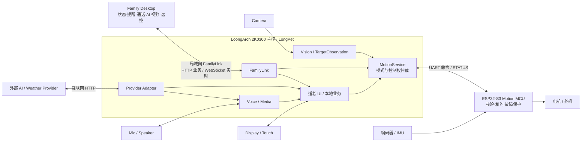
```mermaid
flowchart LR
    F["Family Desktop<br/>状态·提醒·通话·AI 视野·远控"] <-->|"局域网 FamilyLink<br/>HTTP 业务 / WebSocket 实时"| FL
    X["外部 AI / Weather Provider"] <-->|"互联网 HTTP"| PA
    subgraph L["LoongArch 2K0300 主控 · LongPet"]
        UI["适老 UI / 本地业务"]
        VO["Voice / Media"]
        VI["Vision / TargetObservation"]
        FL["FamilyLink"]
        PA["Provider Adapter"]
        MS["MotionService<br/>模式与控制权仲裁"]
        FL --> UI
        PA --> VO
        PA --> UI
        VO --> UI
        VI --> MS
        FL --> MS
        UI --> MS
    end
    CAM["Camera"] --> VI
    AUD["Mic / Speaker"] <--> VO
    DISP["Display / Touch"] <--> UI
    MS <-->|"UART 命令 / STATUS"| M["ESP32-S3 Motion MCU<br/>校验·租约·故障保护"]
    M --> ACT["电机 / 舵机"]
    SEN["编码器 / IMU"] --> M
```

*图 4-1 LongPet 系统总体架构*

FamilyLink 统一承接家属端业务请求，MotionService 集中管理进入 UART 的运动意图；外部 AI 和天气作为信息服务接入。各主体按职责协作，执行器控制始终经过主控策略与 MCU 校验。

自动视觉跟随沿同一闭环运行：人物观测经过时效与模式判断后，由主控生成 `TARGET` 或 `FOLLOW_MOVE`；MCU 根据当前安全状态执行或拒绝，并反馈结果。统一的控制路径让人工远控与自动跟随共用模式和停车规则。协同细节见第 7、8、11 章。

### 4.3 系统功能架构

产品能力分为老人端基础服务、AI 语音、视觉感知、家庭连接、媒体通信和运动执行六个领域。基础服务提供陪伴界面、提醒、今日关怀、天气及设备状态，语音与家属端复用同一业务规则。视觉共享摄像头采集和有效人物观测，供 AI 视野、自动跟头及人物跟随使用；通话按会话协调相机和音频，并处理与视觉及自动运动的资源冲突。运动域统一仲裁人工与自动控制，使多种交互入口保持一致的执行规则。

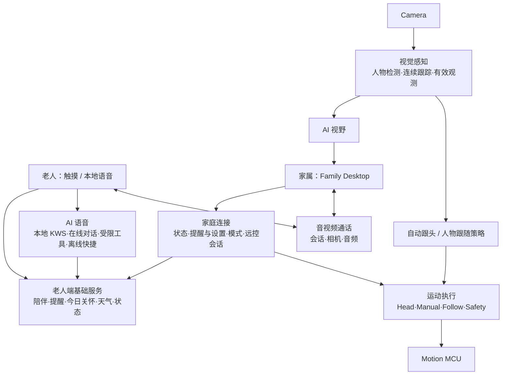
```mermaid
flowchart TB
    E["老人：触摸 / 本地语音"] --> CARE["老人端基础服务<br/>陪伴·提醒·今日关怀·天气·状态"]
    E --> VOICE["AI 语音<br/>本地 KWS·在线对话·受限工具·离线快捷"]
    FAMILY["家属：Family Desktop"] --> HOME["家庭连接<br/>状态·提醒与设置·模式·远控会话"]
    VOICE --> CARE
    HOME --> CARE
    CAMERA["Camera"] --> VISION["视觉感知<br/>人物检测·连续跟踪·有效观测"]
    VISION --> VIEW["AI 视野"] --> FAMILY
    VISION --> AUTO["自动跟头 / 人物跟随策略"]
    FAMILY <--> CALL["音视频通话<br/>会话·相机·音频"]
    E <--> CALL
    HOME --> MOTION["运动执行<br/>Head·Manual·Follow·Safety"]
    AUTO --> MOTION
    MOTION --> MCU["Motion MCU"]
```

*图 4-2 系统功能架构*

六个能力域通过共享业务服务、视觉观测和受控运动入口协作。运动模式、权限及停止条件由运动域与 MCU 共同约束；产品场景见第 8 章。

### 4.4 物理架构与硬件连接概览

物理上，2K0300 主控连接显示与触摸、摄像头、麦克风与扬声器以及网络接口，负责人机交互、感知处理和上层通信。ESP32-S3 通过双向 UART 与主控连接，管理头部舵机、四轮底盘驱动、编码器和 IMU，承担实时运动执行与传感器状态采集。两处理器通过受约束的命令和状态协作：主控处理图像与策略，MCU 专注实时执行和安全保护。

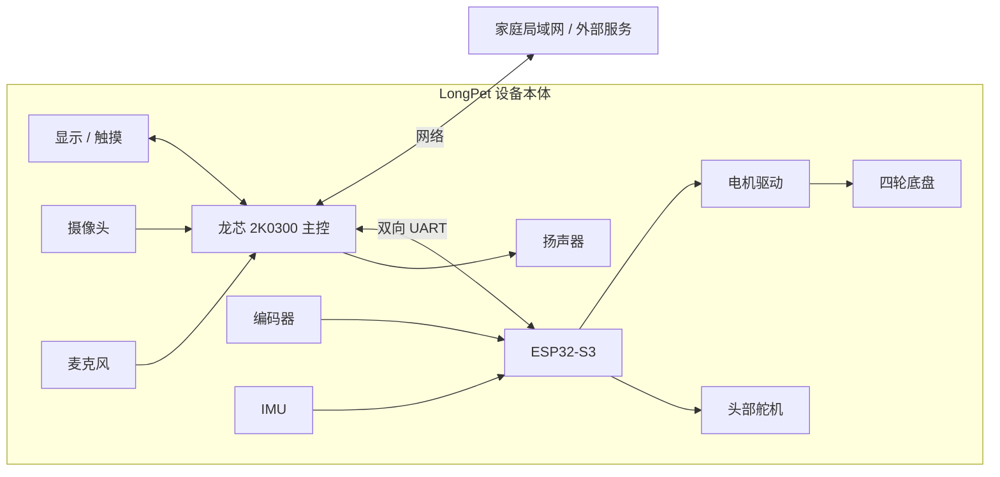
```mermaid
flowchart LR
    subgraph DEVICE["LongPet 设备本体"]
        DISP["显示 / 触摸"] <--> SOC["龙芯 2K0300 主控"]
        CAM["摄像头"] --> SOC
        MIC["麦克风"] --> SOC
        SOC --> SPK["扬声器"]
        SOC <-->|"双向 UART"| MCU["ESP32-S3"]
        MCU --> SERVO["头部舵机"]
        MCU --> DRIVER["电机驱动"] --> WHEEL["四轮底盘"]
        ENCODER["编码器"] --> MCU
        IMU["IMU"] --> MCU
    end
    SOC <-->|"网络"| LAN["家庭局域网 / 外部服务"]
```

*图 4-3 系统物理组成与连接边界*

主控与 MCU 的 UART 分工降低了上层任务波动对实时运动控制的影响。供电、接口、电气参数与引脚见第 5 章和附录 D；运动机构与安全行为见第 11 章。

### 4.5 部署架构与网络边界

系统部署覆盖设备本地、受控家庭局域网和互联网第三方服务。主控的 Linux / Hybrid Rootfs 承载 Qt6 LongPet 应用、本地 SQLite、KWS、ONNX Runtime、Vision、FamilyLink 及媒体组件；Family Desktop 在家属 PC 上通过局域网访问设备；Motion MCU 运行独立固件，通过 UART 与主控通信。ASR、LLM、TTS 和天气由主控按需调用外部 Provider。Buildroot 构建与 Hybrid Rootfs 合并在交付阶段完成，运行时由设备本地系统承载应用。

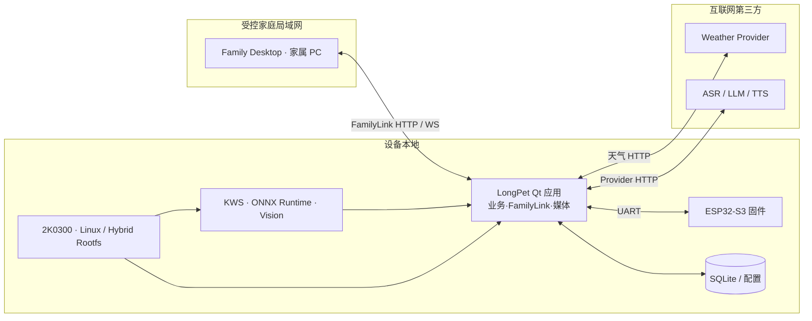
```mermaid
flowchart LR
    subgraph LOCAL["设备本地"]
        OS["2K0300 · Linux / Hybrid Rootfs"] --> APP["LongPet Qt 应用<br/>业务·FamilyLink·媒体"]
        OS --> AI["KWS · ONNX Runtime · Vision"]
        APP <--> DB[(SQLite / 配置)]
        APP <-->|"UART"| FW["ESP32-S3 固件"]
    end
    subgraph LAN["受控家庭局域网"]
        PC["Family Desktop · 家属 PC"]
    end
    subgraph INTERNET["互联网第三方"]
        PROVIDER["ASR / LLM / TTS"]
        WEATHER["Weather Provider"]
    end
    PC <-->|"FamilyLink HTTP / WS"| APP
    APP <-->|"Provider HTTP"| PROVIDER
    APP <-->|"天气 HTTP"| WEATHER
    AI --> APP
```

*图 4-4 系统部署与网络边界*

本地服务、家庭协作和第三方能力分层部署，便于分别管理运行资源、连接权限和服务故障。

FamilyLink 采用配置式连接，对外监听要求 Bearer Token，当前 HTTP/WS 面向受控局域网；跨不可信网络部署需增加安全传输或可信中转。网络中断时，已设提醒在本机时钟可信的前提下仍可触发，本地设置、KWS 快捷动作和已配置的陪伴音频继续可用；开放式对话、天气更新及家属远程连接则按各自网络状态反馈。平台组成见第 6 章，鉴权与数据时效见第 10 章。

### 4.6 软件分层架构

主程序启动时由 Application 组装依赖，运行时沿“表示—控制—业务 Service—Port/Repository—Adapter—系统能力”处理请求。本地触摸经 AppController、家属请求经 FamilyLinkController/FamilyLinkService、语音工具经参数校验后进入相应业务 Service。Repository 管理提醒等持久数据，Port/Adapter 封装设备与网络实现，MotionService 集中接收运动意图。这种分层使多种入口复用业务规则，也便于更换外部 Provider 和板端适配实现。

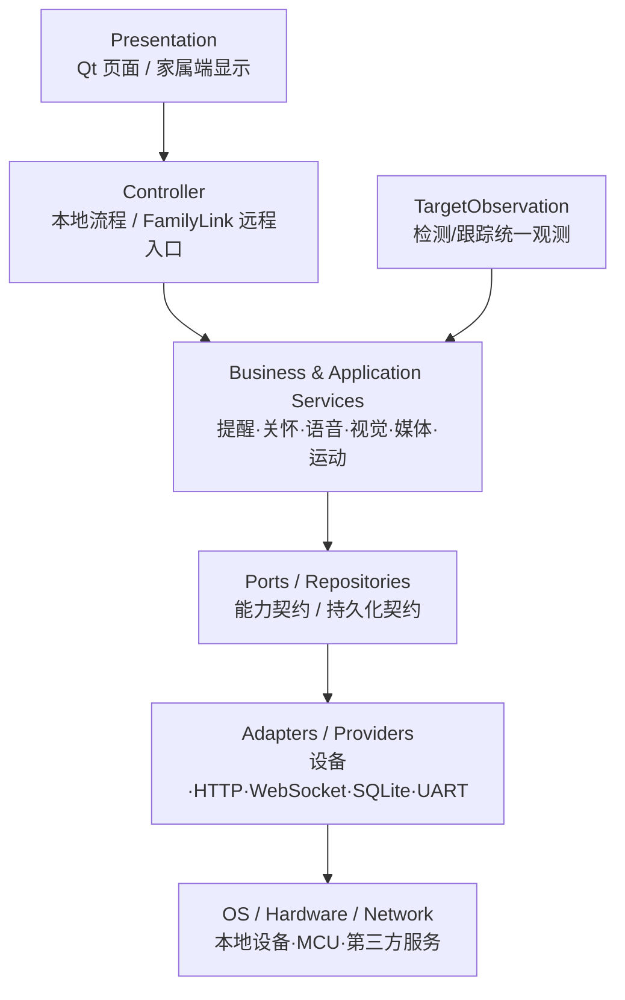
```mermaid
flowchart TB
    UI["Presentation<br/>Qt 页面 / 家属端显示"] --> CT["Controller<br/>本地流程 / FamilyLink 远程入口"]
    CT --> SV["Business & Application Services<br/>提醒·关怀·语音·视觉·媒体·运动"]
    SV --> PR["Ports / Repositories<br/>能力契约 / 持久化契约"]
    PR --> AD["Adapters / Providers<br/>设备·HTTP·WebSocket·SQLite·UART"]
    AD --> EXT["OS / Hardware / Network<br/>本地设备·MCU·第三方服务"]
    OBS["TargetObservation<br/>检测/跟踪统一观测"] --> SV
```

*图 4-5 LongPet 主程序的高层软件分层*

`TargetObservation` 统一视觉观测，MotionService 统一运动入口；两者分别明确感知数据和执行权限的服务边界。对象、线程及摄像头、音频的资源协调见第 7 章。

### 4.7 四个工程仓库的职责划分

四个工程按交付物和运行位置分工：系统工程提供主控软件底座，其他三个工程分别交付主控应用、家属端应用和 MCU 固件。跨工程变化通过接口契约协调，再由各工程独立实现，便于明确责任、版本依赖和联调范围。

| 工程 | 核心职责与交付物 | 运行/作用位置 | 与其他工程的边界 |
| --- | --- | --- | --- |
| LongPet 主程序 | 适老 UI、本地业务、AI/视觉、FamilyLink、媒体与 MotionService；交付主控应用及部署配置 | 2K0300 主控 | 对 Family Desktop 提供 FamilyLink；经 UART 向 MCU 提交运动意图；依赖系统工程的运行环境 |
| Family Desktop | 家属状态查看、提醒与设置、音视频通话、AI 视野、模式选择和人工远控；交付 PC 应用 | 家属 PC | 经 FamilyLink 读写主控业务状态，建立媒体与控制会话；设备数据和运动执行分别由主控、MCU 管理 |
| Motion MCU | UART 协议、模式/参数校验、电机和舵机控制、编码器 PID、IMU 反馈、租约与故障停车；交付 ESP32-S3 固件 | ESP32-S3 | 接受主控约束命令并返回 STATUS；独立决定是否执行和何时停车 |
| Buildroot / LoongArch 系统工程 | 交叉构建 Qt、Python、AI/媒体运行时，生成 SDK/target 并按清单形成 Hybrid Rootfs | 构建机；产物部署到 2K0300 | 提供兼容的系统与运行库；产品业务状态由主程序管理，运动执行由 MCU 管理 |

*表 4-2 四个工程的职责与交付边界*

系统构建依据见第 6 章，应用分层见第 7 章，接口见第 10 章及附录 B，固件安全见第 11 章。

### 4.8 功能模块与物理模块映射

产品功能由多个物理主体协作完成。表 4-3 区分主控的业务决策与状态管理、家属端的交互呈现，以及 MCU 的实际运动执行；AI 视野在家属端绘框，运动动作由 MCU 落地。

| 产品功能 | LoongArch 主控 | 摄像头 / 音频 / 显示 | Family Desktop | Motion MCU |
| --- | --- | --- | --- | --- |
| 适老交互、提醒与今日关怀 | UI、业务校验、SQLite 与提醒调度 | 触摸显示、提示音 | 查看与管理同一设备状态 | — |
| 在线语音与离线快捷 | KWS、会话、工具校验与 Provider 接入 | 麦克风、扬声器 | — | — |
| 人物感知与 AI 视野 | Detector/Tracker、`TargetObservation` 与画面传输 | 摄像头共享采集 | 接收画面、观测并绘框 | — |
| 自动跟头 / 人物跟随 | 目标时效、策略、模式与控制权仲裁 | 摄像头提供人物位置 | 模式选择与状态查看 | 舵机/底盘执行及安全裁决 |
| 音视频通话 | 呼叫状态、媒体会话与资源协调 | 摄像头、麦克风、扬声器 | 呼叫对端与媒体收发 | — |
| 人工远控 | 会话鉴权、命令仲裁与状态反馈 | 显示本地状态 | 按住控制、松开停车 | 校验命令、执行并按租约停车 |
| 天气与设备状态 | Provider 更新、缓存与状态汇聚 | 状态栏显示 | 读取设备状态 | 返回运动状态和故障信息 |

*表 4-3 产品功能与物理主体映射*

“—”表示该功能无直接职责；外部 AI 和天气 Provider 的参与见图 4-4。功能行为见第 8 章，硬件与运行时接口见第 10 章。

### 4.9 主要数据流与控制流

数据流传递观测、业务记录与执行反馈，控制流传递操作意图、模式切换和运动命令。服务层将两者关联并完成校验：带时效的人物框经策略与权限判断后才形成 `FOLLOW_MOVE`，家属端按键也须由有效远控会话接收。表 4-4 汇总四条核心链路。

| 链路 | 数据流 | 控制流与失效边界 |
| --- | --- | --- |
| 语音 | 麦克风 → VAD/KWS 事件；在线会话录音 → ASR 文本 → LLM 结果 → TTS 音频/文字 → 扬声器与界面 | 唤醒或触摸开启会话；Tool Calling 经参数校验调用本地业务 Service；Provider 超时、取消或旧 session 回调不更新新会话，离线快捷能力独立保留。 |
| 视觉 | 摄像头最新帧 → Tinyissimo Detector / LK Tracker → 带时间戳与新鲜度的 `TargetObservation` → AI 视野、自动跟头/跟随策略 | AI 视野只传画面和观测；策略在目标有效、模式与 MCU 状态满足条件时，经 MotionService 生成 `TARGET`/`FOLLOW_MOVE`；目标失效不沿用旧框。 |
| 家庭与媒体 | 主控业务快照 ↔ FamilyLink REST ↔ Family Desktop；独立 WebSocket 传 AI 视野 JPEG/观测、通话 JPEG/PCM 与远控状态 | 家属写入以设备确认和 revision 为准；HTTP 建立短时会话，WS 承载实时操作；断连使画面、通话或远控会话分别失效。 |
| 运动 | MCU `STATUS`/故障/头偏 → MotionService → 家属端与视觉策略 | 本地/家属/视觉意图 → MotionService 仲裁 → UART `MODE`、`MOVE`、`HEAD`、`TARGET`、`FOLLOW_MOVE` 或 `STOP` → MCU 校验执行；租约或链路到期由 MCU 停车。 |

*表 4-4 主要数据流、控制流与失效边界*

提醒、关怀和设置的持久数据由本地触摸、语音工具和家属端共用业务 Service 写入 SQLite；会话、天气快照、视觉及运动状态按各自时效在运行期管理，见第 10 章。

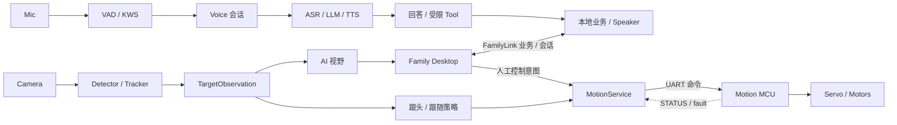
```mermaid
flowchart LR
    MIC["Mic"] --> KWS["VAD / KWS"] --> VO["Voice 会话"] --> CLOUD["ASR / LLM / TTS"] --> TOOL["回答 / 受限 Tool"] --> BIZ["本地业务 / Speaker"]
    CAM["Camera"] --> DET["Detector / Tracker"] --> OBS["TargetObservation"] --> VIEW["AI 视野"] --> FAMILY["Family Desktop"]
    OBS --> STRATEGY["跟头 / 跟随策略"] --> MOTION["MotionService"]
    FAMILY <-->|"FamilyLink 业务 / 会话"| BIZ
    FAMILY -->|"人工控制意图"| MOTION
    MOTION -->|"UART 命令"| MCU["Motion MCU"] --> ACT["Servo / Motors"]
    MCU -."STATUS / fault".-> MOTION
```

*图 4-6 主要数据流与控制流*

主控汇集语音、视觉和家属端输入，统一仲裁运动意图；MCU 反馈执行状态。观测与状态沿数据链路更新，受控命令沿控制链路执行。接口和安全时效见第 10、11 章及附录 B。

### 4.10 核心技术路线与选型原则

LongPet 围绕单核 LoongArch 平台的资源条件组合本地基础能力、按需接入的在线 Provider、家属端协作和独立 MCU 执行。由此，设备可同时提供触摸交互、语音入口、人物感知与家庭连接；外部服务或感知模块异常时，各能力按自身状态反馈和降级。表 4-5 汇总关键选型及对应依据。

| 技术路线 | 总体取舍及产品作用 | 详细依据 |
| --- | --- | --- |
| 2K0300 + Hybrid Rootfs | 以 LoongArch 主控承载本地 UI、业务和感知；保留已验证的板端基础系统，按清单合入 Buildroot 用户空间，控制 ABI/ISA 与系统稳定性风险。 | 第 6 章 |
| ONNX Runtime 标量路径 | 在无 LSX/LASX 的目标 CPU 上统一语音与视觉推理运行时，既检查可加载性，也验证数值正确性。 | 第 6、9 章 |
| Tinyissimo + Tracker | 轻量人物检测负责搜索与纠偏，跟踪负责帧间位置更新，适应单核上 KWS 与 Vision 并发；单人物板端测试的目标位置更新约为 7～9 Hz。上层统一消费 `TargetObservation`。 | 第 7、9 章，表 9-7 |
| 本地 KWS + 在线 AI + 离线基础陪伴 | 本地识别提供唤醒与受限快捷动作，联网 Provider 支持开放式 ASR/LLM/TTS 对话；提醒和本地入口可在网络中断时继续使用。 | 第 7—9 章 |
| 独立 Provider 与业务 Port | ASR、LLM、TTS、天气分别配置和处理失败；AI 工具只能调用经过校验的本地业务能力，便于部署切换并限制外部结果权限。 | 第 7、10 章 |
| 老人端 + Family Desktop 分工 | 老人端保持低操作复杂度；家属端通过 FamilyLink 参与管理、通话和协助，两端以设备业务状态为准。 | 第 7、8、10 章 |
| 主控策略 + ESP32-S3 安全执行 | MotionService 汇总人工和自动控制，MCU 独立校验模式、命令、租约与故障；Linux、网络或视觉中断时按时效规则停车。 | 第 10、11 章 |

*表 4-5 核心技术路线与总体选型依据*

本地能力、可替换 Provider、共享感知和独立运动执行共同支撑产品功能与部署灵活性。

## 5 硬件系统设计

LongPet 原型采用龙芯 2K0300 主控与 ESP32-S3 运动 MCU 协同架构，将本机交互、端侧感知和受控运动集成到同一硬件平台。本章说明模块组成、连接方式与选型理由；引脚和设备节点见附录 D。板卡规格采用《龙芯 2K0300 先锋派产品规格书》V1.0，运动功能测试结果见[《LongPet 产品运动功能测试报告》V1.3](LongPet_产品运动功能测试报告_2026-09-13_V1.3.docx)。

### 5.1 硬件总体组成

LongPet 以 LoongArch 原生平台承载 Qt6 老人端应用、本地语音唤醒和视觉推理，连接触控屏、摄像头、音频设备及家庭网络，并驱动头部和四轮底盘。原型选用成熟开发板与标准外设，缩短硬件接入周期，使开发和验证聚焦适老交互、端侧感知与运动协同。

系统采用“龙芯主控 + ESP32-S3 运动控制 MCU”结构：龙芯负责 UI、AI、网络和高层行为，MCU 负责执行器时序、反馈采集与失效停车。摄像头和音频由多个业务共享，在控制硬件规模的同时支持视觉、语音、通话等功能。图 5-1 展示当前业务使用的硬件及连接。

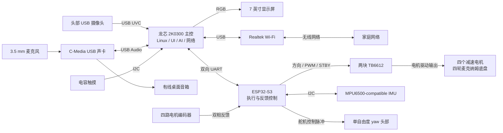
```mermaid
flowchart LR
    CAM["头部 USB 摄像头"] -->|"USB UVC"| SOC["龙芯 2K0300 主控<br/>Linux / UI / AI / 网络"]
    MIC["3.5 mm 麦克风"] --> AUDIO["C-Media USB 声卡"]
    AUDIO --> SPK["有线桌面音箱"]
    AUDIO <-->|"USB Audio"| SOC
    SOC -->|"RGB"| LCD["7 英寸显示屏"]
    TOUCH["电容触摸"] -->|"I2C"| SOC
    SOC <-->|"USB"| WIFI["Realtek Wi-Fi"]
    WIFI <-->|"无线网络"| NET["家庭网络"]
    SOC <-->|"双向 UART"| MCU["ESP32-S3<br/>执行与反馈控制"]
    MCU -->|"方向 / PWM / STBY"| DRV["两块 TB6612"]
    DRV -->|"电机驱动输出"| MOTOR["四个减速电机<br/>四轮麦克纳姆底盘"]
    ENC["四路电机编码器"] -->|"双相反馈"| MCU
    MCU <-->|"I2C"| IMU["MPU6500-compatible IMU"]
    MCU -->|"舵机控制脉冲"| HEAD["单自由度 yaw 头部"]
```

*图 5-1 LongPet 硬件总体组成与双处理器分工*

箭头表示信号或电机驱动连接，供电见图 5-2；编码器安装于电机侧。DHT22 用于固件诊断采样，接线见附录 D。

| 功能模块 | 当前硬件组成 | 对产品的作用 |
| --- | --- | --- |
| 主控与本地存储 | 龙芯 2K0300 开发板、板载内存与 eMMC | 承载老人端应用、端侧感知与业务数据 |
| 本机交互 | 7 英寸触控屏、麦克风、USB 声卡及音箱 | 触摸操作、表情与提醒、语音交互和通话 |
| 视觉感知 | 头部前置 USB UVC 摄像头 | 人物检测、Tracker、AI 视野、通话和视觉运动输入 |
| 联网 | Realtek USB Wi-Fi | 连接 Family Desktop 和在线服务 |
| 运动执行与反馈 | ESP32-S3、两块 TB6612、四电机与编码器、IMU、头部舵机 | 执行底盘和头部动作，形成轮速与航向反馈 |
| 供电 | 执行侧电池及降压路径、主控独立充电宝 | 支持当前原型分路运行 |

*表 5-1 当前硬件功能模块与产品职责*

各模块围绕本机交互、感知、通信和运动执行形成完整的原型硬件链路。

### 5.2 龙芯 2K0300 主控平台

原型主控为**龙芯 2K0300 先锋派开发板**，搭载龙芯 2K0300（Loongson 2K0300）SoC。下文简称“龙芯 2K0300 主控”。部分底层软件沿用 `2K300`、`LS2K300`、`2K300-PAI` 标识，均对应本项目使用的平台。

该平台满足赛题的 LoongArch 原生运行要求，并以 Linux 环境和外设接口承载 Qt6、ONNX Runtime 与多媒体链路。项目针对单核算力采用轻量模型和受控并发调度，使图形界面、语音与视觉能力在同一主控上协同运行；软件适配见第 6 章。

| 项目 | 当前平台配置 | 对 LongPet 的意义 |
| --- | --- | --- |
| CPU 与架构 | 单核 LA264，LoongArch64，标称 1.0 GHz；目标平台无 LSX/LASX | 原生承载 Linux 应用；端侧推理受单核与指令集约束 |
| 内存 | 板载 512 MB DDR4；当前系统可见约 369 MiB | 物理容量与系统可用量分开计算，需为 UI、媒体和模型控制内存预算 |
| 主存储 | 板载 8 GB eMMC；2 MB SPI NOR 用于启动固件 | 系统、应用和本地数据在主控侧管理，存储分工见 5.10 |
| USB | 板卡提供四个 USB 2.0 HOST 接口，当前连接相机、声卡等；Wi-Fi 也走 USB 总线 | 使用 Linux 成熟外设链路，按共享总线规划带宽 |
| 显示与触摸 | 24 位 RGB LCD 与 I2C 触摸，当前面板 1024×600 | 支持本机适老操作与陪伴反馈 |
| 音频 | 当前使用 C-Media USB 声卡录放 | 已验证录放链路与板载模拟音频方案分开 |
| 网络 | 当前主要使用 USB Wi-Fi；板卡另提供千兆 RJ45 | 满足家庭联网，有线口提供后续接入选择 |
| 执行侧连接 | 40PIN GPIO 排针复用 UART2，接运动 MCU | 主控只交换控制和状态，执行器由 MCU 管理 |

*表 5-2 当前主控配置与产品设计意义*

表中区分板卡标称规格与当前系统工作状态；目标指令集、内存和 Linux 运行环境详见第 6 章。

板卡还提供 TF、SPI、CAN、ADC、调试和看门狗等扩展资源，为后续外设接入留有空间。RTC 已实现系统读写；断电保持需结合后备电池装配复测，见附录 D。

### 5.3 显示与触摸模块

当前原型采用正点原子 7 英寸 IPS RGB 触控显示模块，分辨率为 1024×600；触摸经 I2C 接入，板端识别为 Goodix Capacitive TouchScreen。屏幕装在头部正面，既提供直接触摸操作，也呈现陪伴表情、提醒、通话画面和设备状态。

7 英寸屏幕与头部结构匹配，横向布局可容纳大字号、清晰按钮和状态区，支持老人直接完成常用操作。1024×600 兼顾界面信息量与单核主控的显示负载；适老可读性由 UI 设计和使用测试继续验证。当前 Qt6 使用 framebuffer 与 evdev 触摸链路，设备节点及 FPC 定义见 D.6。

### 5.4 摄像头模块

原型采用 SenSor OV2735 方案的 200 万像素 USB UVC 摄像头，安装在头部正面、屏幕下方，随头部 yaw 转动调整水平视向。倒装画面通过配置旋转 180°校正；头部当前为单自由度结构。镜头标称参数及设备识别信息见 D.7。

同一摄像头为人物检测、Tracker 跟踪、家属端 AI 视野、视频通话、自动跟头和人物跟随提供画面。USB UVC 可复用成熟的 Linux V4L2 链路，降低多业务接入成本。当前 GStreamer/V4L2 以 640×480 MJPEG、请求 30 FPS 采集；检测与网络显示按各自处理链路调度。设备模式和节点见 D.7，资源共享与仲裁见第 7、8 章。

### 5.5 麦克风与音频输出模块

原型采用“3.5 mm 桌面麦克风 + C-Media USB 声卡 + 联想有线桌面音箱”音频方案。麦克风和音箱分别接入声卡录音与播放端，USB 声卡连接龙芯主控，形成统一的录放链路。

该链路覆盖本地唤醒、语音交互、离线陪伴、提醒及通话，多个业务共用已联调的输入输出设备。当前正式录放使用 USB 声卡；板卡规格中的 ES8388 属于另一条板载音频路径。ALSA 设备和音量控件见 D.7，音频资源仲裁见第 7、8 章。

### 5.6 网络通信模块

原型主要通过开发板配套的 Realtek USB Wi-Fi 模块联网。板端枚举为 `0bda:f179`，接口为 `wlan0`，驱动标识为 RTL8188FU / `rtl8xxxu`；板卡物料标识为 RTL8188FTV。两类名称分别服务于设备维护和镜像适配。

Wi-Fi 承担 FamilyLink 家庭通信、音视频通话、在线 AI Provider 和天气服务访问。板载千兆 RJ45 为后续有线接入提供选择。无线接口异常启动后的恢复机制已验证；应用通过运行时状态反馈网络与服务可达性，网络部署边界见第 4、10 章。

### 5.7 ESP32-S3 运动控制模块

运动控制板采用 ESP32-S3-WROOM 系列模组，固件编译目标为 `ESP32S3 Dev Module`。实物丝印见 D.3；Flash、PSRAM 等容量参数以最终板卡配置为准。

采用第二处理器的原因是将实时执行责任与 Linux 业务负载分离。龙芯处理图像、语音、UI、网络和高层运动意图；ESP32-S3 负责编码器采集、轮速 PID、IMU 航向反馈、方向输出、PWM、驱动使能和头部舵机。执行侧控制周期与停车判断在 MCU 内完成，不依赖 Linux 每次调度都及时到达。

主控与 MCU 通过双向 UART 交换命令和状态。当主控应用卡顿或通信中断时，供电正常的 MCU 可按本地时效规则撤销底盘驱动，降低上层业务波动对运动执行的影响。MCU 失效场景的独立硬件保护属于后续工程化工作；模式、租约与故障恢复见第 11 章。

### 5.8 电机、驱动、编码器与 IMU

底盘由四个带编码器的 TT 减速电机和四个麦克纳姆轮组成，两块 TB6612 双路驱动板分别承载四路电机中的 A/B、C/D 逻辑通道。ESP32-S3 向驱动板提供方向、PWM 和 STBY 使能；电机电流由驱动板输出。每台电机的双相编码器反馈至 MCU，形成轮速控制；MPU6500-compatible IMU 经 I2C 提供 Gyro Z，辅助航向控制。

编码器与 IMU 为轮速和航向控制提供反馈。IMU 按实机 `WHO_AM_I=0x70` 与固件兼容路径标为 MPU6500-compatible；电机规格、HalfQuad 计数和通道接线见 D.4、D.5。A/B/C/D 为固件逻辑通道，物理轮位以最终线束复核结果确定。

麦克纳姆底盘为多方向运动提供机械基础。当前版本聚焦前进、后退和原地左右转，均已通过实机测试；自动人物跟随采用受限的前进和原地转向，硬件闭环也已通过 V1.3 测试。横向平移留待后续版本，速度、转角和停车距离的量化标定列入工程化计划。

### 5.9 头部舵机机构

头部由 ESP32-S3 控制一只 5 V 舵机，实现单自由度 yaw，可用于人物自动跟头和人工调整。相机与正面交互随头部转向人物，以较简洁的机构实现水平方向关注，并控制重量、成本与执行负载。

舵机左右方向、回中、软件边界及与底盘并发已通过 V1.3 运动功能测试。GPIO、中心脉宽、可用范围和方向约定见 D.5。更换舵机或调整装配时，应重新确认方向与机械边界；寿命和承载能力留待整机可靠性验证。

### 5.10 电源、存储与外部接口

执行侧采用 3S 18650、标称 3000 mAh 且带过充、过放保护的锂电池组，经 LM2596 降压至 5 V，为电机驱动、ESP32-S3 和头部舵机供电。图 5-2 展示已核对的供电路径；降压模块数量和支路拓扑将在完整电源图中明确。

龙芯主控使用独立 5 V 充电宝。实物联调中，共用现有 LM2596 路径在高 CPU 负载下出现稳定性问题，因此当前采用分路供电以支撑功能验证。主控与执行侧保持共地，为 UART 提供共同信号参考；高负载电源瞬态将在后续电气测试中量化。

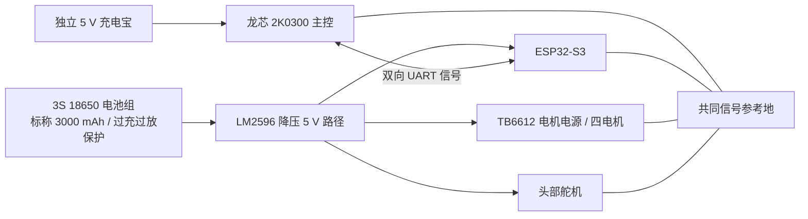
```mermaid
flowchart LR
    BAT["3S 18650 电池组<br/>标称 3000 mAh / 过充过放保护"] --> REG["LM2596 降压 5 V 路径"]
    REG --> DRV["TB6612 电机电源 / 四电机"]
    REG --> MCU["ESP32-S3"]
    REG --> HEAD["头部舵机"]
    BANK["独立 5 V 充电宝"] --> SOC["龙芯 2K0300 主控"]
    SOC <-->|"双向 UART 信号"| MCU
    SOC --- GND["共同信号参考地"]
    MCU --- GND
    DRV --- GND
    HEAD --- GND
```

*图 5-2 当前原型供电路径与共地边界*

图中展示供电与 UART 信号关系；外围设备支路、驱动逻辑电源和保护设计将在正式电源树中细化。

存储按处理器和用途分工：主控板载 8 GB eMMC 承载系统、应用、模型和业务数据，2 MB SPI NOR 承载启动固件。当前部署将主程序放在 `<APP_ROOT>/LongPet`，视觉模型放在 `<MODEL_DIR>/`，KWS 资源放在 `<KWS_ROOT>/`，业务数据库位于 `<DATA_DIR>/longpet.db`，配置位于 `/etc/longpet/`。上述参数表示部署目录，实际值由部署配置指定；这些目录共同使用主控文件系统，便于按功能维护和升级。

板卡 TF 插槽可作为后续存储扩展接口，当前主存储仍为 eMMC。ESP32-S3 Flash 承载运动固件；训练数据和完整工程备份作为研发交付资料管理，板端部署使用所需模型与运行资源。USB、RGB/I2C 和 UART 连接见附录 D。

图 5-3～图 5-5 展示原型整机、内部骨架和底盘装配，可直观看到交互模块、执行机构与线束布局。

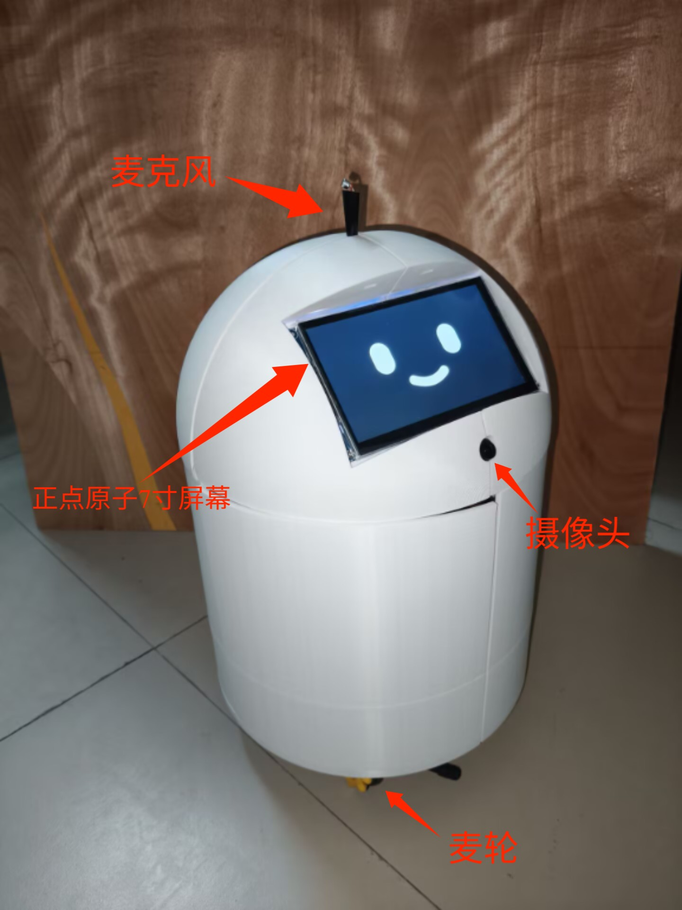

*图 5-3 LongPet 原型整机正面实拍*

可见头部屏幕、前置摄像头、顶部麦克风与外壳；原图箭头为部件标注。

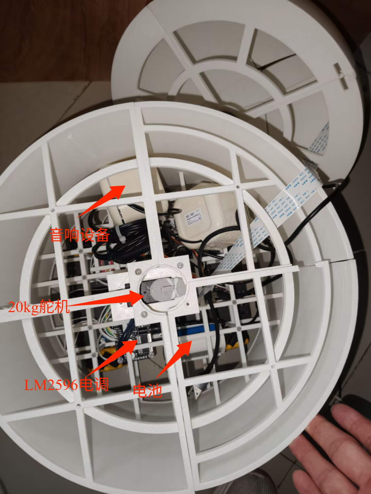

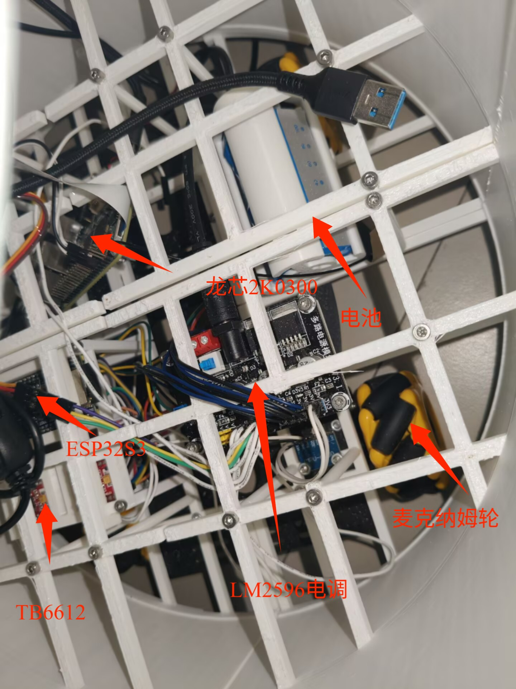

*图 5-4 LongPet 原型内部结构实拍*

展示头部机构、骨架和主要线束布局。

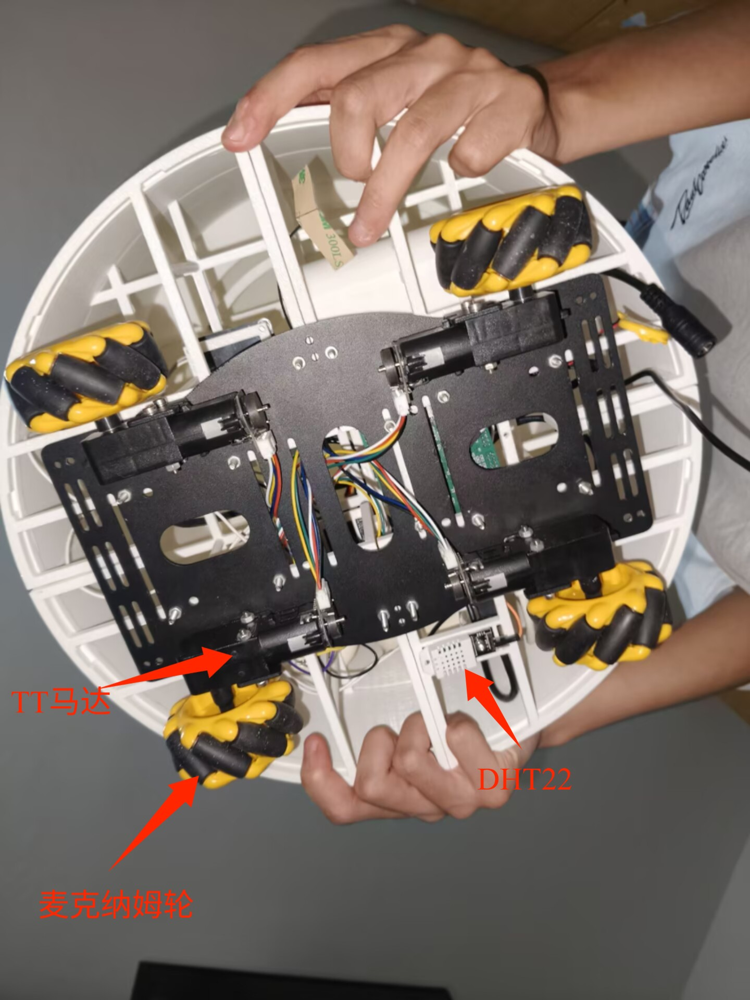

*图 5-5 LongPet 四轮底盘实拍*

展示四电机、麦克纳姆轮与编码器线束；逻辑通道到物理轮位的映射见后续线束图。

### 5.11 硬件连接关系与信号边界

硬件连接分为三层：USB、RGB 显示、音频与网络接入龙芯主控；双向 UART 连接两处理器；方向、PWM、STBY、编码器和 IMU I2C 集中在运动 MCU 一侧。电机功率由驱动板输出，主控仅传输受控运动意图。图 5-6 展示执行与反馈链路，供电路径见图 5-2，引脚见 D.2～D.5。

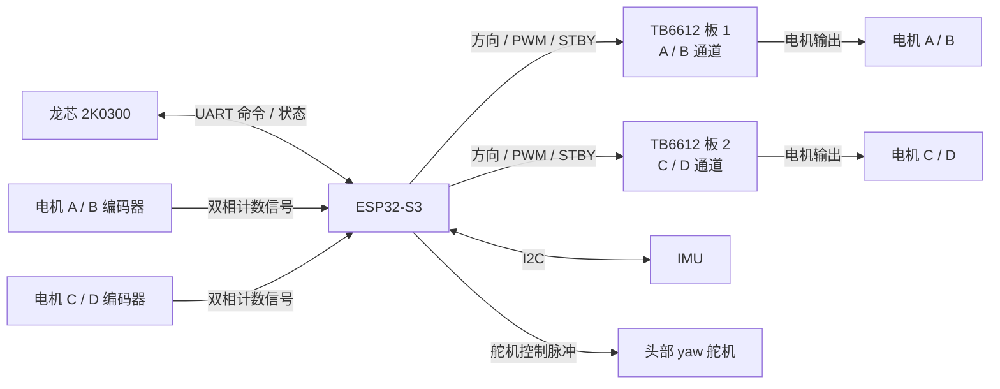
```mermaid
flowchart LR
    SOC["龙芯 2K0300"] <-->|"UART 命令 / 状态"| MCU["ESP32-S3"]
    MCU -->|"方向 / PWM / STBY"| AB["TB6612 板 1<br/>A / B 通道"]
    MCU -->|"方向 / PWM / STBY"| CD["TB6612 板 2<br/>C / D 通道"]
    AB -->|"电机输出"| MAB["电机 A / B"]
    CD -->|"电机输出"| MCD["电机 C / D"]
    EAB["电机 A / B 编码器"] -->|"双相计数信号"| MCU
    ECD["电机 C / D 编码器"] -->|"双相计数信号"| MCU
    MCU <-->|"I2C"| IMU["IMU"]
    MCU -->|"舵机控制脉冲"| SERVO["头部 yaw 舵机"]
```

*图 5-6 Motion MCU 执行器与反馈连接图*

A/B/C/D 为固件逻辑通道；控制信号与负载供电分开，模块共地和 MCU 供电见图 5-2。

UART 采用 TX/RX 交叉接线并共地；物理脚号、MCU GPIO 与 Linux 节点在附录 D 分层标注。负载 5 V 供电和通信信号电平分别设计，MCU 停滞、掉电及输出初始化前的默认安全状态列入 D.9 的硬件保护工作。

### 5.12 关键物料选型

| 物料或结构 | 选型理由 | 当前取舍与边界 |
| --- | --- | --- |
| 龙芯 2K0300 先锋派开发板 | 满足 LoongArch 原生平台要求，Linux、Qt6、端侧 AI 及多媒体链路已有工程基础 | 以轻量模型和受控并发适配单核资源 |
| 7 英寸 RGB 触控模块 | 与头部结构匹配，以大按钮和表情提供直接交互 | 1024×600 工作点兼顾界面与显示负载 |
| USB UVC 摄像头 | V4L2 接入成熟，单路 MJPEG 服务视觉与视频通话 | 单相机共享，视角与单目感知按场景配置 |
| C-Media USB 声卡及现有麦克风、音箱 | 已联调录放链路覆盖唤醒、语音和通话 | 整机声学与回声性能纳入后续测试 |
| Realtek USB Wi-Fi | 使用现有 Linux 驱动与家庭无线连接 | 板载 RJ45 为有线接入提供扩展选择 |
| ESP32-S3 + 两块 TB6612 | 四路电机控制与反馈集中在独立执行侧，支持快速撤销使能 | 后续增加物理急停与默认禁能保护 |
| 麦克纳姆轮 + 编码器 + IMU | 提供多方向运动机械基础及轮速、航向反馈 | 当前动作集中在已验证的前后与原地转向 |
| 单轴头部舵机 | 以较简洁的机构实现水平方向人物关注 | 当前提供 yaw；扩轴时重新评估负载和安全 |
| 执行侧电池降压与独立主控电源 | 分路供电支持当前原型运行与功能验证 | 一体化电源管理和支路保护列入工程化计划 |

*表 5-3 关键物料与结构选型*

选型围绕原生算力平台、共享外设与独立运动执行展开，兼顾原型可实现性和后续扩展。

### 5.13 原型验证成果与工程化方向

当前原型已支持本机多模态交互、视觉跟头和受控底盘动作。V1.3 运动测试共 58 项，56 项通过，左右平移 2 项按版本计划暂缓；通过项包括舵机边界与并发、UART 断线停车、V2.3 人物跟随硬件闭环及距离阈值现场验证。下一阶段将围绕量化性能、电源保护和整机可靠性开展工程化工作。

| 项目 | 当前原型配置与验证 | 后续工程化工作 |
| --- | --- | --- |
| 算力与内存 | 单核约 1 GHz、512 MB 物理内存；已通过轻量模型与受控并发支撑多模态功能 | 按整机工况验证资源与散热裕量 |
| 视觉与空间感知 | 单 RGB 相机配合头部 yaw 完成人物感知与跟头；当前运动限定于有人看护的低速场景 | 评估视野遮挡和近地盲区；扩展自主移动时补充距离、障碍与悬崖感知 |
| 运动量化 | 前后与原地转向、人物跟随闭环已通过功能测试；横向平移按版本计划暂缓 | 完成轮位映射、速度、转角、停距和编码器计数标定，并覆盖不同地面与负载 |
| 电源与电池管理 | 执行侧电池具过充、过放保护，主控采用已联调的独立供电路径 | 完成电源树、充电与 BMS 方案、保险和支路保护，量测瞬态、温升及续航 |
| 硬件停车保护 | MCU 软件按时效撤销 STBY，断线停车已通过功能测试 | 增加独立物理急停、电源切断、外部 STBY 下拉及驱动保护，测量滑行停距 |
| 环境与时间 | DHT22 用于停车诊断，RTC 已完成系统读写 | 按业务需求决定环境数据接入，复测 RTC 断电保持 |
| 装配与可靠性 | 现成模块与骨架完成原型装配，整机、内部和底盘均有实拍记录 | 完善线束固定、散热与夹点防护，开展长稳、EMC 和环境适应性验证 |

*表 5-4 原型能力与后续工程化工作*

当前运动功能面向有人看护的低速原型验证；软件停车撤销驱动输出，实际停距需结合惯性和地面条件测量。整机安全与可靠性按后续测试和保护设计逐项完善。

## 6 LoongArch 系统软件平台设计

LongPet 在龙芯 2K0300 上运行图形、语音、视觉和多媒体组件。软件平台采用受控交叉构建、标量推理适配和 Hybrid Rootfs，并分别验证产物兼容性、推理数值和板端功能。

### 6.1 目标板约束与平台设计目标

目标主控龙芯 2K0300 采用单核 LA264、约 1 GHz 的 LoongArch64 处理器，不支持 LSX/LASX 向量指令。编入这些指令的二进制包无法在目标板运行；语音、视觉和界面并发时还需控制 CPU 与内存占用。一次板端测试显示系统可见内存约 369 MiB，未配置 swap。

交付基线采用 LoongArch64 LP64D ABI、Linux 6.12.0.lsgd 内核、glibc 2.38 和 Python 3.12。外部 GCC 13.3 工具链以通用 `loongarch64` 和严格对齐为编译目标。ONNX Runtime 产物还需满足目标板内核的 16 KiB ELF 可加载段对齐要求。

软件栈分为基础系统、通用平台、AI 与媒体运行时、应用功能四层（图 6-1）。

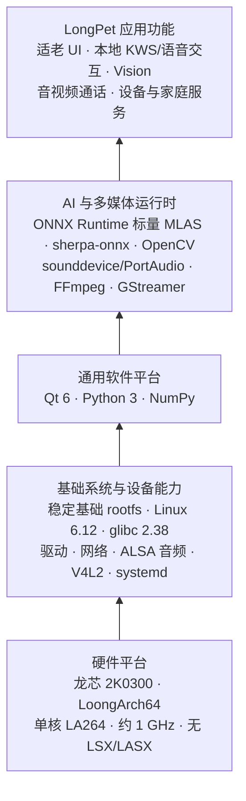
```mermaid
flowchart BT
    H["硬件平台<br/>龙芯 2K0300 · LoongArch64<br/>单核 LA264 · 约 1 GHz · 无 LSX/LASX"]
    B["基础系统与设备能力<br/>稳定基础 rootfs · Linux 6.12 · glibc 2.38<br/>驱动 · 网络 · ALSA 音频 · V4L2 · systemd"]
    P["通用软件平台<br/>Qt 6 · Python 3 · NumPy"]
    R["AI 与多媒体运行时<br/>ONNX Runtime 标量 MLAS · sherpa-onnx · OpenCV<br/>sounddevice/PortAudio · FFmpeg · GStreamer"]
    A["LongPet 应用功能<br/>适老 UI · 本地 KWS/语音交互 · Vision<br/>音视频通话 · 设备与家庭服务"]
    H --> B --> P --> R --> A
```

*图 6-1 LongPet 面向 2K0300 的 LoongArch 软件栈总体架构*

### 6.2 LoongArch AI 生态的兼容性边界

预编译的 LoongArch 软件包可能使用 2K0300 不支持的向量指令，运行时的架构判断也可能选错计算内核。关键组件统一交叉构建，并检查指令集、ABI、动态库依赖和推理数值。

源码构建固定版本与编译选项；构建后继续检查 ELF 产物和模型输出。

### 6.3 Buildroot 软件栈与交叉构建基线

Buildroot 2024.08 的 `output-qt6` 构建树使用面向 2K0300 的媒体版 defconfig，包含 Qt、Python/AI、视觉处理及多媒体软件包。主要组件见表 6-1。

*表 6-1 LongPet LoongArch 软件平台关键组件与版本基线*

| 组件 | 当前工程版本 | 构建方式 | 在 LongPet 中的主要用途 | 设计说明 / 关键考虑 |
| --- | --- | --- | --- | --- |
| Qt 6 | 6.8.1 | Buildroot 源码交叉构建 | Widgets 触控界面、网络、SQL、SVG | 采用 `linuxfb` 和触摸输入插件，适配板端显示环境 |
| Python 3 | 3.12.5 | Buildroot 源码交叉构建 | 本地 KWS 及 Python AI 组件运行 | 与基础系统 Python 3.12 运行环境保持兼容 |
| NumPy | 1.25.0 | Buildroot/Meson 源码交叉构建 | 音频数据处理和 AI Python 扩展基础 | 固定工具链与目标 ISA，避免依赖不可控的预编译二进制 |
| OpenCV | 4.10.0 | Buildroot 源码交叉构建 | 摄像头输入、图像预处理与视觉跟踪 | 保留 V4L2、视频处理及目标端所需接口 |
| ONNX Runtime | 1.17.1 | Buildroot 源码交叉构建并应用 MLAS 补丁 | 本地 ONNX 模型推理 | 对无 LSX/LASX 目标启用一致的标量路径，并验证数值正确性 |
| sherpa-onnx | 1.12.15 | Buildroot 源码交叉构建 | 语音推理组件 | 复用系统 ONNX Runtime，避免私有运行库副本不一致 |
| sounddevice | 0.5.1 | Buildroot 源码打包，配套 CFFI/PortAudio | Python 音频采集 | 将动态加载依赖列为合并清单的必需文件 |
| FFmpeg | 6.1.2 | Buildroot 源码交叉构建 | 多媒体工具与编解码库 | 按当前构建基线交付，控制板端实时编码负载 |
| GStreamer | 1.22.9 | Buildroot 源码交叉构建 | 插件化音视频处理能力 | 显式纳入运行时插件，不能只依赖 ELF 依赖闭包 |

Buildroot 生成相互匹配的 target、staging 和交叉 SDK。`output-qt6/target` 为 Hybrid Rootfs 提供软件组件，最终镜像按清单选择合入。

### 6.4 Python、NumPy 与音频依赖的源码构建

部分预编译 NumPy 包使用 2K0300 不支持的扩展指令，因此从 NumPy 1.25.0 源码构建。构建过程使用 Buildroot 的 Meson 交叉编译流程，并将目标端头文件安装到 staging，供下游扩展使用。Python 3.12、NumPy、CFFI、sounddevice 和 PortAudio 构成板端 Python 音频链路。

Buildroot 以 Python 字节码交付，合并时保留 NumPy、sounddevice 的 `.pyc` 文件及二进制扩展。sounddevice 经 CFFI 间接加载 PortAudio，相关文件不会全部出现在 ELF 的 `DT_NEEDED` 中；合并清单因此显式要求 sounddevice、`_sounddevice`、`_cffi_backend` 和 PortAudio 同时存在。板端分别验证数值计算、模块导入和音频设备访问。

### 6.5 ONNX Runtime 的无向量指令适配

#### 6.5.1 可加载但数值错误的问题

ONNX Runtime 1.17.1 的原有 MLAS 路径在无 LSX/LASX 的 2K0300 上出现数值错误。早期板端测试中，FP32 模型输出固定乱码，INT8 模型输出空串，静音输入也得到异常结果；模型可以加载，但推理结果错误。

源码与产物检查发现，原 LoongArch 路径在无向量内核时混用了 16 宽 B 矩阵打包和 4 宽标量计算内核。数据布局不一致导致 MatMul、Gemm、Conv 等计算失真，进而影响 Zipformer ASR 解码。修复前后的算子测试验证了这一定位。

#### 6.5.2 MLAS 标量路径的源码级修复

ONNX Runtime 包新增默认关闭的 `onnxruntime_MLAS_FORCE_SCALAR` 选项，仅在 2K0300 构建规则中启用。补丁调整 MLAS 源文件选择、LoongArch 宏和 LSX 头文件条件，改用通用标量源，并将 B 矩阵打包统一为与标量内核匹配的 4 宽格式。产物仍为 LoongArch64 LP64D 库。

构建使用通用 `loongarch64` 和严格对齐选项。sherpa-onnx 复用 `/usr/lib` 中的 ONNX Runtime，安装时移除 Python 包内的私有运行库副本。部署测试曾因绝对 RPATH 误加载旧库；改用相对 `$ORIGIN` 路径后，隔离库验证通过。验证时需核对实际加载的库版本。

#### 6.5.3 算子、模型与部署链路验证

目标板隔离部署的十项 ONNX Runtime 算子测试均通过。Conv、LayerNorm、Softmax 相对独立参考的最大绝对误差分别约为 `1.9×10⁻⁶`、`1.3×10⁻⁶`、`3.0×10⁻⁸`；其余受测算子为零误差。判定阈值为绝对误差 `1×10⁻⁵`、相对误差 `1×10⁻⁴`。FP32、INT8 流式识别测试中，静音输出为空串，语音结果连续三次一致，四类样例与 x86 参考逐字匹配。x86 参考使用的 sherpa-onnx 版本与板端不同，这些结果仅覆盖受测样例。

构建与镜像检查确认了标量源文件、无 LSX/LASX 指令、16 KiB ELF 可加载段对齐及修复库已纳入交付包。板端隔离部署的算子与语音测试通过；完整 Hybrid Rootfs 的启动与功能验证见项目综合测试报告。

图 6-2 展示从数值错误定位到标量路径修复、板端验证的流程。

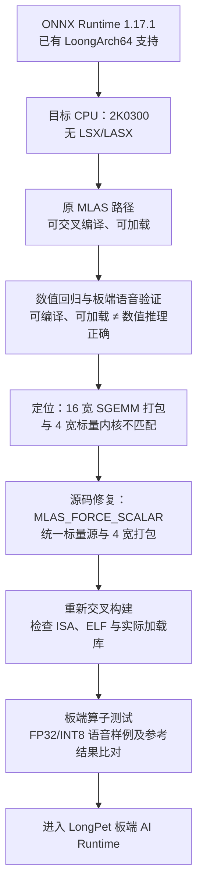
```mermaid
flowchart TD
    A["ONNX Runtime 1.17.1<br/>已有 LoongArch64 支持"] --> B["目标 CPU：2K0300<br/>无 LSX/LASX"]
    B --> C["原 MLAS 路径<br/>可交叉编译、可加载"]
    C --> D["数值回归与板端语音验证<br/>可编译、可加载 ≠ 数值推理正确"]
    D --> E["定位：16 宽 SGEMM 打包<br/>与 4 宽标量内核不匹配"]
    E --> F["源码修复：MLAS_FORCE_SCALAR<br/>统一标量源与 4 宽打包"]
    F --> G["重新交叉构建<br/>检查 ISA、ELF 与实际加载库"]
    G --> H["板端算子测试<br/>FP32/INT8 语音样例及参考结果比对"]
    H --> I["进入 LongPet 板端 AI Runtime"]
```

*图 6-2 ONNX Runtime 在无 LSX/LASX 的 2K0300 上的适配与验证路径*

### 6.6 sherpa-onnx、Qt6、OpenCV 与多媒体能力

sherpa-onnx 1.12.15 依赖 ONNX Runtime、Python、NumPy 和 ALSA。构建启用 Python 接口，关闭未使用的 TTS、说话人分离和 GPU 选项，并禁用 Eigen 向量化。LongPet 的本地 KWS 另由独立维护的 Python/ONNX 组件实现。

界面使用 Qt6 Widgets/Network/SQL/SVG，显示采用 `linuxfb`，触摸由输入插件接入。OpenCV 4.10.0 提供 C++/Python 图像处理、V4L2 摄像头和 FFmpeg 视频后端。媒体组件包含 FFmpeg、GStreamer 插件、Opus、VP8、RTP、DTLS、SRTP 与 WebRTC 相关基础库。合并清单显式列出通过运行时注册或 `dlopen()` 加载的插件。板端尚未完成全部 WebRTC 或实时软件编码场景的性能验收；当前也没有已确认可用的通用硬件视频编码器。

### 6.7 基础系统路线与 Hybrid Rootfs 决策

早期实机验证显示，直接套用龙芯 Buildroot 仓库（[open-loongarch/buildroot-2024.08](https://gitee.com/open-loongarch/buildroot-2024.08)）构建的系统，完整替换基础系统后的稳定性未达到项目要求（出现CPU 占用率异常波动等问题）。交付方案因此保留已验证的出厂自带基础系统，仅按清单合入所需的用户空间组件。

Hybrid Rootfs 以可启动的板卡基础 rootfs、内核和 ramdisk 为基线，从 `output-qt6/target` 选取 Qt6、Python/AI、OpenCV 和媒体组件。原有内核、模块、固件、动态加载器及核心 C/C++ 运行库保持不变；新增组件通过依赖、ABI 和 ISA 检查后合入。

### 6.8 Hybrid Rootfs 的合并与校验设计

基础系统与 Buildroot target 按清单合并，经依赖、ABI、ISA、基础文件和完整性校验后形成交付包，再进行板端验证（图 6-3）。

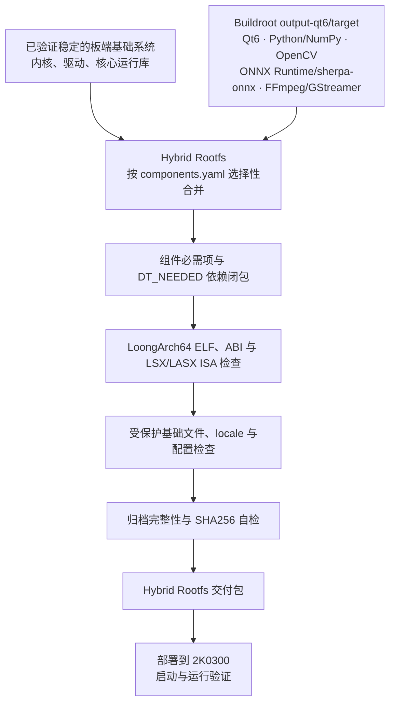
```mermaid
flowchart TD
    B["已验证稳定的板端基础系统<br/>内核、驱动、核心运行库"] --> M["Hybrid Rootfs<br/>按 components.yaml 选择性合并"]
    T["Buildroot output-qt6/target<br/>Qt6 · Python/NumPy · OpenCV<br/>ONNX Runtime/sherpa-onnx · FFmpeg/GStreamer"] --> M
    M --> C1["组件必需项与 DT_NEEDED 依赖闭包"]
    C1 --> C2["LoongArch64 ELF、ABI 与 LSX/LASX ISA 检查"]
    C2 --> C3["受保护基础文件、locale 与配置检查"]
    C3 --> C4["归档完整性与 SHA256 自检"]
    C4 --> O["Hybrid Rootfs 交付包"]
    O --> V["部署到 2K0300<br/>启动与运行验证"]
```

*图 6-3 LongPet Hybrid Rootfs 的构建、组件合并与完整性校验流程*

#### 6.8.1 清单驱动的组件合入和依赖闭包

`components.yaml` 以包含/排除规则、必需文件和受保护路径限定合并范围，覆盖 locale、Qt6、OpenCV、NumPy、sounddevice、ONNX Runtime、sherpa-onnx、FFmpeg、V4L2 工具及 GStreamer。必需文件缺失时构建失败；GStreamer 插件和 Python 动态加载依赖需显式列入清单。

解析器递归读取新增 ELF 的 `DT_NEEDED`，优先复用基础 rootfs 中的库，缺失时从 Buildroot target 补齐共享库及链接名，同时保留原有目录布局和受保护文件。合并后检查动态依赖、断链软链接及 Qt5 残留依赖。2026 年 8 月 29 日的记录显示：必需组件缺失 0、未解析依赖 0；检查 1739 个 ELF，断链软链接 0。

#### 6.8.2 ABI、架构与 ISA 检查

合并前核对基础 rootfs 与 target 的 glibc 版本、Python 主版本，以及内核镜像与模块目录；新增 ELF 的 GLIBC、GLIBCXX、CXXABI 符号版本要求不得超出基础运行库能力。8 月 29 日检查时，两套系统均使用 glibc 2.38，新增 ELF 的符号版本要求未超限。

架构检查遍历合并 rootfs 的全部 ELF，要求 `Machine=LoongArch`。ISA 检查默认反汇编本次新增的 ELF，拒绝 LSX/LASX 指令；也可启用全 rootfs 严格扫描。该次检查发现非 LoongArch ELF 0 个，新增 ELF 的向量指令命中 0 次。默认模式的 ISA 检查范围限于新增 ELF。

#### 6.8.3 基础文件保护、locale 与产物校验

清单保护 `/boot`、内核模块、固件、动态加载器、核心 glibc/libstdc++ 与既有系统配置。构建前后对关键基础文件计算 SHA256 并比较；不一致时停止交付。Qt6 所需 UTF-8 环境通过 `locale-archive` 和 `LANG=C.UTF-8` 配置补齐，构建过程校验 archive 非空且包含 C.UTF-8。合并还保留归档的数字属主、权限、扩展属性和 ACL，检查目录层级、关键文件、压缩包完整性，并对 rootfs、内核和 ramdisk 生成及自检 `SHA256SUMS`。

8 月 29 日合并记录显示受保护文件未变、locale 验证通过，rootfs、内核和 ramdisk 的校验通过。现有构建流程可按固定输入和配置重建软件集合；尚无不同主机间逐字节一致的验证记录。

### 6.9 systemd、自启动与自恢复

LongPet 服务以独立的 `longpet` 用户运行，配置显示、触摸、音频、串口权限和私有运行目录，并指定 `linuxfb` framebuffer、`tty1` VT 与触摸输入插件。板端联调解决了 `tty1` 与控制台抢占、设备节点权限问题；整板重启后应用和界面能够恢复。服务通过 `Restart=always` 在进程异常退出后自动重启。

针对特定 Wi-Fi 驱动探测失败，系统配置了条件式恢复服务。时间同步已启用，但 RTC 读取和重启后的同步稳定性仍需验证，提醒服务应检查时钟是否可信。合并系统在 `/etc/locale.conf` 中设置 C.UTF-8；冷启动验收已检查 Qt 字符编码、媒体设备权限、网络恢复及并发资源占用。

### 6.10 验证结论与证据边界

表 6-2 汇总已完成的构建检查与板端测试。具体测试条件见功能与性能报告。

*表 6-2 LongPet LoongArch 平台关键问题、设计决策与验证结果矩阵*

| 工程问题 | 设计决策 | 验证方式 | 当前结果 / 状态 |
| --- | --- | --- | --- |
| 2K0300 无 LSX/LASX | 采用通用目标编译选项，排除不兼容向量路径 | 交叉编译、ELF 架构与新增 ELF 指令扫描 | 构建与 ISA 校验通过 |
| LoongArch AI/Python 组件不能只按架构名称直接复用 | 固定源码、工具链和 ABI 基线 | 目标包构建、符号版本及板端导入检查 | 构建与运行验证通过 |
| NumPy 等 Python 扩展需受控构建 | Buildroot 源码交叉构建，保留字节码与扩展模块 | 构建产物、清单必需项和板端导入检查 | 构建与板端验证通过 |
| ONNX Runtime 可加载但曾出现数值错误 | 强制一致的标量 MLAS 和 4 宽打包路径 | 十项板端算子、FP32/INT8 语音样例及参考结果比对 | 板端数值验证通过 |
| 图形、视觉、语音和媒体组件需在同一目标环境协作 | 扩展 Buildroot Qt6、OpenCV、Python/AI、FFmpeg/GStreamer 配置 | target 构建、运行库与插件合并检查、板端功能验证 | 构建与运行验证通过 |
| 完整替换基础系统的稳定性未达项目要求 | 保留稳定基础系统，选择性合入 Buildroot 用户空间 | Hybrid Rootfs 合并校验和目标板运行验收 | Hybrid 方案板端验证通过 |
| 混合系统可能出现依赖、ABI/ISA 或基础文件冲突 | 对全 rootfs 依赖、符号版本、ISA、受保护文件和 SHA256 分层检查 | 合并报告与最终归档自检 | 依赖、兼容性与完整性校验通过 |
| 嵌入式应用需要自动启动和进程故障恢复 | systemd 管理 LongPet，配置运行权限与自动重启 | 整板重启、服务重启和异常退出恢复测试 | 板端验证通过 |

## 7 LongPet 应用软件架构

LongPet 主程序统一承载本地照护、联网语音、人物感知、家属协同和运动控制。`Application` 负责对象组装与生命周期，本地 `AppController` 和远程 `FamilyLinkController` 接收操作意图，Service 集中处理业务规则；语音、视觉、媒体和运动等外部能力通过 Port 与 Adapter 接入。该结构使不同入口复用同一业务逻辑，并支持可选设备能力的独立降级与后续扩展。

### 7.1 应用软件总体分层

`Application` 在启动时创建对象、注入依赖并连接 Qt 信号，运行时由本地和远程控制入口调用共享的业务服务。Repository 提供持久化边界，设备 Port 提供外部能力边界（图 7-1）。

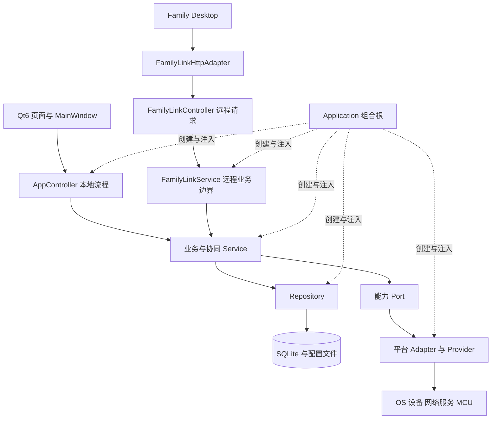
```mermaid
flowchart TB
    UI[Qt6 页面与 MainWindow] --> AC[AppController 本地流程]
    FD[Family Desktop] --> HTTP[FamilyLinkHttpAdapter]
    HTTP --> FC[FamilyLinkController 远程请求]
    FC --> FL[FamilyLinkService 远程业务边界]
    AC --> S[业务与协同 Service]
    FL --> S
    S --> R[Repository]
    R --> DB[(SQLite 与配置文件)]
    S --> P[能力 Port]
    P --> A[平台 Adapter 与 Provider]
    A --> E[OS 设备 网络服务 MCU]
    APP[Application 组合根] -.创建与注入.-> AC
    APP -.创建与注入.-> FL
    APP -.创建与注入.-> S
    APP -.创建与注入.-> R
    APP -.创建与注入.-> A
```

*图 7-1 LongPet 主程序逻辑分层与依赖方向*

虚线表示启动期组装，实线表示运行期业务调用。

| 模块层 | 主要职责 | 职责边界 |
| --- | --- | --- |
| Qt 表示层 | 呈现页面、表情、状态栏及会话快照；发出语义化用户事件 | 直接读写数据库、发 HTTP 请求、占用音频或摄像头、写串口 |
| 控制层 | 将本地或远程事件映射为业务动作，组织页面跳转和请求/响应 | 复制照护规则、协议实现或设备驱动 |
| Service 层 | 校验业务约束、维护状态机和服务间协作，给出可显示结果 | 依赖某个 Qt 页面或自行解析底层硬件协议 |
| Repository / Port | 隔离持久化与外部能力契约 | 决定用户流程或产品界面 |
| Adapter / Provider | 实现 SQLite 以外的平台、网络、音视频和 UART 接入及错误映射 | 绕开 Service 修改业务状态或决定控制权限 |

*表 7-1 软件层级的职责边界*

语音、视觉、媒体、天气和运动使用 Port/Adapter 隔离具体实现，便于替换适配器并控制故障影响范围。网络管理等简单能力由 Service 直接使用 Adapter；设置变更由 `SettingsService` 发信号，再由 `Application` 连接音量和背光 Adapter。

### 7.2 Qt6 表示层与适老界面

`MainWindow` 汇集页面并发出提醒保存、通话、语音和设置变更等语义信号。`AppController` 调用 `ReminderService`、`CareService`、`SettingsService`、`VideoCallService` 等业务服务，再将结果返回页面。表情、状态栏、会话状态和提示消息随业务状态更新，使界面与服务状态保持一致。

本地与家属端操作复用同一套提醒规则：`ReminderService` 校验名称、时间和重复设置，页面负责提交草稿与显示结果。页面关闭或切换不影响提醒调度及已保存数据。

### 7.3 应用控制层与页面流程

本地 `AppController` 协调导航、超时返回、页面刷新和语音快捷动作，并呈现服务状态与错误。远程 `FamilyLinkController` 处理路由、鉴权、输入解析和响应映射，再调用 `FamilyLinkService`。两条入口共用业务服务，规则集中在 Service 层。

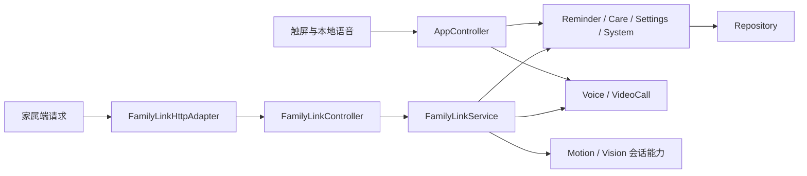
```mermaid
flowchart LR
    L[触屏与本地语音] --> AC[AppController]
    R[家属端请求] --> FH[FamilyLinkHttpAdapter] --> FC[FamilyLinkController] --> FL[FamilyLinkService]
    AC --> RS[Reminder / Care / Settings / System]
    FL --> RS
    AC --> VC[Voice / VideoCall]
    FL --> VC
    FL --> MV[Motion / Vision 会话能力]
    RS --> REP[Repository]
```

*图 7-2 本地与远程入口对同一业务服务的复用*

新增本地或家属端页面时，可复用现有业务规则和持久化能力，减少跨端重复实现。

### 7.4 业务服务、Repository 与本地持久化

`ReminderService` 管理提醒校验、调度和完成状态；`CareService` 汇总照护事件形成今日关怀；`SettingsService` 管理持久化设置；`SystemService` 汇聚网络、电源、音量和背光状态；`WeatherService` 定时刷新天气，并在网络恢复后补刷、标记数据时效。各服务按产品功能划分，可同时支持本地与远程操作。

`DatabaseManager` 打开 SQLite 并维护版本化 schema；`ReminderRepository`、`CareEventRepository` 和 `SettingsRepository` 封装查询与更新。AI、天气配置由相应 Repository 读取，Provider 工厂据此选择实现。本地与远程入口通过 Service 访问持久化数据，提醒修订冲突由业务服务处理，Repository 执行持久化。数据库是核心启动依赖，打开失败时 `Application::initialize` 失败。

### 7.5 设备适配层与能力降级

Port 定义服务所需能力，Adapter 对接具体设备或外部实现。`VoiceInteractionService` 使用 ASR、LLM、TTS 和音频 Port；`VisionService` 使用 Camera、Detector、Tracker Port；`MotionService` 和 `VideoCallService` 分别使用运动和媒体 Port。`Application` 在启动时注入实现，使 Service 不依赖单一设备或外部服务的具体实现。

可选能力故障时，系统维持其他功能运行。`VoiceCapabilityService` 根据配置、网络和 Provider 状态判断在线语音可用性，本地快捷指令与陪伴独立运行；天气服务保留带时效标记的最近快照并在网络恢复后补刷；摄像头或视觉模型不可用时，`VisionService` 报告状态。FamilyLink、AI 视野或 Motion 启动失败会被分别记录，不影响其他可用模块初始化。核心数据库故障则由启动流程明确报告。

### 7.6 AI 语音模块与 Provider 分层

`VoiceCommandDispatcher` 根据 KWS 事件、触屏请求、紧急与停止命令以及在线状态选择处理路径。`VoiceInteractionService` 管理录音、ASR、LLM、工具调用、TTS 和播放；`LocalCompanionService` 处理本地陪伴和快捷动作。`VoiceToolRegistry` 校验工具参数并调用现有业务 Service，例如创建提醒，使语音操作遵循与触屏相同的业务规则。`KwsProcessAdapter` 使用 `QProcess` 管理独立 KWS bridge，并向 `KwsPort` 发布事件。

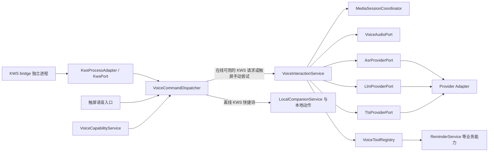
```mermaid
flowchart LR
    K[KWS bridge 独立进程] --> KP[KwsProcessAdapter / KwsPort] --> D[VoiceCommandDispatcher]
    UI[触屏语音入口] --> D
    C[VoiceCapabilityService] --> D
    D -->|在线可用的 KWS 请求或触屏手动尝试| V[VoiceInteractionService]
    D -->|离线 KWS 快捷词| O[LocalCompanionService 与本地动作]
    V --> M[MediaSessionCoordinator]
    V --> A[VoiceAudioPort]
    V --> ASR[AsrProviderPort]
    V --> LLM[LlmProviderPort]
    V --> TTS[TtsProviderPort]
    V --> T[VoiceToolRegistry] --> B[ReminderService 等业务能力]
    ASR --> PA[Provider Adapter]
    LLM --> PA
    TTS --> PA
```

*图 7-3 语音会话、Provider 与业务工具的分层*

ASR、LLM、TTS 分别配置 Provider Port，`AiProviderFactory` 可按能力选择实现。`ProviderHttpClient` 异步执行网络请求，并以会话 ID 关联结果；取消时中止 Provider 与音频任务，旧会话回调无法更新新会话。在线能力不可用时，KWS 路径仍支持已配置的本地快捷动作和陪伴音频。触屏语音入口显示不可用原因，在线尝试失败后允许重试；离线能力范围保持为快捷指令与本地音频。

### 7.7 视觉模块与 TargetObservation 数据通路

`CameraCaptureAdapter` 实现 `CameraSourcePort`，以单采集进程和 `acquire/release` 计数共享摄像头。`VisionService` 在独立线程中处理最新帧，将 Detector 与 Tracker 的输出统一为 `TargetObservation`。观测提供目标状态、帧序号、采集与发布时间、观测年龄、画面尺寸、人物框、归一化位置及置信度。家属端与自动控制共用该接口，无需依赖模型内部格式；人物框高度用于粗略判断远近。

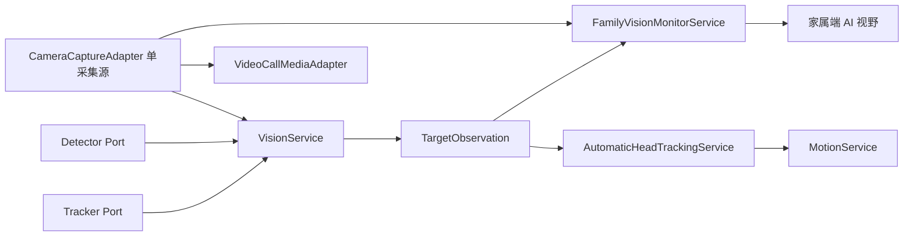
```mermaid
flowchart LR
    CAM[CameraCaptureAdapter 单采集源] --> VS[VisionService]
    CAM --> FV[FamilyVisionMonitorService]
    CAM --> CALL[VideoCallMediaAdapter]
    DET[Detector Port] --> VS
    TRK[Tracker Port] --> VS
    VS --> OBS[TargetObservation]
    OBS --> FV
    OBS --> AUTO[AutomaticHeadTrackingService]
    AUTO --> MS[MotionService]
    FV --> VIEW[家属端 AI 视野]
```

*图 7-4 摄像头共享与统一视觉观测的多消费者数据通路*

`AutomaticHeadTrackingService` 根据观测时效与位置提出跟头或跟随请求，由 `MotionService` 统一处理运动权限。`FamilyVisionMonitorService` 复用相机帧和人物观测，向家属端发布 AI 视野，无需重复运行检测器。视频通话使用同一相机源，期间暂停 Vision 推理和自动跟随；仅查看 AI 视野不影响本地 Vision。

### 7.8 FamilyLink 服务与家属端协同

FamilyLink 将家属端请求接入设备已有的业务服务。`FamilyLinkHttpAdapter` 处理 HTTP 传输，`FamilyLinkController` 负责路由、认证和数据转换，`FamilyLinkService` 组合提醒、关怀、设置、系统状态、通话、视觉监看与运动会话能力。远程修改与本地操作共用业务校验和状态机；AI 视野、通话及远控分别由专门的媒体或运动服务处理。

FamilyLink 默认绑定本机地址；配置 FamilyLink 对外监听时必须提供令牌，否则 `Application` 拒绝启用。远程读写仍通过业务服务校验，AI 视野会话由专门服务管理。

### 7.9 MotionService 与运动 MCU 协同

`MotionService` 统一处理人工远控和自动视觉运动。家属端经 `FamilyLinkService` 取得远控会话，`FamilyMotionControlAdapter` 将实时控制数据转为 `FamilyMotionControlPort` 事件；`AutomaticHeadTrackingService` 提出跟头与跟随请求。`MotionService` 检查模式、人工占用及 MCU 状态，再通过 `MotionPort` 和 `EspSerialAdapter` 发送 UART 命令。

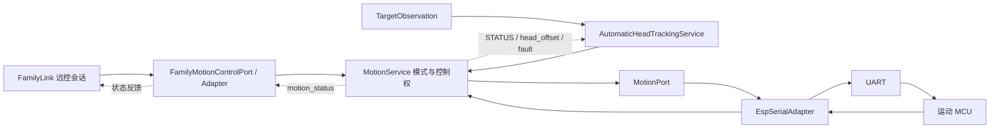
```mermaid
flowchart LR
    FAMILY[FamilyLink 远控会话] --> FPORT[FamilyMotionControlPort / Adapter]
    OBS[TargetObservation] --> AUTO[AutomaticHeadTrackingService]
    FPORT --> MS[MotionService 模式与控制权]
    AUTO --> MS
    MS --> MP[MotionPort] --> ESP[EspSerialAdapter] --> UART[UART] --> MCU[运动 MCU]
    MCU --> ESP --> MS
    MS -. STATUS / head_offset / fault .-> AUTO
    MS -. motion_status .-> FPORT
    FPORT -. 状态反馈 .-> FAMILY
```

*图 7-5 人工与自动控制汇入同一运动服务*

实线表示命令，虚线表示状态反馈。

集中仲裁使视觉策略可独立迭代，也避免远控与自动模式争夺控制权。MCU 的 `STATUS` 更新 `MotionService`，再反馈给视觉策略和家属端；人物跟随仅使用有效的 MCU 状态继续决策。主控发出命令后，实际执行状态以 MCU 后续报告为准。服务停机或链路异常时，`MotionService` 结束相应控制状态，MCU 继续执行独立的命令超时、故障锁存和停车保护。

### 7.10 线程、进程、资源与生命周期管理

`Application` 集中管理资源持有者的创建与关闭，Service 维护会话和状态机，Adapter 管理进程与网络句柄。视觉检测和跟踪运行在 `VisionInferenceThread`；KWS bridge、相机采集、语音录放及通话音频由相应 Adapter 通过 `QProcess` 管理；Provider 使用异步 Qt 网络请求及超时、取消回调。摄像头、麦克风和异步结果分别按资源所有权与会话 ID 协调。

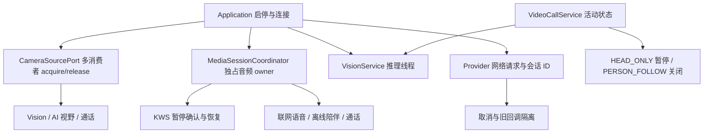
```mermaid
flowchart TB
    APP[Application 启停与连接] --> CAMERA[CameraSourcePort 多消费者 acquire/release]
    APP --> MEDIA[MediaSessionCoordinator 独占音频 owner]
    APP --> VISION[VisionService 推理线程]
    APP --> NET[Provider 网络请求与会话 ID]
    CAMERA --> CV[Vision / AI 视野 / 通话]
    MEDIA --> KWS[KWS 暂停确认与恢复]
    MEDIA --> VA[联网语音 / 离线陪伴 / 通话]
    CALL[VideoCallService 活动状态] --> VISION
    CALL --> AUTO[HEAD_ONLY 暂停 / PERSON_FOLLOW 关闭]
    NET --> FENCE[取消与旧回调隔离]
```

*图 7-6 共享硬件与异步任务的运行期协调*

| 资源或异步边界 | 当前协调机制 | 异常处理 |
| --- | --- | --- |
| 摄像头 | 一个 `CameraCaptureAdapter` 对 Vision、AI 视野和通话计数共享；最后一位消费者释放后停采集 | 相机或模型不可用时报告状态，其他业务保持运行 |
| 麦克风与音频 | `MediaSessionCoordinator` 为语音、离线陪伴、通话维护 owner；KWS 暂停确认后才允许打开音频，释放后延迟恢复 KWS | 暂停确认超时则中止本次音频操作 |
| 通话与视觉 | 通话状态通知 Vision 和自动控制；媒体 Adapter 使用共享相机源 | 通话时暂停 Vision 与 HEAD_ONLY，并关闭 PERSON_FOLLOW；结束后 Vision 可重新获取新观测，HEAD_ONLY 满足条件才恢复，PERSON_FOLLOW 须家属显式重新开启 |
| 网络请求与会话 | Provider 超时/取消；`VoiceInteractionService` 以 session ID 拦截旧 ASR、LLM、TTS 和播放回调 | 当前会话返回错误或结束，旧结果与新会话隔离 |
| 运动控制 | `MotionService` 统一模式、会话和状态；Adapter 承接网络与 UART | 控制能力退出，MCU 继续执行独立安全保护 |

*表 7-2 主要共享资源与异步边界*

关闭时，`Application::shutdown` 先停止媒体超时与 KWS 恢复调度，再依次停止语音、天气、视觉、自动运动、Motion、家属端监听、提醒及平台监测，最后释放对象并关闭数据库。活跃任务由对应 Service 取消，设备与网络句柄由 Adapter 释放。`deploy/longpet.service` 负责自启动和异常重启，与应用内资源释放共同构成恢复边界。

## 8 核心业务功能设计

LongPet 将日常陪伴、照护提醒和家庭联系整合在同一设备中。老人通过 1024×600 触屏或语音快速进入常用功能；家属通过桌面端设置提醒、查看设备、发起通话并提供远程协助，形成老人易用、家属可参与的双端体验。

### 8.1 业务能力与协同关系

老人端集中呈现提醒、今日关怀、天气和语音入口，减少日常操作步骤；家属端提供设备查看、通话及远程协助。视觉功能让设备主动关注人物，并向家属展示当前感知画面；人物跟随与人工远控均在独立运动安全校验下运行。

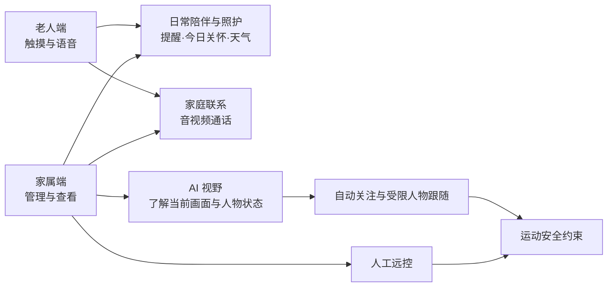
```mermaid
flowchart LR
    E[老人端<br/>触摸与语音] --> D[日常陪伴与照护<br/>提醒·今日关怀·天气]
    E --> C[家庭联系<br/>音视频通话]
    F[家属端<br/>管理与查看] --> D
    F --> C
    F --> V[AI 视野<br/>了解当前画面与人物状态]
    V --> A[自动关注与受限人物跟随]
    F --> R[人工远控]
    A --> S[运动安全约束]
    R --> S
```

*图 8-1 LongPet 核心业务能力关系*

| 核心功能 | 主要使用者 | 当前产品价值 |
| --- | --- | --- |
| 陪伴界面与语音 | 老人 | 用触摸或自然语言进入常用功能，并看懂设备正在倾听、回答还是等待 |
| 提醒与今日关怀 | 老人、家属 | 将提醒触发、老人确认和饮水记录汇成当日可查看的信息 |
| 天气 | 老人 | 在状态栏低成本查看当前天气，并在在线对话中询问天气 |
| 自动关注与 AI 视野 | 老人、家属 | 机器人朝向人物，家属了解它当前看到的画面和感知状态 |
| 人物跟随与人工远控 | 老人、家属 | 在受控场景下靠近人物，或由家属手动协助移动 |
| 音视频通话 | 老人、家属 | 在同一设备上进行家庭联系；语音与视频按所需媒体分别启用 |

*表 8-1 核心功能、目标用户与主要价值*

### 8.2 老人端界面与状态反馈

老人端的设计重点是让高频任务一步可见、低频设置少打扰。1024×600 触屏首页显示陪伴表情和简短提示，并直接提供“陪我说话”“今日关怀”“视频通话”三个大按钮。状态栏显示时间、网络，以及有数据时的天气和供电信息，并提供设置入口。老人可从“今日关怀”进入提醒列表，查看事项状态或新增、编辑、确认提醒；较复杂的配置由家属端完成。

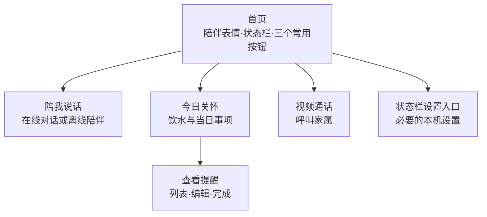
```mermaid
flowchart TD
    H[首页<br/>陪伴表情·状态栏·三个常用按钮] --> T[陪我说话<br/>在线对话或离线陪伴]
    H --> G[今日关怀<br/>饮水与当日事项]
    G --> M[查看提醒<br/>列表·编辑·完成]
    H --> P[视频通话<br/>呼叫家属]
    H --> X[状态栏设置入口<br/>必要的本机设置]
```

*图 8-2 老人端主要导航*

语音不可用时，常用功能仍可通过触屏进入。

陪伴表情用于提示设备状态：待机、倾听、思考、说话和异常分别配有表情或文字反馈。提醒触发时显示提示，并区分已完成与未确认事项；通话页面显示对方、连接状态和挂断入口。网络、AI 或设备能力不可用时，页面提示重试或功能状态，其他本地功能保持可用。表情暂时不承担情绪识别功能。

### 8.3 提醒、今日关怀与天气

提醒用于把饮水、用药等需要记住的事项转成到时可见、完成可查的行动。老人可在本机提醒页触摸创建或修改，家属可远程补充，在线语音也可在限定范围内创建、查询或删除提醒。三种入口指向同一份本地提醒状态，老人不必学会家属端的复杂设置。家属端的写入只有在设备确认成功后才算完成；连接失败或内容冲突会提示刷新、重试，不会显示虚假的保存成功。

```mermaid
flowchart LR
    A[老人触摸] --> R[本地提醒]
    B[家属远程设置] --> R
    C[在线语音工具操作] --> R
    R --> D[到时提醒老人]
    D --> E{老人确认完成?}
    E -- 是 --> F[记录完成<br/>更新今日关怀]
    E -- 尚未确认 --> G[保持未完成状态]
```

*图 8-3 提醒的三入口与完成状态*

触发后未确认的提醒保持未完成；断网期间已有本地提醒仍依本机时间触发。

“今日关怀”把饮水记录和用药提醒完成等离散事件整理为当日信息。老人可在本机记录喝水并查看进度，家属端可读取同一设备上的关怀摘要；活动分钟、互动次数虽有展示或记录位置，当前并未自动由摄像头或运动传感器生成健康指标，后续会补充相关功能和算法；没有可靠数据时应显示未知或待接入。这些信息有效帮助家庭了解已记录的日常事项。

天气作为无需另开复杂页面的日常信息显示在状态栏，也可作为在线语音回答的已有事实。网络正常且配置可用时更新当前天气；更新失败时，本次运行中已取得的快照会保留，首次无数据则显示“--”。若快照过期，在线语音使用旧快照时会提示信息可能过期。

### 8.4 语音交互、工具操作与离线陪伴

语音让老人少走菜单。在线能力可用时，老人说“小龙小龙”后进入倾听状态，说完需求后看到思考状态，随后听到回答并看到说话状态，结束后回到陪伴状态。老人也可以触摸“陪我说话”进入对话。在线模式支持日常聊天、询问时间和当前天气，以及提醒创建、查询、按明确对象删除和打开限定页面等业务操作。Tool Calling 的价值在于把自然语言请求转为受限的真实产品动作，提高产品的便捷性和智能性。

```mermaid
flowchart TD
    W[小龙小龙] --> N{在线 AI 可用?}
    N -- 是 --> L[倾听需求] --> Q[思考并进行 Tool Calling] --> P[基础的记忆整理] --> O[回答与播报] --> H[返回陪伴]
    N -- 否 --> K[离线快捷提示与关键词]
    K --> B[时间·提醒页面·返回主页等本地动作]
    K --> C[有授权音频时播放陪伴内容]
    B --> H
    C --> H
    T[触摸陪我说话] --> M[手动尝试在线会话]
    M --> L
    M -. 在线请求失败 .-> E[显示错误并允许重试] --> H
```

*图 8-4 在线与离线语音流程*

在线 AI 不可用时，KWS 唤醒可进入本地快捷功能；触屏入口会先提示不可用原因并尝试在线会话，失败后提示并允许重试，不会自动转为离线大模型对话。

离线时，“小龙小龙”打开本地快捷提示；本地词可打开提醒、报时、返回主页、进入联系家人的通话入口或紧急页面。“陪我说话”可播放已配置的本地陪伴音频，音频文件缺失时页面提示不可播放。通话仍需网络，紧急页面目前不自动报警；语音“停止”用于取消对话或陪伴音频，或触发底盘停车。

通话、录音、播报或陪伴音频占用麦克风时，本地唤醒监听暂停；触屏取消或挂断入口保持可用。在线请求失败时显示失败状态，老人可结束或重试；离线快捷功能仍可通过本地唤醒入口使用。

### 8.5 人物感知、AI 视野与自动跟随

人物感知将同一份实时观测用于自动关注、家属端 AI 视野和人物跟随：老人获得更自然的陪伴反馈，家属可以了解设备关注的画面，并在需要时开启受控跟随。三项功能按各自权限运行。

**自动关注。** 家属开启“仅头部”后，设备根据有效人物位置调整头部朝向，底盘保持静止。目标丢失、画面中断或观测过期时停止使用旧位置。

**AI 视野。** 家属可在桌面端查看当前画面、人物框、感知状态及“关闭／仅头部／人物跟随”模式，并进入人工远控。无有效目标时不显示旧人物框；关闭远程视野页面不影响设备本地视觉功能。

**人物跟随。** 家属开启后，设备先确认目标，再调整头部和机身朝向；目标较远且安全条件满足时低速靠近，到达设定的画面距离后停车。目标丢失、摄像头不可用、人工接管、通话或故障时停止移动。通话或人工远控结束后，家属需重新开启跟随。

```mermaid
flowchart LR
    P[发现人物] --> H[仅头部自动关注]
    H --> V[家属端 AI 视野<br/>画面·人物框·状态]
    V --> U{家属开启跟随?}
    U -- 是 --> F[确认目标并调整朝向] --> M[条件满足时靠近] --> S[距离合适或目标丢失时停车]
    U -- 否 --> H
```

*图 8-5 人物感知与受控跟随流程*

### 8.6 音视频通话与媒体资源

老人可从首页“视频通话”主动呼叫家属，家属端可接听或拒绝；老人等待时可取消，呼叫被拒绝时会收到提示。家属端可选择语音或视频呼叫设备；设备播放对应提示并准备媒体后接通，老人端提供挂断入口。通话页显示对象、连接状态和时长，触屏可显示醒目的挂断按钮。

```mermaid
flowchart TD
    A[老人从首页发起视频呼叫] --> B[家属端接听或拒绝]
    C[家属端发起语音或视频呼叫] --> D[设备提示并准备媒体]
    B -- 接听 --> E[双方通话]
    B -- 拒绝 --> R[老人端显示无法接听]
    D --> E
    E --> F[任一端挂断或连接中断] --> G[显示结果并返回首页]
```

*图 8-6 双向通话流程*

语音通话只使用音频，视频通话使用双方画面和声音。设备发起视频时暂停占用摄像头的视觉任务，通话结束后重新检测人物。摄像头、麦克风或扬声器被占用、权限不足或连接失败时，页面显示失败或忙碌状态并释放已占用资源；断线后退出通话。家庭通话需保持网络连接。

### 8.7 家属端管理与人工远控

老人端提供陪伴、关怀、通话和必要的本机操作。家属端集中管理设备与网络状态、今日关怀、提醒、AI 视野、音视频通话、自动跟头、人物跟随及人工远控。家属端以设备实际反馈为准，失联、能力不可用或写入冲突时提示异常。

```mermaid
flowchart LR
    E[老人端<br/>陪伴·关怀·视频呼叫·必要设置] <-->|同一设备状态| F[家属端<br/>提醒与设置管理·设备状态·AI 视野·通话·远控]
    F --> M[模式选择<br/>关闭／仅头部／人物跟随]
    F --> R[人工远控<br/>按住移动·松开停车]
```

*图 8-7 老人端与家属端的功能分工*

两端共用设备上的提醒状态；家属端通过刷新获取关怀信息。

家属从“AI 视野”进入人工远控，按住方向按钮或按键时发送控制意图，松开、页面失焦或连接丢失时停车。人工控制优先于自动跟随；退出后，家属需重新开启跟随。运动能力不可用、控制模式不符或设备故障时，界面禁用控制按钮。

### 8.8 当前业务边界

现阶段的业务链覆盖老人端日常使用、家属端远程协助、本地感知与受控运动。表 8-2 集中列出已交付能力及使用条件，便于后续试用和迭代。

| 能力 | 当前交付 | 使用条件与后续方向 |
| --- | --- | --- |
| 老人端适老交互 | 大按钮、浅层导航与状态表情 | 目前表情是交互反馈，可加入情绪识别丰富表情反馈 |
| 提醒与今日关怀 | 触屏、家属端和在线语音共用提醒，完成后形成当日记录 | 已有本地提醒可在断网时触发；完成状态以老人确认为准，活动指标待接入可靠数据源 |
| 天气 | 状态栏显示天气，在线对话可引用已获取的信息 | 联网更新；失败时保留本次运行快照，过期标记列入后续完善项 |
| 在线 AI 语音与工具操作 | 自然语言聊天、提醒管理和限定页面操作 | 需要在线服务；具体动作由本机规则授权 |
| 本地唤醒与离线陪伴 | 离线保留关键词唤醒、快捷动作和已配置的陪伴音频 | 通话占用麦克风时暂停监听；长期记忆功能 |
| AI 视野、自动关注与人物跟随 | 家属查看当前画面，设备在受控条件下关注并靠近人物 | 目标无效或模式冲突时停车；身份识别、摔倒检测算法、复杂导航与避障属于后续能力 |
| 音视频通话 | 老人和家属双向联系，按需启用语音或视频 | 依赖网络与媒体设备；家属主动呼叫时设备提示后接通，老人可挂断 |
| 家属管理与人工远控 | 远程设置提醒、查看状态和按住协助移动 | 写入以设备确认为准；松开或失焦停车，左右平移暂缓开放 |

*表 8-2 LongPet 已交付的业务能力、使用条件与后续方向*

## 9 本地 AI 模型与感知系统设计

LongPet 在龙芯 2K0300 上完成关键词唤醒（KWS）和人物视觉推理，形成无需云端参与的基础感知链。人物检测模型由项目在 PC 端训练、导出为 ONNX 后部署到板端；在线 ASR、LLM 和 TTS 则补充开放式语音对话能力。

### 9.1 端侧 AI 处理链与工程边界

麦克风输入先经自适应能量 VAD 筛选，再由常驻 FSMN-CTC 模型产生关键词事件；摄像头输入经轻量 Detector 和 Sparse LK Tracker 形成带时效信息的 `TargetObservation`。两条链分别支撑语音入口和人物位置观测，电机动作仍由独立运动控制链路裁决。板端运行依赖标量适配后的 ONNX Runtime、Python/NumPy 音频组件和 OpenCV。

### 9.2 本地 KWS、声学模型与关键词策略

本地 KWS 采用第三方预训练 FSMN-CTC ONNX 模型及配套中文 token 表。项目完成音频采集、FBank、CTC 词条匹配、自适应 VAD、进程桥接和业务动作映射的端侧集成，并针对产品词条配置别名和阈值。声学文件为 `components/longpet-kws/assets/fsmn/fsmn_ctc.onnx`（3,065,258 B；SHA-256 `6febd9f7f15c47caed88d434d810651e34215334c66961b9ba66251fa04d98c4`），来源状态见 E.6。产品 KWS 使用 Python、NumPy 和 ONNX Runtime `CPUExecutionProvider` 运行。

板端默认以 48 kHz 单声道 PCM 每约 100 ms 取一块，转换为模型 16 kHz 输入；自适应能量 VAD 在静音时跳过 ONNX，保留约 300 ms 语音前缀，连续约 500 ms 静音后重置流式缓存。`KwsProcessAdapter` 通过独立 bridge 接收逐行 JSON 事件；模型常驻，暂停时释放采集，异常退出可重启。音频会话只有在带 ID 的暂停确认后才获麦克风；超时按失败处理。

```mermaid
flowchart LR
    A[48 kHz 麦克风/100 ms 音频块] --> B[16 kHz 重采样]
    B --> C[自适应 Energy VAD]
    C --> D[FSMN-CTC ONNX + token/alias]
    D --> E[JSON 事件 → KwsProcessAdapter]
    E --> F[VoiceCommandDispatcher]
    F --> G[在线语音/本地快捷/紧急页面]
    H[录音·TTS·通话] -.麦克风所有权.-> I[MediaSessionCoordinator]
    I -.暂停 KWS 并等待 ACK.-> C
```

*图 9-1 本地关键词与音频资源协调*

通话和播报期间暂停 KWS 监听。

产品 bridge 为同一声学模型配置 11 个词条：“小龙小龙、你好、陪我说话、救命、停止、打开提醒、现在几点、联系家人、返回主页、音量大点、音量小点”。默认唤醒阈值为 0.15，“你好”为 0.10，其余命令词为 0.05；“救命”配置同音字别名，“返回主页”通过词表中的“反回主页”匹配后归一化。阈值属于 CTC 匹配策略。

| 关键词 | 当前 `VoiceCommandDispatcher.cpp` 的实际行为 |
| --- | --- |
| “小龙小龙” | 在线可用时开始语音会话，否则打开离线指令窗口 |
| “你好” | 识别后不触发业务操作 |
| “救命” | 取消当前语音/陪伴并打开本地紧急页面，当前不自动拨号或上报 |
| “停止” | 取消当前语音或陪伴操作并提示用户，或发送底盘 `STOP` |
| “陪我说话”“打开提醒”“现在几点”等 | 在线不可用时执行本地音频、提醒页、报时、联系家人入口、主页或音量调整 |

*表 9-1 关键词到业务动作的映射*

通话、录音、播报和离线播放占用麦克风时，KWS 监听暂停。无视觉工况下，KWS 进程在安静环境cpu占用约13%， 嘈杂环境中 CPU 占用约 23%～31%；实测端到端延迟控制在几百毫秒以内。

### 9.3 人物检测模型自主训练与板端部署

LongPet 基于 [ETH-PBL/TinyissimoYOLO](https://github.com/ETH-PBL/TinyissimoYOLO) 的 TinyissimoYOLO-v1-small 网络结构，自主训练人物检测权重。通用模型从随机初始化开始，在 COCO person-only 数据上训练，再使用 LongPet 固定摄像头的实拍数据进行领域微调。

#### 9.3.1 板端模型选型

在单核约 1 GHz 的龙芯 2K0300 上，早期 YOLO11n-Pose 和手部 Landmark 每帧耗时数秒，皆作为废弃方案。后来测试的FastestDet 能检测人物，但推理延迟较高。表 9-2 对比同图、同 benchmark 条件下的纯 CNN 推理耗时，作为轻量模型选型依据。

| 模型 | 输入 | 板端纯推理平均耗时 | 相对速度 |
| --- | ---: | ---: | ---: |
| FastestDet | 352×352 | 2,399.16 ms | 1× |
| Tinyissimo V1.1 | 128×128 | 635.41 ms | 约 3.78× |

*表 9-2 板端模型选型基线*

Tinyissimo V1.1 的单次推理约 0.64 s，比 FastestDet 快约 3.78 倍；正式 V1.2 的并发性能另见表 9-6。

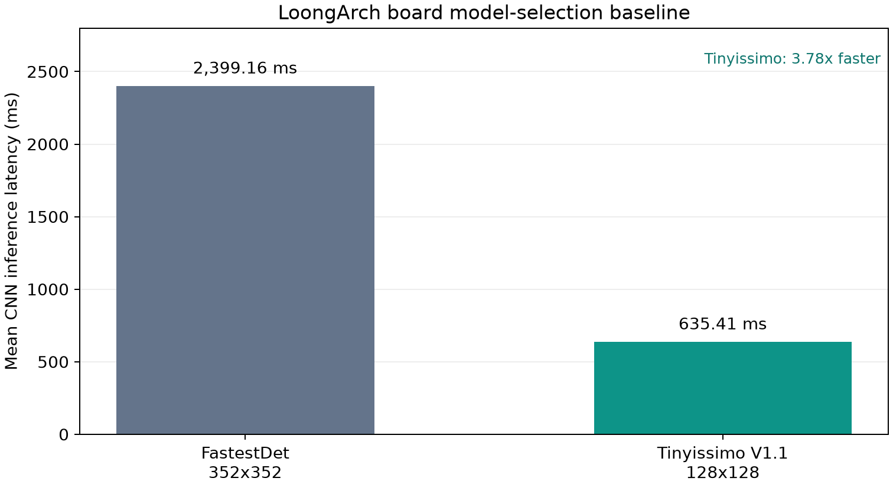

*图 9-2 同口径板端纯推理延迟对比*

#### 9.3.2 Tinyissimo 架构来源与 COCO 通用训练

V1.1 从随机权重开始训练，使用 COCO person-only 小样本集：训练集 2,000 张含人图和 500 张无人图，验证集 500 张含人图和 125 张无人图。该版本用于验证架构、ONNX 导出及板端部署。COCO-full 随后独立随机初始化（`pretrained=false`、`resume=false`），用于训练正式通用人物模型；配置与有效数据量见表 9-3。

| 项目 | COCO-full 正式配置或扫描结果 |
| --- | --- |
| 网络与任务 | TinyissimoYOLO-v1-small，person-only |
| 初始化 | 重新随机初始化；`pretrained=false`、`resume=false` |
| 输入 | 128×128 |
| manifest 选出训练图片 | 69,115（64,115 张含人图、5,000 张无人图） |
| 扫描后有效训练图片 | **69,078**，其中 **4,996** 张空标注背景图 |
| 损坏并忽略 | **37** 张 |
| Optimizer / batch | SGD / 256 |
| 最大 epoch / patience | 150 / 30 |
| 初始学习率 `lr0` / seed | 0.01 / 20260901 |
| AMP | 开启 |

*表 9-3 COCO-full 通用人物模型训练配置*

manifest 选出 69,115 张图，训练缓存确认 69,078 张有效图，其中 4,996 张为空标注背景图；37 张损坏图被忽略。正式部署前继续使用 LongPet 固定视角数据微调。

```mermaid
flowchart TD
    A[TinyissimoYOLO-v1-small 网络结构<br/>ETH-PBL 上游] --> B[V1.1 独立随机初始化<br/>小集 2500 train / 625 val]
    B --> C[架构与板端可行性验证]
    A --> D[COCO-full 重新随机初始化<br/>pretrained=false；有效训练图 69078]
    D --> E[通用 person checkpoint]
    E --> F[V1.2 产品域微调<br/>366 train / 88 val]
    F --> G[85 张 Frozen Test<br/>不参与训练与模型选择]
    G --> H[V1.2 FINAL_RECOMMENDED<br/>正式部署]
    F --> I[V1.3 从 V1.2 继续训练<br/>170 train / 93 val]
    I --> J[52 张 New Test + 原 Frozen Test]
    J --> K[V1.3 EXPERIMENTAL<br/>扩域评估与跨场景优化]
```

*图 9-3 人物检测权重训练谱系*

V1.1 与 COCO-full 独立初始化；V1.2 使用 539 张领域数据进行训练、验证和冻结测试划分，V1.3 在 V1.2 基础上开展扩域实验。

#### 9.3.3 LongPet 实拍数据集构建

V1.2 数据来自 36 段自行拍摄的产品视角视频，总长约 332.7 s，分辨率 1920×1080、约 30 FPS，按约 2 FPS 抽帧。使用 dHash 汉明距离和 32×18 灰度差剔除近重复帧；YOLOv8x teacher 在 PC 端初标，低置信、局部人体及疑似漏检由人工复核。同一视频的帧只进入一个 split，避免相邻帧随机划分造成测试泄漏。

V1.2 领域数据集共 539 张：366 张用于训练，88 张用于验证和早停，85 张 Frozen Test 用于独立评估。Frozen Test 在 V1.3 实验中继续保持原有标注和划分，其中没有经确认的纯无人负样本。

```mermaid
flowchart LR
    A[36 段实拍视频] --> B[约 2 FPS 抽帧]
    B --> C[dHash + 32×18 灰度差去重]
    C --> D[YOLOv8x teacher 初标]
    D --> E[低置信/局部人体/漏检人工复核]
    E --> F[视频级固定 split]
    F --> G[366 train]
    F --> H[88 val]
    F --> I[85 Frozen Test]
```

*图 9-4 V1.2 实拍数据集构建流程*

YOLOv8x teacher 只在 PC 端用于初标，冻结测试集保持独立。

#### 9.3.4 V1.2 领域微调与 Frozen Test

V1.2 从项目 COCO-full `best.pt` 开始领域微调，输入 128×128，使用 SGD、batch 32、`lr0=0.001`、最多 30 epoch、`patience=8`；最佳验证结果出现在第 21 个 epoch。表 9-4 在同一组 85 张 Frozen Test 上比较 COCO-only 与 V1.2 的静态 ONNX 模型。

| 指标 | COCO-only | V1.2 | 变化 |
| --- | ---: | ---: | ---: |
| Precision | 1.0000 | 1.0000 | 不变 (均为1是由于第一轮实拍数据采集未收集无人负样本） |
| Recall | 0.8813 | 0.9647 | +0.0834 |
| mAP50 | 0.9777 | 0.9856 | +0.0079 |
| mAP50-95 | 0.7963 | 0.8488 | +0.0525 |
| 正样本逐帧检测成功率 | 84.7% | 96.5% | +11.8 个百分点 |

*表 9-4 V1.2 产品域适配结果*

在同一组冻结测试帧上，Recall 从 0.8813 提升至 0.9647，正样本逐帧检出率提升 11.8 个百分点。逐帧检出按 `score≥0.25` 且最佳框 `IoU≥0.50` 统计。困难场景 `2场景1人绿左.mp4` 的 3 张测试帧尚未检出；空场误报由 V1.3 新域负样本另行评估。

#### 9.3.5 V1.3 扩域实验与最终版本取舍

V1.3 从 V1.2 checkpoint 继续微调，新增 19 段、总长约 174.4 s 的视频，形成 315 张图：170 张训练、93 张验证、52 张 New Test；其中 226 张含人图、89 张人工确认的无人图。扩域实验同时使用 New Test 和保持不变的 V1.2 Frozen Test，分别评估新旧场景表现。

| 测试域与指标 | V1.2 | V1.3 |
| --- | ---: | ---: |
| **New V1.3 Test（52 张；38 positive / 14 negative）** |  |  |
| Recall | 0.4689 | 0.7895 |
| mAP50 / mAP50-95 | 0.7062 / 0.2989 | 0.8959 / 0.6136 |
| 正样本逐帧检出率 | 47.37% | 71.05% |
| 确认无人帧误报率 | 28.57% | 0% |
| **Frozen V1.2 Test（85 张；无 confirmed negative）** |  |  |
| Recall | 0.9647 | 0.9502 |
| mAP50 / mAP50-95 | 0.9856 / 0.8488 | 0.9784 / 0.8086 |
| 正样本逐帧检出率 | 96.47% | 88.24% |

*表 9-5 V1.3 在两个测试域上的表现*

V1.3 提高了新域召回率和 mAP，14 张确认无人测试帧中未出现误报；原冻结域的逐帧检出率则从 96.47% 降至 88.24%。为保持已验证产品场景的检出表现，正式部署继续使用 V1.2（`FINAL_RECOMMENDED`）；V1.3 作为扩域实验版本（`EXPERIMENTAL`）继续优化。

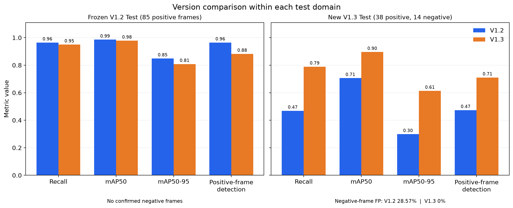

*图 9-5 V1.2 与 V1.3 在新旧测试域的表现对照*

#### 9.3.6 ONNX 导出与 LoongArch 部署

正式 V1.2 为 person-only FP32 ONNX，opset 17，输入 `[1,3,128,128]`、输出 `[1,5,16]`，约 402,057 个参数，文件 1,620,685 B；SHA-256 为 `cb3defedb3ac01006d4caa5312c21d4a674e5a808e885067f2bc67e8f822f89c`。在 85 张 Frozen Test 上，PyTorch 与 ONNX 原始输出的最大绝对差为 0.00036621、平均绝对差为 0.00000982，均满足 `atol=5e-4`；逐图 `score≥0.25` 的候选框数量一致。

板端通过 ONNX Runtime `CPUExecutionProvider` 运行 V1.2 模型；`deploy/longpet.service` 指向 `tinyissimo-person-128-longpet-v1.onnx`。训练与部署流程包括 COCO 通用训练、产品域微调、Frozen Test、ONNX 一致性检查、LoongArch 部署、板端测量及 Detector+Tracker 调度优化。

### 9.4 Detector + Tracker 持续人物感知

正式 V1.2 的 detector-only 板端测量显示，KWS 并发时 CNN 平均推理约 1,269 ms，检测吞吐约 0.738 FPS。Vision V2.0 使用 Tinyissimo 低频搜索、目标重获和周期纠偏，并由 Sparse Lucas–Kanade Tracker 在检测间隙更新人物框。工作线程只处理摄像头最新帧，避免旧帧排队。

| V1.2 detector-only 板端工况 | 预热 / 测量帧 | 平均推理 | P95 推理 | 平均总链路 | 有效检测吞吐 |
| --- | ---: | ---: | ---: | ---: | ---: |
| Vision 基本独占（主程序停止） | 10 / 65 | 735.26 ms | 759.04 ms | 768.11 ms | 1.285 FPS |
| KWS 并发 | 10 / 33 | 1,268.86 ms | 1,374.13 ms | 1,322.83 ms | 0.738 FPS |

*表 9-6 正式 V1.2 detector-only 实机测量*

总链路包含 JPEG 解码、预处理、CNN 推理和后处理；两组 RSS 分别为 41,296/41,920 kB，`LongPetVisionBench` 进程 CPU 分别为 90.29%/55.91%。KWS 并发使单核资源竞争加剧。

```mermaid
flowchart LR
    A[Camera latest frame] --> B[SEARCHING]
    B -->|Tinyissimo 检测| C[DETECTED]
    C --> D[Sparse LK 跟踪]
    D --> E[TRACKING]
    E -->|周期纠偏| F[Tinyissimo]
    F --> E
    E -->|跟踪失败| G[LOST]
    G -->|Tinyissimo 重获| H[REACQUIRED]
    H --> D
```

*图 9-6 Detector 与 Tracker 的状态流*

跟踪特征不足、越界或一致性检查失败时转入目标重搜。

| V2.0 Detector+Tracker 实机工况 | CNN 平均推理 | Detector 总链路 | Detector 实际触发 | 目标位置更新 |
| --- | ---: | ---: | ---: | ---: |
| KWS 正常运行，单人物 | 992.33 ms | 1,030.19 ms | 0.121 Hz | **8.75 Hz** |
| 真人持续走动，单人物 | 993.922 ms | 1,028.81 ms | 0.247 Hz | **7.23 Hz** |

*表 9-7 V2.0 板端感知调度*

通过低频 Detector 与高频 Tracker 协同，单人物测试中的目标观测频率达到约 7～9 Hz；真人走动时，6 次跟踪失败均由 Detector 重获。这使受限算力平台也能够持续向上层提供人物位置。

CNN 周期纠偏与 Tracker 目前在同一工作线程同步执行，CNN 推理期间目标更新暂停，结束后继续处理最新帧。`TargetObservation` 的时间戳和 freshness 约束上层消费，避免无限使用旧目标。

### 9.5 TargetObservation 与产品视觉接口

`TargetObservation` 是 Detector 与 Tracker 的统一服务级感知接口，至少包含人物 bbox、归一化中心、`SEARCHING/DETECTED/TRACKING/CORRECTED/LOST/REACQUIRED` 状态、帧序号、采集时间戳、发布时间戳及 age/freshness。家属端 AI 视野、自动跟头和人物跟随消费同一观测；上层无需知道该 bbox 来自 Tinyissimo 检测还是 Sparse LK 跟踪。目标过期、丢失或摄像头故障时，控制策略停止继续使用旧框；是否运动仍由第 11 章的模式、租约与安全约束裁决。
家属端 AI 视野在授权会话中接收共享摄像头已有的 JPEG 与归一化 bbox/视觉元数据，由 Family Desktop 本地绘框。板端无需为叠框再次执行 JPEG 解码、绘制和编码，避免增加 2K0300 的图像处理负担。家属端退出 AI 视野只释放远程查看资源，本地 Vision 继续运行；视频通话则按媒体资源仲裁暂停或重置 Vision。

### 9.6 并发资源、性能验证与当前边界

端侧视觉以 Detector+Tracker 调度在有限算力下保持目标位置更新，并通过最新帧处理与观测时效避免旧画面积压。表 9-6 测量连续 CNN 检测吞吐，表 9-7 测量协同后的目标更新频率。Vision 与 KWS 在单核上竞争 CPU；经过kws的vad检测参数调整后，全部业务开启时，实机测试加载期 CPU 短时约 100%、随后维持在约 40%～80%，内存约 0.18 GB。cpu负载和内存资源占用健康，长期运行安全稳定。

后续验证重点包括无人画面误报、困难场景漏检、多人关联、完全遮挡、快速尺度变化，以及 CNN 同步推理造成的短时更新空档。V1.2 冻结集没有确认的纯无人样本，困难场景未检出时 Tracker 也无法建立目标。V1.3 已改善新域表现，后续训练需兼顾原有场景。

## 10 接口与数据设计

LongPet 通过业务 Service、统一数据契约和设备适配层连接老人端、家属端、AI 能力与运动 MCU。页面和外部请求提交操作意图，业务层完成校验，设备与服务反馈执行结果。这一设计明确了数据归属和控制权限，也便于在网络、设备或算法状态变化时保持一致的用户反馈。本章说明主要接口、数据生命周期和异常处理；附录 B 汇总协议字段与实现索引。

### 10.1 系统接口总体设计与边界

系统接口分为七类：板内 C++ Service/Port 与模型契约，KWS/音视频进程间接口，主控—MCU UART 接口，LongPet—Family Desktop HTTP/WebSocket 接口，AI/天气第三方 HTTP 接口，相机/音频/显示/触摸设备接口，以及 SQLite/配置/模型文件接口。各类接口分别定义数据所有者、有效时限和失败反馈，支撑多端协同与故障定位。

```mermaid
flowchart LR
    UI[Qt 页面] --> APP[Controller 与 Service]
    FAMILY[Family Desktop] -->|HTTP 控制面| APP
    FAMILY <-->|WebSocket 画面 音频 远控| MEDIA[媒体与远控适配器]
    APP -->|业务读写| DATA[(SQLite 与配置)]
    APP -->|Provider 请求| CLOUD[AI 与天气服务]
    APP -->|设备能力| DEV[Camera Audio Display Input]
    APP -->|运动意图| UART[UART 协议] --> MCU[Motion MCU]
    MCU -->|STATUS 故障状态| UART
```

*图 10-1 系统接口全景*

HTTP 处理业务控制，WebSocket 承载实时流，UART 将主控意图交给独立 MCU；板内 Service 统一解释外部反馈。

数据流与控制流分别承载：AI 视野传输 JPEG 画面和带时效的人物观测，人物跟随由策略层独立决定是否生成运动命令；家属端控制与画面使用不同通道，使 STOP 不受画面传输排队影响；通话由 HTTP 管理呼叫状态和会话参数，由独立连接传输双向 JPEG/PCM。这样既复用感知和媒体资源，也保持控制路径清晰。

### 10.2 LongPet—运动 MCU 串口接口

主控通过 115200 baud、8N1、无流控的双向 UART 与 Motion MCU 通信。`MotionService` 生成模式、底盘、头部和视觉目标意图，`EspSerialAdapter` 完成串口写入与状态解析；MCU 依据当前模式、参数和本机安全状态执行或拒绝命令。这使应用决策与底层运动保护各司其职。行式 ASCII 协议支持 `MODE`、`MOVE`、`HEAD`、`TARGET`、`FOLLOW_MOVE`、`STOP`、`PING` 和 `STATUS`；当前主程序使用除 `PING` 外的上述命令，`PING` 保留为 MCU 侧链路探测能力。

`TARGET` 携带人物相对画面中心的偏差和框面积，用于 `HEAD_ONLY/FOLLOW` 模式的头部目标；`FOLLOW_MOVE` 在 `FOLLOW` 模式下单独表达底盘意图，避免将视觉框面积直接当作运动指令。`PING` 仅探测一般链路，不续租移动或目标。`STATUS` 反馈 mode、motion、stop reason、fault、target、servo，以及可选的 head_offset、imu；主控结合状态时效判断 MCU 是否在线。非法命令被拒绝，写入失败、状态过期或故障触发上层退出控制，最终执行与停车仍由 MCU 裁决。命令参数见附录 B.2，安全时效见第 11 章。

### 10.3 LongPet—Family Desktop 接口

设备端 `FamilyLinkController` 在 `/api/v1` 提供状态、设置、提醒和通话快照等 HTTP/JSON 接口，并为 AI 视野和远控签发短时会话。家属端由 Electron 主进程 HTTP Adapter 发起业务请求，Renderer 通过 preload/IPC 获取结果；连接信息仅返回 `hasToken` 摘要。Token 在连接弹窗输入期间短暂经过 Renderer，后续请求由主进程持有凭据；输入状态在连接信息更新或重新打开弹窗时清空。启用 FamilyLink 对外监听必须配置 Bearer Token，当前部署范围为受控局域网。

```mermaid
flowchart LR
    R[Family Desktop Renderer] --> IPC[preload / IPC]
    IPC --> MAIN[主进程 FamilyLink HTTP Adapter]
    MAIN -->|REST 状态 设置 提醒 模式 通话信令 会话申请| FL[LongPet FamilyLink]
    FL --> S[既有业务 Service]
    R <-->|AI 视野 WS: JPEG + vision_target| V[视觉流 Adapter]
    R <-->|通话 WS: JPEG + PCM + Control| C[媒体 Adapter]
    R <-->|远控 WS: chassis head stop + status| M[Motion 控制 Adapter]
```

*图 10-2 FamilyLink 控制面与三个实时通道*

流连接先通过 HTTP 取得临时会话，再用一次性凭据鉴权。

远程提醒和设置复用本地业务 Service 的校验与 revision 冲突检查，以设备确认结果更新界面。AI 视野复用摄像头帧；Vision 产生有效观测时同步发送 `vision_target`，观测失效或断流时隐藏人物框。人工远控按短周期刷新底盘命令，松开时发送 STOP，服务和 MCU 的租约超时机制进一步保障断连停车。音视频通话以 `callId + expectedRevision` 隔离新旧呼叫，并以 `connected && mediaReady` 确认媒体接通。接口路径、消息及错误见附录 B.3。

### 10.4 AI Provider 与第三方服务接口

语音 ASR、LLM、TTS 分别通过独立 Port 接入：ASR 将音频转为文字，LLM 生成文本、流式片段或受限工具调用，TTS 将文字合成为音频。`AiProviderFactory` 可为三项能力分别选择 Provider、模型和凭据，为部署调整与供应商替换留出空间。现有实现包括 OpenAI-compatible 接口和阿里云接口：兼容接口使用 `audio/transcriptions`、`chat/completions`、`audio/speech`；阿里云 ASR/TTS 使用原生多模态接口，LLM 使用兼容协议。`ProviderHttpClient` 统一处理超时、取消和 HTTP 错误，并通过 session ID 将结果关联到当前会话。自建 LoongArch AI Server 可按同一契约接入，属于后续扩展方向。

天气能力使用独立的 `WeatherProviderPort`。`QWeatherProvider` 向配置的专属 Host 请求当前天气，通过 `X-QW-Api-Key` 请求头传递密钥；`WeatherService` 管理缓存、时效、重试及状态栏和语音所需的数据。第三方请求失败时，界面按快照时效展示或标记不可用，不影响本地持久业务数据。接口方法、字段和错误归属见附录 B.4。

### 10.5 摄像头、音频、显示与平台硬件接口

主程序把相机视为 `CameraSourcePort`，由一个 `CameraCaptureAdapter` 管理采集进程、最新 JPEG 帧和多消费者 `acquire/release`；Vision、AI 视野和视频通话共用该来源。音频由 `VoiceAudioPort`、通话媒体 Port 及 `MediaSessionCoordinator` 协调，KWS 暂停被确认后才允许语音或通话开启麦克风；Adapter 使用平台媒体进程接入 ALSA/GStreamer。显示与触摸由 Qt 平台插件承接，状态和页面只消费抽象事件；系统状态服务汇聚设备可用性。串口设备访问仅在 Motion Adapter 中实现。

设备名、模型路径和 Qt 平台参数由部署配置注入，便于适配不同板端环境。设备缺失时，接口返回明确的能力不可用或故障状态，页面据此显示真实状态。硬件连接和系统软件依赖分别见第 5、6 章，配置解析规则见附录 B.6。

### 10.6 本地业务数据与持久化

`DatabaseManager` 使用 SQLite 版本化 schema。默认数据库文件位于 Qt `AppLocalDataLocation` 下的 `longpet.db`，可由 `LONGPET_DATABASE_PATH` 或板端 service 配置覆盖。当前 schema v1 包含 `schema_meta`、`reminders`、`reminder_events`、`care_events`、`settings` 五张表，持久保存提醒、执行记录、关怀事件和用户设置。网络、电源、通话、视觉、天气与运动状态在运行期管理，减少无必要的持久写入，也让业务记录与瞬时状态的用途更清楚。

| 数据域 | 主要内容 | 生命周期 | 写入来源 | 主要读取方 |
| --- | --- | --- | --- | --- |
| 提醒与事件 | 提醒草稿、revision、触发/完成记录 | SQLite 持久化 | ReminderService 经 Repository | 本地页面、FamilyLink、照护汇总、语音工具 |
| 关怀事件 | 饮水、活动、交互事件及来源 | SQLite 持久化 | CareService 经 Repository | 今日关怀、本地与家属端状态 |
| 用户设置 | 音量、亮度、宠物风格等键值 | SQLite 持久化 | SettingsService 经 Repository | 本地 UI、FamilyLink、硬件应用链 |
| AI 与天气配置 | Provider、模型、请求参数及密钥 | 独立配置文件/环境覆盖 | 部署配置 | 组合根与 Provider 工厂 |
| 会话与观测 | AI 历史、通话、Vision、Motion、天气快照 | 进程内或当前连接；重启不继承 | 对应 Service/Adapter | 当前页面与会话消费者 |

*表 10-1 数据所有权与生命周期*

`care_events` 按已接入的业务入口记录活动或交互，为今日关怀及后续能力扩展提供统一事件基础。

```mermaid
flowchart LR
    INTENT[本地 家属 语音意图] --> SERVICE[业务 Service 校验]
    SERVICE --> REPO[Repository] --> SQLITE[(SQLite 持久业务数据)]
    CONFIG[受限 INI 与环境配置] --> START[Application 启动时注入]
    START --> RUNTIME[会话 天气 视觉 运动运行态]
    SERVICE --> RUNTIME
    RUNTIME -- 进程退出后不继承 --> END[状态结束]
```

*图 10-3 持久业务数据、启动配置与运行期状态的不同生命周期*

### 10.7 AI 对话、记忆与敏感数据

`VoiceInteractionService` 以进程内 `user/assistant` 文本对提供有限轮次的对话上下文。`historyTurns` 默认 4 轮，可配置为 0—20 轮；完整会话在用户输入和助手回复均非空时追加一对，并裁剪到最多 `2 × historyTurns` 条。请求临时组合 system prompt、有效天气快照、历史和本轮输入；清空历史或重启后上下文结束。`VoiceToolRegistry` 可将经过工具校验的提醒操作写入业务数据，而对话文本仍按会话上下文管理。这种区分使语音交互具备连续性，同时控制保留范围。

音频、对话、第三方请求和家庭状态均按敏感信息处理。Provider 密钥与 FamilyLink 长期凭据通过受控配置进入相应进程；文档示例仅使用 `<API_KEY>`、`<TOKEN>`、`<BASE_URL>` 等脱敏示例参数。对话历史不写入当前 SQLite，日志、网络访问和配置文件权限仍需按部署要求管理。

### 10.8 视觉观测、训练数据与模型元数据

Camera 帧携带 JPEG、sequence、timestamp 与旋转信息；`VisionService` 将 Detector/Tracker 结果统一为 `TargetObservation`，提供目标存在性、新鲜度、状态、时间戳、画面尺寸、位置、置信度和诊断信息。同一观测同时服务于家属端 AI 视野、自动跟头和人物跟随，减少重复推理和接口转换。家属端将可绘制目标序列化为 `[0,1]` 范围内的 `x/y/w/h`；目标缺失或过期时发送 `bbox:null`。运动策略直接消费服务级观测，并由 `MotionService` 形成受控动作。

```mermaid
flowchart LR
    FRAME[CameraFrame JPEG sequence timestamp] --> DT[Detector / Tracker]
    DT --> OBS[TargetObservation present fresh age bbox state]
    OBS --> VIEW[AI 视野序列化与绘框]
    OBS --> HEAD[自动跟头策略]
    OBS --> FOLLOW[人物跟随策略]
    FOLLOW --> MOTION[MotionService]
    HEAD --> MOTION
```

*图 10-4 视觉数据契约的消费者*

训练样本、模型权重和模型元数据是另一类文件资产；运行期观测不写入业务 SQLite，训练过程见第 9 章。字段表见附录 B.5。

### 10.9 配置管理、令牌与隐私保护

配置按运行参数、敏感凭据及模型/设备路径管理。AI 与天气 INI 由对应 Repository 读取，环境变量可覆盖 Provider、模型、超时和密钥；FamilyLink 监听地址、端口、Token，以及数据库和视觉模型路径也可按部署环境配置。板端 `longpet.service` 指定运行用户、设备组与必要环境，凭据通过受限配置或 service drop-in 注入。家属端后续 HTTP 请求由 Electron 主进程持有 Bearer Token，连接信息仅向 Renderer 回传 `hasToken`；连接弹窗输入期间 Token 短暂存在于 Renderer，输入状态在连接信息更新或重新打开弹窗时清空。当前采用配置式连接，自动配对属于后续扩展。

视觉、通话媒体与远控使用用途隔离的短时令牌，客户端获取令牌后在相应 WebSocket 会话的鉴权消息中传递。当前 HTTP/WS 链路配合接口鉴权，面向受控局域网部署；跨不可信网络部署时需增加 HTTPS/WSS 或可信中转。附录 B.6 列出配置项和抽象路径，不包含实际账号或密钥。

### 10.10 数据一致性、失效与降级处理

系统按数据时效和执行确认更新产品状态。提醒与设置通过 revision 处理并发修改；语音以 session ID 过滤取消后的 ASR/LLM/TTS 回调；天气快照记录更新时间并标记 stale；视觉目标通过 `present/fresh/ageMs` 和状态判定有效性；家属端在断连后清除在线标识和旧框，并区分 HTTP 401 与网络不可达；通话以 `callId/revision/mediaReady` 确认信令与媒体状态；MotionService 同时检查 UART 和 MCU 状态，失联时撤销控制权。这套规则降低了旧结果误用、重复写入和失联控制的风险。

```mermaid
flowchart LR
    INPUT[外部结果或用户命令] --> CHECK{身份 版本 时效 能力有效?}
    CHECK -->|是| APPLY[更新当前状态或执行受控动作]
    CHECK -->|否| REJECT[拒绝 丢弃旧回调 或标记不可用]
    REJECT --> UI[向本地或家属端反馈]
    APPLY --> UI
```

*图 10-5 接口结果进入产品状态前的有效性门控*

不同接口的具体错误与恢复方式见附录 B.7；该图不替代第 11 章的 MCU 失效安全设计。

## 11 运动控制与系统安全设计

### 11.1 设计目标与安全原则

LongPet 是具备摄像头、网络连接和可运动底盘的适老产品。运动控制的目标不是让底盘“能动”，而是使它**受控、安全、可恢复地动**。系统遵循失效优先停车原则：视觉误检、远控端失焦、串口断线或主控任务阻塞时，底盘不得持续执行上一条运动命令。系统在命令超时、故障、模式冲突或控制源丢失时停车；恢复运动须重新满足模式、命令和时效条件。通信在线与运动授权分别校验。

### 11.2 双处理器运动控制架构

运动安全采用**上层策略约束 + MCU 独立执行保护**。龙芯 2K0300 主控负责远控接入、视觉感知、运动策略和控制权仲裁。ESP32-S3 运动 MCU 负责模式与命令校验、时效检查、传感器故障处理和输出撤销。MCU 与电机直接相连，即使 Linux 应用层失去响应，也能独立停止底盘。

```mermaid
flowchart LR
    A[家属端按住操控 / 模式选择] --> B[LoongArch 主控 LongPet<br/>会话鉴权、控制权仲裁]
    V[Vision 目标观测] --> C[自动视觉运动策略<br/>目标时效、头身与距离决策]
    C --> D[MotionService<br/>模式与命令门控]
    B --> D
    D --> E[UART Motion Protocol V2]
    E --> F[ESP32-S3<br/>严格解析、模式白名单、独立超时、故障锁存]
    F --> G[头部舵机]
    F --> H[TB6612 驱动 / 四轮底盘]
    I[编码器 / IMU] --> F
    F -- STATUS / FAULT --> D
    D -- 状态 / 拒绝原因 --> B
```

*图 11-1 双处理器分层控制与安全边界*

网络和视觉侧通过 MCU 控制电机；主控失效时，MCU 的租约与链路超时仍能使持续底盘动作停止。

### 11.3 运动执行链路

`MotionService` 集中管理串口、家属端会话、视觉模式和 MCU 状态。`AutomaticHeadTrackingService` 将 `TargetObservation` 的画面偏差转为 `TARGET`；人物跟随时，再结合物理头偏和归一化人物框高度形成 `FOLLOW_MOVE`。Family Desktop 通过 FamilyLink 申请远控会话并发送底盘、头部控制意图。命令经 `MotionService` 和 UART Motion Protocol V2 到达 ESP32-S3，由 MCU 控制舵机、TB6612 四轮麦克纳姆底盘、编码器 PID 与 IMU 航向反馈，并通过双向 UART 返回 `STATUS` 和故障信息。

MCU 启动时执行 `BeginSafe`：先将两组 TB6612 的 STBY 置低，再初始化方向和 PWM 输出，初始模式为 `SAFE`。头部位置受软件脉宽限制；`HEAD` 与 `TARGET` 使用同一左右方向映射。自动跟头设置死区和单次转动幅度上限。

### 11.4 控制模式与权限

MCU 设置 `SAFE`、`HEAD_ONLY`、`MANUAL`、`FOLLOW` 四种模式。切换模式时先停车，清除底盘动作、手动与跟随租约、目标有效性和转向瞬态，再进入新模式。重复发送当前 `MODE` 不清除现有租约；模式切换也不解除故障锁存。

| 模式 | 主要控制来源 | 允许动作 | 禁止动作 | 典型退出或停车条件 |
| --- | --- | --- | --- | --- |
| `SAFE` | 主控安全管理 | `MODE`、`STOP`、`PING`、`STATUS` | 所有主动底盘及头部命令 | 上电保持停止；显式切换模式前仍不运动 |
| `HEAD_ONLY` | 自动头部跟踪 | `TARGET` 修正头部及通用命令 | `MOVE`、`FOLLOW_MOVE`；目标帧驱动轮组 | 目标丢失/过期、模式切换、故障 |
| `MANUAL` | 已获控制权的家属端 | `HEAD`；持续刷新的 `MOVE` 驱动底盘；通用命令 | `TARGET`、`FOLLOW_MOVE` | 松开/退出主动 `STOP`，链路或 `MOVE` 租约到期、模式切换、故障 |
| `FOLLOW` | LongPet 视觉跟随策略 | `TARGET` 跟头；独立续租的 `FOLLOW_MOVE` 前进、原地旋转或停止；通用命令 | 手动 `MOVE`；`FOLLOW_MOVE` 后退、平移及弧线动作 | 目标丢失/过期、跟随租约或链路到期、模式切换、故障 |

*表 11-1 MCU 模式与权限矩阵*

各模式均接受诊断、停车和模式命令；`STOP` 立即撤销底盘驱动。协议保留 `SHIFT_LEFT`/`SHIFT_RIGHT` 解析，但当前版本和家属端均未开放左右平移。旧三整数目标格式仅兼容 `TARGET` 输入，不触发按目标面积自动驱动底盘。

### 11.5 UART 协议与输入校验

主控与 MCU 使用逐行 ASCII 串口协议。MCU 使用固定 64 字节行缓冲，限制每次主循环的读取量，并在收到完整行后解析。非可打印 ASCII、控制字符和超长行整行丢弃；未知命令、错误模式、额外字段、整数溢出及越界参数均被拒绝。解析仅接受约定的空格分隔，速度、舵机步长和目标几何量不得越界。

只有格式正确且当前模式允许的完整命令才刷新通用链路时戳；非法输入既不执行，也不刷新运动或目标时效。主控同样校验命令并检查 `STATUS`。V1.3 测试中，半包、超长行、乱码、特殊关键词组合和越界参数复测均通过，未再复现此前的乱码卡死。

### 11.6 多级时效与运动租约

固件分别记录通用链路、手动动作、自动跟随动作和视觉目标的时戳。四项超时当前均为 500 ms，但由各自的有效输入独立刷新。

| 安全时钟 | 仅由什么刷新 | 到期后的含义 |
| --- | --- | --- |
| General Link | 任意被接受的合法命令，包括 `PING`、`STATUS` | 活动底盘无有效链路，停车 |
| MANUAL Motion Lease | `MANUAL` 中合法 `MOVE` | 手动动作不再被持续授权，停车 |
| FOLLOW Motion Lease | `FOLLOW` 中合法、非停止的 `FOLLOW_MOVE` | 自动底盘动作不再被新策略结果授权，停车 |
| TARGET Freshness | `HEAD_ONLY`/`FOLLOW` 中合法目标帧 | 当前有效人物目标过期，清目标并停车 |

*表 11-2 四类独立时效约束*

`PING`/`STATUS` 仅续通用链路，`TARGET` 不续跟随动作租约；`FOLLOW_MOVE STOP` 立即停车且不建立新租约。目标过期检查仅针对已取得的有效目标。活动底盘完全失联时通常记录 `LINK_TIMEOUT`；链路仍由 `PING` 保持、动作却未刷新时，记录 `MANUAL_COMMAND_TIMEOUT` 或 `FOLLOW_COMMAND_TIMEOUT`。两种情况均停车。

家属端按住底盘按钮时周期发送控制意图，LongPet 仅在远控租约有效时重发 `MOVE`。视觉侧须对新目标观测重新检查时效、模式、头偏和距离，才发送下一条 `FOLLOW_MOVE`。UART 断线时主控尝试停车；命令无法送达时由 MCU 超时停车。

### 11.7 统一停车、故障锁存与恢复

停止请求、模式切换、目标丢失、链路或动作租约到期属于可恢复停车。IMU 初始化或运行时读取失败、活动运动控制周期超限、固件定角转向超时则触发故障锁存。控制周期目标为 100 ms；活动运动间隔超过 250 ms 时，固件报 `CONTROL_OVERRUN` 并停车。定角转向有固件超时保护，但对外 `MOVE` 尚未开放定角转向指令。

```mermaid
flowchart TD
    A[STOP / 切模式 / 目标丢失 / 链路或租约超时] --> S[setStopped]
    B[IMU 异常 / 控制周期超限 / 定角转向超时] --> L[故障锁存并记录首次 FAULT]
    L --> S
    S --> R[Run::Stop]
    R --> O[STBY LOW → PWM 归零、方向撤销<br/>编码器计数、转向与 PID 瞬态清理]
    L --> X[拒绝后续 MOVE / TARGET / 主动 HEAD<br/>直至 MCU 复位或重新上电]
```

*图 11-2 统一停车与故障锁存路径*

`setStopped` 清除底盘模式、速度及手动、跟随租约，并调用 `Run::Stop`；目标有效位由目标丢失、故障或模式切换路径清除。`Run::Stop` 先撤销 TB6612 STBY，再将 PWM 置零、方向脚置低，清除编码器计数、转向与 PID 瞬态；头部舵机保持当前位置。故障锁存后，`PING`、`STATUS`、`STOP` 和 `MODE` 仍可用于诊断或停车，恢复主动控制须复位或重新上电并排查故障。

`STATUS` 只有一个 `stopReason` 字段。锁存后发送 `STOP` 或切换模式可能覆盖最近的停车原因，但 `fault=1` 保留；排障时应查看首次 `[FAULT]` 记录。

### 11.8 家庭远控与控制权仲裁

Family Desktop 发起远控会话，LongPet 校验会话身份、串口状态、MCU 在线状态及故障状态，同一时间只允许一名远控控制者。进入 `MANUAL` 前，`MotionService` 预留手动控制权、释放自动控制，再执行 `STOP → MODE MANUAL → STATUS`；退出时执行 `STOP → MODE SAFE`。MCU 失联、模式意外变化、故障或串口断线时，主控撤销控制权。长期 Bearer Token 保留在 Electron 主进程，渲染进程使用短时运动会话令牌。当前明文 HTTP/WS 控制端口仅用于局域网，不应直接暴露公网。

底盘控制按住时持续刷新，按钮或键盘释放、页面失焦、隐藏、退出或断线时，家属端发送停止命令并停止刷新；LongPet 远控租约和 MCU 手动租约提供超时停车。头部控制按住时发送有限步进，松开后保持当前位置。界面仅在 MCU 处于 `MANUAL` 且无故障时开放操控。

人工遥控优先于自动视觉运动，视频通话也会暂停相关自动运动。远控或通话结束后，人物跟随须由用户重新开启；头部自动跟踪可在开关有效、视觉恢复且安全条件满足时重新进入 `HEAD_ONLY`，并等待新目标。

### 11.9 视觉跟随安全控制

`HEAD_ONLY` 模式下，`TARGET` 只驱动头部舵机，不驱动轮组。`FOLLOW` 模式下，`TARGET` 更新头部及目标时效；目标稳定、Motion 状态有效时，LongPet 读取 MCU 报告的物理 `head_offset`，判断是否需要原地转动机身，再根据人物框归一化高度的 FAR/GOOD/NEAR 分类决定是否前进。画面中心偏差 `dx` 不直接用于底盘驱动。

头身对齐且分类为 FAR 时，底盘低速前进；GOOD 或 NEAR 时停车，不自动后退。头偏方向变化时先停车并重新确认；目标丢失或过期时停车、清目标，重获后重新确认稳定性。MCU 仅在 `FOLLOW` 模式接受 `FOLLOW_MOVE`，且拒绝后退、平移和弧线动作。视觉观测中断时，上层停止续租，由 MCU 在租约到期后停车。V1.3 测试覆盖人物跟随硬件闭环、距离阈值、独立租约与失联停车，包括台架、悬空轮组和低速落地验证。人物框高度仅是距离代理；系统尚无 SLAM、自主导航及障碍、悬崖检测能力。

### 11.10 安全设计验证与证据追踪

《LongPet 产品运动功能测试报告_2026-09-13_V1.3》附录 A 共列 58 项：56 项通过，左右平移两项（15、16 号）主动暂缓，待验证项为 0。表 11-3 列出运动安全设计与测试编号的对应关系。

| 安全设计机制 | V1.3 测试编号 | 当前结论 |
| --- | --- | --- |
| 上电默认 `SAFE`、底盘不自启 | 1–2 | 通过 |
| 半包、超长行、乱码与异常参数拒绝；压力复测未再卡死 | 23–27（含 25 号压力复测） | 通过 |
| `SAFE` 拒绝 `MOVE`；`HEAD_ONLY` 允许跟头但轮组阻断 | 28–30 | 通过 |
| 模式切换前停车并清旧运动/租约 | 32、55 | 通过 |
| 运动中 `STOP` 与随后重新合法控制 | 33–34 | 通过 |
| 单条 `MOVE` 后静默，通用链路到期停车 | 36 | 通过 |
| `PING`/`STATUS` 不续 MANUAL `MOVE` 租约 | 37 | 通过 |
| UART 断开停车及重连后的受控恢复 | 38–39、56–57 | 通过 |
| IMU 故障、控制周期超限锁存，拒绝动作，复位后恢复 | 40–43 | 通过 |
| 目标过期或丢失清目标；`TARGET` 不直接驱动 FOLLOW 底盘 | 46–48 | 通过 |
| 非 FOLLOW 模式拒绝 `FOLLOW_MOVE`；FOLLOW 禁止后退/平移 | 49、54 | 通过 |
| `TARGET`、`PING`/`STATUS` 不续 FOLLOW 独立租约 | 50–51 | 通过 |
| `FOLLOW_MOVE STOP` 立即撤销运动并清租约 | 53 | 通过 |
| V2.3 人物跟随硬件闭环及距离阈值 | 报告正文 5.5、5.6；附录 A 48–58 | 通过 |

*表 11-3 安全设计与 V1.3 测试证据追踪*

测试编号见报告附录 A；人物跟随硬件闭环还对应报告正文 5.5 的实机结果。

### 11.11 版本边界与后续优化

`SHIFT_LEFT`/`SHIFT_RIGHT` 横向平移暂缓交付。`speed` 是内部控制量，尚未标定为 cm/s；精确速度、转角误差、停车距离及 `stopReason` 的诊断可读性仍需改进。

`Run::Stop` 将 TB6612 的 STBY 置低，使电机进入高阻自由滑行状态；实际停车距离受速度、惯性、地面和负载影响。现阶段运动功能须在有人看护的低速环境中使用，人物框高度不能充当碰撞检测。后续应增加物理急停、驱动默认禁能、限流与供电保护、电源切断路径、外部 STBY 下拉及障碍、悬崖感知，并量化速度、转角和停距。

## 12 典型业务流程与系统协同

本章从老人和家属的实际操作出发，展示提醒、语音、视觉、通话和运动如何在同一设备上协同。每条流程都包含请求处理、结果反馈和异常退出，使用户看到的状态与设备真实状态保持一致。具体能力、接口和运动保护分别见第 8、10、11 章。

### 12.1 业务流程设计原则与统一闭环

老人触摸、家属操作、语音和环境事件都进入统一业务入口。设备先检查能力状态，业务服务再校验请求并处理数据；AI、媒体、视觉和运动按各自权限执行。页面、表情、语音和家属端依据业务结果或 MCU 状态更新，拒绝、超时和失联也会及时结束等待。可选能力故障按模块降级，本地提醒等独立业务继续运行；数据库初始化失败时则明确停止启动。

```mermaid
flowchart TD
    I[用户或环境输入] --> S[输入与能力状态识别]
    S --> E[业务入口：Controller / Dispatcher / FamilyLink / Vision]
    E --> B[Application 与业务 Service：校验、授权、记录]
    B --> C{能力路径}
    C --> A[AI 与本地业务]
    C --> M[媒体与共享设备]
    C --> P[视觉策略与 MotionService]
    A --> R[结果、事件或错误]
    M --> R
    P --> U[UART 与 Motion MCU] --> R
    R --> V[核对 Session、版本、时效及执行状态]
    V --> F[UI / 表情 / TTS / Family Desktop / STATUS]
    F --> X[结束或进入下一状态]
    V -->|无效或过期| D[丢弃或降级并提示] --> X
```

*图 12-1 LongPet 统一业务闭环*

声音、画面、提醒记录和 `TargetObservation` 提供业务事实；经校验的服务与策略形成控制意图。底盘动作还需 MotionService 与 MCU 确认，避免把视觉观测或已发送命令直接当作执行结果。

所有流程遵循相同的状态规则：成功与失败均给出可感知反馈；异步结果只作用于当前会话；版本、画面和目标过期后立即失效；人工接管优先于自动运动；执行动作经过 LongPet 与 MCU 两级控制；Camera、Mic、Speaker 按会话获取和释放。外部 Provider 或网络异常时，受影响能力退出当前流程，其他业务保持可用。

### 12.2 提醒与今日关怀业务流程

老人端提醒页、家属端管理和在线语音工具都可发起提醒相关操作，三个入口共用 LongPet 的提醒业务，由设备统一校验、读取、保存和调度。变更经设备确认后，发起端更新结果；版本冲突时提示刷新。到达设定时间后，本机展示提醒，老人确认后写入完成事件并更新今日关怀，家属端读取同一设备摘要。设备时间有效时，已保存提醒由本机独立调度，家属端断开后仍可触发。

```mermaid
flowchart TD
    T[老人触摸] --> R[统一提醒业务校验]
    F[家属端经 FamilyLink] --> R
    V[在线 LLM → 白名单 Tool] --> R
    R -->|有效| DB[本地提醒定义与事件持久化]
    R -->|失败或版本冲突| E[入口显示失败、刷新或重试]
    DB --> TIME[本机时间到达]
    TIME --> SHOW[老人端提醒与待确认状态]
    SHOW --> Q{老人确认完成?}
    Q -->|否| P[保持未完成]
    Q -->|是| C[记录完成事件] --> CARE[今日关怀汇总]
    CARE --> U[本机展示；家属端刷新同源摘要]
```

*图 12-2 三入口统一提醒及关怀闭环*

提醒触发后保持待确认状态，老人确认才计入完成；今日关怀汇总已记录的饮水和提醒事件。语音入口受在线 Provider 状态影响，触摸操作与已保存的本地提醒仍可运行。时间和存储异常见 12.9。

### 12.3 在线 AI 语音交互与工具调用流程

本地 KWS 唤醒或触摸语音入口后，LongPet 建立 Voice Session 并申请音频资源。KWS 暂停确认后开始录音，ASR 转写语音，LLM 根据有限会话上下文生成回答或提出受限工具操作。工具操作经授权和业务校验执行，执行结果回到同一会话，再由文字、TTS 和表情反馈给老人。播放结束后释放音频、恢复 KWS，界面按待机→倾听→思考→说话→待机更新状态。

```mermaid
sequenceDiagram
    actor U as 老人
    participant K as KWS / Mic
    participant V as Voice Session
    participant A as ASR
    participant L as LLM
    participant T as Tool Registry
    participant B as 本地业务 Service
    participant S as TTS / Speaker
    U->>K: 唤醒并说出需求
    K->>V: KWS 事件；暂停监听确认后交出音频
    V-->>U: Listening / 倾听
    V->>A: 当前 Session 的录音
    A-->>V: 识别文本或错误
    V-->>U: Thinking / 思考
    V->>L: 文本与有限上下文
    alt 普通问答
        L-->>V: 回答文本
    else 工具操作
        L-->>V: Tool Call
        V->>T: 校验授权范围与请求内容
        T->>B: 调用获准的本地能力
        B-->>T: 实际执行结果或失败
        T-->>V: Tool Result
        V->>L: 带真实结果继续生成回答
        L-->>V: 最终回答文本
    end
    V->>S: 当前 Session 的合成与播放
    S-->>U: Speaking / 文字与语音反馈
    S-->>V: 播放完成或失败
    V->>K: 释放音频；冷却后恢复 KWS
    V-->>U: Idle / 结果或错误提示
```

*图 12-3 在线语音和 Tool Calling 时序*

工具范围包括提醒创建、查询、按明确对象删除，设备日期时间查询和限定页面导航；具体参数见第 10 章及附录 B。天气回答使用标明时效的设备快照。LLM 通过受限工具调用业务服务，提醒变化可在本地列表和后续触发中查看。

Voice Session 将本轮交互与迟到的 ASR、LLM、TTS 或播放结果隔离。老人取消时，录音、在线请求和播报退出，音频资源释放；KWS 暂停期间仍可通过触摸取消。已由业务服务确认的操作保留实际执行结果，后续播报取消不会改变记录。在线服务失败时会话结束等待并显示原因；合成或播放失败时仍可保留文字回答。异常恢复见 12.9。

### 12.4 离线语音交互与能力降级流程

在线语音不可用时，本地 KWS 继续识别已配置的唤醒词和快捷词。命令分发器将有效意图交给本机页面或业务服务，陪伴功能在取得音频资源后播放已配置的本地内容。页面变化、文字提示和播放结果反馈执行状态，动作完成后回到待机。音频资源被占用或内容缺失时，设备说明可用能力并结束等待。离线功能覆盖本地快捷动作和有限陪伴；通话需要网络，紧急页面当前不自动报警。快捷词与动作范围见第 8、9 章。

```mermaid
flowchart TD
    W[本地 KWS 唤醒] --> N{在线 AI 可用?}
    N -->|是| O[当前 Session：ASR → LLM → TTS] --> I[结束并恢复 KWS]
    N -->|否| L[本地命令窗口与已配置关键词]
    L --> Q{快捷动作或陪伴音频?}
    Q -->|快捷| P[本地业务或页面动作] --> I
    Q -->|陪伴| A[申请音频；播放已配置片段] --> I
    Q -->|无效、缺失或忙| E[说明当前可用范围或失败原因] --> I
    N -. 网络和 Provider 恢复后，下一次唤醒重新判定 .-> O
```

*图 12-4 在线与离线语音分流*

离线模式提供本地快捷动作和有限陪伴；网络与 Provider 恢复后，下一次交互重新判断在线能力。已保存提醒始终由本机业务管理。

### 12.5 人物感知、自动跟头与人物跟随流程

Camera 共享画面供多个业务使用，Vision 将人物检测和连续跟踪统一为 `TargetObservation`，提供人物位置、状态与时效。AI 视野显示有效观测；家属启用仅头部或人物跟随模式后，策略结合新鲜目标、当前模式和运动状态生成意图。MotionService 仲裁控制权，Motion MCU 执行动作并回传模式、运动、故障与头部状态。观测、决策、执行和反馈形成闭环，使视觉信息能安全地服务于自动关注和跟随。

```mermaid
flowchart TD
    C[共享 Camera Frame] --> D[Detector + Tracker]
    D --> O[TargetObservation：位置、状态、时效]
    O --> AV[AI 视野：JPEG + 有效人物元数据]
    O --> H{家属选仅头部?}
    H -->|是且有效| HP[头部策略] --> MS[MotionService 模式与状态门控]
    O --> F{家属选人物跟随?}
    F -->|是且有效| FP[目标确认、头身对齐、距离分级] --> MS
    MS -->|受控头部或底盘指令| U[UART → Motion MCU]
    U --> E[头部舵机 / 底盘]
    U -->|STATUS| MS
    MS --> S[模式、头偏、运动与故障反馈]
    S --> FP
    S --> AV
    O -->|丢失或过期| X[旧目标失效；停止跟随意图并清目标]
    X --> MS
```

*图 12-5 单份视觉观测服务三个消费路径*

仅头部模式根据有效目标调整舵机，底盘保持停止；人物跟随先确认目标，再协调头部朝向、机身方向和粗略距离，在控制条件满足时低速靠近，到达合适距离或目标过近时停车。人物框用于距离分级，障碍与悬崖感知不在当前配置中；运动许可规则见第 11 章。

目标丢失、观测过期或 Camera 中断时，跟随转入等待或丢失状态，停止续发移动意图，并将目标与停车状态反馈给家属端；链路异常时 MCU 的独立时效保护继续生效。家属关闭模式或人工接管后，自动控制结束。目标重获后，系统重新确认目标和运动状态再执行获准动作。失效停车路径见 12.9。当前跟随面向有人看护的低速场景，采用受限前进和原地转向。

### 12.6 家属端 AI 视野与人工远程控制流程

家属打开 AI 视野后，Family Desktop 经 FamilyLink 建立监看会话。LongPet 传输共享 Camera 画面和有效的 `TargetObservation` 人物信息；人物框随观测时效更新，过期后隐藏。关闭页面只释放远端监看会话，本地 Vision 可继续运行。本地推理未启用时，家属端仍可看到实时画面，人物框暂不显示。

家属进入人工远控后，Family Desktop 请求独立控制会话。LongPet 校验控制者和 MCU 状态，MotionService 先停止自动动作，再授予人工控制权。按住方向键时，家属端持续刷新运动意图；设备将有效命令送往 MCU，并把实际模式、运动和故障状态回传页面。松键、退出、窗口失焦或断连时停止续租并尽可能发送停车请求，MCU 的时效保护负责处理消息未送达的情形。人工接管结束后，人物跟随由家属显式重开；仅头部模式按条件等待新目标恢复。控制权限与断连处理见第 11 章及 12.9。

```mermaid
flowchart LR
    CAM[Camera] --> LP[LongPet 共享采集与观测]
    LP -->|JPEG / Target Metadata 数据流| FL[FamilyLink] --> VIEW[Family Desktop AI 视野]
    INPUT[家属按住或松开 控制流] --> FD[Family Desktop 远控会话]
    FD -->|运动意图 / 停止与释放| FL --> ARB[LongPet MotionService 仲裁]
    ARB -->|UART 命令| MCU[Motion MCU] --> ACT[电机 / 舵机]
    MCU -->|STATUS 执行状态| ARB -->|运动状态反馈| FL --> FD
```

*图 12-6 AI 视野数据链与远控控制链*

Family Desktop 通过 LongPet 与 Motion MCU 协同；设备确认人工模式、在线且无故障后开放操控。页面以 MCU 回传状态反馈执行和停车结果，监看或控制连接中断时清除旧画面和可控状态。

### 12.7 音视频通话与媒体资源生命周期

家属可发起语音或视频呼叫，老人可从设备发起视频呼叫。信令建立独立呼叫会话，并向两端展示来电、外呼等待和接听状态；设备发起的呼叫可由家属接听、拒绝，等待期间也可取消。通话协调音频所有权，确认 KWS 暂停后，按模式启用 Mic、Speaker 和共享 Camera。媒体就绪后两端显示“已接通”。任一端挂断或媒体断连时，双方更新结束状态，设备释放媒体资源并按条件恢复本地能力。会话标识和版本用于隔离过期操作；信令字段见第 10 章及附录 B。

```mermaid
stateDiagram-v2
    [*] --> 待机
    待机 --> 来电提示或外呼等待: 家属或老人发起
    来电提示或外呼等待 --> 媒体准备: 提示完成或接听
    来电提示或外呼等待 --> 结束: 拒绝或取消
    媒体准备 --> 已接通: 音频与所需画面就绪
    媒体准备 --> 失败: 权限、占用或连接故障
    已接通 --> 结束: 任一端挂断
    已接通 --> 失败: 媒体断连
    结束 --> 待机: 释放资源
    失败 --> 待机: 释放资源并提示
```

*图 12-7 通话会话与资源生命周期*

通话期间暂停 Vision 推理和仅头部自动控制，关闭人物跟随；视频复用共享相机。结束时释放 Camera 和音频，再恢复 KWS；Vision 等待新观测，仅头部模式按条件恢复，人物跟随由家属重新启用。异常断线按相同资源释放流程处理，并向两端反馈状态。

### 12.8 多功能并发、资源占用与控制权仲裁

设备端统一管理共享资源和控制权。Camera 可向多个业务提供同一采集源，通话期间暂停 Vision 推理；Mic/Speaker 通过音频所有权协调，KWS 暂停确认后才让出麦克风；底盘和头部经 MotionService 与 MCU 模式共同约束。表 12-1 列出并发冲突时的优先顺序和恢复条件。

| 冲突场景 | 优先能力 | 被让渡能力 | 恢复条件 | 设计原因 |
| --- | --- | --- | --- | --- |
| 人工远控接管自动跟头/跟随 | 已认证的单一人工控制会话 | 自动运动先停车；跟随关闭 | 人工释放后仅头部可按条件恢复；跟随由家属显式重开 | 保持单一控制者 |
| 通话占用 Mic/Speaker | 已取得音频所有权的通话 | KWS 监听及新的 Voice/陪伴请求 | 通话释放资源并经过恢复冷却，新请求重新判定 | 音频资源按所有权让渡，忙时返回明确提示 |
| 在线 Voice 与本地陪伴 | 当前音频占用者 | 后发会话等待或收到忙提示 | 当前会话取消或播放结束并释放音频 | 避免录放会话交叉 |
| 通话视频与 Vision/AI 视野 | 通话视频取得共享 Camera；Vision 推理暂停 | 自动跟头暂停、人物跟随关闭；AI 视野显示有效数据 | 通话结束后 Vision 重获观测；跟随由家属显式重开 | 共享采集，通话期间暂停自动运动 |
| AI 视野查看与本地 Vision | 共享同一相机帧 | 本地推理按原有状态运行，各自管理消费句柄 | 关闭视野只结束远端会话 | 页面退出不影响本地感知 |
| 新 Voice Session 与旧 Provider 回调 | 当前有效语音会话 | 丢弃旧 ASR/LLM/TTS/播放结果 | 新会话独立完成 | 保持回答、页面和工具动作归属当前会话 |
| 停车请求与任意持续底盘动作 | 停车请求与 MCU 安全约束 | 撤销当前人工或自动移动授权 | 重新满足模式、会话、目标和安全条件后才可动作 | 停车优先，故障锁存仍按规则处理 |

*表 12-1 主要共享资源与控制权仲裁*

停车请求撤销底盘驱动与移动授权，头部保持当前位置；网络断线时，MCU 依独立租约超时停车。模式许可与故障恢复见第 11 章。

### 12.9 异常、断连与安全降级流程

异常处理遵循“撤销失效结果或控制权—反馈真实状态—满足条件后重新获取会话或数据”的顺序。人物跟随被关闭后需家属重新启用，MCU 故障锁存按专门规则复位。

| 异常触发 | 当前流程的处置与用户反馈 | 继续可用及恢复条件 |
| --- | --- | --- |
| AI Provider 超时、鉴权或响应失败 | 当前 Voice Session 进入错误/降级，停止等待并提示；旧回调丢弃，TTS 失败时可保留文字回答 | 提醒调度、触摸、Vision 等独立运行；Provider 恢复后重新发起会话 |
| Weather Provider 失败 | 保留本次运行已有快照和获取时间；过期标记旧数据，首次无数据标记未知 | 本地业务继续；网络与配置恢复后补刷 |
| Vision 观测丢失、过期或 Camera 中断 | 清旧人物框与控制目标；自动跟随停止续租并在可达时发停车；家属端显示搜索/丢失或断流 | 提醒、语音及触摸继续；Camera/Vision 恢复后等待新目标确认 |
| FamilyLink/远控通道断开、窗口失焦或页面退出 | 停止刷新意图，能送达时请求停车和释放控制；家属端撤销在线可控显示 | 已保存本地提醒照常工作；重连后重新取状态与会话，MCU 超时保护最终停车 |
| 主控—MCU 控制链路失败、MCU 离线或故障 | 运动状态标记不可用或未确认，撤销人工或自动控制 | 提醒、天气、界面和语音独立运行；链路恢复后重新授权，故障按第 11 章排障复位 |
| Camera 不可用 | Vision 与 AI 视野视频失败或无画面；视频通话媒体准备失败并释放已得资源 | 无相机依赖的本地业务继续；恢复设备后重试新会话 |
| Mic/Speaker 忙、不可用或 KWS 暂停确认超时 | Voice/陪伴或通话拒绝、失败并释放已获资源；页面保留触摸取消/挂断 | 资源释放并确认后重试；KWS 按音频协调规则恢复 |
| 过期会话、旧版本状态或旧视觉帧 | 丢弃回调、拒绝写入或隐藏过期框；提示刷新/重试，不让旧数据改变当前状态 | 获取新快照、新会话或新鲜观测后继续 |
| 本地数据库无法打开或迁移失败 | 应用初始化失败并提示原因 | 修复存储或版本后重启 |

*表 12-2 典型异常与局部降级矩阵*

可选能力故障限制在相关模块，数据库初始化失败则阻止启动；运动、媒体和异步结果还受会话、资源和时效约束，及时终止失效流程。

### 12.10 典型流程与需求、模块和验证映射

表 12-3 将典型流程与需求 ID、责任模块和验证方式对应起来。UT 为单元验证，ST 为软件集成验证，BT 为板端验证，HT 为硬件实机验证，E2E 为双端或端到端验证；接口约定见第 10 章和附录 B。

| 典型流程 | 主要需求 ID | 主要模块 | 验证类型 |
| --- | --- | --- | --- |
| 三入口提醒及今日关怀 | FR-REM-01、FR-REM-03、FR-REM-04、FR-CARE-01、FR-CARE-02 | 提醒与关怀业务、FamilyLink、受限语音工具 | UT、ST、E2E |
| 在线 Voice 与 Tool Calling | FR-VOICE-02、FR-VOICE-03、FR-VOICE-06、FR-VOICE-07、NFR-SEC-02 | KWS、Voice Session、在线 AI Provider、工具授权与本地业务 | UT、ST、BT、E2E |
| Offline Voice | FR-VOICE-01、FR-VOICE-05、FR-UI-04 | KWS、本地命令分发、有限陪伴与页面 | UT、ST、BT |
| Vision 观测与 AI 视野 | FR-VISION-01、FR-VISION-02、FR-VISION-04、FR-MM-02 | Vision、共享 Camera、FamilyLink、Family Desktop | UT、ST、BT、E2E |
| 仅头部自动关注与人物跟随 | FR-VISION-03、FR-VISION-05、FR-VISION-06、FR-MOTION-05 | 视觉控制策略、MotionService、Motion MCU | UT、ST、HT、E2E |
| Family Remote Control | FR-FAMILY-04、FR-MOTION-03、FR-MOTION-04、FR-MOTION-08、FR-MOTION-09 | Family Desktop、FamilyLink、MotionService、Motion MCU | UT、ST、HT、E2E |
| 双向音视频通话 | FR-CALL-01、FR-CALL-02、FR-CALL-03、FR-MM-03、FR-MM-04 | 通话业务、媒体资源协调、共享 Camera、Family Desktop | UT、ST、E2E |
| 异常与局部降级 | FR-WEATHER-01、FR-WEATHER-02、NFR-STAB-01、NFR-STAB-02、CON-RES-01 | 天气、语音、视觉、媒体、运动与业务 UI | UT、ST、BT、E2E |

*表 12-3 典型业务流程的需求、模块与验证类型追踪*

验证覆盖输入、状态变化、执行结果和用户反馈；运动类还需核对 MCU 状态回传及停车行为。

## 13 非功能需求落实与工程化设计

LongPet 将响应、稳定性、适老性、安全性和可维护性落实到具体运行链路。单核主控通过资源调度共享摄像头与音频，在线能力异常时局部降级，本地提醒和运动停车仍按各自条件运行。核心数据库异常则停止初始化并明确反馈，确保产品状态与实际能力一致。

| 非功能目标 | 主要设计机制 | 验证与后续重点 |
| --- | --- | --- |
| 响应和资源 | 本地操作独立于在线请求；视觉处理最新帧；媒体设备按会话交接 | 已有板端视觉数据；补充长稳与在线时延测试 |
| 稳定和安全 | 可选能力局部降级；会话过期退出；主控与 MCU 分层约束运动 | 运动功能已完成相应实机测试；继续完善整机保护 |
| 适老和隐私 | 大入口、清晰状态、触摸与语音互补；凭据和会话数据受控 | 补充老年用户任务测试与凭据专项验收 |
| 维护和复现 | Service/Port/Adapter 分层；版本、模型与系统产物可核对 | 按发布清单复测构建和部署结果 |

*表 13-1 非功能需求落实矩阵*

逐项需求状态见附录 A。

### 13.1 性能预算、响应链路与资源约束

界面导航、提醒查看和取消等本地操作直接响应，在线 ASR、LLM、TTS 和天气请求由独立会话处理超时、取消与旧结果。视觉链只处理最新画面，轻量检测负责搜索与纠偏，跟踪在检测间隙更新目标。性能调度优先保障本地交互、目标时效和停车链路；检测吞吐与目标更新频率分别按第 9 章板端数据评估。

### 13.2 视觉、语音与媒体并发资源调度

KWS 和 Vision 共享单核算力，录音、播报、通话及 AI 视野共用麦克风、扬声器与摄像头。`MediaSessionCoordinator` 按会话交接音频所有权，确认 KWS 暂停后再开启录音；AI 视野复用现有画面，视频通话接管摄像头时暂停或重置相关 Vision 与自动运动。资源紧张时优先保留页面、提醒和运动失效保护，可选感知与在线能力按状态降级。已测并发工况见第 9.6 节。

### 13.3 适老可用性与交互一致性

1024×600 触控界面直接呈现说话、关怀和通话等高频入口，采用大操作目标和浅层导航；复杂提醒管理与远程协助由 Family Desktop 承担。等待、失败、不可用和结束状态通过文字、界面与表情反馈，并提供退出或重试入口。触摸、语音和离线快捷动作互补，使断网时仍能完成基本操作。下一阶段通过老年用户任务测试检验提示理解度和完成率。

### 13.4 稳定性、故障隔离与服务恢复

故障按“识别来源—局部降级—状态反馈—条件恢复”处理：Provider 失败结束当前在线会话，天气数据标记时效，Vision 无新鲜观测时隐藏旧目标并退出依赖目标的运动，FamilyLink 断开后本地提醒继续可用。Motion UART 或 MCU 状态无效时撤销运动授权；核心 SQLite 无法打开或迁移失败时停止启动。systemd 负责 LongPet 自启动与异常退出恢复，条件式服务处理已知 Wi-Fi 探测问题；KWS、语音、媒体和远控会话分别释放资源，重启后重新取得授权。STOP、租约和故障锁存见第 11 章，物理急停、电流保护与机械防护列入后续整机工程化。

### 13.5 网络、接口、凭据与隐私安全

本地提醒、照护事件和设置持久化；有限对话上下文及媒体、视觉、远控状态按进程或会话管理。长期凭据由受控配置和相应进程持有，普通业务响应仅返回必要状态；家庭媒体与远控使用短时会话令牌。音频和画面随任务采集、传输与释放。当前 HTTP/WS 家庭通道面向受控局域网；跨不可信网络部署时增加加密传输与可信接入。配置权限和凭据保护继续纳入专项验收，数据边界见第 10 章。

### 13.6 可维护性、日志诊断与可观测性

Controller 接收操作，Service 维护规则，Repository 管理持久数据，Port、Adapter 和 Provider 隔离设备与外部服务。本地、语音和家属入口复用同一业务规则；模型、服务与设备参数通过配置解耦。维护时结合 systemd 日志、Provider 响应、媒体会话、模型状态及 UART/MCU 状态定位问题。LongPet、Family Desktop、Motion MCU 与 Buildroot/LoongArch 分别管理交付物，跨模块诊断的完善项见附录 A。

### 13.7 自动化测试、实机验证与可复现性

项目按软件、板端和整机三个层次验证：软件测试覆盖规则、接口、取消及失效处理；板端测试覆盖 LoongArch 运行库、模型数值和资源表现；实机测试覆盖运动、停车与双端闭环。正式 V1.2 视觉模型以 Frozen Test、ONNX parity 和模型 hash 固定版本，ONNX Runtime 通过参考输出比对验证数值；Hybrid Rootfs 以组件清单、依赖、ISA/ABI 和 hash 检查部署输入。协议版本与需求追踪矩阵支持复测，相关结果见第 6、9、11 章。

### 13.8 第三方组件、模型来源与许可管理

发布清单分别管理 Qt、ONNX Runtime、TinyissimoYOLO 结构、KWS 声学权重等第三方资产的版本、用途和许可。项目训练的人物权重与上游结构分开标识，正式 V1.2 和实验 V1.3 模型分别管理。模型 hash 与训练材料用于版本定位；第三方库和权重的再分发许可在正式发布前核验，发布流程见第 14 章。

## 14 构建、部署、发布与运营计划

LongPet 以四工程协同发布：系统运行时、终端应用、运动固件和家属端应用按兼容版本组合，经过集成验收后进入原型试用。构建、刷写和现场配置步骤由《构建部署指南》执行，本章明确交付关系、放行条件和维护流程。

### 14.1 四工程构建链与交付物关系

交付链为“源码与工具链基线 → Hybrid Rootfs → LongPet 应用与 AI 模型 → Motion MCU 固件 → Family Desktop → 集成验收 → 发布包”。四工程分别产出系统运行时、终端应用、执行固件和家属端应用；版本、模型和协议在同一发布基线中成组管理。

| 工程 | 主要交付物 | 集成放行关注点 |
| --- | --- | --- |
| Buildroot/LoongArch | Hybrid Rootfs、运行库、校验清单 | 稳定基础系统未被覆盖，依赖、ABI/ISA、hash 可核对 |
| LongPet | LoongArch 应用、service、配置与正式模型 | UI/本地业务、模型、媒体和设备接口可用 |
| Motion MCU | ESP32-S3 固件与 UART 协议基线 | SAFE、STOP、状态及失联停车与主控匹配 |
| Family Desktop | 桌面应用与 FamilyLink 配置 | 鉴权、状态、提醒、通话、AI 视野与受控远控联调 |

*表 14-1 四工程交付物及集成关系*

放行以组合版本的板端与实机验收结果为准。

### 14.2 龙芯系统、应用、家属端与 MCU 部署概览

龙芯系统保留已验证的板端 rootfs、内核和驱动，从 Buildroot 选择性合入 Qt、Python/AI 与媒体用户态组件，形成经清单和完整性检查的 Hybrid Rootfs；合并规则见第 6 章。LongPet 使用匹配工具链交叉构建，连同运行资源、systemd 服务和受控配置部署。本地 KWS 与正式 V1.2 人物 ONNX 模型按路径和 SHA-256 校验，实验 V1.3 独立存放。

Motion MCU 固件按 ESP32-S3 配置构建并烧录，与 UART 协议和终端应用成对放行；接线和安全测试见第 11 章及附录 D。Family Desktop 独立构建，在受控局域网完成状态、提醒、媒体和远控联调。LoongArch 推理算力的扩展路线见第 17.6 节。

### 14.3 配置、首次启动与验收检查点

首次部署依次确认显示与触摸、网络和系统时间、摄像头、音频、UART、数据库、KWS/视觉模型、LongPet 服务及 FamilyLink 可达性。AI 和天气服务、FamilyLink 凭据、设备与数据路径、Vision/Motion 开关由受控配置提供；启用 FamilyLink 对外监听前先配置令牌。验收同时验证提醒读写、模型导入、媒体资源交接、MCU 状态及断连停车。绝对时间提醒在系统时间可信后测试。

### 14.4 版本基线、发布包与完整性校验

发布基线由四工程源码版本、Buildroot 配置与工具链、稳定系统及 Hybrid Rootfs、LongPet 应用与 service、AI Runtime/模型、MCU 固件、Family Desktop、配置模板、SHA-256 manifest 和验收记录共同组成。Hybrid 合并检查依赖闭包、符号版本、LoongArch 架构、目标指令集、受保护基础文件与 UTF-8 locale；ISA 扫描范围见第 6.8 节。发布清单使用配置模板，不包含真实密钥。模型、固件或 Provider 变更时同步更新兼容关系与回归结果。

### 14.5 升级、备份、回退与故障恢复

升级前备份 SQLite 业务数据和受控配置，核对新包 hash、协议兼容性与回退基线；回退时成组恢复兼容的系统、应用、模型和固件。模型替换后复测目标场景，固件升级后重做受影响的安全验收。systemd 支持应用自启动和异常退出恢复，Wi-Fi 探测故障有条件式恢复路径；重启后重新建立语音、通话或运动会话。数据库、电源和硬件故障按诊断结果处理，必要时现场修复。

### 14.6 原型试用、使用支持与维护计划

当前发布面向受控环境中的比赛原型试用。试用前确认供电、网络、活动区域和家属端连接，运动保持有人看护的低速条件。使用支持围绕网络不可达、模型或设备路径错误、媒体占用、提醒时间异常及 MCU 故障提供状态说明与处理指引；维护人员结合发布版本、配置和日志定位问题，必要时恢复备份或回退。量产保护、长稳和适老专项测试列入下一阶段。

### 14.7 后续运营、反馈收集与迭代计划

原型运营收集设备与家属端的使用反馈，记录问题版本、设备与网络条件、操作路径和实际结果，按交互、业务、AI、媒体、运动与硬件分类。问题经过确认、定位、修复、回归和版本归档形成闭环；涉及运动安全或数据完整性的变更优先复测。迭代优先级结合用户理解度、可靠性、维护成本和部署条件确定，新能力按明确的放行标准进入正式版本；LoongArch AI 算力扩展路线见第 17.6 节。

## 15 关键技术难点与方案权衡

LongPet 的关键技术选择围绕三项约束展开：2K0300 的算力与指令集、多人多端共享的感知和媒体资源，以及运动执行的时效安全。项目通过目标平台源码适配、轻量视觉、Hybrid Rootfs 和独立运动 MCU 将这些约束转化为可运行的产品方案。

| 关键问题 | 曾考虑或尝试的方案 | 最终选择 | 核心取舍 |
| --- | --- | --- | --- |
| LoongArch AI 软件栈 | 直接使用同架构预编译包及默认优化路径 | 固定工具链源码构建、标量 MLAS 路径和 ISA/ABI 检查 | 增加构建与补丁维护成本，并接受标量性能约束，换取目标板兼容性与推理数值正确性 |
| 系统构建 | 完整替换为新 Buildroot Rootfs；早期实机稳定性未达要求 | 保留稳定 BSP，选择性合入组件形成 Hybrid Rootfs | 增加清单合并与版本组合维护，换取内核、驱动基础的稳定性 |
| 人物检测模型 | YOLO11n-Pose、手部方案及 FastestDet；后者板端延迟较高 | TinyissimoYOLO person-only 正式 V1.2 模型 | 收敛通用识别任务，换取单核板端更低的检测延迟 |
| 持续人物感知 | 每次目标更新都运行 Detector | 低频 Detector 搜索与纠偏，Sparse LK Tracker 更新间隙位置 | 增加目标状态、重获和时效管理，换取更高的目标位置更新频率 |
| 语音交互 | 完整本地开放式 AI，或全部依赖在线服务 | 本地 KWS、离线快捷能力与在线 ASR/LLM/TTS 组合 | 开放式对话依赖网络，换取单核平台上的能力覆盖与断网基本入口 |
| 人物跟随 | 深度测距或 SLAM 等完整空间感知路线 | 人物框远近代理、头身协调与目标时效门控 | 放弃绝对距离与自主导航能力，换取较低硬件成本和受控低速跟随 |
| 电机控制 | 由 Linux 主控直接承担运动执行与失联判断 | ESP32-S3 独立执行模式、租约和故障停车 | 增加第二控制器及 UART 协议复杂度，换取主控失联时的执行侧停车能力 |

*表 15-1 七项技术难点与方案权衡*

### 15.1 2K0300 无 LSX/LASX 的软件兼容问题

2K0300 使用 LoongArch64，但不支持 LSX/LASX。项目固定工具链并源码构建 NumPy、ONNX Runtime 等关键组件，检查 ELF 架构、ABI 和目标指令，使本地唤醒与人物感知能够在目标板上运行。软件栈升级时沿用同一检查流程，目标构建与补丁见第 6 章。

### 15.2 ONNX Runtime 从可加载到数值正确的修复

目标板曾出现运行库可加载、语音模型输出却异常的问题。项目将目标构建统一到标量 MLAS 路径，使用算子参考结果和语音样例验证修复，并核对实际加载的运行库。由此建立“可加载—数值正确—模型可用”的板端验证链；标量性能和版本补丁持续按第 6.5 节管理。

### 15.3 基础系统稳定性与 Hybrid Rootfs 取舍

Qt6、AI 与媒体运行时需要补充用户态组件。项目保留已验证的内核、驱动和核心运行库，按清单合入 Buildroot 组件，形成 Hybrid Rootfs。依赖、ABI/ISA、受保护文件和整包校验共同约束合并过程，使应用能力扩展与板端基础稳定性保持一致；发布时按成组版本管理。

### 15.4 低算力视觉模型、领域适配与 Detector/Tracker 协同

项目选用 TinyissimoYOLO-v1-small person-only 结构，以 COCO 人物数据和固定机位实拍数据训练正式 V1.2 权重，再由低频 Detector 搜索与纠偏、Sparse LK Tracker 更新检测间隙的位置。普通摄像头与单核 CPU 因此能够持续提供带时效的 `TargetObservation`；第 9 章单人物板端测试的目标更新频率达到约 7～9 Hz。V1.3 扩域模型继续作为实验版本，遮挡、漏检、多人关联和同步检测空档列入后续优化。

### 15.5 语音在线/离线链路与资源竞争

本地 KWS、快捷动作和离线陪伴保障断网时的基本操作，在线 ASR/LLM/TTS 提供开放式对话。VAD、低频视觉检测和媒体会话所有权协调单核算力及音频、摄像头资源；通话期间相关感知按资源状态暂停，Provider 故障只影响当前在线会话。开放式语音依赖网络，长时间多业务并发将在下一阶段验证。

### 15.6 头身协调、距离代理与无地图跟随边界

人物框提供方向与相对尺度，LongPet 用 `HEAD_ONLY` 和 `FOLLOW` 区分头部关注与底盘动作：结合 MCU 反馈的头部偏移决定是否转动机身，以人物框大小划分 FAR/GOOD/NEAR 距离代理，并要求目标新鲜、稳定。该策略在有人看护的低速环境实现受控跟随；真实测距、地图与障碍感知属于后续扩展，安全条件见第 11.9 节。

### 15.7 远程控制时效性与双处理器失效安全

家属远控、视觉目标和 Linux 主控状态都有时效。`MotionService` 仲裁人工与自动控制，校验会话和目标；ESP32-S3 MCU 独立执行模式、租约、故障锁存及停车约束。人工接管先停止自动动作，退出后人物跟随保持关闭，重新启用后才恢复。双处理器设计使执行侧具备失联停车机制；实际停距、物理急停和电源保护纳入后续整机验证。

## 16 技术创新与应用价值

LongPet 的创新集中在受限 LoongArch 平台上的系统适配、持续人物感知、多端协同和分层运动控制。项目把成熟组件组织成可在原型硬件上运行、可验证的产品链路，并形成适合后续迭代的工程方法。

### 16.1 LoongArch 低算力平台的可验证 AI 适配实践

项目将目标 ISA/ABI、源码构建、标量推理和板端数值比对串成完整的 AI Runtime 适配链，使本地 KWS 与人物视觉在无 LSX/LASX 的 2K0300 上运行并得到数值验证。该方法可用于后续运行库升级和模型迁移，具体版本及产物见第 6 章。

### 16.2 可校验的 Hybrid Rootfs 交付方法

Hybrid Rootfs 保留稳定板端的内核、驱动和核心运行库，选择性引入 Buildroot 的 Qt/AI 用户态组件，再通过清单、依赖闭包、符号版本、ISA、受保护文件 hash 和整包 SHA-256 校验交付。项目由此建立系统组件可追踪、版本可回退的发布方式；跨环境重建与长期可靠性列入后续验证。

### 16.3 面向持续人物感知的轻量视觉与分层推理

正式 V1.2 人物模型、低频 Detector 与 Sparse LK Tracker 形成带时间戳和新鲜度的 `TargetObservation`，供家属端 AI 视野、自动跟头和人物跟随复用。在单核主控上，模型与跟踪器协同将单人物目标位置更新提升至第 9 章实测的约 7～9 Hz，使普通摄像头也能支撑持续感知闭环。遮挡、多人关联和推理空档是下一阶段的优化重点。

### 16.4 语音、视觉与家属端协同的适老体验

老人端以大入口、浅导航、语音和清晰状态反馈承载高频任务，Family Desktop 承担复杂管理与远程协助。提醒、关怀、通话、AI 视野和受控运动共享主控业务规则；本地快捷能力保留断网时的基本操作入口。这一分工减轻老人端操作负担，适老效果将在老年用户专项测试中进一步量化。

### 16.5 AI 感知与多层运动安全机制

Vision/LLM 输出先作为感知或操作意图进入业务层，`MotionService` 校验模式、会话与时效，MCU 独立执行故障和停车约束。旧目标或失联会话因此无法持续获得运动授权，感知、决策和执行的责任边界清晰。物理急停、障碍感知和整机安全验证列入后续工程化。

### 16.6 应用价值、成本优势与推广条件

LongPet 以约 700～800 元的主要原型硬件估算，集成 LoongArch 主控、触控显示、普通摄像头、本地 KWS/人物视觉、在线语音、Family Desktop、四轮底盘和单轴头部。轻量模型、共享摄像头和独立 MCU 降低了原型对高价 GPU、LiDAR 与深度相机的依赖，展现了低成本组合实现完整交互与受控运动的潜力。该金额为主要硬件估算，量产成本还需计入外壳、认证、人工、物流和售后；推广前继续完成适老、长稳、硬件保护与部署支持验证。

## 17 当前成果、限制与后续规划

LongPet 已形成可运行的比赛原型，系统平台、端侧 AI、家属协同和运动功能分别完成相应层级的验证。本章区分已验证、已实现待专项验收及后续规划，明确下一阶段的测试与工程化重点。

### 17.1 交付基线与已验证成果

当前交付基线包括龙芯 2K0300 上的 Qt6 终端与 Hybrid Rootfs，提醒、关怀、天气、在线语音、本地 KWS 和有限离线陪伴，正式 Tinyissimo V1.2 人物视觉与 Detector/Tracker，自动跟头、人物跟随，以及 Family Desktop 管理、AI 视野、通话和远控，底层由 ESP32-S3 Motion MCU 执行运动。系统、模型、双端接口和已开放运动功能均完成相应的板端或实机验证；版本及测试工况见第 6、9、11 章。

### 17.2 已实现能力与验证边界

项目用 VERIFIED、IMPLEMENTED、PLANNED 区分验收状态：VERIFIED 对应指定版本和工况下通过的测试，IMPLEMENTED 对应已完成实现、下一步补专项测试的能力，PLANNED 对应后续建设。核心业务、本地 AI、FamilyLink/Family Desktop 协同及已开放运动功能已纳入相应验证；状态呈现、异常处理、配置保护和诊断能力继续完善专项验收。

| 状态 | 能力范围 | 当前说明 |
| --- | --- | --- |
| VERIFIED | Hybrid Rootfs、本地 KWS、正式 V1.2 视觉、提醒、FamilyLink/Family Desktop 协同、已开放运动功能 | 已通过对应的软件、板端、双端或实机测试 |
| IMPLEMENTED | 部分状态呈现、异常处理、配置保护与诊断能力 | 已实现，专项测试按附录 A 继续完成 |
| PLANNED | 后续算力服务、环境感知和量产级硬件保护 | 按产品化路线逐步建设 |

*表 17-1 当前能力与验证状态*

逐项需求和测试记录见附录 A。

### 17.3 实验性能力、接口预留与未完成功能

正式部署采用 V1.2 FINAL_RECOMMENDED 人物模型，V1.3 扩域模型继续作为 EXPERIMENTAL 版本优化。Provider/Service 已为后续 LoongArch AI Server 或近端 AI Compute Board 留出接入边界。当前产品聚焦陪伴、家属协同和有人看护的低速跟随；人脸身份识别、医疗诊断、完整本地 LLM、SLAM、自主导航与全场景避障留待独立需求论证。横向平移、物理急停、BMS/电源保护、机械防护和 EMC 验证按工程化计划推进。

### 17.4 已知性能、环境、硬件与成本限制

当前单核主控以轻量模型、受控并发和在线 Provider 组合提供能力；在线语音、天气和远程通话需要网络及对应服务。单 RGB 相机与水平单轴头部支持人物关注，跟随使用人物框远近代理，运行范围为有人看护的低速场景。下一阶段量化速度、停距、长期运行、RTC 断电保持及整机电气和结构表现。约 700～800 元为主要原型硬件估算，量产成本与服务器或近端算力板配置分别核算。

### 17.5 后续测试、工程化与产品化路线

下一阶段优先完成适老用户、长期稳定性、实际停距、RTC 断电保持、配置安全和跨模块诊断测试。运动与整机工程化继续增加障碍/悬崖感知、物理急停、**独立硬件级默认禁能与失控保护**、限流、电源/BMS 和机械防护，并按目标市场开展必要认证。版本迭代按第 14.7 节闭环管理；私有化或本地化 AI 服务可根据部署需求进入后续版本。

### 17.6 LoongArch AI 推理基础设施演进路线

当前架构由 2K0300 终端承担本地 KWS、视觉和实时业务，开放式语音接入在线 AI Provider；运动裁决始终由 LongPet 主控和 Motion MCU 负责。后续可按部署需求选择共享的 LoongArch AI Server，或本地/近端 LoongArch AI Compute Board，为 ASR、LLM、TTS 提供推理算力。两条路线复用现有 Provider/Service 接口，可按成本、隐私、时延、功耗及网络条件分别部署或组合。相关鉴权、数据保护、模型兼容、超时与离线回退将在选型后验证；两项算力设施均处于规划阶段。

```mermaid
flowchart LR
    C["当前终端：2K0300<br/>本地 KWS / Vision"] --> P["统一 Provider / Service 边界"]
    O["当前在线 Provider"] --> P
    P -. 后续可选 A .-> S["LoongArch AI Server<br/>LAN / WAN"]
    P -. 后续可选 B .-> B["LoongArch AI Compute Board<br/>本地 / 近端"]
    P --> L["LongPet 业务校验"]
    L --> M["MotionService<br/>Motion MCU 安全执行"]
```

*图 17-1 LoongArch AI 推理能力演进路线*

实线为当前终端能力，虚线为并行可选的规划方向；运动安全仍由主控与 MCU 裁决。

## 18 总结

### 18.1 产品设计总结

LongPet 已形成面向老年日常陪伴与家属协同的 LoongArch 智能终端原型。老人端以大入口触控、语音、本地提醒和关怀完成日常交互，Family Desktop 提供复杂管理与远程协助。在单核、无 LSX/LASX 的 2K0300 上，项目完成 Hybrid Rootfs、AI Runtime 适配、本地 KWS、轻量人物感知、在线语音、媒体会话和受控运动的集成。人物感知、跨端协同与已开放的运动功能分别经过板端、双端和实机验证，原型已贯通感知、交互、家属协同与执行侧失联停车。

### 18.2 需求与成果对应

适老操作由老人端界面、本地语音与 Family Desktop 分工实现；陪伴与关怀由提醒、事件记录、在线对话和离线快捷能力支撑；人物关注与跟随由正式 V1.2 视觉模型、Detector/Tracker 和 Motion MCU 完成；平台可部署性由 Hybrid Rootfs、目标 ISA 适配和版本化交付保障。每项能力对应的软件、板端、双端或实机测试状态汇总于附录 A，后续迭代继续以真实使用效果、稳定性和整机安全为放行依据。

## 附录

### 附录 A 需求—模块—测试追踪矩阵

#### A.1 维护规则与状态口径

本附录对应 **REQ-BASE-2026-09-15**，将 74 条需求逐项关联到设计章节、实现模块和验证记录。工程名称使用 LongPet、Family Desktop、Motion MCU、Buildroot/LoongArch 和 Vision Handoff，路径均为工程内相对位置。

`VERIFIED` 表示表内所列范围已有验证记录，`IMPLEMENTED` 表示实现已完成、专项验收将在后续测试中完成，`PLANNED` 用于后续版本。验证方式列同时列出已有方法与后续适用方法，实际通过层级由对应记录确定。当前基线为 69 条 VERIFIED、5 条 IMPLEMENTED。

需求编号在各领域内递增，作废后保留且不复用；新增需求追加编号，实质变更时同步更新受影响的设计和测试。FR 领域为 UI、REM、CARE、WEATHER、VOICE、VISION、CALL、FAMILY、MOTION、MM；NFR 领域为 PERF、STAB、USAB、SAFE、SEC、MAINT、REPRO；CON 领域为 PLAT、HW、NET、RES。

验证结论按实际版本和条件使用：软件测试用于逻辑与接口，板端测试用于目标环境，实机测试用于硬件动作。测试文件路径只用于定位方法，完成状态以执行结果为准；现有实机通过记录可直接沿用原编号。

测试记录关联需求 ID、版本、设备与网络条件、步骤、期望和实际结果、结论及证据位置。正常与异常场景可共同支撑同一需求。已有报告沿用原编号；综合测试用例正式编号产生后统一补入，基线变更时同步更新相关映射。

#### A.2 现有证据定位索引

下列 E- 标识用于在矩阵中简写现有验证记录，具体文件和适用范围集中列于表 A-1。E- 标识与测试用例编号分开管理。

| 引用简称 | 现有材料与定位 | 证据范围 |
| --- | --- | --- |
| E-APP | LongPet：`tests/V02Test.cpp`；`docs/LongPet-Vision-V2.0-Detector-Tracker-Report.md` 第 10 节 | 提醒持久化、重复调度、关怀设置、接口、页面与语音状态的软件回归 |
| E-WEATHER | LongPet：`docs/LongPet-Weather-Feature-Report.md` 第 3、6 节；`tests/V02Test.cpp` 的 `weatherServiceRefreshesUpdatesAndDegrades`、`voiceInteractionInjectsWeatherContext` | 天气快照降级、时效处理和语音上下文的软件测试及板端修复记录 |
| E-VOICE | LongPet：`docs/LongPet-Network-AI-Voice-V3-Report.md` 第 11 节；`tests/V02Test.cpp` 的 `voiceInteractionCompletesAndRetainsContext`、`voiceInteractionFailuresCancelAndRecover`、`v3ToolValidationAndPendingCancellation`、`v3CallsWaitForKwsBeforeAudio` | 会话、工具权限、离线分流与媒体交接的软件验证 |
| E-CALL | LongPet：`docs/LongPet-LAN-Bidirectional-Voice-Video-Call-Report.md` 第 9 节；`tests/V02Test.cpp` 的 `videoCallStateAndApiTransition`、`mediaFrameProtocolAndIncomingCallLifecycle`；Family：`tests/video-call-media-protocol.test.js` | 双端通话状态、信令与媒体协议的软件验证 |
| E-FAMILY | LongPet：`tests/V02Test.cpp` 的 `familyLinkApiReadsAndWritesServiceData`；Family：`tests/family-link-service.test.js`、`tests/http-family-link-adapter.test.js` | 家属端状态、读写、冲突处理与接口联调 |
| E-VISION | LongPet：`docs/LongPet-Vision-V2.0-Detector-Tracker-Report.md` 第 10、12 节；`tests/VisionV1Test.cpp` | 感知状态、最新帧处理、板端真人移动与 KWS 并发验证 |
| E-VIEW | LongPet：`docs/LongPet-Vision-V2.1-Family-AI-View-Report.md` 第 11 节；`tests/VisionV1Test.cpp` 的 `familyAiViewSharesCameraWithoutPausingVision`、`familyAiViewProtocolSerializesSafeNormalizedTargets`、`familyAiViewWebSocketRequiresEphemeralAuthentication`；Family：`tests/vision-monitor-protocol.test.js` | AI 视野共享、目标时效与短时会话鉴权的软件验证 |
| E-MOTION-SW | LongPet：`tests/MotionV1Test.cpp`；`docs/LongPet-Vision-V2.3-Head-Body-Person-Following-Report.md`；Family：`tests/motion-control-adapter.test.js` | 人工接管、跟随抢占、退出后不自动恢复及远控会话的软件验证 |
| E-MOT | [《LongPet 产品运动功能测试报告》V1.3](LongPet_产品运动功能测试报告_2026-09-13_V1.3.docx)，正文 5.5—5.6、附录 A | 58 项运动功能测试中 56 项通过，15、16 号横移按版本计划暂缓；保留原报告编号 |
| E-MODEL | Vision Handoff：`FINAL_STATUS.md`、`10_reports/final/LongPet-Vision-Final-Test-Report.md`、`10_reports/final/LongPet-Vision-Training-Reproduction-Guide.md`、`03_models/model_manifest.csv` | V1.2 正式与 V1.3 实验模型、冻结集与新域评测、模型 hash 和复现材料 |
| E-PLATFORM | 第 6 章；Buildroot/LoongArch Hybrid Rootfs 组件清单和校验资产；LongPet：`deploy/longpet.service` | 构建、算子数值、系统合并校验、启动与服务恢复 |

*表 A-1 现有验证记录索引*

标识用于快速定位测试与交付材料，具体通过范围以各记录的版本、条件和结果为准。

#### A.3 当前需求追踪矩阵

*表 A-2 FR-UI 需求追踪矩阵*

| 需求 ID | 需求摘要 | 设计章节 | 实现模块/工程 | 验证方式 | 当前状态 | 验证记录 / 后续验证事项 |
| --- | --- | --- | --- | --- | --- | --- |
| FR-UI-01 | 触摸首页与常用导航 | 7.2—7.3、8.2 | LongPet：MainWindow、AppController、页面及 SettingsService | UT；E2E 操作检查 | VERIFIED | E-APP |
| FR-UI-02 | 陪伴与业务状态反馈 | 7.2、8.2、10.10 | LongPet：MainWindow、AppController、页面及 SettingsService | UT；E2E 操作检查 | VERIFIED | E-APP |
| FR-UI-03 | 必要本机设置 | 7.4、8.2、10.6 | LongPet：MainWindow、AppController、页面及 SettingsService | UT；E2E 操作检查 | VERIFIED | E-APP |
| FR-UI-04 | 触摸与语音互补 | 7.6、8.2、8.4、8.6 | LongPet：MainWindow、AppController、页面及 SettingsService | UT；E2E 操作检查 | VERIFIED | E-APP |

*表 A-3 FR-REM 需求追踪矩阵*

| 需求 ID | 需求摘要 | 设计章节 | 实现模块/工程 | 验证方式 | 当前状态 | 验证记录 / 后续验证事项 |
| --- | --- | --- | --- | --- | --- | --- |
| FR-REM-01 | 统一提醒入口 | 7.2—7.4、8.3—8.4、10.6 | LongPet：ReminderService、ReminderRepository；Family Desktop 提醒管理 | UT；ST；E2E 三入口联调 | VERIFIED | E-APP |
| FR-REM-02 | 提醒编辑与删除 | 8.3—8.4、10.3、10.10 | LongPet：ReminderService、ReminderRepository；Family Desktop 提醒管理 | UT；ST；E2E 三入口联调 | VERIFIED | E-APP |
| FR-REM-03 | 到时触发与完成确认 | 7.4、8.3、10.6 | LongPet：ReminderService、ReminderRepository；Family Desktop 提醒管理 | UT；ST；E2E 三入口联调 | VERIFIED | E-APP |
| FR-REM-04 | 提醒持久化与断网运行 | 4.1、7.4、8.3、10.6 | LongPet：ReminderService、ReminderRepository；Family Desktop 提醒管理 | UT；ST；E2E 三入口联调 | VERIFIED | E-APP |

*表 A-4 FR-CARE 需求追踪矩阵*

| 需求 ID | 需求摘要 | 设计章节 | 实现模块/工程 | 验证方式 | 当前状态 | 验证记录 / 后续验证事项 |
| --- | --- | --- | --- | --- | --- | --- |
| FR-CARE-01 | 真实照护事件汇总 | 7.4、8.3、10.6 | LongPet：CareService、CareEventRepository；Family Desktop 关怀摘要 | UT；E2E 数据核对 | VERIFIED | E-APP |
| FR-CARE-02 | 关怀信息真实性 | 8.3、8.8、10.6 | LongPet：CareService、CareEventRepository；Family Desktop 关怀摘要 | UT；E2E 数据核对 | IMPLEMENTED | 设计依据：8.3、8.8；展示与事件来源专项验收待归档 |

*表 A-5 FR-WEATHER 需求追踪矩阵*

| 需求 ID | 需求摘要 | 设计章节 | 实现模块/工程 | 验证方式 | 当前状态 | 验证记录 / 后续验证事项 |
| --- | --- | --- | --- | --- | --- | --- |
| FR-WEATHER-01 | 天气获取与失败降级 | 7.4—7.5、8.3、10.4 | LongPet：WeatherService、QWeatherProvider、VoiceInteractionService、状态栏 | UT；BT 联网/断网检查 | VERIFIED | E-WEATHER |
| FR-WEATHER-02 | 天气时效与语音引用 | 8.3、10.10、B.4、B.7 | LongPet：WeatherService、QWeatherProvider、VoiceInteractionService、状态栏 | UT；BT 联网/断网检查 | VERIFIED | E-WEATHER |

*表 A-6 FR-VOICE 需求追踪矩阵*

| 需求 ID | 需求摘要 | 设计章节 | 实现模块/工程 | 验证方式 | 当前状态 | 验证记录 / 后续验证事项 |
| --- | --- | --- | --- | --- | --- | --- |
| FR-VOICE-01 | 本地唤醒与快捷动作 | 7.6、8.4、9.2 | LongPet：VoiceCommandDispatcher、VoiceInteractionService、LocalCompanionService、VoiceToolRegistry、KwsProcessAdapter | UT/ST；BT/E2E 声学与联网链路 | VERIFIED | E-VOICE |
| FR-VOICE-02 | 在线语音问答 | 7.6、8.4、10.4 | LongPet：VoiceCommandDispatcher、VoiceInteractionService、LocalCompanionService、VoiceToolRegistry、KwsProcessAdapter | UT/ST；BT/E2E 声学与联网链路 | VERIFIED | E-VOICE |
| FR-VOICE-03 | 有限工具操作 | 7.6、8.4、10.4 | LongPet：VoiceCommandDispatcher、VoiceInteractionService、LocalCompanionService、VoiceToolRegistry、KwsProcessAdapter | UT/ST；BT/E2E 声学与联网链路 | VERIFIED | E-VOICE |
| FR-VOICE-04 | 有限会话上下文 | 8.4、10.7 | LongPet：VoiceCommandDispatcher、VoiceInteractionService、LocalCompanionService、VoiceToolRegistry、KwsProcessAdapter | UT/ST；BT/E2E 声学与联网链路 | VERIFIED | E-VOICE |
| FR-VOICE-05 | 离线基础陪伴 | 7.5—7.6、8.4、9.2 | LongPet：VoiceCommandDispatcher、VoiceInteractionService、LocalCompanionService、VoiceToolRegistry、KwsProcessAdapter | UT/ST；BT/E2E 声学与联网链路 | VERIFIED | E-VOICE |
| FR-VOICE-06 | 停止取消与结果隔离 | 7.6、7.10、8.4、10.10 | LongPet：VoiceCommandDispatcher、VoiceInteractionService、LocalCompanionService、VoiceToolRegistry、KwsProcessAdapter | UT/ST；BT/E2E 声学与联网链路 | VERIFIED | E-VOICE |
| FR-VOICE-07 | 语音失败反馈 | 7.5—7.6、8.4、B.7 | LongPet：VoiceCommandDispatcher、VoiceInteractionService、LocalCompanionService、VoiceToolRegistry、KwsProcessAdapter | UT/ST；BT/E2E 声学与联网链路 | VERIFIED | E-VOICE |

*表 A-7 FR-VISION 需求追踪矩阵*

| 需求 ID | 需求摘要 | 设计章节 | 实现模块/工程 | 验证方式 | 当前状态 | 验证记录 / 后续验证事项 |
| --- | --- | --- | --- | --- | --- | --- |
| FR-VISION-01 | 人物发现 | 8.5、9.3—9.4 | LongPet：VisionService、AutomaticHeadTrackingService、FamilyVisionMonitorService、MotionService；Family Desktop AI 视野 | UT/ST；BT；HT/E2E 受控场景 | VERIFIED | E-MODEL；E-VISION |
| FR-VISION-02 | 持续位置观测 | 7.7、9.4—9.5、10.8 | LongPet：VisionService、AutomaticHeadTrackingService、FamilyVisionMonitorService、MotionService；Family Desktop AI 视野 | UT/ST；BT；HT/E2E 受控场景 | VERIFIED | E-VISION |
| FR-VISION-03 | 仅头部自动关注 | 8.5、11.4、11.9 | LongPet：VisionService、AutomaticHeadTrackingService、FamilyVisionMonitorService、MotionService；Family Desktop AI 视野 | UT/ST；BT；HT/E2E 受控场景 | VERIFIED | E-MOT：附录 A 28—30、46—47；E-VISION |
| FR-VISION-04 | 家属 AI 视野 | 7.7、8.5、B.3、B.5 | LongPet：VisionService、AutomaticHeadTrackingService、FamilyVisionMonitorService、MotionService；Family Desktop AI 视野 | UT/ST；BT；HT/E2E 受控场景 | VERIFIED | E-VIEW |
| FR-VISION-05 | 受限人物跟随 | 8.5、11.9 | LongPet：VisionService、AutomaticHeadTrackingService、FamilyVisionMonitorService、MotionService；Family Desktop AI 视野 | UT/ST；BT；HT/E2E 受控场景 | VERIFIED | E-MOT：正文 5.5—5.6、附录 A 48—58 |
| FR-VISION-06 | 目标失效与重获 | 9.4—9.5、10.10、11.9 | LongPet：VisionService、AutomaticHeadTrackingService、FamilyVisionMonitorService、MotionService；Family Desktop AI 视野 | UT/ST；BT；HT/E2E 受控场景 | VERIFIED | E-VISION；E-MOT：附录 A 46—48、56—58 |

*表 A-8 FR-CALL 需求追踪矩阵*

| 需求 ID | 需求摘要 | 设计章节 | 实现模块/工程 | 验证方式 | 当前状态 | 验证记录 / 后续验证事项 |
| --- | --- | --- | --- | --- | --- | --- |
| FR-CALL-01 | 双向家庭呼叫 | 8.6、10.3、B.3 | LongPet：VideoCallService、VideoCallMediaAdapter；Family Desktop 通话页面及媒体适配器 | UT/ST；E2E 双端通话 | VERIFIED | E-CALL |
| FR-CALL-02 | 明确通话状态与挂断 | 8.2、8.6、10.10、B.7 | LongPet：VideoCallService、VideoCallMediaAdapter；Family Desktop 通话页面及媒体适配器 | UT/ST；E2E 双端通话 | VERIFIED | E-CALL |
| FR-CALL-03 | 媒体模式与异常退出 | 7.10、8.6、B.3、B.7 | LongPet：VideoCallService、VideoCallMediaAdapter；Family Desktop 通话页面及媒体适配器 | UT/ST；E2E 双端通话 | VERIFIED | E-CALL |

*表 A-9 FR-FAMILY 需求追踪矩阵*

| 需求 ID | 需求摘要 | 设计章节 | 实现模块/工程 | 验证方式 | 当前状态 | 验证记录 / 后续验证事项 |
| --- | --- | --- | --- | --- | --- | --- |
| FR-FAMILY-01 | 设备状态与管理入口 | 4.3、7.8、8.7、10.3 | Family Desktop：FamilyLink Service、HTTP/媒体/远控 Adapter、Renderer；LongPet：FamilyLinkService | UT/ST；E2E 双端状态及控制 | VERIFIED | E-FAMILY |
| FR-FAMILY-02 | 远程写入确认与冲突 | 8.3、8.7、10.3、10.10 | Family Desktop：FamilyLink Service、HTTP/媒体/远控 Adapter、Renderer；LongPet：FamilyLinkService | UT/ST；E2E 双端状态及控制 | VERIFIED | E-FAMILY |
| FR-FAMILY-03 | 自动模式管理 | 8.5、8.7、B.3、11.8 | Family Desktop：FamilyLink Service、HTTP/媒体/远控 Adapter、Renderer；LongPet：FamilyLinkService | UT/ST；E2E 双端状态及控制 | VERIFIED | E-MOTION-SW；E-VIEW |
| FR-FAMILY-04 | 手动远控与头部调整 | 8.7、11.8、B.3 | Family Desktop：FamilyLink Service、HTTP/媒体/远控 Adapter、Renderer；LongPet：FamilyLinkService | UT/ST；E2E 双端状态及控制 | VERIFIED | E-MOTION-SW；E-MOT：第 11 章所引实机通过结论 |

*表 A-10 FR-MOTION 需求追踪矩阵*

| 需求 ID | 需求摘要 | 设计章节 | 实现模块/工程 | 验证方式 | 当前状态 | 验证记录 / 后续验证事项 |
| --- | --- | --- | --- | --- | --- | --- |
| FR-MOTION-01 | 软件初始化安全 | 5.13、11.3—11.4、D.9 | LongPet：MotionService、AutomaticHeadTrackingService、EspSerialAdapter；Motion MCU 执行与安全控制；Family Desktop 远控 | UT/ST；HT/E2E，按 E-MOT 受控条件 | VERIFIED | E-MOT：附录 A 1—2、28 |
| FR-MOTION-02 | 模式隔离与切换停车 | 11.4、11.6 | LongPet：MotionService、AutomaticHeadTrackingService、EspSerialAdapter；Motion MCU 执行与安全控制；Family Desktop 远控 | UT/ST；HT/E2E，按 E-MOT 受控条件 | VERIFIED | E-MOT：附录 A 28—30、32、49、54—55 |
| FR-MOTION-03 | 主控失联独立停车 | 11.2、11.6、11.8 | LongPet：MotionService、AutomaticHeadTrackingService、EspSerialAdapter；Motion MCU 执行与安全控制；Family Desktop 远控 | UT/ST；HT/E2E，按 E-MOT 受控条件 | VERIFIED | E-MOT：附录 A 36、38—39、56—57 |
| FR-MOTION-04 | 人工命令失效停车 | 11.6、11.8 | LongPet：MotionService、AutomaticHeadTrackingService、EspSerialAdapter；Motion MCU 执行与安全控制；Family Desktop 远控 | UT/ST；HT/E2E，按 E-MOT 受控条件 | VERIFIED | E-MOT：附录 A 37 |
| FR-MOTION-05 | 跟随命令失效停车 | 11.6、11.9 | LongPet：MotionService、AutomaticHeadTrackingService、EspSerialAdapter；Motion MCU 执行与安全控制；Family Desktop 远控 | UT/ST；HT/E2E，按 E-MOT 受控条件 | VERIFIED | E-MOT：附录 A 50—51 |
| FR-MOTION-06 | 非法指令不产生运动 | 11.5、B.2 | LongPet：MotionService、AutomaticHeadTrackingService、EspSerialAdapter；Motion MCU 执行与安全控制；Family Desktop 远控 | UT/ST；HT/E2E，按 E-MOT 受控条件 | VERIFIED | E-MOT：附录 A 23—27、49、54 |
| FR-MOTION-07 | 严重故障禁止自动恢复 | 11.7 | LongPet：MotionService、AutomaticHeadTrackingService、EspSerialAdapter；Motion MCU 执行与安全控制；Family Desktop 远控 | UT/ST；HT/E2E，按 E-MOT 受控条件 | VERIFIED | E-MOT：附录 A 40—43 |
| FR-MOTION-08 | 人工接管优先 | 7.9、8.7、11.8 | LongPet：MotionService、AutomaticHeadTrackingService、EspSerialAdapter；Motion MCU 执行与安全控制；Family Desktop 远控 | UT/ST；HT/E2E，按 E-MOT 受控条件 | VERIFIED | E-MOTION-SW：人工生命周期及抢占测试；8.5、11.8 已确认设计 |
| FR-MOTION-09 | 明确停止语义 | 11.4、11.7、11.11、D.9 | LongPet：MotionService、AutomaticHeadTrackingService、EspSerialAdapter；Motion MCU 执行与安全控制；Family Desktop 远控 | UT/ST；HT/E2E，按 E-MOT 受控条件 | VERIFIED | E-MOT：附录 A 33—34、53 |

*表 A-11 FR-MM 需求追踪矩阵*

| 需求 ID | 需求摘要 | 设计章节 | 实现模块/工程 | 验证方式 | 当前状态 | 验证记录 / 后续验证事项 |
| --- | --- | --- | --- | --- | --- | --- |
| FR-MM-01 | 跨入口业务一致性 | 4.9、7.3—7.4、8.3、10.6 | LongPet：VoiceToolRegistry、业务 Service、VisionService、MediaSessionCoordinator、MotionService；Family Desktop | UT/ST；E2E 跨模态切换 | VERIFIED | E-APP；E-VOICE；E-VISION；E-MOTION-SW |
| FR-MM-02 | 视觉观测共同使用 | 7.7、9.5、10.8 | LongPet：VoiceToolRegistry、业务 Service、VisionService、MediaSessionCoordinator、MotionService；Family Desktop | UT/ST；E2E 跨模态切换 | VERIFIED | E-APP；E-VOICE；E-VISION；E-MOTION-SW |
| FR-MM-03 | 音频独占与监听让渡 | 7.10、8.4、8.6 | LongPet：VoiceToolRegistry、业务 Service、VisionService、MediaSessionCoordinator、MotionService；Family Desktop | UT/ST；E2E 跨模态切换 | VERIFIED | E-APP；E-VOICE；E-VISION；E-MOTION-SW |
| FR-MM-04 | 通话期间自动控制让渡与恢复 | 7.10、8.5—8.6、11.8 | LongPet：VoiceToolRegistry、业务 Service、VisionService、MediaSessionCoordinator、MotionService；Family Desktop | UT/ST；E2E 跨模态切换 | VERIFIED | E-APP；E-VOICE；E-VISION；E-MOTION-SW |

*表 A-12 NFR-PERF 需求追踪矩阵*

| 需求 ID | 需求摘要 | 设计章节 | 实现模块/工程 | 验证方式 | 当前状态 | 验证记录 / 后续验证事项 |
| --- | --- | --- | --- | --- | --- | --- |
| NFR-PERF-01 | 本地操作不受网络阻塞 | 7.6、7.10、8.2 | LongPet：异步 Provider、AppController、VisionInferenceThread、媒体协调 | UT/ST；BT 并发与故障工况 | VERIFIED | E-APP；E-VISION；第 9.6 节 |
| NFR-PERF-02 | 有效观测优先 | 4.1、7.7、9.4—9.6 | LongPet：异步 Provider、AppController、VisionInferenceThread、媒体协调 | UT/ST；BT 并发与故障工况 | VERIFIED | E-APP；E-VISION；第 9.6 节 |
| NFR-PERF-03 | 并发资源受控 | 6.1、7.10、9.6、11.6 | LongPet：异步 Provider、AppController、VisionInferenceThread、媒体协调 | UT/ST；BT 并发与故障工况 | VERIFIED | E-APP；E-VISION；第 9.6 节 |

*表 A-13 NFR-STAB 需求追踪矩阵*

| 需求 ID | 需求摘要 | 设计章节 | 实现模块/工程 | 验证方式 | 当前状态 | 验证记录 / 后续验证事项 |
| --- | --- | --- | --- | --- | --- | --- |
| NFR-STAB-01 | 可选能力独立降级 | 4.1、7.4—7.5、B.7 | LongPet：Application、能力 Service、Adapter；Buildroot/板端 systemd | UT/ST；BT 故障恢复 | VERIFIED | E-APP；E-VISION；E-PLATFORM |
| NFR-STAB-02 | 媒体失败可结束并重试 | 7.5、7.10、8.6、B.7 | LongPet：Application、能力 Service、Adapter；Buildroot/板端 systemd | UT/ST；BT 故障恢复 | VERIFIED | E-APP；E-VISION；E-PLATFORM |
| NFR-STAB-03 | 服务启动与异常恢复 | 6.9—6.10、7.10、11.6—11.8 | LongPet：Application、能力 Service、Adapter；Buildroot/板端 systemd | UT/ST；BT 故障恢复 | VERIFIED | E-APP；E-VISION；E-PLATFORM |
| NFR-STAB-04 | 核心存储失败显式报告 | 7.4—7.5、B.7 | LongPet：Application、能力 Service、Adapter；Buildroot/板端 systemd | UT/ST；BT 故障恢复 | IMPLEMENTED | 设计与代码：Application::initialize、DatabaseManager；故障专项记录待归档 |

*表 A-14 NFR-USAB 需求追踪矩阵*

| 需求 ID | 需求摘要 | 设计章节 | 实现模块/工程 | 验证方式 | 当前状态 | 验证记录 / 后续验证事项 |
| --- | --- | --- | --- | --- | --- | --- |
| NFR-USAB-01 | 浅层高频操作 | 4.1、7.2—7.3、8.2、8.7 | LongPet：首页、业务页面、状态栏；Family Desktop 管理入口 | UT 页面检查；E2E 操作走查 | VERIFIED | E-APP；8.2、8.7 |
| NFR-USAB-02 | 可理解的异常与退出 | 7.3、8.2—8.7、B.7 | LongPet：首页、业务页面、状态栏；Family Desktop 管理入口 | UT 页面检查；E2E 操作走查 | IMPLEMENTED | 设计及界面已实现；适老用户理解性专项记录待归档 |

*表 A-15 NFR-SAFE 需求追踪矩阵*

| 需求 ID | 需求摘要 | 设计章节 | 实现模块/工程 | 验证方式 | 当前状态 | 验证记录 / 后续验证事项 |
| --- | --- | --- | --- | --- | --- | --- |
| NFR-SAFE-01 | 失效安全与物理边界 | 5.13、11.1—11.11、D.9 | LongPet 运动仲裁；Motion MCU；原型驱动与供电 | HT；DOC 边界核对 | VERIFIED | E-MOT；表 5-4、附录 D.9 |

*表 A-16 NFR-SEC 需求追踪矩阵*

| 需求 ID | 需求摘要 | 设计章节 | 实现模块/工程 | 验证方式 | 当前状态 | 验证记录 / 后续验证事项 |
| --- | --- | --- | --- | --- | --- | --- |
| NFR-SEC-01 | 远程鉴权与用途隔离 | 7.8、10.3、10.9、B.3 | LongPet：FamilyLinkController、实时会话适配器、VoiceToolRegistry、配置仓储；Family Desktop 主进程与连接窗口 | UT/ST；DOC 配置与数据流审查 | VERIFIED | E-APP；E-VOICE；E-VIEW；E-MOTION-SW |
| NFR-SEC-02 | 工具权限边界 | 7.6、8.4、10.4 | LongPet：FamilyLinkController、实时会话适配器、VoiceToolRegistry、配置仓储；Family Desktop 主进程与连接窗口 | UT/ST；DOC 配置与数据流审查 | VERIFIED | E-APP；E-VOICE；E-VIEW；E-MOTION-SW |
| NFR-SEC-03 | 敏感凭据与配置管理 | 10.7、10.9、B.6 | LongPet：FamilyLinkController、实时会话适配器、VoiceToolRegistry、配置仓储；Family Desktop 主进程与连接窗口 | UT/ST；DOC 配置与数据流审查 | IMPLEMENTED | 配置和凭据隔离设计已实现；配置访问权限及业务响应凭据保护专项验收待归档 |
| NFR-SEC-04 | 对话与运行数据保留边界 | 10.6—10.8、B.6 | LongPet：FamilyLinkController、实时会话适配器、VoiceToolRegistry、配置仓储；Family Desktop 主进程与连接窗口 | UT/ST；DOC 配置与数据流审查 | VERIFIED | E-APP；E-VOICE；E-VIEW；E-MOTION-SW |

*表 A-17 NFR-MAINT 需求追踪矩阵*

| 需求 ID | 需求摘要 | 设计章节 | 实现模块/工程 | 验证方式 | 当前状态 | 验证记录 / 后续验证事项 |
| --- | --- | --- | --- | --- | --- | --- |
| NFR-MAINT-01 | 外部能力可替换 | 4.6、7.1、7.5—7.6、10.4 | LongPet：业务 Service、Repository、Port/Adapter、Provider 工厂、配置与日志；各工程部署资产 | UT；DOC 接口与部署审查 | VERIFIED | E-APP；E-VOICE；第 7、10 章 |
| NFR-MAINT-02 | 配置与模块职责清晰 | 4.7—4.8、7.1—7.9、10.9、B.6 | LongPet：业务 Service、Repository、Port/Adapter、Provider 工厂、配置与日志；各工程部署资产 | UT；DOC 接口与部署审查 | VERIFIED | E-APP；E-VOICE；第 7、10 章 |
| NFR-MAINT-03 | 故障可定位 | 6.9、7.5、7.10、11.7、B.7 | LongPet：业务 Service、Repository、Port/Adapter、Provider 工厂、配置与日志；各工程部署资产 | UT；DOC 接口与部署审查 | IMPLEMENTED | 设计与日志入口已实现；跨模块诊断专项验收待归档 |

*表 A-18 NFR-REPRO 需求追踪矩阵*

| 需求 ID | 需求摘要 | 设计章节 | 实现模块/工程 | 验证方式 | 当前状态 | 验证记录 / 后续验证事项 |
| --- | --- | --- | --- | --- | --- | --- |
| NFR-REPRO-01 | 软件基线可识别 | 4.7、6.3—6.4、6.8、10.9 | Buildroot/LoongArch 构建与 Hybrid Rootfs；LongPet、Family Desktop、Motion MCU；Vision Handoff | DOC；BT 数值及部署复核 | VERIFIED | E-PLATFORM；E-MODEL |
| NFR-REPRO-02 | 模型来源与版本可追踪 | 9.3、10.8 | Buildroot/LoongArch 构建与 Hybrid Rootfs；LongPet、Family Desktop、Motion MCU；Vision Handoff | DOC；BT 数值及部署复核 | VERIFIED | E-PLATFORM；E-MODEL |
| NFR-REPRO-03 | 系统合并产物可校验 | 6.7—6.10 | Buildroot/LoongArch 构建与 Hybrid Rootfs；LongPet、Family Desktop、Motion MCU；Vision Handoff | DOC；BT 数值及部署复核 | VERIFIED | E-PLATFORM；E-MODEL |
| NFR-REPRO-04 | 验证条件与结果可复核 | 6.5、6.10、9.3—9.6、11.10 | Buildroot/LoongArch 构建与 Hybrid Rootfs；LongPet、Family Desktop、Motion MCU；Vision Handoff | DOC；BT 数值及部署复核 | VERIFIED | E-PLATFORM；E-MODEL |

*表 A-19 CON-PLAT 需求追踪矩阵*

| 需求 ID | 需求摘要 | 设计章节 | 实现模块/工程 | 验证方式 | 当前状态 | 验证记录 / 后续验证事项 |
| --- | --- | --- | --- | --- | --- | --- |
| CON-PLAT-01 | 目标 ISA 与 ABI | 5.2、6.1、6.5、6.8 | Buildroot/LoongArch 构建与板端运行环境 | DOC；BT 兼容性与资源检查 | VERIFIED | E-PLATFORM |
| CON-PLAT-02 | 有限内存与存储 | 5.2、5.10、6.1、9.6 | Buildroot/LoongArch 构建与板端运行环境 | DOC；BT 兼容性与资源检查 | VERIFIED | E-PLATFORM |

*表 A-20 CON-HW 需求追踪矩阵*

| 需求 ID | 需求摘要 | 设计章节 | 实现模块/工程 | 验证方式 | 当前状态 | 验证记录 / 后续验证事项 |
| --- | --- | --- | --- | --- | --- | --- |
| CON-HW-01 | 视觉与头部几何边界 | 5.4、5.9、11.9、D.5、D.7 | 原型主控、摄像头、头部、底盘与供电；LongPet 与 Motion MCU | DOC；HT 已开放功能核对 | VERIFIED | 表 5-4；附录 D；E-MOT |
| CON-HW-02 | 受控低速运动环境 | 5.8、5.10、5.13、11.11、D.8—D.9 | 原型主控、摄像头、头部、底盘与供电；LongPet 与 Motion MCU | DOC；HT 已开放功能核对 | VERIFIED | 表 5-4；附录 D；E-MOT |
| CON-HW-03 | 提醒时钟与供电前提 | 6.9、8.3、D.1 | 原型主控、摄像头、头部、底盘与供电；LongPet 与 Motion MCU | DOC；HT 已开放功能核对 | VERIFIED | 6.9、D.1：约束已确认，RTC 断电保持验证不在通过范围 |

*表 A-21 CON-NET 需求追踪矩阵*

| 需求 ID | 需求摘要 | 设计章节 | 实现模块/工程 | 验证方式 | 当前状态 | 验证记录 / 后续验证事项 |
| --- | --- | --- | --- | --- | --- | --- |
| CON-NET-01 | 网络可达性前提 | 4.5、7.5、8.4、8.6、B.7 | LongPet 在线 Provider 与 FamilyLink；Family Desktop；部署网络 | DOC；ST/E2E 断网与鉴权 | VERIFIED | 第 4.5、10.9 节；E-APP |
| CON-NET-02 | 受控局域网部署 | 4.5、10.9、11.8 | LongPet 在线 Provider 与 FamilyLink；Family Desktop；部署网络 | DOC；ST/E2E 断网与鉴权 | VERIFIED | 第 4.5、10.9 节；E-APP |

*表 A-22 CON-RES 需求追踪矩阵*

| 需求 ID | 需求摘要 | 设计章节 | 实现模块/工程 | 验证方式 | 当前状态 | 验证记录 / 后续验证事项 |
| --- | --- | --- | --- | --- | --- | --- |
| CON-RES-01 | 共享算力与媒体设备 | 6.1、7.10、9.6 | LongPet：KWS、Vision、Camera、MediaSessionCoordinator | UT/ST；BT 并发检查 | VERIFIED | E-VISION；第 7.10、9.6 节 |

#### A.4 后续回填与覆盖检查

74 条需求均已关联设计章节、实现工程和验证路径。运动功能沿用 E-MOT 的原测试编号；综合测试报告形成后，在矩阵中补入正式用例 ID、执行版本和证据位置。

5 条 `IMPLEMENTED` 需求的实现位置均已明确，后续分别补充关怀未知数据展示、存储故障、适老异常提示、敏感凭据保护和跨模块诊断的专项验收记录。

需求覆盖第 4—11 章的总体设计、硬件平台、软件架构、核心业务、端侧感知、接口数据与运动安全；各 ID 在矩阵中直接指向相关章节。未来新增能力进入新版基线时追加稳定 ID，并同步更新设计与测试映射。

当前状态为 `VERIFIED` 69 条、`IMPLEMENTED` 5 条，共 74 条，与第三章逐项对应。状态反映现有记录支持的验证范围。

### 附录 B 系统接口索引

本附录汇总接口方向、关键字段、错误处理和实现位置，便于开发联调与后续维护。路径为各工程内的相对路径；`LongPet:`、`Family:`、`MCU:` 分别指主程序、Family Desktop 和 Motion MCU 工程。`<BASE_URL>`、`<API_KEY>`、`<TOKEN>`、`<DEVICE_ID>` 均为示例脱敏示例参数。

#### B.1 接口总览

| ID | 接口族 | 发送方 → 接收方 | 传输/机制 | 主要用途 | 实现位置 |
| --- | --- | --- | --- | --- | --- |
| IF-BOARD-01 | 本地业务请求与状态 | Qt 页面 → AppController → Service | Qt 信号/方法与模型 | 提醒、关怀、设置、通话、语音 | LongPet: `src/app/AppController.cpp`、`src/services/` |
| IF-DATA-01 | 业务持久化 | Service → Repository → SQLite | Qt SQL | 提醒、事件、设置 | LongPet: `src/data/DatabaseManager.cpp`、各 Repository |
| IF-PROC-01 | KWS bridge | KwsProcessAdapter ↔ 独立 bridge | QProcess 标准输入/输出 | 唤醒、暂停确认、恢复、异常退出 | LongPet: `src/platform/KwsProcessAdapter.cpp`、`deploy/kws/` |
| IF-MOTION-01 | Motion UART V2 | MotionService → MCU；MCU → MotionService | ASCII UART，双向 | 运动命令、状态与故障 | MCU: `docs/motion-protocol-v2.md`、`xiao_che/xiao_che.ino`；LongPet: `src/platform/EspMotionProtocol.cpp`、`EspSerialAdapter.cpp` |
| IF-FAMILY-01 | FamilyLink REST | Family Desktop 主进程 ↔ LongPet | HTTP/JSON | 状态、设置、提醒、通话信令、会话签发 | LongPet: `src/app/FamilyLinkController.cpp`；Family: `docs/FAMILY_LINK_API.md` |
| IF-FAMILY-02 | AI 视野流 | LongPet → Family Desktop Renderer | WebSocket，LPMF v1 | JPEG 与人物观测元数据 | LongPet: `src/platform/FamilyVisionStreamAdapter.cpp`、`FamilyVisionProtocol.cpp`；LongPet: `docs/LongPet-Vision-V2.1-Family-AI-View-Report.md` |
| IF-FAMILY-03 | 通话媒体 | LongPet ↔ Family Desktop Renderer | WebSocket，LPMF v1 | 双向 JPEG/PCM、会话控制 | LongPet: `src/platform/VideoCallMediaAdapter.cpp`、`src/model/MediaFrameProtocol.cpp`；Family: `docs/VIDEO_CALL_MEDIA_PROTOCOL.md` |
| IF-FAMILY-04 | 人工远控 | Family Desktop Renderer ↔ MotionService | WebSocket，LPMF v1 Control | 底盘、头部、STOP 和状态 | LongPet: `src/platform/FamilyMotionControlAdapter.cpp`；Family: `docs/FAMILY_LINK_API.md` 第 8 节 |
| IF-FAMILY-05 | 自动视觉运动模式 | Family Desktop 主进程 ↔ FamilyLinkService | HTTP/JSON | HEAD_ONLY、PERSON_FOLLOW 与禁用 | LongPet: `src/app/FamilyLinkController.cpp`；Family: `docs/FAMILY_LINK_API.md` 第 9、12 节 |
| IF-AI-01 | ASR / LLM / TTS | VoiceInteractionService ↔ Provider | Port + HTTP | 语音转写、回答、合成 | LongPet: `src/services/VoiceInteractionPorts.h`、`src/platform/AiProviderFactory.cpp`、各 Provider |
| IF-AI-02 | 当前天气 | WeatherService ↔ QWeatherProvider | Port + HTTPS GET | 当前天气快照 | LongPet: `src/services/WeatherPorts.h`、`src/platform/QWeatherProvider.cpp` |
| IF-VISION-01 | 目标观测 | VisionService → AI 视野/自动控制 | Qt 信号与 `TargetObservation` | 统一人物状态与时效 | LongPet: `src/model/VisionModels.h`、`src/services/VisionService.cpp` |
| IF-DEVICE-01 | 相机/音频/显示/串口 | Adapter ↔ OS 设备 | GStreamer、ALSA、Qt 平台、UART | 平台能力接入 | LongPet: `src/platform/`、`deploy/longpet.service` |
| IF-CONFIG-01 | 配置与模型 | Application/Adapter → 配置/模型文件 | INI、环境变量、文件系统 | Provider、路径、能力开关 | LongPet: `src/app/Application.cpp`、`src/data/*ConfigRepository.cpp`、`deploy/配置说明.md` |

*表 B-1 系统接口矩阵*

矩阵列示当前已接入的接口及其实现位置。

#### B.2 Motion UART 接口

主控串口与 MCU `Serial1` 通过 115200 baud、8N1、无流控的双向 UART 通信。MCU 接受 CR、LF 或 CRLF 行结束，主控以 LF 发送 ASCII 行；命令、状态和诊断共用该通道。表 B-2 同时标明协议支持范围与主程序的实际使用方式。

| Command | 方向 | 允许模式 | 主要参数 | 用途与边界 |
| --- | --- | --- | --- | --- |
| `MODE <mode>` | 主控 → MCU | 模式切换入口 | `SAFE`、`HEAD_ONLY`、`MANUAL`、`FOLLOW` | 切换执行语义；重复当前模式是 no-op |
| `STOP` | 主控 → MCU | 全模式 | 无 | 统一停车；不自动使头部回中 |
| `PING` | 主控 → MCU | 全模式 | 无 | MCU 协议支持的链路探测；当前主程序不发送，不续租移动或目标 |
| `STATUS` | 主控 → MCU | 全模式 | 无 | 请求一条 `[STATUS]`；当前 MotionService 周期请求 |
| `MOVE <direction> <speed>` | 主控 → MCU | `MANUAL` | `FORWARD/BACKWARD/ROTATE_LEFT/ROTATE_RIGHT/SHIFT_LEFT/SHIFT_RIGHT`，速度 1—100 | 手动底盘命令；当前产品交互开放前进、后退及原地转向，SHIFT 保留在底层协议 |
| `HEAD <action> [step]` | 主控 → MCU | `MANUAL` | `LEFT/RIGHT`，步长 1—100 μs；或 `CENTER` | 人工头部步进/回中；协议可省步长，主程序发送明确步长 |
| `TARGET <dx> <dy> <area>` | 主控 → MCU | `HEAD_ONLY`、`FOLLOW` | `dx/dy` 为 −4096—4096 px；`area` 为 0—16777216 px² | 人物相对画面中心的目标；`area=0` 表示目标丢失，只控制头部目标语义 |
| `FOLLOW_MOVE <direction> <speed>` / `FOLLOW_MOVE STOP` | 主控 → MCU | `FOLLOW` | `FORWARD/ROTATE_LEFT/ROTATE_RIGHT`、速度 1—100；或 STOP | 独立的跟随底盘意图；不接受后退、平移 |

*表 B-2 Motion UART V2 主要命令*

主控序列化校验支持的方向和值；MCU 对非法字符、额外字段、未知命令、越界整数或模式不匹配的整行命令予以拒绝，且不刷新超时。执行状态通过后续 `STATUS`、诊断和链路时效确认。模式、watchdog 与故障处置见 MCU: `docs/motion-protocol-v2.md` 及第 11 章。

| `[STATUS]` 字段 | 主控解释 | 数据失效时的处理 |
| --- | --- | --- |
| `mode`、`motion`、`stop` | 当前 MCU 模式、底盘状态、停车原因 | 不以主控最后发送的命令代替 MCU 报告 |
| `fault`、`target` | 故障锁存、当前是否有有效目标 | 故障或目标丢失时不得继续按旧状态运动 |
| `servo` | 当前舵机脉宽，单位 μs | 只作为反馈，不由页面直接写值 |
| `head_offset` | 可选 V2.3 物理头偏，单位 μs；主控将其规范为负左、正右 | 未提供时按头部偏移未知处理 |
| `imu` | IMU 可用性标志 | 用于设备状态反馈；当前运动策略不涉及自主导航 |

*表 B-3 MCU STATUS 的产品级解释*

`head_offset` 为可选字段，消费者结合 `headOffsetAvailable` 使用；`uartAvailable` 与 `mcuOnline` 由主控运行期维护，用于区分串口可访问与 MCU 状态在线。

#### B.3 FamilyLink / Family Desktop 接口

FamilyLink REST 使用 UTF-8 JSON 和 `/api/v1` 路径前缀。设备默认回环监听；FamilyLink 对外监听需配置长期 Bearer Token，请求头为 `Authorization: Bearer <TOKEN>`。家属端后续业务请求由 Electron 主进程 HTTP Adapter 发起，Renderer 经 preload/IPC 调用，连接信息仅返回 `hasToken` 摘要；Token 在连接弹窗输入期间短暂经过 Renderer，输入状态在连接信息更新或重新打开弹窗时清空。时间戳使用 UTC ISO 8601；提醒的 `scheduledDate` 为日期，`timeOfDay` 为本地日内时间。写操作使用最近设备快照中的 revision 或 `callId`。

非 2xx 响应采用 `{"error":{"code":"...","message":"...","details":{...}}}` 结构，`details` 可省略。当前设备与家属端处理 400、401、404、405、409、413、422、431、500、503 等状态；403、429 属于协议文档的建议状态，当前设备端未使用。409 可表示 revision 冲突、设备忙或自动跟随模式切换受限，客户端按 `error.code` 给出对应提示。

| Interface | 方向/传输 | 请求或事件与核心字段 | 失败语义 / 实现位置 |
| --- | --- | --- | --- |
| `GET /status` | 家属端 → 设备，HTTP | `apiVersion`、capabilities、device、system、care | 连接失败视为离线；LongPet: `FamilyLinkController.cpp`；Family: `FAMILY_LINK_API.md` |
| `GET /settings`；`PATCH /settings` | 家属端 ↔ 设备，HTTP | `volume`、`brightness`、`petStyle`、`expectedRevision` | 修订冲突 409，能力不可用 503；同上 |
| `GET /reminders`；`POST /reminders` | 家属端 ↔ 设备，HTTP | `items`；草稿的 type、title、timeOfDay、scheduledDate、repeatRule、enabled | 校验失败或能力不可用应显式返回；同上 |
| `PUT /reminders/{id}`；`DELETE /reminders/{id}?expectedRevision=...` | 家属端 ↔ 设备，HTTP | 完整草稿及 `expectedRevision`；删除以查询参数携带版本 | 不匹配 409，不能覆盖新数据；同上 |
| `GET/POST /video-call`；`POST /video-call/actions` | 家属端 ↔ 设备，HTTP | `mode`；`callId`、`expectedRevision`、`action`；快照含 `mediaPort/mediaToken/mediaReady` | 已占用、旧 callId 或 revision 被拒绝；LongPet: `VideoCallService.cpp`、`FamilyLinkController.cpp` |
| `POST /vision-monitor/sessions` | 家属端 → 设备，HTTP | 返回 `sessionId/sessionToken/port/protocolVersion/mediaFrameVersion/frameRate/expiresAt` | 单 viewer 忙时 409，监看服务未启动时 503；人物观测取决于 Vision 运行状态；LongPet: `FamilyLinkController.cpp`、`FamilyVisionStreamAdapter.cpp` |
| `POST /motion-control/sessions` | 家属端 → 设备，HTTP | 返回 `sessionId/sessionToken/port/protocolVersion/mediaFrameVersion/refreshIntervalMs/leaseTimeoutMs/defaultSpeed/headStepUs/expiresAt` | 已占用 409，服务不可用 503；LongPet: `FamilyLinkController.cpp`、`FamilyMotionControlAdapter.cpp` |
| `GET/PUT /automatic-head-tracking` | 家属端 ↔ 设备，HTTP | 兼容接口；`enabled` 与当前 `active/state` | 不具备能力时 503；LongPet: `FamilyLinkController.cpp` |
| `GET/PUT /automatic-tracking` | 家属端 ↔ 设备，HTTP | `mode=DISABLED/HEAD_ONLY/PERSON_FOLLOW`；返回 followState、distanceClass、targetAgeMs、headOffset 等 | 条件不满足时拒绝模式切换；LongPet: `FamilyLinkController.cpp`；Family: `FAMILY_LINK_API.md` 第 12 节 |

*表 B-4 当前 REST 接口*

表中路径接在 `/api/v1` 后；JSON 结构和 HTTP 状态以 LongPet 控制器实现为准，Family: `docs/FAMILY_LINK_API.md` 用于对端联调。事件推送接口 `/api/v1/events` 列入后续扩展。

| 实时接口 | 建立方式与方向 | LPMF 流/Control 内容 | 断开或无效时 |
| --- | --- | --- | --- |
| `/vision-monitor/v1`，通常端口 8789 | HTTP 签发短时会话；Renderer → 设备首帧 `authenticate`；设备 → Renderer | `DeviceVideo(1)` JPEG；`Control(5)` 的 `stream_started`、`vision_target`、`error` | 未鉴权不开放相机；断开隐藏旧帧和框；LongPet `FamilyVisionStreamAdapter.cpp`、`FamilyVisionProtocol.cpp` |
| `/media/v1`，通常端口 8788 | 通话快照给出 `mediaPort/mediaToken`；双方 WebSocket | `DeviceVideo(1)`、`FamilyVideo(2)` JPEG；`DeviceAudio(3)`、`FamilyAudio(4)` PCM；`Control(5)` 鉴权及媒体状态 | 旧 callId/Token、媒体失败或断开使通话结束；LongPet `VideoCallMediaAdapter.cpp`；Family `VIDEO_CALL_MEDIA_PROTOCOL.md` |
| `/motion-control/v1`，通常端口 8790 | HTTP 签发短时会话；Renderer → 设备首帧 `authenticate`；双向状态 | `Control(5)` JSON：`chassis`、`head`、`stop`、`release`；设备返回 `control_started`、`motion_status`、`error` | 断开撤销控制；MOVE 停止刷新后停车；LongPet `FamilyMotionControlAdapter.cpp`；Family `FAMILY_LINK_API.md` 第 8 节 |

*表 B-5 三种 WebSocket 通道*

客户端根据已配置设备 URL 的主机和服务返回端口建立连接，令牌通过会话鉴权消息传递。三个通道复用 `MediaFrameProtocol`：每个 WebSocket Binary Message 包含一个 LPMF 帧，24 字节大端帧头依次为 `LPMF` magic(4)、version(1)、streamType(1)、flags(2)、sequence(4)、Unix 微秒时间戳(8)、payloadLength(4)，payload 最大 2 MiB；Control payload 为 UTF-8 JSON。通话媒体协议见 Family: `docs/VIDEO_CALL_MEDIA_PROTOCOL.md`。当前通话适配器以会话内 `callId` 和媒体 Token 鉴权，视觉与远控适配器同时校验请求路径；通话路径校验可在后续版本补齐。

视觉与远控的首个 Control 消息包含 `type=authenticate`、`protocol_version`、`session_id`、`token`；通话媒体首个 Control 消息包含 `type=authenticate`、`callId`、`token`。视觉 `vision_target` 元数据携带帧序号、新鲜度、状态与可空 bbox；监看画面可独立于本地 Vision 推理连接，人物框仅在推理开启且观测有效时显示。远控 `chassis` 携带 `direction/speed`，`head` 携带 `action/step_us`（回中除外），`stop` 无参数；`motion_status` 反馈 `uart_available/mcu_online/fault/mode/motion/updated_at` 等状态。通话音频为 PCM S16_LE、16 kHz、单声道、20 ms 帧，视频为 JPEG。三类短时会话按用途隔离。

#### B.4 AI Provider 与天气接口

| 能力/实现 | 方法与路径类别 | 请求核心字段 | 响应核心字段 | 错误处理 / 实现位置 |
| --- | --- | --- | --- | --- |
| OpenAI-compatible ASR | `POST <BASE_URL>/audio/transcriptions`，multipart | WAV `file`、`model`、可选 `language`、`response_format=json` | `text` | session ID 对应的成功/失败信号；LongPet: `OpenAiCompatibleProviders.cpp`、`ProviderHttpClient.cpp` |
| 阿里云 ASR | `POST <BASE_URL>/services/aigc/multimodal-generation/generation` | `model`、含 WAV Data URI 的 `input.messages`、`parameters` | 转写文本 | 与兼容协议不同；LongPet: `AliyunProviders.cpp` |
| OpenAI-compatible LLM | `POST <BASE_URL>/chat/completions` | `model`、`messages`、可选 `tools` 与流式参数 | 文本、SSE delta、tool calls/finish reason | 片段与工具参数校验，取消旧 session；LongPet: `OpenAiCompatibleProviders.cpp` |
| OpenAI-compatible TTS | `POST <BASE_URL>/audio/speech` | `model`、`input`、`voice` | 音频字节 | 失败可保留文字回答；LongPet: `OpenAiCompatibleProviders.cpp` |
| 阿里云 TTS | `POST <BASE_URL>/services/aigc/multimodal-generation/generation` 或 `.../services/audio/tts/SpeechSynthesizer`，按模型系列选择 | `model`、文本及语音参数 | `output.audio.url`，再下载音频字节 | 不与 ASR 共用固定响应解析；LongPet: `AliyunProviders.cpp` |
| 当前天气 | `GET <BASE_URL>/weather/v1/current/{latitude}/{longitude}` | 可选语言；请求头 `X-QW-Api-Key: <API_KEY>` | 条件、温度、湿度等当前天气 JSON | 独立超时/错误码，缓存标记 stale；LongPet: `QWeatherProvider.cpp`、`WeatherService.cpp` |

*表 B-6 Provider 接口类别*

ASR/LLM/TTS 的 Provider、Base URL、模型与 Key 可分别配置，由 `AiProviderFactory.cpp` 按部署配置选择实现。网络、鉴权、限流、超时和无效响应统一归入能力错误，避免错误内容进入对话结果。Provider 契约也为后续接入自建 LoongArch AI Server 预留了扩展位置。

#### B.5 Vision / TargetObservation 数据结构

视觉数据依次经过 `CameraFrame` 输入、`VisionService` 的 `TargetObservation` 服务级契约和家属端 `vision_target` 网络序列化。`PersonDetection.boundingBox` 使用原画面像素坐标，`normalizedCenter/normalizedSize` 使用裁剪后的 `[0,1]` 坐标；家属端 `bbox={x,y,w,h}` 以归一化左上角和宽高表示，仅在目标可绘制时提供。清晰的坐标契约便于本地控制与远端绘框共享同一观测。

| Field | 类型 | 含义与单位/范围 | 主要消费者 |
| --- | --- | --- | --- |
| `present`、`fresh` | bool | 是否有目标、观测是否仍在有效时窗；两者需共同判断 | 自动控制、AI 视野 |
| `status` | enum | SEARCHING、DETECTED、TRACKING、CORRECTED、LOST、REACQUIRED | 自动控制、AI 视野 |
| `frameSequence` | uint64 | 对应采集帧序号；网络帧头取低 32 位 | 调试、画面/观测关联 |
| `timestamp`、`publishedAt` | QDateTime | 采集与发布时刻 | 时效判定、遥测 |
| `ageMs` | int64，ms | 观测年龄；需结合当前接收时刻判断 | 自动控制、AI 视野 |
| `sourceSize` | QSize，px | 原画面宽高 | 像素几何转换 |
| `target.boundingBox` | QRectF，px | 原画面中的人物框 | 本机运动策略与调试 |
| `target.normalizedCenter/normalizedSize` | QPointF/QSizeF，0—1 | 相对画面的中心与尺寸 | AI 视野序列化、跟随距离代理 |
| `target.confidence`、`detectorConfidence`、`trackerConfidence` | float | 目标及检测/跟踪置信度；来源不同，不能混作同一阈值 | 策略、诊断与 AI 视野 |
| `trackerName`、`trackedPointCount`、`detectorRan` | string/int/bool | 本次跟踪器和检测器运行信息 | 遥测/诊断 |
| `detectorMs`、`trackerMs`、`diagnostic` | double ms / string | 耗时与诊断，不直接作为控制授权 | 遥测/调试 |
| 网络 `bbox` | JSON object 或 null | `{x,y,w,h}`，均在 `[0,1]`；不可绘制时为 null | Family Desktop Canvas |

*表 B-7 目标观测及网络投影的关键字段*

网络 `vision_target` 还包含 `protocol_version`、`frame_sequence`、`capture_timestamp`、`published_at`、`present`、`fresh`、`state`、`age_ms`、检测/跟踪置信度及遥测字段。目标缺失、过期或处于 SEARCHING/LOST 时，服务端发送 `bbox:null`，家属端结合接收时刻与 `age_ms` 隐藏旧框。AI 视野组合最新 JPEG 和最新有效观测，按时效匹配而非逐帧绑定。实现位置：LongPet `src/model/VisionModels.h`、`src/model/VisionModels.cpp`、`src/platform/FamilyVisionProtocol.cpp`；Family `src/renderer/vision-monitor-adapter.js`。

#### B.6 本地数据与配置索引

| Item | 用途与实际范围 | 默认/解析规则 | 敏感性 / 实现位置 |
| --- | --- | --- | --- |
| SQLite `schema_meta` | schema 版本；当前 v1 | 随数据库创建 | 非敏感；LongPet: `src/data/DatabaseManager.cpp` |
| SQLite `reminders` | 提醒定义、启用、revision、创建/更新时间 | Repository 维护 | 含个人日程；LongPet: `ReminderRepository.cpp` |
| SQLite `reminder_events` | 提醒计划、完成和状态事件 | 关联提醒 ID | 含个人行为；LongPet: `ReminderRepository.cpp` |
| SQLite `care_events` | 饮水、活动、交互等实际写入事件及来源 | CareService 记录 | 含照护行为；LongPet: `CareEventRepository.cpp` |
| SQLite `settings` | 音量、亮度、宠物风格等键值 | SettingsService 维护 | 一般配置；LongPet: `SettingsRepository.cpp` |
| `LONGPET_DATABASE_PATH` | SQLite 文件路径 | 未覆盖时 Qt `AppLocalDataLocation/longpet.db` | 路径可能暴露部署信息；LongPet: `Application.cpp` |
| AI 配置 `LONGPET_AI_CONFIG` | ASR/LLM/TTS 分项 Provider、Base URL、模型、Key；`history_turns` 等 | Linux 默认 `/etc/longpet/ai.ini`，环境变量可覆盖具体项 | 含密钥；LongPet: `AiConfigRepository.cpp`、`deploy/配置说明.md` |
| 天气配置 `LONGPET_WEATHER_CONFIG` | Host、Key、坐标、刷新与 stale 时限 | Linux 默认 `/etc/longpet/longpet-weather.ini`，环境变量可覆盖 | 含密钥与位置；LongPet: `WeatherConfigRepository.cpp` |
| `LONGPET_FAMILY_LINK_ADDRESS/PORT/TOKEN` | FamilyLink 监听与长期 Bearer | 地址未设时回环，默认端口 8787；FamilyLink 对外监听需 Token | Token 敏感；LongPet: `Application.cpp`、`FamilyLinkController.cpp` |
| `LONGPET_VISION_ENABLED`、`LONGPET_VISION_DETECTOR`、`LONGPET_VISION_MODEL_PATH` | 启停本地推理、选择 Detector 与模型文件 | `LONGPET_VISION_ENABLED` 默认关闭；Detector 默认 Tinyissimo，模型路径可覆盖 Adapter 默认值；AI 视野流可独立于推理连接 | 模型文件需版本管理；LongPet: `Application.cpp`、`VisionDetectorFactory.cpp`、`TinyissimoYoloAdapter.cpp` |
| `LONGPET_MOTION_ENABLED/DEVICE` | Motion 开关与 UART 节点 | 默认关闭；启用后由部署指定设备 | 设备访问受系统权限约束；LongPet: `Application.cpp`、`deploy/longpet.service` |
| Qt/音视频设备环境 | `QT_QPA_PLATFORM`、触摸输入、相机和 ALSA 设备选择 | 板端 service 设置，Adapter 读取 | 设备路径不含账号；LongPet: `deploy/longpet.service`、`src/platform/` |
| AI 对话历史、天气快照、通话/视觉/运动状态 | 当前进程或会话内状态 | 重启不从 SQLite 恢复 | 可能含敏感内容；LongPet: 对应 Service/模型 |

*表 B-8 本地数据、运行路径与配置*

AI 对话上下文在进程内管理；训练数据与模型权重按文件资产管理，与 SQLite 业务记录分离。板端 service 的实际路径按部署环境确定，本表仅列配置规则和脱敏示例信息。

#### B.7 接口错误与降级语义索引

| Interface | 典型失败或过期 | 产品行为 | 恢复/安全边界 |
| --- | --- | --- | --- |
| FamilyLink REST 传输 | 请求超时、连接失败或断开 | 标记设备不可达，界面区分缓存与实时状态 | 重连后重新获取状态；写入以设备成功响应为准 |
| FamilyLink REST 鉴权 | HTTP 401、`AUTHENTICATION_REQUIRED` | 提示令牌无效或缺失，区分鉴权失败与设备离线 | 修正令牌后重试；写入仍须通过鉴权 |
| 提醒与设置 | `expectedRevision` 不匹配或能力不可用 | 返回 409/503 和对应提示，保留设备端现有值 | 刷新最新版本或恢复设备能力后重试 |
| AI Provider | 超时、鉴权/限流、无效响应、取消 | 在线会话反馈错误；TTS 失败时保留文字，离线快捷能力独立可用；旧回调按 session ID 丢弃 | 重新发起会话，错误响应不进入业务数据 |
| 天气 Provider | 网络或响应失败、缓存过期 | 无数据为未知；已有快照标记 stale | 网络恢复补刷，语音引用时说明旧数据时效 |
| AI 视野 | 摄像头不可用、WS 断开、Vision 未启用或观测不新鲜 | 摄像头或 WS 失败时清除旧画面；推理未启用或无新鲜观测时仍可显示实时画面，人物框暂不显示 | 检查 `LONGPET_VISION_ENABLED` 与模型状态，等待新鲜观测；断流后重新取得会话 |
| 通话 | 媒体权限失败、旧 callId/revision、WS 断开 | 通话反馈失败或结束；仅在 `connected && mediaReady` 时显示接通 | 释放摄像头、音频和 Socket 后重新建会话 |
| 人工远控 | 客户端停止刷新、失焦/断连、UART 或 MCU 状态失效 | 发送 STOP 或撤销控制，并锁定页面操作 | 建立新会话且 MCU 状态有效后恢复控制；最终停车由 MCU 裁决 |
| Motion UART | 非法命令、写入失败、STATUS 过期/故障 | 将执行状态标记为未确认，退出自动或人工控制 | 检查链路与 MCU 状态；故障复位规则见第 11 章 |
| SQLite | 打开或 schema 迁移失败 | 应用初始化失败，无法读取本地照护数据 | 修复存储或版本后重新启动 |

*表 B-9 各接口的失效语义*

统一的错误反馈、时效判断和恢复入口便于本地端与家属端保持一致状态；自动化测试和实机验收见第 13 章。

### 附录 C 关键配置与运行参数表

#### C.1 配置管理说明

本附录列出各模块的配置入口、默认值、部署示例和固定参数，便于复现运行环境与调整功能。表中“默认”为未配置时的回退值，“模板/部署”为工程提供的设置，实际运行值由部署配置决定。AI 和天气配置中，同名有效环境变量优先于 INI；`asr/model` 表示 `[asr]` 分组下的 `model`，其余分组同理。发布配置采用分项 Provider 结构。

部署目录以 `<APP_ROOT>`、`<CONFIG_DIR>`、`<KWS_ROOT>`、`<MODEL_DIR>`、`<DATA_DIR>` 表示，使用时替换为实际路径；`/dev/*` 为设备节点。密钥、令牌和位置使用脱敏示例参数。“条件必需”表示启用该能力时必须提供，“固定”表示编译期常量。

#### C.2 AI Provider

ASR、LLM、TTS 分别配置服务、模型和凭据，可按部署需求独立组合；会话、流式输出和分句合成参数由 Voice 模块统一管理。

*表 C-1 AI Provider 配置与运行参数*

| 配置类别 | 配置项 | 作用 | 是否必需 | 当前默认/示例 | 备注 |
| --- | --- | --- | --- | --- | --- |
| ASR | `asr/provider` / `LONGPET_ASR_PROVIDER` | 选择转写实现 | 条件必需 | 模板 `aliyun` | 支持 `aliyun/dashscope`、`openai/openai-compatible`；分组存在但未填时不自动补 Provider |
| ASR | `asr/api_base_url` / `LONGPET_ASR_BASE_URL` | 转写服务基址 | 条件必需 | `https://api.example.com/v1` | 示例需替换为所选 Provider 的真实服务入口 |
| ASR | `asr/api_key` / `LONGPET_ASR_API_KEY` | 服务鉴权 | 按服务要求 | `<API_KEY>` | 敏感配置 |
| ASR | `asr/model` / `LONGPET_ASR_MODEL` | 转写模型 | 条件必需 | 模板 `qwen-audio-3.0-asr-flash` | 按所选服务配置模型名称 |
| ASR | `asr/language` / `LONGPET_ASR_LANGUAGE` | 转写语言 | 否 | 默认 `zh` | 与界面语言分开 |
| LLM | `llm/provider` / `LONGPET_LLM_PROVIDER` | 选择对话实现 | 条件必需 | 模板 `openai-compatible` | `aliyun/dashscope` 也走兼容 Chat Completions 实现 |
| LLM | `llm/api_base_url` / `LONGPET_LLM_BASE_URL` | 对话服务基址 | 条件必需 | `https://api.example.com/v1` | 与 ASR 独立 |
| LLM | `llm/api_key` / `LONGPET_LLM_API_KEY` | 对话鉴权 | 按服务要求 | `<API_KEY>` | 敏感配置 |
| LLM | `llm/model` / `LONGPET_LLM_MODEL` | 对话模型 | 条件必需 | 模板 `qwen-plus` | 由配置选择，无内置本地 LLM 权重 |
| TTS | `tts/provider` / `LONGPET_TTS_PROVIDER` | 选择合成实现 | 条件必需 | 模板 `aliyun` | 支持值同 ASR |
| TTS | `tts/api_base_url` / `LONGPET_TTS_BASE_URL` | 合成服务基址 | 条件必需 | `https://api.example.com/v1` | 与 ASR/LLM 独立 |
| TTS | `tts/api_key` / `LONGPET_TTS_API_KEY` | 合成鉴权 | 按服务要求 | `<API_KEY>` | 敏感配置 |
| TTS | `tts/model` / `LONGPET_TTS_MODEL` | 合成模型 | 条件必需 | 模板 `qwen3-tts-flash` | 模型系列影响阿里云接口选择 |
| TTS | `tts/voice` / `LONGPET_TTS_VOICE` | 合成音色 | 条件必需 | 模板 `Cherry` | 须与服务模型兼容 |
| 对话 | `voice/system_prompt` / `LONGPET_VOICE_SYSTEM_PROMPT` | 系统提示词 | 否 | 默认空；模板要求中文、温和、简短回答 | 空值时不添加 system 消息 |
| 对话 | `voice/request_timeout_ms` / `LONGPET_VOICE_REQUEST_TIMEOUT_MS` | Provider 请求等待上限 | 否 | 默认 `30000` ms | ASR/LLM/TTS 共用该时限 |
| 对话 | `voice/history_turns` / `LONGPET_VOICE_HISTORY_TURNS` | 保留对话轮数 | 否 | 默认 `4` | 历史保存在进程内 |
| 对话 | `voice/llm_stream_enabled` / `LONGPET_VOICE_LLM_STREAM_ENABLED` | 流式回答 | 否 | 默认 `true` | SSE |
| 合成队列 | `voice/sentence_tts_enabled` / `LONGPET_VOICE_SENTENCE_TTS_ENABLED` | 分句合成 | 否 | 默认 `true` | 与流式回答协作 |
| 合成队列 | `voice/sentence_minimum_characters`、`voice/sentence_maximum_characters` | 分句长度边界 | 否 | 默认 `6`、`120` 字符 | 对应 `LONGPET_VOICE_SENTENCE_MINIMUM_CHARACTERS`、`LONGPET_VOICE_SENTENCE_MAXIMUM_CHARACTERS` |
| 合成队列 | `voice/tts_prebuffer_segments` / `LONGPET_VOICE_TTS_PREBUFFER_SEGMENTS` | 预合成缓冲段数 | 否 | 默认 `2` | 板端模板建议保持 1～2 |
| 可用性 | `voice/availability_retry_ms` / `LONGPET_VOICE_AVAILABILITY_RETRY_MS` | 失败后再次允许在线尝试的间隔 | 否 | 默认 `30000` ms | 非持续健康检查频率 |
| 可用性 | `voice/require_internet` / `LONGPET_VOICE_REQUIRE_INTERNET` | 是否要求互联网可用 | 否 | 默认 `true` | 全部 Provider 位于局域网时可关闭，仍检查本地网络 |
| 工具 | `tools/enabled`、`tools/maximum_rounds` | 启用业务工具及限制往返轮数 | 否 | 默认 `true`、`3` | 对应 `LONGPET_VOICE_TOOLS_ENABLED`、`LONGPET_VOICE_TOOLS_MAXIMUM_ROUNDS` |

#### C.3 Voice / KWS

在线录音与本地 KWS 分别配置 VAD，兼顾对话断句和常驻关键词监听；KWS bridge 与应用协调麦克风交接和进程恢复。

*表 C-2 Voice / KWS 配置与运行参数*

| 配置类别 | 配置项 | 作用 | 是否必需 | 当前默认/示例 | 备注 |
| --- | --- | --- | --- | --- | --- |
| 在线录音 | `voice/vad_enabled` / `LONGPET_VOICE_VAD_ENABLED` | 自动断句开关 | 否 | 默认 `true` | 在线录音 VAD |
| 在线录音 | `voice/vad_threshold_db`、`voice/vad_noise_ratio` | 能量下限及背景噪声倍率 | 否 | 默认 `-55.0` dBFS、`2.0` | 对应 `LONGPET_VOICE_VAD_THRESHOLD_DB`、`LONGPET_VOICE_VAD_NOISE_RATIO` |
| 在线录音 | `voice/vad_silence_timeout_ms` / `LONGPET_VOICE_VAD_SILENCE_TIMEOUT_MS` | 连续静音结束录音 | 否 | 默认 `900` ms | 不同于 KWS 固定静音结束窗 |
| 在线录音 | `voice/recording_minimum_ms`、`voice/vad_minimum_speech_ms` | 最短录音及最少语音时长 | 否 | 默认 `600`、`160` ms | 对应 `LONGPET_VOICE_RECORDING_MINIMUM_MS`、`LONGPET_VOICE_VAD_MINIMUM_SPEECH_MS` |
| 在线录音 | `voice/recording_maximum_ms` / `LONGPET_VOICE_RECORDING_MAXIMUM_MS` | 最大录音时长 | 否 | 默认 `12000` ms | 达到上限结束录音 |
| KWS 进程 | `kws/enabled` / `LONGPET_KWS_ENABLED` | 本地监听开关 | 否 | 默认 `false`；模板 `true` | 应用由 Qt 统一管理 bridge 和麦克风访问 |
| KWS 进程 | `kws/python_program` / `LONGPET_KWS_PYTHON` | Python 可执行程序 | 条件必需 | 默认 `python3`；模板指定系统 Python | 路径用部署配置指定 |
| KWS 进程 | `kws/bridge_script` / `LONGPET_KWS_BRIDGE_SCRIPT` | bridge 入口 | 条件必需 | `<KWS_ROOT>/longpet_kws_bridge.py` | 仓库对应 `deploy/kws/longpet_kws_bridge.py` |
| KWS 进程 | `kws/kws_root` / `LONGPET_KWS_ROOT` | 声学组件根目录 | 条件必需 | `<KWS_ROOT>/upstream` | 部署 `components/longpet-kws` 组件及声学资产 |
| KWS 模型 | `kws/model_path` / `LONGPET_KWS_MODEL` | FSMN-CTC 声学模型 | 条件必需 | `<KWS_ROOT>/upstream/assets/fsmn/fsmn_ctc.onnx` | SHA-256：`6febd9f7f15c47caed88d434d810651e34215334c66961b9ba66251fa04d98c4` |
| KWS 词表 | `kws/tokens_path` / `LONGPET_KWS_TOKENS` | 中文 token 词表 | 条件必需 | `<KWS_ROOT>/upstream/assets/fsmn/tokens.txt` | 与模型配套；不是鉴权 Token |
| KWS 采集 | `kws/capture_backend` / `LONGPET_KWS_CAPTURE_BACKEND` | 音频采集后端 | 否 | 默认 `sounddevice` | `arecord` 为备用后端 |
| KWS 采集 | `kws/input_device` / `LONGPET_KWS_INPUT_DEVICE` | PortAudio 输入设备 | 否 | 默认空 | 根据实际音频设备选择输入 |
| KWS 采集 | `kws/alsa_device` / `LONGPET_KWS_ALSA_DEVICE` | ALSA 设备选择 | `arecord` 时必需 | 模板 `plughw:CARD=Device,DEV=0` | 解析顺序：KWS 环境变量 → `LONGPET_AI_CAPTURE_DEVICE` → INI |
| KWS 采集 | `kws/input_sample_rate` / `LONGPET_KWS_INPUT_SAMPLE_RATE` | 采集采样率 | 否 | 默认 `48000` Hz | 重采样至声学模型固定 `16000` Hz；单声道 S16_LE |
| KWS 词条 | `SUPPORTED_KEYWORDS`、`KEYWORD_ALIASES` | 词条及同音映射 | 固定 | 11 词：小龙小龙、你好、陪我说话、救命、停止、打开提醒、现在几点、联系家人、返回主页、音量大点、音量小点 | bridge 覆盖词条；“返回主页”匹配“反回主页”；非 INI 词条配置 |
| KWS 阈值 | `kws/wake_threshold` / `LONGPET_KWS_WAKE_THRESHOLD` | 唤醒阈值 | 否 | 默认 `0.15` | 需按真实环境复验 |
| KWS 阈值 | `kws/hello_threshold` / `LONGPET_KWS_HELLO_THRESHOLD` | “你好”识别阈值 | 否 | 默认 `0.10` | 传给 bridge 的 `--nihao-threshold`；业务策略另行决定是否处理 |
| KWS 阈值 | `kws/companion_threshold`、`kws/emergency_threshold` | 陪伴、紧急词阈值 | 否 | 默认均 `0.05` | 对应 `LONGPET_KWS_COMPANION_THRESHOLD`、`LONGPET_KWS_EMERGENCY_THRESHOLD` |
| KWS 阈值 | `kws/command_threshold` / `LONGPET_KWS_COMMAND_THRESHOLD` | 其余快捷词统一阈值 | 否 | 默认 `0.05` | 停止/提醒/时间/联系家人/主页/音量 |
| KWS VAD | `kws/vad_threshold_db`、`kws/vad_noise_ratio` | 自适应能量门控 | 否 | 默认 `-60.0` dBFS、`2.5` | 对应 `LONGPET_KWS_VAD_THRESHOLD_DB`、`LONGPET_KWS_VAD_NOISE_RATIO` |
| KWS VAD | `EnergyVad` 的前缀/结束窗 | 保留起音、结束一句 | 固定 | 前缀 `300` ms、静音 `500` ms | bridge 启用能量 VAD，保留起音并识别静音结束 |
| KWS 会话 | `kws/command_timeout_ms` / `LONGPET_KWS_COMMAND_TIMEOUT_MS` | 唤醒后等待业务命令时限 | 否 | 默认 `10000` ms | 应用策略控制，非 bridge 的模型超时参数 |
| KWS 交接 | `kws/pause_timeout_ms` / `LONGPET_KWS_PAUSE_TIMEOUT_MS` | 等待麦克风释放确认 | 否 | 默认 `5000` ms | Qt 启动 bridge 时固定带 `--start-paused` |
| KWS 交接 | `kws/resume_cooldown_ms` / `LONGPET_KWS_RESUME_COOLDOWN_MS` | 恢复监听冷却时间 | 否 | 默认 `1200` ms | 防止自身播放尾音触发 |
| KWS 恢复 | `kws/restart_delay_ms` / `LONGPET_KWS_RESTART_DELAY_MS` | 进程失败重启等待 | 否 | 默认 `2000` ms | 与 systemd 重启应用不同 |
| 离线语音 | `offline/enabled`、`offline/companion_audio_directory` | 启用及定位陪伴音频 | 启用时目录必需 | 默认启用；`<APP_ROOT>/offline-audio` | 对应 `LONGPET_OFFLINE_VOICE_ENABLED`、`LONGPET_OFFLINE_COMPANION_AUDIO_DIR` |

#### C.4 Vision

视觉模块采用正式 V1.2 模型，检测、跟踪、观测时效与相机采集分别配置。模型文件名和 SHA-256 用于部署校验，实验 V1.3 独立管理。

*表 C-3 Vision 配置与运行参数*

| 配置类别 | 配置项 | 作用 | 是否必需 | 当前默认/示例 | 备注 |
| --- | --- | --- | --- | --- | --- |
| 启停 | `LONGPET_VISION_ENABLED` | 本地人物推理开关 | 否 | 默认关闭；service `1` | 监看画面可独立于推理连接 |
| 检测器 | `LONGPET_VISION_DETECTOR` | 选择 Detector | 否 | 默认/部署 `tinyissimo` | `tinyissimo-yolo` 为别名；保留 `fastestdet` 兼容入口，非正式基线 |
| 正式模型 | `LONGPET_VISION_MODEL_PATH` | 加载模型文件 | 条件必需 | `<MODEL_DIR>/tinyissimo-person-128-longpet-v1.onnx` | **V1.2 / FINAL_RECOMMENDED**；代码及 service 均使用此文件名 |
| 正式模型 | V1.2 SHA-256 | 核对权重完整性 | 发布必需 | `cb3defedb3ac01006d4caa5312c21d4a674e5a808e885067f2bc67e8f822f89c` | 与 Handoff 实体文件一致 |
| 实验模型 | V1.3 资产状态 | 隔离实验权重 | 固定标识 | `tinyissimo-person-128-longpet-v2.onnx`：**EXPERIMENTAL** | 非当前默认；不得替换正式模型而不重新验收 |
| 输入 | 模型输入形状 | 规定适配器输入 | 固定 | FP32 `[1,3,128,128]`，128×128 | ONNX opset 17 |
| 检测阈值 | `LONGPET_VISION_CONFIDENCE_THRESHOLD` | 过滤低分检测 | 否 | 默认 `0.25` | 有效范围 `0.01～0.99` |
| NMS | `LONGPET_VISION_NMS_THRESHOLD` | IoU 抑制阈值 | 否 | 默认 `0.45` | 有效范围 `0.01～0.99` |
| 推理 | `LONGPET_VISION_INFERENCE_THREADS` | Detector 推理线程数 | 否 | 默认 `1` | 范围 1～64；板端基准保持单线程 |
| 跟踪 | `LONGPET_VISION_TRACKING_ENABLED` | Detector/Tracker 协作 | 否 | 默认启用；service `1` | Sparse LK |
| 调度 | `LONGPET_VISION_TRACKER_INTERVAL_MS` | 跟踪请求间隔 | 否 | 默认/部署 `100` ms | 请求频率约 10 Hz，实际更新频率见第 9 章实测 |
| 调度 | `LONGPET_VISION_DETECTOR_CORRECTION_MS` | 正常跟踪时检测校正间隔 | 否 | 默认/部署 `8000` ms | 丢失与搜索使用下列独立间隔 |
| 调度 | `LONGPET_VISION_SEARCH_INTERVAL_MS`、`LONGPET_VISION_LOST_INTERVAL_MS` | 搜索/丢失重检间隔 | 否 | 默认/部署均 `250` ms | 实际更新受推理耗时限制 |
| 时效 | `LONGPET_VISION_FRESHNESS_MS` | 服务级观测新鲜度窗口 | 否 | 默认 `2500` ms | 自动运动采用更严格的 500 ms，见 C.8 |
| 跟踪质量 | `LONGPET_VISION_TRACKER_MIN_CONFIDENCE`、`LONGPET_VISION_TRACKER_LOW_CONFIDENCE_FRAMES` | 低质量连续帧触发重检 | 否 | 默认 `0.15`、`3` 帧 | 跟踪质量与检测置信度分别判定 |
| LK 图像 | `LONGPET_VISION_TRACKER_SCALE` | 跟踪处理缩放比例 | 否 | 默认 `0.5` | 范围 `0.25～1.0` |
| LK 特征 | `LONGPET_VISION_TRACKER_MAX_POINTS`、`LONGPET_VISION_TRACKER_MIN_POINTS` | 最大/最少有效点数 | 否 | 默认 `60`、`6` | 最小点数不超过最大点数 |
| LK 特征 | `LONGPET_VISION_TRACKER_QUALITY`、`LONGPET_VISION_TRACKER_MIN_DISTANCE`、`LONGPET_VISION_TRACKER_MAX_ERROR` | 角点质量、间距、误差边界 | 否 | 默认 `0.01`、`5.0` px、`20.0` | 像素参数作用于跟踪处理图像 |
| 相机 | `LONGPET_CAMERA_DEVICE` | UVC 设备节点 | 条件必需 | 默认/部署 `/dev/video0` | 优先于旧通话相机变量；硬件见附录 D |
| 相机 | `LONGPET_CAMERA_ROTATION` | 装配方向校正 | 否 | 默认 `0`；部署 `180` 度 | 仅 `0/90/180/270` |
| 相机采集 | GStreamer/V4L2 caps | 采集工作点 | 固定 | MJPEG、640×480、请求 30 FPS | 不等同于推理频率 |

#### C.5 FamilyLink

FamilyLink 统一配置业务监听与鉴权，通话、AI 视野和远控使用独立实时端口与会话参数。

*表 C-4 FamilyLink 配置与运行参数*

| 配置类别 | 配置项 | 作用 | 是否必需 | 当前默认/示例 | 备注 |
| --- | --- | --- | --- | --- | --- |
| HTTP | `LONGPET_FAMILY_LINK_ADDRESS` | REST 监听地址 | 否 | 默认 `127.0.0.1`；局域网示例 `0.0.0.0` | 对外监听须提供 Token；service 模板未设置地址和 Token |
| HTTP | `LONGPET_FAMILY_LINK_PORT` | REST 端口 | 否 | 默认 `8787` | API 前缀固定 `/api/v1` |
| 鉴权 | `LONGPET_FAMILY_LINK_TOKEN` | 长期 Bearer 鉴权 | 对外监听必需 | `<TOKEN>` | 敏感配置；实时会话另行生成短时 Token |
| 通话 WS | `LONGPET_MEDIA_ADDRESS`、`LONGPET_MEDIA_PORT` | 通话媒体监听 | 否 | 默认 `0.0.0.0`、`8788` | WS 通道基准 `/media/v1` |
| 监看 WS | `LONGPET_VISION_MONITOR_PORT` | AI 视野端口 | 否 | 默认/部署 `8789` | 监听地址沿用 FamilyLink；路径固定 `/vision-monitor/v1` |
| 监看 WS | `LONGPET_VISION_MONITOR_FPS` | 监看帧率上限 | 否 | 默认/部署 `7` FPS | 限制 1～10；与本地检测调度独立 |
| 远控 WS | `LONGPET_MOTION_CONTROL_PORT` | 远控端口 | 否 | 默认/部署 `8790` | 监听地址沿用 FamilyLink；路径固定 `/motion-control/v1` |
| 短时会话 | `SessionLifetimeSeconds`、`AuthenticationTimeoutMs` | 监看/远控签发有效窗及首帧鉴权等待 | 固定 | `30` s、`6000` ms | 只适用于这两类会话，非通话全程时限 |
| 媒体音频 | `AudioChunkBytes` | 通话 PCM 工作点 | 固定 | S16_LE、16 kHz、单声道；640 bytes / 20 ms | 通话设备由 `LONGPET_CALL_CAPTURE_DEVICE`、`LONGPET_CALL_PLAYBACK_DEVICE` 选择 |
| 媒体背压 | `MaximumSocketBacklog`、`RemoteVideoMinimumIntervalMs` | 控制通话发送积压及远端视频处理频率 | 固定 | `256` KiB、`120` ms | 视频 JPEG；完整协议见附录 B |
| 远控租约 | `LONGPET_MOTION_REFRESH_MS`、`LONGPET_MOTION_REMOTE_LEASE_MS` | MOVE 刷新与应用层撤销控制 | 否 | 默认/部署 `150`、`350` ms | 完整运动参数见 C.8 |
| 家属端连接 | `baseUrl`、`token` | 家属端目标设备和鉴权 | 实际设备连接必需 | `http://<DEVICE_HOST>:8787`、`<TOKEN>` | 由连接窗口输入；适配器补 `/api/v1`；初始可处于 mock 模式 |
| 家属端 HTTP | `timeoutMs` | 请求等待上限 | 否 | 适配器默认 `6000` ms | 构造选项；不是板端 INI 字段 |

#### C.6 Weather

天气查询通过经纬度指定地点，独立管理请求超时、刷新周期和快照时效。

*表 C-5 Weather 配置与运行参数*

| 配置类别 | 配置项 | 作用 | 是否必需 | 当前默认/示例 | 备注 |
| --- | --- | --- | --- | --- | --- |
| 启停 | `weather/enabled` / `LONGPET_WEATHER_ENABLED` | 天气能力开关 | 否 | 默认 `false` | 启用后校验配置 |
| Provider | `weather/provider` / `LONGPET_WEATHER_PROVIDER` | 选择天气实现 | 否 | 默认 `qweather` | 当前工厂提供 QWeather |
| endpoint | `weather/api_host` / `LONGPET_WEATHER_API_HOST` | 天气服务 Host | 条件必需 | `<WEATHER_API_HOST>` | API 路径由实现拼接 `/weather/v1/current/{latitude}/{longitude}` |
| 鉴权 | `weather/api_key` / `LONGPET_WEATHER_API_KEY` | 请求鉴权 | 条件必需 | `<API_KEY>` | 敏感配置；请求头 `X-QW-Api-Key` |
| 地点 | `weather/latitude`、`weather/longitude` | 查询位置 | 条件必需 | `<LATITUDE>`、`<LONGITUDE>` | 对应 `LONGPET_WEATHER_LATITUDE`、`LONGPET_WEATHER_LONGITUDE`；部署时显式填写实际坐标 |
| 语言 | `weather/language` / `LONGPET_WEATHER_LANGUAGE` | 天气文本语言 | 否 | 默认 `zh` | 与 ASR 语言独立 |
| 请求 | `weather/request_timeout_ms` / `LONGPET_WEATHER_REQUEST_TIMEOUT_MS` | 独立天气超时 | 否 | 默认 `10000` ms | 下限 1000 ms |
| 刷新 | `weather/refresh_minutes` / `LONGPET_WEATHER_REFRESH_MINUTES` | 正常刷新间隔 | 否 | 默认 `30` min | 下限 1 min；启动及网络恢复也触发刷新 |
| 缓存 | `weather/stale_after_minutes` / `LONGPET_WEATHER_STALE_AFTER_MINUTES` | 标记旧快照过期 | 否 | 默认 `120` min | 下限 1 min；失败保留旧快照并按时效标记 |
| 恢复/降级 | `m_retryTimer`、无快照状态 | 首次无数据时重试及显示降级 | 固定 | 无快照每 `60000` ms 重试；无数据显示未知 | 快照在进程内管理，网络恢复后刷新 |

#### C.7 数据库与本地数据

数据库、配置、模型和离线音频按用途分别定位，业务记录持久保存，实时会话在进程内管理。

*表 C-6 数据库与本地数据配置*

| 配置类别 | 配置项 | 作用 | 是否必需 | 当前默认/示例 | 备注 |
| --- | --- | --- | --- | --- | --- |
| 数据库 | `LONGPET_DATABASE_PATH` | SQLite 文件覆盖路径 | 否 | 默认 Qt `AppLocalDataLocation/longpet.db`；service `<DATA_DIR>/longpet.db` | Application/Organization 名均为 `LongPet`；日程、照护记录属于个人数据 |
| AI 配置 | `LONGPET_AI_CONFIG` | AI/Voice/KWS INI 文件位置 | 条件必需 | Linux 默认/模板 `<CONFIG_DIR>/ai.ini`；非 Linux `AppConfigLocation/longpet-ai.ini` | 分项环境变量可覆盖内容；文件含敏感配置 |
| 天气配置 | `LONGPET_WEATHER_CONFIG` | 天气 INI 文件位置 | 条件必需 | Linux 默认/模板 `<CONFIG_DIR>/longpet-weather.ini`；非 Linux `AppConfigLocation/longpet-weather.ini` | 文件含 Key 和位置 |
| 模型 | `LONGPET_VISION_MODEL_PATH`、`LONGPET_KWS_MODEL`、`LONGPET_KWS_TOKENS` | 推理资产定位 | 启用时必需 | 见 C.3、C.4 | 模型不写入业务 SQLite |
| 离线媒体 | `LONGPET_OFFLINE_COMPANION_AUDIO_DIR` | 陪伴音频目录 | 启用时必需 | `<APP_ROOT>/offline-audio` | 同 `offline/companion_audio_directory`；通话媒体不因此持久化 |
| UI 资源 | `resources/`、Qt 资源定义 | 图标、图片及界面资源 | 构建必需 | 随应用资源构建 | 通过 Qt 资源系统统一打包 |
| 日志 | `StandardOutput`、`StandardError` | 应用/恢复服务日志去向 | 部署项 | systemd journal | 统一收集运行日志，诊断输出脱敏 |
| 临时状态 | AI 历史、天气快照、实时会话状态 | 当前会话数据 | 固定行为 | 进程内管理 | 重启不从 SQLite 恢复实时 Token 或运动授权 |

#### C.8 Motion / UART

运动参数分为应用层可配置项和 MCU 编译期常量。控制刷新、目标时效与 MCU 租约共同约束运动；接线与 GPIO 见附录 D。

*表 C-7 Motion / UART 配置与运行参数*

| 配置类别 | 配置项 | 作用 | 是否必需 | 当前默认/示例 | 备注 |
| --- | --- | --- | --- | --- | --- |
| 启停 | `LONGPET_MOTION_ENABLED` | UART 运动服务开关 | 否 | 默认关闭；service `1` | 自动或远控需要链路及 MCU 有效状态 |
| UART | `LONGPET_MOTION_DEVICE` | 串口设备 | 条件必需 | 默认/部署 `/dev/ttyS2` | 节点依系统枚举确认 |
| UART | `kLinkBaud` / Adapter 波特率约束 | 通信基准 | 固定 | `115200`、8N1、无流控 | 当前 Adapter 拒绝其他波特率 |
| UART 恢复 | `ReconnectIntervalMs` | 打开失败后重连 | 固定 | `2000` ms | 非命令租约 |
| 人工远控 | `LONGPET_MOTION_REFRESH_MS` | MOVE 刷新周期 | 否 | 默认/部署 `150` ms | 范围 100～200 ms |
| 人工远控 | `LONGPET_MOTION_REMOTE_LEASE_MS` | 应用层远控租约 | 否 | 默认/部署 `350` ms | 范围 200～450 ms |
| 人工远控 | `LONGPET_MOTION_DEFAULT_SPEED` | 默认速度命令 | 否 | 默认/部署 `20` | 1～100 控制单位，非 cm/s |
| 人工远控 | `LONGPET_MOTION_HEAD_STEP_US` | 单次头部步长 | 否 | 默认/部署 `20` μs | 范围 1～100 μs |
| 状态 | `LONGPET_MOTION_STATUS_POLL_MS` | MCU 状态查询周期 | 否 | 默认/部署 `250` ms | 范围 200～2000 ms |
| 自动关注 | `LONGPET_AUTO_HEAD_ENABLED` | 启动时仅头部自动关注 | 否 | 默认关闭；service `0` | 不作为人物跟随默认开关 |
| 自动关注 | `LONGPET_AUTO_HEAD_MAX_TARGET_AGE_MS`、`LONGPET_AUTO_HEAD_TARGET_EXPIRY_MS` | 目标准入年龄与 TARGET 失效时限 | 否 | 默认/部署均 `500` ms | 比 Vision 服务级 freshness 更严格 |
| MCU 模式 | `ControlMode` | 执行侧控制模式 | 固定枚举 | 上电 `SAFE`；另有 `HEAD_ONLY/MANUAL/FOLLOW` | 运行时由模式命令切换，非 INI 默认跟随 |
| MCU 租约 | `kLinkTimeoutMs`、`kManualCommandTimeoutMs`、`kFollowCommandTimeoutMs`、`kTargetTimeoutMs` | 链路/人工/跟随/目标独立失效窗 | 固定 | 均 `500` ms | 四类时间戳分别维护 |
| MCU 控制 | `kControlPeriodMs`、`kControlOverrunMs`、`kTurnTimeoutMs` | 控制周期、过载和转弯时限 | 固定 | `100`、`250`、`3000` ms | 属于固件编译期基准 |
| 舵机边界 | `kServoCenterUs`、`kServoMinimumUs`、`kServoMaximumUs` | 中心与产品软件边界 | 固定 | `1570`、`870`、`2270` μs | 库 attach 范围为 `500～2500` μs，产品动作按软件边界限幅 |
| 跟头修正 | `kHeadTargetDeadbandPixels`、`kHeadTargetCorrectionDivisor`、`kHeadMaximumCorrectionPerTargetUs` | 死区及单次修正限幅 | 固定 | `10` px、`8`、`40` μs | HEAD/TARGET 共用物理方向映射 |

**Follow 代码默认值与 V2.3 实机标定部署值。** 未配置覆盖项时使用代码默认值，主 `longpet.service` 模板采用相同参数。V2.3 标定部署通过 `longpet.service.d/follow.conf` 覆盖距离阈值，其余参数保持不变；两套值分别列示如下。标定值适用于当前摄像头、安装位置和测试场景，更换装配后重新标定。人物跟随仍由家属显式开启。

*表 C-8 Follow 代码默认值与 V2.3 实机标定部署值*

| 参数组 | 配置项 | 代码默认值 | V2.3 标定部署值 | 含义与单位 |
| --- | --- | --- | --- | --- |
| 跟随准入 | `LONGPET_FOLLOW_TARGET_STABLE_MS`、`LONGPET_FOLLOW_MOTION_STATUS_MAX_AGE_MS` | `600`、`750` ms | `600`、`750` ms | 目标稳定窗、MCU 状态年龄上限 |
| 对齐滞回 | `LONGPET_FOLLOW_ALIGN_ENTER_US`、`LONGPET_FOLLOW_ALIGN_EXIT_US` | `220`、`100` μs | `220`、`100` μs | 头部偏移进入、退出对齐旋转阈值，使用 `head_offset` |
| 对齐驻留 | `LONGPET_FOLLOW_ALIGN_ENTER_DWELL_MS`、`LONGPET_FOLLOW_ALIGN_EXIT_DWELL_MS` | `400`、`400` ms | `400`、`400` ms | 对齐旋转进入、退出条件保持时间 |
| 动作保持 | `LONGPET_FOLLOW_MIN_MOTION_MS` | `300` ms | `300` ms | 最短动作保持时间，失效停车优先 |
| 远距滞回 | `LONGPET_FOLLOW_FAR_ENTER_HEIGHT`、`LONGPET_FOLLOW_FAR_EXIT_HEIGHT` | `0.28`、`0.34` | `0.53`、`0.57` | 进入 FAR、退出 FAR 的归一化人物框高度 |
| 近距滞回 | `LONGPET_FOLLOW_NEAR_ENTER_HEIGHT`、`LONGPET_FOLLOW_NEAR_EXIT_HEIGHT` | `0.78`、`0.70` | `0.84`、`0.78` | 进入 NEAR、退出 NEAR 的归一化人物框高度 |
| 跟随速度 | `LONGPET_FOLLOW_FORWARD_SPEED`、`LONGPET_FOLLOW_ROTATE_SPEED` | `12`、`10` | `12`、`10` | 前进、原地旋转控制量，范围 1～100 |

FAR 且头身对齐时低速前进，GOOD 或 NEAR 时停车。人物框高度用于距离分级，不作为米制测距；旧 MCU area 阈值不参与底盘距离决策。

#### C.9 Runtime / systemd / 环境变量

systemd 管理应用启动、设备权限和异常恢复，Hybrid Rootfs 提供运行库与插件环境。关键运行参数如下。

*表 C-9 Runtime / systemd / 环境变量配置*

| 配置类别 | 配置项 | 作用 | 是否必需 | 当前默认/示例 | 备注 |
| --- | --- | --- | --- | --- | --- |
| 应用服务 | `longpet.service`：`ExecStart`、`WorkingDirectory` | 应用入口与工作目录 | 部署必需 | `<APP_ROOT>/LongPet`、`<APP_ROOT>` | 模板为 simple 服务；按部署账户映射目录 |
| 服务权限 | `User`、`Group`、`SupplementaryGroups` | 设备访问身份 | 部署必需 | 专用部署用户/组；附加 `video input audio tty dialout` | 正式文档不记录真实账户名 |
| 启动依赖 | `After`、`Wants` | 网络管理启动顺序 | 部署项 | `NetworkManager.service` | 不表示应用必然等到互联网可达 |
| 自动恢复 | `Restart`、`RestartSec` | 应用退出后重启 | 部署项 | `always`、`2` s | 重启后旧会话不恢复 |
| 运行目录 | `RuntimeDirectory`、`RuntimeDirectoryMode`、`XDG_RUNTIME_DIR` | 私有运行时目录 | 部署项 | 专用运行目录、`0700`、`<RUNTIME_DIR>` | 同时设置 `HOME=<APP_ROOT>` |
| framebuffer | `QT_QPA_PLATFORM` | Qt 平台与显示设备 | 板端必需 | `linuxfb:fb=/dev/fb0:tty=/dev/tty1` | 参数与当前 service 一致 |
| 触摸 | `QT_QPA_GENERIC_PLUGINS`、`QT_QPA_EVDEV_TOUCHSCREEN_PARAMETERS` | 触摸插件与节点 | 板端必需 | `evdevtouch:/dev/input/event0`、`/dev/input/event0` | 设备节点变更后复核 |
| UI 环境 | `QT_QPA_FB_HIDECURSOR`、`QT_IM_MODULE` | 隐藏光标、虚拟键盘 | 部署项 | `1`、`qtvirtualkeyboard` | service 模板设置 |
| Qt runtime | `QT_PLUGIN_PATH`、`QT_QPA_PLATFORM_PLUGIN_PATH`、`QML_IMPORT_PATH`、`QML2_IMPORT_PATH` | 插件及 QML 搜索目录 | 按镜像布局 | `<QT_LIB_DIR>/plugins`、其 `platforms` 子目录、`<QT_LIB_DIR>/qml` | Hybrid Rootfs profile 设置；systemd 不自动读取 shell profile |
| locale | `LANG` | UTF-8 locale | Qt 运行必需 | Hybrid Rootfs `C.UTF-8` | 还需配套 locale archive；模板未显式设置 `LC_ALL` |
| 动态库 | 系统库安装位置 / `LD_LIBRARY_PATH` | 解析 Qt、OpenCV、ORT 等库 | 库必须可解析 | Hybrid Rootfs 合入标准系统库目录 | 应用 service 使用系统库搜索路径 |
| USB 音量 | `LONGPET_ALSA_MIXER_DEVICE` | ALSA mixer | 否 | 部署 `hw:CARD=Device` | 当前源码尝试 `PCM`、`Speaker` 控件 |
| 在线语音设备 | `LONGPET_AI_CAPTURE_DEVICE`、`LONGPET_AI_PLAYBACK_DEVICE` | 录音与播放设备 | 启用时必需 | 默认/部署 `plughw:CARD=Device,DEV=0` | 通话 `LONGPET_CALL_CAPTURE_DEVICE`、`LONGPET_CALL_PLAYBACK_DEVICE` 默认同设备；通话覆盖需单独设置 |
| Wi-Fi 恢复 | `rtl8xxxu-wlan0-recover.service`：`ExecStart`、`TimeoutStartSec` | 启动时无线恢复 | 按外设需要 | `<SYSTEM_SBIN>/rtl8xxxu-wlan0-recover`、`70` s | oneshot，日志到 journal；不保存 SSID/密码于本表 |

#### C.10 配置安全与发布要求

敏感配置与源码分离，开发配置与发布模板分离；正式交付仅保留脱敏示例，不含真实 Key、Token、密码、账号和精确个人位置。配置变更后重新验证对应能力及共享设备交接；运动阈值变更后复核失效停车。模型或 runtime 更新时同步记录版本、来源、SHA-256 与验证结果；V1.3 始终保留 EXPERIMENTAL 标识，未经验收不能成为正式默认。

### 附录 D 硬件连接与引脚摘要

本附录给出 LongPet 原型的外设连接、UART 接线、MCU GPIO、供电关系和系统设备节点，可直接用于装配检查与软件联调。表中区分物理针脚、逻辑 GPIO 和 Linux 设备节点；运动功能与第 5、11 章的设计和测试结果一致。

以下 MCU GPIO 均为 ESP32-S3 逻辑管脚号，Linux 节点对应当前系统配置。更换镜像或外设后重新确认节点；电气参数与机构边界按最终装配测量。

#### D.1 龙芯主控外设连接摘要

| 模块 | 连接到 | 接口 | 用途 | 当前状态 |
| --- | --- | --- | --- | --- |
| 7 英寸显示 / Goodix 触摸 | 龙芯主控 | 40PIN LCD FPC：RGB / I2C | 本机显示与触摸 | 当前使用，节点及排线见 D.6 |
| OV2735 方案摄像头 | 龙芯主控 | USB UVC | 视觉、通话、跟头与跟随输入 | 当前使用，见 D.7 |
| C-Media USB 声卡 | 龙芯主控 | USB Audio | 录音与播放 | 当前使用，见 D.7 |
| 桌面麦克风 / 有线音箱 | USB 声卡 | 3.5 mm 录音输入 / 播放输出 | 语音交互、提醒、通话 | 当前使用，采用声卡直连方案 |
| Realtek Wi-Fi | 龙芯主控 | USB 无线网卡 | 家庭和在线服务连接 | 当前主要联网接口，见 D.7 |
| ESP32-S3 | 龙芯主控 | UART2 ↔ Serial1 | 命令与状态 | 当前使用，见 D.2 |
| 两块 TB6612 / 四电机 | ESP32-S3 / 驱动板 | 方向、PWM、STBY / 电机输出 | 四轮执行 | 当前使用，见 D.3、D.4 |
| 四路编码器 / IMU | ESP32-S3 | 双相信号 / I2C | 轮速与航向反馈 | 当前使用，见 D.4、D.5 |
| 头部舵机 | ESP32-S3 | 舵机控制脉冲 | yaw 关注与人工控制 | 当前使用，参数见 D.5 |
| 板载 eMMC / SPI NOR | 龙芯主控 | 板载存储接口 | 系统、应用、数据 / 启动固件 | 存储分工见 5.10 |
| RTC | 龙芯主控 | SoC RTC 与板卡后备电池接口 | 系统时间 | 已完成读写验证；断电保持待复测 |
| DHT22 | ESP32-S3 | 单总线数据 | 固件停车诊断 | 已安装，用于固件诊断采样 |

*表 D-1 硬件模块连接总览*

表中列出当前已接入模块；RJ45、TF 等板卡接口可供后续扩展。USB 端口位置与线束按最终装配核对。

#### D.2 龙芯—ESP32-S3 UART 接线

| 龙芯 2K0300 端 | 方向 | ESP32-S3 端 | 参数/说明 |
| --- | :---: | --- | --- |
| 40PIN GPIO 排针物理 8 脚：GPIO44 / UART2_TX | → | GPIO6，`Serial1` RX | 主控命令进入 MCU |
| 40PIN GPIO 排针物理 10 脚：GPIO45 / UART2_RX | ← | GPIO7，`Serial1` TX | MCU 状态、启动与故障日志返回 |
| 板卡 GND（实际所接地脚未记录） | ↔ | GND | 共地，作为 UART 信号参考 |

*表 D-2 龙芯—运动 MCU UART 交叉接线*

龙芯物理 8/10 脚分别复用 UART2_TX / UART2_RX，两侧 TX 连接对方 RX；MCU `Serial1.begin(kLinkBaud, SERIAL_8N1, LINK_RX, LINK_TX)` 对应 RX GPIO6、TX GPIO7。

当前应用配置 `LONGPET_MOTION_DEVICE=/dev/ttyS2`；`EspSerialAdapter` 和固件均使用 **115200、8N1、无软硬件流控**。UART2 为外设复用名，`/dev/ttyS2` 为当前镜像的设备节点。40PIN GPIO 排针与 40PIN LCD FPC 分属不同接口；实际 GND 接线、电平容限、上电次序和线束通断在装配电气检查中确认。

#### D.3 ESP32-S3 GPIO 分配表

| 功能 | ESP32-S3 GPIO | 方向（相对 MCU） | 连接模块 | 说明 |
| --- | --- | --- | --- | --- |
| Serial1 RX / TX | 6 / 7 | 输入 / 输出 | 龙芯 UART2 TX / RX | 115200 8N1，交叉连接 |
| AIN1 / AIN2 | 41 / 42 | 输出 | TB6612 板 1 A 路 | 电机 A 方向 |
| BIN1 / BIN2 | 39 / 38 | 输出 | TB6612 板 1 B 路 | 电机 B 方向 |
| CIN1 / CIN2 | 48 / 45 | 输出 | TB6612 板 2 第一通道 | 固件逻辑电机 C |
| DIN1 / DIN2 | 21 / 20 | 输出 | TB6612 板 2 第二通道 | 固件逻辑电机 D |
| PWMA / PWMB / PWMC / PWMD | 4 / 5 / 9 / 10 | 输出 | 四路驱动 PWM 输入 | LEDC 通道 4 / 5 / 6 / 7；25 kHz、10 bit |
| STBY_AB / STBY_CD | 40 / 47 | 输出 | 两块 TB6612 STBY | 高电平使能，低电平撤销驱动 |
| 编码器 A 双相信号 | 11 / 12 | 输入 | 电机 A 编码器 | HalfQuad |
| 编码器 B 双相信号 | 13 / 14 | 输入 | 电机 B 编码器 | HalfQuad |
| 编码器 C 双相信号 | 15 / 16 | 输入 | 电机 C 编码器 | HalfQuad |
| 编码器 D 双相信号 | 17 / 18 | 输入 | 电机 D 编码器 | HalfQuad |
| IMU SDA / SCL | 35 / 36 | 双向 / 时钟输出 | IMU I2C | 地址 `0x68` |
| 头部舵机信号 | 2 | 输出 | 头部 yaw 舵机 | 控制脉冲范围见 D.5 |
| DHT22 数据 | 8 | 双向 | 已安装 DHT22 | 停车诊断采样，正式业务未启用 |

*表 D-3 当前固件 GPIO 分配*

LEDC 通道号和 GPIO 号分别标注；C/D 为第二块双路驱动板的固件逻辑命名。

运动控制板模组丝印为 `ESP32S3WROOMR8N2`，固件编译目标为 `ESP32S3 Dev Module`；完整板卡配置以最终物料清单为准。

#### D.4 电机、编码器与 TB6612 接线表

| 驱动板/通道 | 方向输入 GPIO | PWM GPIO / LEDC | 编码器 A/B GPIO | STBY GPIO | 电机侧 |
| --- | --- | --- | --- | --- | --- |
| TB6612 板 1 / A | 41 / 42 | 4 / 4 | 11 / 12 | 40 | TT 电机 A，5 V 原型供电 |
| TB6612 板 1 / B | 39 / 38 | 5 / 5 | 13 / 14 | 40 | TT 电机 B，5 V 原型供电 |
| TB6612 板 2 / C | 48 / 45 | 9 / 6 | 15 / 16 | 47 | TT 电机 C，5 V 原型供电 |
| TB6612 板 2 / D | 21 / 20 | 10 / 7 | 17 / 18 | 47 | TT 电机 D，5 V 原型供电 |

*表 D-4 两块 TB6612 与四个电机的固件通道映射*

TT 减速电机标称 3～9 V，原型使用 5 V，减速比 1:48，商品编码器规格为“13 线”，轮径 60 mm。A/B/C/D 为固件通道；物理轮位、编码器输出轴计数和端子极性通过单轮点动及反馈符号复核后纳入线束图。

#### D.5 IMU、舵机与 DHT22 接线表

| 器件 | MCU 接口 | 当前状态与参数 |
| --- | --- | --- |
| MPU6500-compatible IMU | I2C SDA GPIO35、SCL GPIO36，地址 `0x68` | 实机 `WHO_AM_I=0x70`，Gyro Z 与 bias 校准正常；供电引脚/电压以模块实物核对 |
| 宏科头部舵机（原记录商品规格“20 kg”） | 信号 GPIO2；5 V 与 GND | 中心约 1570 μs，软件 870～2270 μs；实机机械总行程约 120° |
| DHT22 | 数据 GPIO8；电源与 GND | 实物已安装；固件仅在停车状态周期采样/输出诊断，当前不进入正式业务链 |

*表 D-5 IMU、头部舵机与诊断环境传感器接线*

IMU 在实机上返回 `WHO_AM_I=0x70`；DHT22 用于停车状态诊断采样。舵机“20 kg”为商品规格名称，实际机构承载以整机测试为准。

头部舵机按以下脉宽与方向约定控制：

| 参数或动作 | 当前值 / 方向约定 |
| --- | --- |
| 信号 GPIO / 自由度 | GPIO2 / 水平 yaw |
| 中心脉宽 | 1570 μs |
| 产品软件可用范围 | 870～2270 μs |
| Servo attach 范围 | 500～2500 μs，为库初始化范围；产品运动使用 870～2270 μs 软件边界 |
| HEAD LEFT | 物理向左，脉宽增大，`head_offset` 为负 |
| HEAD RIGHT | 物理向右，脉宽减小，`head_offset` 为正 |
| HEAD CENTER | 脉宽回到 1570 μs，`head_offset` 为 0 |
| 偏移计算 | `head_offset = 1570 - pulse_us`，单位 μs，用于表达脉宽偏移 |
| TARGET 水平方向 | 图像 `dx < 0` 驱动头部向左，`dx > 0` 向右；与人工 HEAD 共用映射 |
| 机械范围与验证 | 已有约 120°总行程记录；软件边界、方向、回中及与底盘并发在 V1.3 报告中通过 |
| STOP 边界 | 撤销底盘输出，舵机保持当前位置并继续供电 |

*表 D-6 头部舵机参数与符号约定*

表中偏移采用脉宽单位；机械角度、极限及左右方向在重新装配后复测。

#### D.6 显示与触摸接口摘要

7 英寸 IPS 屏采用 1024×600、24 位 RGB 面板，触摸经 I2C 接入，实机识别为 Goodix。当前 Qt `linuxfb` 使用 `/dev/fb0`，`evdevtouch` 使用 `/dev/input/event0`。板端 framebuffer 为 1024×600×32（BGRA/BGRX），其中 32 位表示 Linux 内存像素格式；面板物理接口仍为 24 位 RGB。表 D-7 按功能段归并 40PIN LCD FPC 定义。

| FPC 脚位 | 官方信号名 | 用途 |
| --- | --- | --- |
| 1、2 | VCC | 5 V 输入 |
| 3～10 | R0～R7 | 8 位红色数据线 |
| 11、20、29 | GND | 地线 |
| 12～19 | G0～G7 | 8 位绿色数据线 |
| 21～28 | B0～B7 | 8 位蓝色数据线 |
| 30 | CLK | 像素时钟 |
| 31、32 | HSYNC、VSYNC | 水平、垂直同步 |
| 33、34 | LCD_EN、LCD_BL | 数据使能、背光控制 |
| 35、36 | CT_RST、CT_SDA | 电容触摸复位、I2C SDA |
| 37 | NC | 未连接 |
| 38、39 | CT_SCL、CT_INT | 电容触摸 I2C SCL、中断 |
| 40 | RESET | LCD 复位，低电平有效 |

*表 D-7 龙芯 2K0300 先锋派 40PIN LCD FPC 接口摘要*

屏线与触摸方向按原型装配检查。

#### D.7 USB 外设与系统设备节点

| 外设 | 原型识别/节点 | 应用配置及注意事项 |
| --- | --- | --- |
| 摄像头 | OV2735 方案、200 万像素 UVC；`1bcf:2281`，`XHH-260128-A 2M`，`uvcvideo`；`/dev/video0` | `LONGPET_CAMERA_DEVICE=/dev/video0`；当前 GStreamer/V4L2 请求 640×480 MJPEG@30，物理倒装配置旋转 180°；1920×1080 MJPEG@30 为已有枚举记录的支持模式 |
| USB 音频 | C-Media Electronics Inc. USB Audio Device，`0d8c:0014`，ALSA `CARD=Device` | 录放 `plughw:CARD=Device,DEV=0`；mixer `hw:CARD=Device`；当前适配器依次尝试 `PCM`、`Speaker`，已有报告确认 `Speaker` 可用 |
| USB Wi-Fi | Realtek 802.11n，`0bda:f179`，`wlan0` | 当前主要联网接口；软件识别 RTL8188FU，驱动 `rtl8xxxu`；已有启动恢复验证 |
| USB HUB | `1a86:8091` | 外设扩展链路；具体端口拓扑以最终枚举为准 |
| 显示 | `/dev/fb0` | Qt `linuxfb`，1024×600 |
| 触摸 | Goodix，`/dev/input/event0` | Qt `evdevtouch`；节点以最终枚举为准 |
| Motion UART | `/dev/ttyS2` | `LONGPET_MOTION_DEVICE` 当前值；设备树枚举后复核 |

*表 D-8 原型 USB 外设与 Linux 设备节点*

音频使用 `CARD=Device` 逻辑标识，减少数字 card 序号变化对部署的影响。

摄像头采用 2.8 mm 镜头，标称视场角约 100°；整机视野以最终装配标定为准。`CameraCaptureAdapter` 请求 MJPEG，640×480 采集已验证。设备枚举支持 1080p MJPEG，当前业务采集工作点为 640×480；30 FPS 为采集请求值，推理速度见第 9 章。

Wi-Fi 模块的物料标识为 RTL8188FTV，当前驱动识别为 RTL8188FU；两项分别用于物料识别与软件维护。板卡另提供 ES8388 音频路径，当前应用使用 C-Media USB 声卡；`AudioVolumeAdapter` 依次支持 `PCM` 与 `Speaker` 音量控件。

#### D.8 电源与共地关系

| 电源域 | 当前连接 | 已知边界 |
| --- | --- | --- |
| 执行侧 | 3S 18650、3000 mAh（过充/过放保护）→ LM2596 5 V 路径 → 两块 TB6612/四电机、ESP32-S3、头部舵机 | 支路保护、滤波和充电方式纳入正式电源树 |
| 龙芯主控 | 独立 5 V 充电宝 → 龙芯 2K0300 | 采用独立路径适应当前主控负载；后续测量电压、电流瞬态 |
| 信号参考 | 龙芯 GND ↔ ESP32-S3 GND ↔ 驱动板/舵机 GND | 共地为 UART 提供信号参考；最终线束校核接地、接插件与上电次序 |

*表 D-9 当前供电与共地关系*

原型采用主控与执行侧分路供电、通信共地的结构；额定电流、续航和支路保护在后续电源测试中量化，见表 5-4。

#### D.9 硬件安全边界

| 保护或接口 | 当前事实 | 边界 |
| --- | --- | --- |
| MCU fail-safe | 本地检测通信失效、命令过期和受控故障后撤销底盘输出；已通过 V1.3 功能验收 | 生效条件为 MCU 供电与程序正常运行；独立硬件保护列入后续工作 |
| TB6612 STBY | `BeginSafe()` 首先将 GPIO40/47 置低；`Run::Stop()` 置低 STBY 并清输出 | 低电平使驱动输出进入高阻自由滑行；实际停距需测量 |
| 上电、复位与 MCU 失效 | 软件初始化禁能已通过相应功能测试 | 进一步验证软件启动前的电平、外部 STBY 下拉与异常掉电行为 |
| 物理急停与驱动保护 | 原型以 MCU 软件停车和电池包过充、过放保护为基础 | 工程化阶段增加独立急停、电源切断与支路过流保护 |
| 供电与信号 | 主控独立供电，UART 共地；执行侧使用 5 V 降压路径 | 在完整电气图中确认 TB6612 VM/逻辑 VCC、编码器与 IMU 电平、信号容限和接地路径 |
| 头部机构 | 脉宽范围、方向和并发功能已验收 | STOP 时舵机仍供电；夹点、机械限位、寿命与承载纳入整机验证 |

*表 D-10 软硬件停车与电气保护边界*

当前 MCU 软件停车机制及验收编号见第 11 章；后续独立硬件保护和整机电气验证与表 5-4 对应。

### 附录 E 第三方软件、库与模型清单

#### E.1 清单说明

本清单列出板端、家属端、MCU 和 PC 训练/导出链路的主要组件，说明版本、用途及项目改动。板端部署版本与 PC 开发环境分别管理，项目训练模型和自维护模块单独列示。许可栏列出现有许可信息，具体发布要求统一见 E.8。

#### E.2 系统与基础运行环境

*表 E-1 系统与基础运行环境组件清单*

| 组件/项目 | 当前用途 | 版本/基线 | 来源 | 项目使用或修改方式 | 许可状态 |
| --- | --- | --- | --- | --- | --- |
| Linux / LoongArch | 主控内核、驱动、设备接口 | 板卡基础镜像 `6.12.0.lsgd` | 板卡系统；[Linux 内核资料](https://docs.kernel.org/arch/loongarch/index.html) | Hybrid Rootfs 保留原内核、模块，不由用户态 SDK 替换 | 许可按发布版本确认，含板卡补丁/驱动 |
| Buildroot | 用户态交叉构建与 target/SDK | `2024.08`，当前工程配置 | [Buildroot](https://buildroot.org/) | 配置 Qt/AI/媒体组件，自维护 Hybrid Rootfs 合并工具 | 工程 `COPYING`：GPL-2.0-or-later，文件例外及包许可分别核对 |
| glibc / libstdc++ | C/C++ 基础 ABI | 合并报告 glibc `2.38`；libstdc++ 以当前工程锁定版本为准 | GNU / 板卡基础 rootfs | 保护基础文件并检查 GLIBC/GLIBCXX/CXXABI 符号兼容性 | 许可按发布版本确认 |
| GCC | LoongArch 交叉编译 | 工程工具链 `13.3` | GNU / 龙芯工具链 | 通用 LoongArch64 标量目标与严格对齐 | 许可按发布版本确认 |
| systemd | 自启动、恢复、日志 | Buildroot 包 `256.4`；板卡保留系统实例以镜像为准 | [systemd](https://systemd.io/) | 自维护应用与 Wi-Fi 恢复 unit | 多文件/组件许可；许可按发布版本确认 |
| NetworkManager | 网络状态、Wi-Fi 管理 | Buildroot 包 `1.46.0`；板卡实例以镜像为准 | [NetworkManager](https://networkmanager.dev/) | 应用依赖系统服务及网络管理工具 | 包记录 GPL-2.0+（应用）、LGPL-2.1+（libnm） |
| SQLite | 提醒、事件、设置持久化 | Buildroot 包 `3.46.0`；Qt 插件实际链接版本另按产物核对 | [SQLite](https://www.sqlite.org/) | Qt SQL 接入，自维护 schema/Repository | 包记录 `blessing`；Qt 插件许可独立核对 |

#### E.3 UI / 网络 / 多媒体

*表 E-2 UI / 网络 / 多媒体组件清单*

| 组件/项目 | 当前用途 | 版本/基线 | 来源 | 项目使用或修改方式 | 许可状态 |
| --- | --- | --- | --- | --- | --- |
| Qt 6 | 老人端 Widgets、GUI、SVG、SQL、网络、WebSockets、虚拟键盘 | Buildroot `6.8.1`；CMake 最低 `6.5` | [Qt 官方资料](https://doc.qt.io/qt-6/) | 链接所需模块，采用 linuxfb/evdevtouch；自维护业务/UI | qt6base 包记录含 LGPL-3.0/GPL 及其他许可；各模块分别管理适用许可 |
| OpenCV | JPEG/图像处理、稀疏 LK 跟踪；PC 评测处理 | 板端 `4.10.0`；Handoff PC 快照 `5.0.0` | [OpenCV](https://opencv.org/) | C++ 链接 core/imgcodecs/imgproc/video；自维护跟踪适配器 | 板端包记录 Apache-2.0 |
| FFmpeg | Rootfs 媒体组件、OpenCV 视频后端、PC 视频处理 | 板端包 `6.1.2` | [FFmpeg](https://ffmpeg.org/) | 按 Buildroot 配置构建；应用媒体进程主要使用 GStreamer | 包基础记录 LGPL-2.1+、libjpeg license；GPL/外部编解码选项须按实际配置复核 |
| GStreamer / 插件 | 相机 MJPEG、在线录放及通话管线 | 核心 `1.22.9`；插件按镜像清单 | [GStreamer](https://gstreamer.freedesktop.org/) | 应用调用 `gst-launch-1.0`；显式合入动态加载插件 | 核心包记录 LGPL-2.1+；插件逐项复核 |
| ALSA lib / 工具 | USB 声卡、mixer、备用 arecord 采集 | alsa-lib `1.2.12`；工具以当前工程锁定版本为准 | [ALSA](https://www.alsa-project.org/) | C++ mixer 接入；音频管线/工具访问设备 | 包记录 LGPL-2.1+（库）、GPL-2.0+（aserver）；工具另核对 |
| V4L2 / v4l-utils | Linux 摄像头接口及枚举工具 | 内核接口随 `6.12.0.lsgd`；工具以当前工程锁定版本为准 | [Linux Media 文档](https://docs.kernel.org/userspace-api/media/index.html) | 经 GStreamer/OpenCV 接入 UVC，不是独立 AI runtime | 内核及工具分别按上游 LICENSE 复核 |
| sounddevice / PortAudio / CFFI | KWS 音频采集与 Python 本地接口 | sounddevice `0.5.1`、CFFI `1.16.0`；PortAudio 以当前工程锁定版本为准 | sounddevice、PortAudio、CFFI 上游项目 | 采集进程隔离；Rootfs 补齐 PortAudio/CFFI 动态依赖 | sounddevice METADATA 记录 MIT；其余许可按发布版本确认 |

#### E.4 AI / 数值计算

*表 E-3 AI / 数值计算组件清单*

| 组件/项目 | 当前用途 | 版本/基线 | 来源 | 项目使用或修改方式 | 许可状态 |
| --- | --- | --- | --- | --- | --- |
| Python | 板端 KWS；PC 工具链 | 板端构建 `3.12.5`；Handoff PC 快照 `3.13.15` | [Python](https://www.python.org/) | 板端源码交叉构建；PC 环境独立管理 | Buildroot 包记录 Python-2.0、others |
| NumPy | KWS FBank、重采样、VAD、CTC 数值计算 | 板端包 `1.25.0`；PC 快照 `2.4.6` | [NumPy](https://numpy.org/) | 调用库；项目维护纯 NumPy 特征/门控实现 | 包记录 BSD-3-Clause、MIT、Zlib |
| ONNX Runtime | 板端 KWS 与人物检测；PC ONNX 验证 | 板端 `1.17.1`；Handoff PC 快照 `1.29.0` | [ONNX Runtime](https://onnxruntime.ai/docs/) | C++/Python 接口；LoongArch 无 LSX/LASX 适配、scalar MLAS 数值修复及 ELF 对齐处理 | 板端构建源码 `LICENSE`：MIT；保留修改记录及第三方通知 |
| sherpa-onnx | 已合入镜像的语音工具及 runtime 适配/数值验证链路 | 构建目录 `1.12.15` | [k2-fsa/sherpa-onnx](https://github.com/k2-fsa/sherpa-onnx) | 交叉构建 Python 接口、禁用不适用向量化；产品 KWS 使用独立 Python/ONNX Runtime 链路 | 构建源码 `LICENSE`：Apache-2.0；模型授权另行核对 |
| ONNX | PC 模型检查、导出格式/算子规范 | PC 快照 `1.22.0`；正式视觉模型 opset `17` | [ONNX](https://github.com/onnx/onnx) | `onnx.checker` 与静态 FP32 导出验证 | 许可按发布版本确认 |
| PyTorch / torchvision | PC 视觉训练、微调和导出 | PC 快照 `2.12.1+cu130` / `0.27.1+cu130` | [PyTorch](https://pytorch.org/) | 离线工具；不进入板端运行时 | 许可按发布版本确认 |
| NVIDIA CUDA | PC GPU 训练环境 | Handoff 快照 CUDA `13.0` | NVIDIA | 开发环境使用，不是板端依赖 | 按 NVIDIA 对应版本条款复核 |
| PC 辅助 Python 包 | 数据/图像处理与图表、配置读取 | Handoff：Pillow `12.3.0`、Matplotlib `3.11.1`、PyYAML `6.0.3` | 各包官方项目 | 仅开发/验证链路 | 各包许可按发布版本确认 |
| 在线 ASR / LLM / TTS 服务 | 云端转写、问答、合成 | 模板模型名见 C.2；云端具体版本以服务记录为准 | 阿里云百炼/DashScope 或配置的兼容服务 | 自维护 HTTP Provider；无对应云模型权重随产品分发 | 按所选服务条款和模型使用许可管理 |

#### E.5 Vision

*表 E-4 Vision 组件与模型清单*

| 组件/项目 | 当前用途 | 版本/基线 | 来源 | 项目使用或修改方式 | 许可状态 |
| --- | --- | --- | --- | --- | --- |
| TinyissimoYOLO / TinyissimoYOLO-v1-small | 人物检测网络结构及 PC 训练实现 | 固定提交 `19bea4bd1ea1e2c29a6ee6b14bd7494ce8c6ba25` | [ETH-PBL/TinyissimoYOLO](https://github.com/ETH-PBL/TinyissimoYOLO) | **结构来自上游**；采用 `tinyissimo-v1-small.yaml`，维护 reg_max/ONNX exporter 最小补丁 | 文件标识为 AGPL-3.0；固定提交缺顶层 LICENSE，完整授权待确认 |
| LongPet 人物权重 V1.2 | 正式板端人物检测产品模型 | **FINAL_RECOMMENDED**；文件/hash 见 C.4 | 项目 COCO person-only 训练基线及 LongPet 域微调；Handoff V1.2_FINAL | 项目训练得到的静态 FP32 ONNX 权重 | 第一方训练产物；上游结构、训练实现和数据授权仍需分别复核 |
| LongPet 人物权重 V1.3 | 扩充场景训练实验 | **EXPERIMENTAL** | 项目扩充场景微调；Handoff V1.3_EXPERIMENTAL | 保留复现实验，不作为默认部署模型 | 同 V1.2，按相同资产规则管理 |
| YOLOv8x / Ultralytics | PC 训练数据离线辅助标注 teacher | `yolov8x.pt`；精确发布版本以当前工程锁定版本为准 | Ultralytics YOLO；Handoff teacher 资产 | 仅在 PC 端辅助标注；板端运行 Tinyissimo 产品模型 | 发布前需按上游 LICENSE 与权重条款复核 |
| COCO 2017 | person-only 训练基线数据 | `2017` | [COCO](https://cocodataset.org/) | 筛选人物类并训练项目基线；属于训练数据而非软件库 | 图片与标注许可分别复核，不用软件许可代替数据授权 |
| Sparse Lucas–Kanade Tracker | 帧间人物框更新 | OpenCV `4.10.0`；项目 `SparseOpticalFlowTracker` | OpenCV `calcOpticalFlowPyrLK` / `goodFeaturesToTrack` | 上游算法 API；项目维护点筛选、几何估计和 Detector 校正协作 | OpenCV 包记录 Apache-2.0；项目封装为第一方代码 |
| FastestDet 兼容适配器 | 历史检测方案兼容入口 | 以当前工程锁定版本为准 | 当前 `FastestDetAdapter` 及历史报告 | 工厂保留兼容入口，正式部署使用 Tinyissimo V1.2 | 历史权重来源和许可待确认；当前未列入正式部署 |

ONNX Runtime 与 OpenCV 版本及项目兼容修改见 E.3、E.4；本节不重复训练指标。

#### E.6 KWS

*表 E-5 KWS 组件与模型清单*

| 组件/项目 | 当前用途 | 版本/基线 | 来源 | 项目使用或修改方式 | 许可状态 |
| --- | --- | --- | --- | --- | --- |
| FSMN-CTC / WeKWS | 中文关键词声学网络与 CTC 匹配方法 | FSMN-CTC | [wenet-e2e/wekws](https://github.com/wenet-e2e/wekws)，算法与工具资料 | 项目以 Python + ONNX Runtime 实现板端运行，结合词条匹配形成关键词事件 | 算法工具与预训练权重的许可分别管理 |
| `fsmn_ctc.onnx` / `tokens.txt` | 第三方预训练声学权重及配套中文词表 | 模型 SHA-256 见 C.3；组件导入基线 `d349994161b7a2f43e30078a605033b1e2facc25` | 现有预训练资产，原始下载来源未保留 | 使用既有声学权重，项目完成 LoongArch 端侧部署与推理集成 | 权重许可及再分发授权待确认，见 E.8 |
| `components/longpet-kws` / bridge / 业务映射 | 音频采集、特征处理、关键词识别与业务联动 | 当前工程基线 | 项目自维护组件，保留导入记录 | 维护词条与别名、识别阈值、纯 NumPy FBank、自适应能量 VAD、音频适配、进程交接及业务命令映射 | 自维护代码与导入资产分别管理 |

KWS 采用现有第三方预训练声学模型，项目工作集中于端侧运行、产品词条策略、噪声门控和业务集成。通过本地识别与音频资源协调，设备在断网时仍可提供唤醒及预设快捷动作。

#### E.7 Family Desktop / Motion MCU

家属端依赖通过锁文件固定，MCU 使用以下固件构建基线；实际打包时同步保存依赖版本。

*表 E-6 Family Desktop / Motion MCU 组件清单*

| 组件/项目 | 当前用途 | 版本/基线 | 来源 | 项目使用或修改方式 | 许可状态 |
| --- | --- | --- | --- | --- | --- |
| Electron | 家属端桌面容器、主进程/预加载 | `44.0.0` | [Electron](https://www.electronjs.org/) | 使用框架及随附 Node.js/Chromium | npm 锁文件记录 MIT；内置依赖通知另核对 |
| React / React DOM | 家属端 Renderer | 均 `18.3.1` | [React](https://react.dev/) | 自维护页面、状态及交互 | npm 锁文件记录 MIT |
| Semi Design UI / Icons | 家属端控件与图标 | 均 `2.103.0` | [Semi Design](https://semi.design/) | 引用 UI/图标包 | npm 锁文件记录 MIT |
| Vite / React 插件 | 家属端前端构建 | `8.2.2` / `6.1.1` | Vite / vitejs | 构建工具，不作为设备端运行服务 | npm 锁文件记录 MIT |
| electron-builder | 家属端发布打包 | `26.15.3` | electron-userland/electron-builder | 构建期使用 | npm 锁文件记录 MIT |
| Arduino ESP32 Core | ESP32-S3 固件框架、LEDC/串口/I2C | 记录 `2.0.14`；目标 ESP32S3 Dev Module | [espressif/arduino-esp32](https://github.com/espressif/arduino-esp32) | 使用 Core；Wire `2.0.0`，SPI `2.0.0` 为记录的随附/传递组件 | 发布前需按上游 LICENSE 复核 |
| Adafruit MPU6050 | MPU6050 驱动分支 | `2.2.9` | Adafruit/Adafruit_MPU6050 | WHO_AM_I=0x68 时使用；实机 0x70 走项目 MPU6500-compatible 寄存器路径 | 发布前需按上游 LICENSE 复核 |
| Adafruit BusIO / Unified Sensor | Adafruit 总线及传感器依赖 | `1.17.4` / `1.1.15` | Adafruit 对应项目 | BusIO 为传递依赖，Unified Sensor 当前 include | 发布前需按各上游 LICENSE 复核 |
| ESP32Encoder | 四路编码器计数 | `0.12.0` | ESP32Encoder 上游项目 | HalfQuad 模式 | 发布前需按上游 LICENSE 复核 |
| PID library | 轮速/航向 PID | `1.2.0` | `PID_v1.h` 对应 PID 上游项目 | 调用库；项目维护控制策略/参数 | 发布前需按上游 LICENSE 复核 |
| Servo library | 头部舵机脉宽输出 | 记录 Servo `1.3.0` | 当前 `Servo.h` 构建依赖；精确上游包归属未固化 | 按当前固件实际构建包管理 | 精确来源和许可证尚未核实，列入发布前核验事项；发布前需按上游 LICENSE 复核 |
| DHT library | 停车诊断 DHT22 采样 | 记录 DHT `1.4.7` | 当前 `DHT.h` 构建依赖；精确上游包未在锁文件固化 | 诊断使用，不进入正式照护数据链 | 精确包来源尚未核实，列入发布前核验事项；发布前需按上游 LICENSE 复核 |

#### E.8 来源与许可说明

各组件按实际使用版本保存许可和通知文件，模型结构、预训练权重、项目训练权重及数据集分别管理。KWS 预训练权重的原始下载来源未保留，许可及再分发授权待确认；补齐来源或替换为授权清晰的模型后，再确定其随发布包提供的范围。Tinyissimo 固定提交的完整授权、Servo/DHT 包归属、YOLOv8x 精确版本及部分传递依赖信息也列入发布清单补全项。

发布包按实际包含的组件保留 LICENSE、NOTICE 及适用的源码和修改说明。版本快照、导入提交、模型清单与 SHA-256 用于维护和版本追踪；匿名提交仅保留项目相对路径及脱敏配置。

### 附录 F 参考资料

本附录集中列出硬件手册、开发框架、模型算法和项目技术资料，便于查阅。公开资料链接指向官方或上游项目，具体使用版本见附录 E；项目资料按相对路径定位。

#### F.1 芯片与硬件资料

*表 F-1 芯片与硬件参考资料*

| 编号 | 资料 | 查阅内容 |
| --- | --- | --- |
| [1] | 龙芯《[龙芯2K0300处理器用户手册 V1.01](https://www.loongson.cn/uploads/images/2025060909243029508.%E9%BE%99%E8%8A%AF2K0300%E5%A4%84%E7%90%86%E5%99%A8%E7%94%A8%E6%88%B7%E6%89%8B%E5%86%8C_V1.01.pdf)》及《龙芯2K0300先锋派产品规格书 V1.0》；官方[下载中心](https://www.loongson.cn/download/index) | SoC、目标板规格及外设接口 |
| [2] | Espressif《[ESP32-S3 Hardware Reference](https://docs.espressif.com/projects/esp-idf/en/stable/esp32s3/hw-reference/index.html)》 | 执行侧芯片/模组接口、电气资料 |
| [3] | Toshiba《[TB6612FNG Datasheet](https://toshiba.semicon-storage.com/info/TB6612FNG_datasheet_en_20141001.pdf?did=10660&prodName=TB6612FNG)》 | 双路电机驱动、STBY/输出状态 |
| [4] | TDK InvenSense《[MPU-6500 Product Specification](https://invensense.tdk.com/wp-content/uploads/2020/06/PS-MPU-6500A-01-v1.3.pdf)》 | IMU 寄存器、识别码与陀螺仪数据接口 |

#### F.2 系统与开发框架资料

*表 F-2 系统与开发框架参考资料*

| 编号 | 资料 | 查阅内容 |
| --- | --- | --- |
| [5] | Buildroot《[The Buildroot user manual](https://buildroot.org/downloads/manual/manual.html)》 | 配置、交叉构建、target/SDK 与许可材料 |
| [6] | Linux Kernel《[LoongArch Architecture](https://docs.kernel.org/arch/loongarch/index.html)》及 [Media userspace API](https://docs.kernel.org/userspace-api/media/index.html) | ISA/启动与 V4L2 接口 |
| [7] | Qt《[Qt 6 Documentation](https://doc.qt.io/qt-6/)》 | Widgets、SQL、Network、WebSockets、平台插件 |
| [8] | Microsoft《[ONNX Runtime Documentation](https://onnxruntime.ai/docs/)》 | C/C++/Python 推理接口、构建与线程配置 |
| [9] | OpenCV《[Object Tracking](https://docs.opencv.org/4.x/dc/d6b/group__video__track.html)》 | Sparse Lucas–Kanade 跟踪 API |
| [10] | FFmpeg《[Documentation](https://ffmpeg.org/documentation.html)》；GStreamer《[Documentation](https://gstreamer.freedesktop.org/documentation/)》 | 视频处理与采集/录放管线 |
| [11] | systemd《[systemd.service](https://www.freedesktop.org/software/systemd/man/latest/systemd.service.html)》及工程版本随附手册 | 服务生命周期、依赖、恢复与日志 |

#### F.3 AI / 模型资料

*表 F-3 AI / 模型参考资料*

| 编号 | 资料 | 查阅内容 |
| --- | --- | --- |
| [12] | [ETH-PBL/TinyissimoYOLO](https://github.com/ETH-PBL/TinyissimoYOLO)，固定提交见 E.5 | 上游 v1-small 网络结构与训练/导出实现 |
| [13] | [wenet-e2e/wekws](https://github.com/wenet-e2e/wekws) | FSMN-CTC 关键词识别算法与工具资料；当前权重来源说明见 E.6 |
| [14] | ONNX《[Open Neural Network Exchange Intermediate Representation](https://github.com/onnx/onnx/blob/main/docs/IR.md)》 | ONNX 图、类型、版本与算子集规范 |
| [15] | [k2-fsa/sherpa-onnx](https://github.com/k2-fsa/sherpa-onnx) | 语音工具构建与运行库适配验证 |
| [16] | [COCO 2017](https://cocodataset.org/) 数据说明及 Vision Handoff teacher/训练记录 | 人物类训练基线、离线辅助标注与数据追溯 |

#### F.4 项目内部资料

*表 F-4 项目内部参考资料*

| 编号 | 资料及相对项目位置 | 查阅内容 |
| --- | --- | --- |
| [17] | Vision Final Handoff：`00_README/README.md`、`10_reports/final/LongPet-Vision-Final-Technical-Report.md`、`LongPet-Vision-Final-Test-Report.md`、`03_models/model_manifest.csv`、`05_datasets/V1.2/manifest.json` | 模型版本、训练与优化过程、数据集及最终测试结果 |
| [18] | LongPet：`components/longpet-kws/README.md`、`UPSTREAM_COMMIT`、`deploy/kws/longpet_kws_bridge.py` | 声学资产标识、组件导入基线、关键词配置与进程桥接 |
| [19] | LongPet：`docs/LongPet-AI-Provider-Split-and-Aliyun-Report.md`、`LongPet-AI-Voice-V3-KWS-PR3-Integration-Report-2026-09-07.md`、`LongPet-KWS-VAD-CPU-and-Voice-Latency-Audit-2026-09-11.md` | 分项 Provider、音频交接与 VAD/时延测试 |
| [20] | Motion MCU：`docs/motion-protocol-v2.md`、`firmware-baseline.md`、`bench-test-report.md`；提交材料《LongPet 产品运动功能测试报告 2026-09-13 V1.3》 | 运动协议、固件构建基线、台架测试与 V1.3 实机验收 |
| [21] | LongPet：`docs/LongPet-Weather-Feature-Report.md`；`src/data/WeatherConfigRepository.cpp`、`src/services/WeatherService.cpp` | 天气配置、缓存时效与失败恢复 |
| [22] | LongPet：`docs/LongPet-FamilyLink-ReadOnly-Report.md`、`LongPet-FamilyLink-Write-Report.md`、`LongPet-Family-Remote-Control-V1-Report.md` | 家庭接口读写、鉴权与远控租约 |
| [23] | Family Desktop：`docs/FAMILY_LINK_API.md`、`VIDEO_CALL_MEDIA_PROTOCOL.md`、`FAMILY_REMOTE_CONTROL_V1.md`、`IMPLEMENTATION_REPORT.md` | 双端接口、媒体和家属端实现/验证 |
| [24] | LongPet：`docs/LongPet-Vision-V2.0-Detector-Tracker-Report.md`、`LongPet-Vision-V2.1-Family-AI-View-Report.md`、`LongPet-Vision-V2.3-Head-Body-Person-Following-Report.md` | 视觉协作、AI 视野、跟头与人物跟随 |
| [25] | Buildroot / LoongArch：`rootfs-hybrid/README.md`、`config/components.yaml`、`reports/merge-report.md`（2026-08-29） | 混合 rootfs 组件、ABI/ISA、基础文件保护及 hash 校验 |
| [26] | LongPet：`deploy/配置说明.md`、`deploy/longpet.service`、`deploy/rtl8xxxu-wlan0-recover.service`、`docs/LongPet-V0.2-Board-Integration-Report.md` | 配置与板端集成、应用/Wi-Fi 启动恢复基准 |
